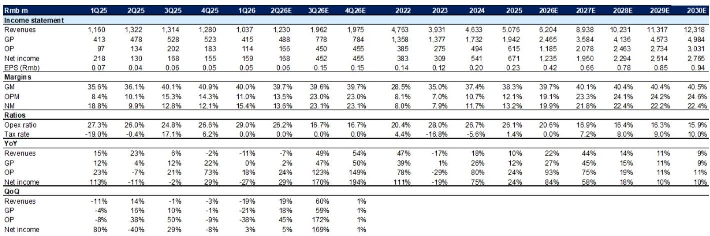
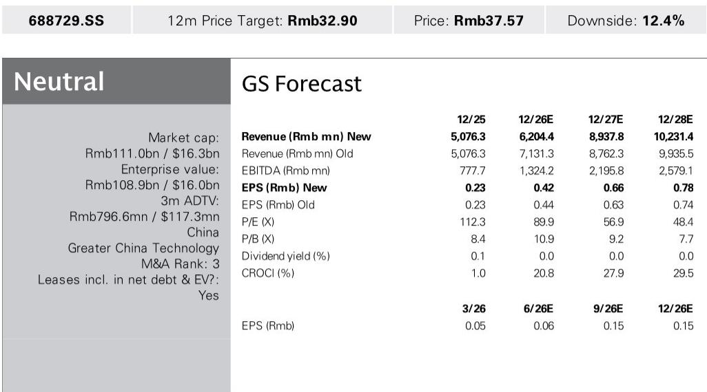
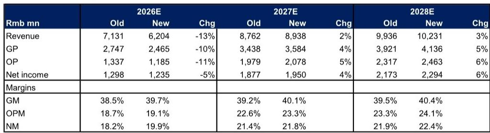

# E-Town Semiconductors Signals a Strategic Pivot: Margin Gains from Localization Now Outpace Revenue Growth from Capacity Expansion

On the surface, the story of E-Town Semiconductors appears to be about riding a wave of Chinese memory and advanced-node capacity expansion. A recent long-term supply agreement between CXMT and Tencent for server DRAM chips underscores the robust demand from local clients and the ongoing mix upgrade toward high-end applications. This macro tailwind is real, and E-Town is positioned to capture it. Yet a deeper examination of the company's latest earnings revisions and valuation dynamics reveals a more nuanced reality: the most significant driver of value creation over the next two years is not top-line volume but a structural improvement in gross margins, fueled by a deliberate shift to domestic suppliers.

The company's 1Q26 results presented a critical tension. Revenue came in below estimates, which the analyst attributes to a slower-than-expected ramp-up of new products. At the same time, gross margin exceeded expectations for the third consecutive quarter, staying above the 40% threshold. This divergence is not a temporary hiccup. It is the clearest signal yet that E-Town is undergoing a fundamental transformation in its cost structure, one that will define its profitability trajectory more than any single capacity expansion cycle.

The earnings revision framework tells the story with precision. For 2026E, the analyst cut revenue estimates by 13% to Rmb6,204 million, reflecting the 1Q26 miss and the delayed contribution from new products. However, gross margin estimates were raised by 120 basis points to 39.7%. The net effect on 2026E net income was a modest 5% reduction. More importantly, for 2027E and 2028E, revenue estimates were raised by 2% and 3% respectively, while gross margins were lifted by 90 basis points in each year. This combination drives net income upgrades of 4% and 6% for those years. The pattern is clear: margin expansion is not merely compensating for revenue softness; it is becoming the primary engine of earnings growth.

## The Supply Chain Shift to Chinese Suppliers Is the Dominant Profitability Catalyst, Not Capacity Expansion

The analyst explicitly attributes the gross margin upgrades to the company moving its supply chain to China suppliers. This is not a marginal efficiency gain. It is a structural reconfiguration of the cost base. Over the forecast horizon, gross margins are projected to rise from 38.3% in 2025 to 40.1% in 2027E and 40.4% in 2028E. The improvement is concentrated in the period from 2025 to 2027, after which margins plateau around 40.5% through 2030E. This suggests that the localization benefit is front-loaded and largely realized within two years.

The mechanism is straightforward. By substituting imported components and materials with domestically sourced alternatives, E-Town reduces its cost of goods sold. This is not a one-time arbitrage; it reflects a broader ecosystem maturation in China's semiconductor supply chain. As domestic suppliers achieve scale and quality parity, the cost advantage becomes enduring. For E-Town, this shift has already demonstrated its impact. The company's gross margin trajectory since 2022 is instructive: from 28.5% in 2022 to 35.0% in 2023, 37.4% in 2024, and 38.3% in 2025. The acceleration in 2023 and 2024 coincided with the early stages of supply chain localization, and the sustained improvement into 2025 and 1Q26 confirms that the trend has not exhausted its potential.

The implication for investors is that E-Town's earnings power is becoming less dependent on the pace of capacity expansion than on the composition of its supply chain. A slower ramp-up of new products, as seen in 1Q26, is a manageable headwind because the margin structure is improving concurrently. This creates a buffer that many semiconductor equipment companies lack, where revenue shortfalls directly compress margins due to high fixed costs.

## Revenue Growth Will Reaccelerate in Mid-2026, but the Shape of the Recovery Is Unusual

The quarterly revenue trajectory reveals a dramatic inflection point ahead. After declining by 19% quarter-over-quarter in 1Q26 to Rmb1,037 million, the analyst projects a 19% sequential rebound in 2Q26E to Rmb1,230 million, followed by a 60% surge in 3Q26E to Rmb1,962 million. The full-year 2026E revenue of Rmb6,204 million implies that the second half of the year will account for approximately 63% of total revenue. This is a highly back-end-loaded profile, which carries execution risk but also reflects the lumpy nature of semiconductor equipment orders tied to new fab construction timelines.

The 2027E revenue forecast of Rmb8,938 million represents 44% year-over-year growth, which is the peak growth rate in the forecast period. After that, growth decelerates to 14% in 2028E and further to 11% and 9% in the subsequent years. This pattern is consistent with a capacity expansion cycle that builds momentum through 2027 and then normalizes. However, the revenue growth trajectory alone does not capture the full earnings story. The operating margin progression is even more striking.

Operating margins are projected to improve from 12.1% in 2025 to 19.1% in 2026E, 23.3% in 2027E, and 24.1% in 2028E. The operating leverage is extraordinary: a 44% revenue increase in 2027E translates into a 75% increase in operating profit. This is driven by a combination of gross margin expansion and a sharp decline in the operating expense ratio, which falls from 26.1% in 2025 to 16.9% in 2027E. The opex ratio improvement reflects the scalability of the business model once the supply chain localization is embedded and new product ramps are complete. The company is moving from a phase where it invests heavily in R&D and sales infrastructure to support new product introductions, to a phase where those investments yield higher revenue with relatively fixed costs.

## The Valuation Framework Suggests the Stock Is Pricing in Perfection, but the Margin Story Is Not Fully Reflected

The target is derived from a 2027E P/E multiple of 49.9x, which is itself derived from a peer regression of P/E to 2027-28E average EPS growth. This multiple has been revised up from 45.9x previously, reflecting the sector re-rating on memory and advanced node capacity expansion and rising AI-related end demand. The stock currently trades at 57.9x 2027E P/E, representing a 16% premium to the target multiple.

The implied PEG ratio of 1.3x sits within the peer range of 0.9x to 1.8x, suggesting the stock is not egregiously overvalued on a growth-adjusted basis. However, the analyst's view is explicitly based on the perspective that the positives are largely priced in. This is a reasonable conclusion if one focuses solely on the capacity expansion narrative. But the margin story introduces a dimension that may not be fully captured by the P/E-to-growth correlation.

Consider the following. The analyst's 2027E net income estimate of Rmb1,950 million is 4% above the prior estimate. The 2028E estimate of Rmb2,294 million is 6% above. These upgrades are driven entirely by margin assumptions, not revenue. If the margin trajectory proves conservative, the earnings power could be significantly higher. For instance, a 100 basis point improvement in gross margin above the current 2027E estimate of 40.1% would add approximately Rmb89 million to gross profit, or roughly 4.6% to net income, assuming a constant tax rate. Conversely, if the revenue ramp in the second half of 2026 disappoints, the margin buffer provides downside protection that a purely volume-driven company would lack.

The key question is whether the market is correctly pricing the sustainability of these margins. The analyst's forecasts show gross margins plateauing around 40.5% from 2028E onward. If the localization benefit extends further, or if the product mix shifts to higher-margin segments such as advanced-node etch and deposition equipment, the plateau could be higher. On the other hand, if competition from Chinese peers intensifies, pricing pressure could erode margins. The analyst flags competition as a key risk, alongside the pace of semiconductor capex expansion and the ramp-up of RTP and dry etcher shipments.

## A Decision Framework for Evaluating E-Town's Risk-Reward Profile

For investors considering a position in E-Town, the following framework synthesizes the analytical insights into actionable decision nodes.

The first node is the gross margin trajectory. If the company can sustain gross margins above 40% through the cycle, the earnings base is more resilient than the P/E multiple implies. The key leading indicator is the pace of supply chain localization. Investors should monitor quarterly disclosures of domestic sourcing ratios and any new supplier qualification announcements. A continued upward trend in gross margins, even during periods of revenue softness, would confirm that the structural improvement is intact.

The second node is the revenue inflection in the second half of 2026. The 3Q26E sequential growth of 60% is an aggressive assumption. If it materializes, it validates the capacity expansion thesis and supports the 2027E revenue growth of 44%. If it falls short, the stock could re-rate lower, but the margin buffer would limit earnings damage. The risk-reward is asymmetric: the downside from a revenue miss is partially offset by margin resilience, while the upside from a revenue beat is amplified by operating leverage.

The third node is the valuation relative to peers. The current 57.9x 2027E P/E is above the target multiple of 49.9x. However, the PEG ratio of 1.3x is at the midpoint of the peer range. This suggests that the stock is not cheap, but it is not egregiously expensive either, provided earnings growth materializes. The critical comparison is with NAURA, which trades at 43.3x 2027E P/E with a 50% EPS growth rate and a PEG of 0.9x. E-Town's premium multiple is justified by its higher margin trajectory and the strategic value of its localization story, but the gap narrows if NAURA also benefits from similar supply chain shifts.

The fourth node is the risk of competition. The analyst explicitly notes that fiercer-than-expected competition is a key risk. E-Town operates in segments such as RTP and dry etching, where domestic competitors are emerging. If pricing pressure intensifies, the margin gains from localization could be offset by lower average selling prices. Investors should track competitive dynamics in these specific product categories, as well as any market share data from Chinese fab procurement cycles.

The final node is the pace of advanced node capacity expansion in China. The CXMT-Tencent agreement is a positive signal, but it represents a single data point. The broader trajectory of Chinese memory and logic fab investment will determine the duration of the revenue growth cycle. Any policy shifts, export control changes, or demand fluctuations in the end markets for DRAM and NAND could alter the capex outlook. The analyst's revenue forecasts assume a sustained expansion through 2028, but the deceleration to single-digit growth by 2029 suggests the cycle has a finite horizon.

## The Margin-Driven Earnings Upgrade Is the Most Underappreciated Element in the Stock

The market's attention is understandably focused on the capacity expansion narrative and the headline revenue growth numbers. But the most powerful insight from the analyst's revision is that the earnings upgrades for 2027E and 2028E are driven by margin assumptions, not revenue. This is a subtle but critical distinction. A company that can grow earnings through margin expansion, even as revenue growth decelerates, possesses a different risk profile than one that relies solely on volume growth.

E-Town is transitioning from a phase where it invests in new product development and supply chain localization to a phase where those investments yield margin benefits. The operating expense ratio is projected to decline from 26.1% in 2025 to 16.4% in 2028E, a reduction of nearly 10 percentage points. This is not cost-cutting; it is the natural leverage of a fixed cost base against a growing revenue stream. Combined with the gross margin improvement, the result is a net margin that rises from 13.2% in 2025 to 22.4% in 2028E.

The stock's current valuation implies that the market is pricing in this improvement, but the margin of safety suggests the view that the risk-reward is balanced. For investors with a longer-term horizon, the margin trajectory offers a compelling argument for patience, provided the key execution risks do not materialize. The company's ability to maintain gross margins above 40% while ramping new products will be the single most important metric to watch in the coming quarters.

*For informational purposes only. Portions may be generated, translated, summarized, or edited with AI assistance based on source materials and may contain omissions or errors. Please verify independently. This is not investment, legal, tax, accounting, or other professional advice.*

For informational purposes only. Portions may be generated, translated, summarized, or edited with AI assistance based on source materials and may contain omissions or errors. Please verify independently. This is not investment, legal, tax, accounting, or other professional advice.

