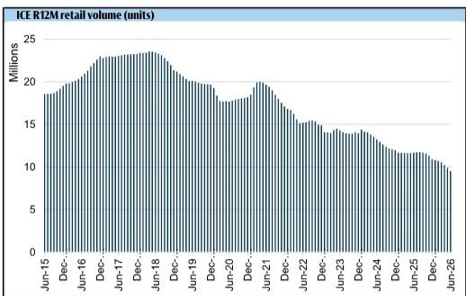
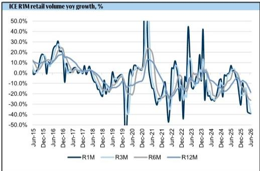
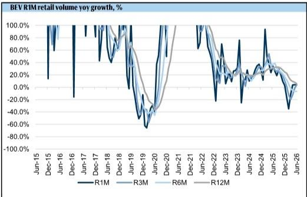

# GS：奔驰大众在华份额变化，新能源车渗透率突破62%

中国乘用车零售市场在2026年6月录得160万辆，同比下降23.2%。这个数字本身已足够说明市场调整的烈度。但GS这份最新月度追踪报告真正值得关注的，不是总量，而是结构：新能源车渗透率单月达到62.9%，而燃油车销量同比明显波动39%。对于仍以燃油车为相对主力的德国车企合资公司来说，这意味着它们的核心收入来源正在以接近四成的速度调整，而新电动车型的放量还需要时间。

报告覆盖了奔驰、宝马、奥迪和大众四个品牌在中国合资公司的零售表现。数据清晰指向一个结论：德国车企正在经历产品切换期最痛苦的阶段——旧产品线加速调整，新产品尚未形成规模支撑。

## 1. 奔驰和大众的合资公司承受了最重的份额损失

奔驰6月零售仅2.48万辆，同比下滑41.8%，市场份额降至1.5%，同比下降49个基点。大众品牌当月销售10.35万辆，同比下滑37.2%，市场份额6.5%，同比下降156个基点。两家公司的共同点是，其中国合资公司的产品组合中，燃油车占比分别高达99.9%和97.7%。在燃油车整体市场以近四成速度调整的背景下，这样的产品结构几乎没有任何缓冲空间。

GS报告特别指出，大众品牌在6月推出了探岳L PHEV，但该车型仍处于爬坡期，对整体销量的贡献尚可忽略。这揭示了一个关键问题：新产品的导入节奏与旧产品的调整速度之间存在时间差，而这个时间差正在以季度为单位影响合资公司的现金流和渠道信心。

> **KC评论：** 报告中的市场份额变化比销量相对值更有观察价值。份额下降意味着品牌在消费者选择中的优先序在系统性后移，这种趋势不会因为一款新车型上市就立刻逆转。

## 2. 奥迪是相对少见出现结构性亮点的德国品牌

奥迪6月零售3.3万辆，同比下滑35.3%，但报告中的一个细节值得单独拎出来：全新AUDI E7X EV于5月上市，仅两个月就已成为奥迪品牌在中国第三畅销的车型。奥迪合资公司的电动化比例达到15.1%，在德国品牌中最高。

这意味着奥迪正在经历一个“以旧养新”的过渡期——燃油车销量下滑的同时，电动车型开始贡献实质性增量。虽然整体销量仍在下降，但产品结构的变化方向与其他三家德国品牌有本质区别。如果E7X的爬坡速度能够维持，奥迪可能在2026年下半年率先进入“电动增量开始弥补燃油减量”的阶段。

## 3. 燃油车市场的调整速度正在加速，而非节奏变化

报告中的滚动数据揭示了趋势的变化方向。燃油车零售量在3个月、6个月和12个月的滚动同比增速分别为-38.3%、-26.3%和-18.7%。这意味着越近期的数据越明显，调整在加速，而不是触底。

对于德国车企而言，这构成了一个双重困境：燃油车业务的下滑速度超过了它们内部规划中的假设，而电动化转型所需的研发投入和渠道改造又需要时间。GS报告没有给出乐观的拐点预测，而是用数据表明，在全新电动平台的产品大规模交付之前，合资公司的销量和份额不确定性将持续存在。

## 4. 一个可复用的观察框架：用“电动化占比”和“新产品爬坡速度”交叉判断合资公司韧性

这份报告提供了一个简洁但有效的分析框架：将德国品牌合资公司的表现拆解为两个维度——当前电动化渗透率，以及最近12个月的新产品导入节奏。奔驰和大众在第一个维度上几乎为零，在第二个维度上新产品尚未起量，因此承受了最大的销量和份额损失。奥迪在电动化占比上领先，且新产品已开始贡献销量，但相对规模仍不足以抵消燃油车下滑。宝马的电动化占比为6.1%，处于中间位置，其12个月滚动销量下滑幅度在德国品牌中最小（-13.5%），说明产品组合的相对均衡性提供了部分缓冲。

这个框架可以用于跟踪未来6至12个月每个品牌的转折点：当某个品牌的电动化占比突破20%且新产品月销量进入品牌前三时，其整体销量下滑曲线可能出现斜率变化。

> **KC评论：** 报告附录中显示，6月平均零售价同比上涨3.1%，主要由蔚来ES9、理想i6等高端新能源车型拉动。这意味着市场并非全面降价，而是高端新能源车在涨价、燃油车在降价——价格信号与销量信号方向相反，进一步压缩了合资公司的利润空间。

For informational purposes only. Portions may be generated,translated,summarized,or edited with AI assistance based on source materials and may contain omissions or errors. Please verify independently. This is not investment,legal,tax,accounting,or other professional advice.

For informational purposes only. Portions may be generated,translated,summarized,or edited with AI assistance based on source materials and may contain omissions or errors. Please verify independently. This is not investment,legal,tax,accounting,or other professional advice.

