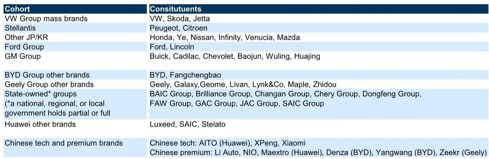
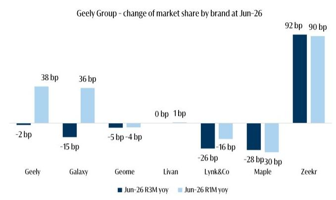
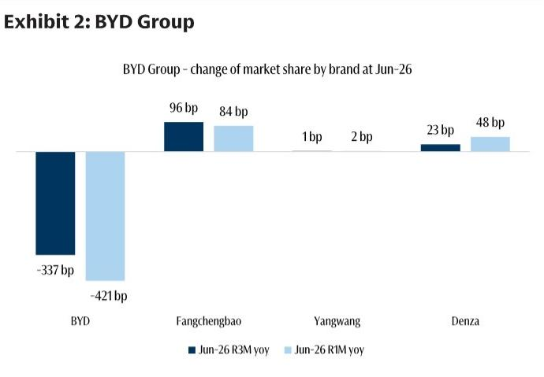

# 欧洲豪华汽车品牌在中国市场的份额变化：产品周期差异是核心因素

2026年6月，梅赛德斯、宝马、奥迪和沃尔沃这四个在中国市场的领先欧洲豪华品牌，其三个月滚动市场份额合计同比下降131个基点。结合单月下降60个基点的数据，这一趋势正在加速，而非趋于稳定。这并非由消费者情绪突变或关税冲击引发的周期性下滑，而是产品过渡期结构性调整的结果——当中国本土科技与豪华品牌正以匹配甚至超越欧洲品牌价格的新能源车型涌入市场时，德国制造商仍过度依赖传统内燃机车型。

一份近期全球研究机构报告追踪了约90个活跃品牌，覆盖中国零售量90%以上，数据显示出清晰模式：欧洲豪华品牌的市场份额保持能力优于大众市场同行，但这种防御正在出现裂痕。份额流失正在扩大。与此同时，本土“中国科技与豪华”品牌阵营——包括小鹏、极氪、小米、理想、蔚来及华为相关品牌——三个月滚动市场份额增长354个基点，仅6月单月就增长337个基点。该阵营中除AITO外，所有品牌均实现份额增长。

这不是一个关于价格竞争的故事，而是一个关于产品周期、开发速度以及新能源车型战略推出时机的问题。对于欧洲制造商而言，弥补产品差距的时间窗口正在收窄，错失这一窗口的代价已不再是利润率侵蚀，而是永久性的市场份额流失。

## 欧洲豪华品牌份额下滑集中于受困于传统燃油与新能源产品线薄弱的品牌

梅赛德斯和宝马是产品过渡期最明显的受影响者。梅赛德斯单月同比份额下降49个基点，三个月滚动下降27个基点。宝马的相应降幅分别为29和21个基点。两个品牌均处于下一代电动架构尚未全面投产或批量交付的阶段，不得不依赖现有燃油车型。在一个新能源渗透率持续上升的市场中，这种依赖直接转化为份额流失。

奥迪和沃尔沃表现相对较好，但原因印证了同样的规律。奥迪单月份额变化为负39个基点，但三个月滚动仅为负3个基点。改善得益于5月推出的新款奥迪E7X，该车型在6月成为品牌第三畅销车型。沃尔沃本地开发的XC70插电混动版仍是其最畅销车型，使品牌单月降幅收窄至负14个基点，三个月滚动为负9个基点。结论显而易见：当欧洲豪华品牌拥有本地化、有竞争力的新能源产品时，至少能减缓份额流失；反之，流失则会加速。

这对欧洲制造商高管而言是一个令人不安的现实。差距不在于品牌价值或定价能力，而在于产品更新的节奏。梅赛德斯和宝马正在为多年开发周期与中国市场速度不匹配付出代价。奥迪的相对韧性来自单一车型的推出——这并非战略，而是权宜之计。

## 本土科技与豪华品牌不仅获得份额，更通过精准发布占据欧洲品牌价格区间

中国科技与豪华品牌阵营三个月滚动合计增长354个基点，并非分散的普遍上升，而是集中于特定高销量车型。小鹏GX增程版和极氪007 GT纯电版均在6月发布，直接推动了该阵营的增长势头。分析师单独统计的小米，单月份额增加95个基点，三个月滚动增加90个基点。极氪分别增加90和92个基点。

战略上重要的不仅是这些增长的幅度，还有其定位。这些品牌并非在低端市场竞争，而是在欧洲豪华品牌传统占据的价格区间推出车型。例如，极氪007 GT纯电版在价格和定位上直接对标宝马3系和梅赛德斯C级。小鹏GX增程版瞄准的是沃尔沃和奥迪主导的同一跨界车细分市场。本土品牌并非以价格作为主要武器，而是在相似价位提供相当或更优的技术、更快的充电速度以及更先进的驾驶辅助系统。

对欧洲制造商而言，这是一种比价格战更危险的竞争态势。价格战可以通过折扣和激励措施应对，而产品战则需要全面重新设计车辆架构、软件栈和供应链——这需要数年时间。本土品牌的开发周期为18至24个月，而欧洲制造商的新平台周期仍为四至五年。这一结构性差距正在扩大。

## 大众集团大众品牌是受影响最显著的外国参与者，但真正故事在于本土集团内部的品牌替代

大众市场细分领域的情况更为明显。大众集团旗下大众、斯柯达和捷达品牌单月份额下降203个基点，三个月滚动下降209个基点——这是数据集中所有外国大众市场品牌中降幅最大的。仅大众品牌单月就下降195个基点，三个月滚动下降205个基点，其他外国大众市场品牌远未达到这一水平。

然而，更有趣的动态发生在本土制造商集团内部。比亚迪的大众品牌单月份额下降421个基点，三个月滚动下降337个基点——报告中单一制造商降幅最大。但比亚迪的豪华品牌线实现增长。吉利的大众品牌线也出现下滑，而其包括极氪在内的豪华品牌线则实现增长。模式一致：本土制造商正通过推出豪华品牌来替代自身大众市场销量。这并非疲弱信号，而是一种有意为之的战略——在维持集团整体份额的同时，推动客户向价值链上游移动。

对欧洲制造商的启示是，本土竞争并非单一形态，而是一场覆盖从入门级到超豪华所有价格区间的多品牌、多细分市场攻势。试图仅防守豪华端的欧洲品牌，将面临来自下方质量不断提升的本土大众品牌和来自上方产品节奏加速的本土豪华品牌的双重挤压。相对少见可持续的应对方式是压缩开发周期，并为中国市场实现产品规划本地化——而不仅仅是制造环节。

## 欧洲制造商的决策框架：三种战略选择及其不同结果

2026年6月的数据提供了清晰的诊断，同时也指向欧洲制造商领导团队必须面对的决策框架。基于报告中的模式，存在三条战略路径，每条路径对市场份额、盈利能力及在中国的长期生存能力都有不同影响。

第一条路径是专门为中国市场加速产品开发周期。这意味着将中国产品规划从全球平台中分离出来，投资于本地工程中心，以更快的时间线开发新能源车型。奥迪E7X的案例表明，一款时机恰当的车型可以减缓份额流失。挑战在于，这需要从根本上重新调整研发优先级、供应链采购和软件开发——无法通过一个工作组完成，需要专门的中国优先产品线。

第二条路径是深化与本土科技企业的合作。部分欧洲制造商已朝此方向迈出步伐，但规模和紧迫性尚未跟上市场节奏。报告显示，本土品牌不仅在车辆硬件上取胜，在软件、连接性和电池技术方面同样领先。欧洲制造商无法在竞争时限内完全内部复制这些能力。与中国电池制造商、自动驾驶公司或智能座舱开发商建立战略联盟、合资企业或技术许可协议已不再是可选项，而是生存机制。

第三条路径是接受在中国市场较小但有利可图的细分定位。这已是部分低于临界销量的欧洲品牌的隐含策略。风险在于中国市场并非静态环境——随着本土品牌持续进步，外国品牌的细分空间将进一步缩小。今天有利可图的细分市场，三年后可能成为无利可图的注脚。这条路径需要清醒评估品牌能否维持维持技术、服务和品牌认知相关性所需的投入。

报告并未指定应选择哪条路径，但数据明确了一点：维持现状并非出路。6月影响梅赛德斯和宝马的产品过渡期，将在欧洲制造商每次处于平台代际更替时重现——除非根本性的开发周期得到重构。

## 产品周期差距现已成为欧洲制造商在中国最重要的战略变量

2026年6月的市场份额数据应被视为领先指标而非滞后指标。欧洲豪华品牌三个月滚动下降131个基点，相对值看似不大，但趋势线正在恶化。本土豪华品牌增长354个基点，且正在加速。两条轨迹之间的差距以无法用单一因素解释的速度扩大——除了产品周期错配。

每个在中国市场的欧洲制造商都将面临同一个问题：能以多快的速度推出一款中国消费者愿意以溢价购买的新能源车型？答案将决定2026年6月的份额流失是暂时现象，还是永久性结构性下滑的开端。

将之视为供应链问题的品牌会重组工厂，却错失要点。将之视为产品问题的品牌会重新设计车辆，但依然太慢。将之视为战略问题的品牌——需要重新思考如何在中国开发、采购和推出产品——才有机会稳定并最终扭转趋势。

6月的数据是一个警示。接下来的六至十二个月将决定它是转折点还是前奏。

*仅供参考。部分内容可能基于源材料通过AI辅助生成、翻译、摘要或编辑，可能存在遗漏或错误。请独立核实。本文不构成专业建议。*

仅供参考。部分内容可能基于源材料通过AI辅助生成、翻译、摘要或编辑，可能存在遗漏或错误。请独立核实。本文不构成专业建议。

