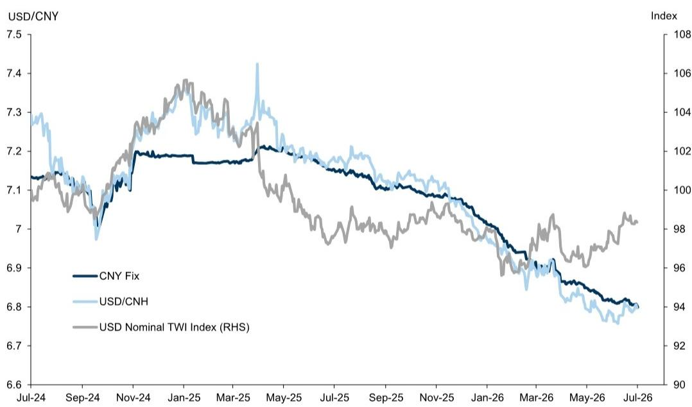
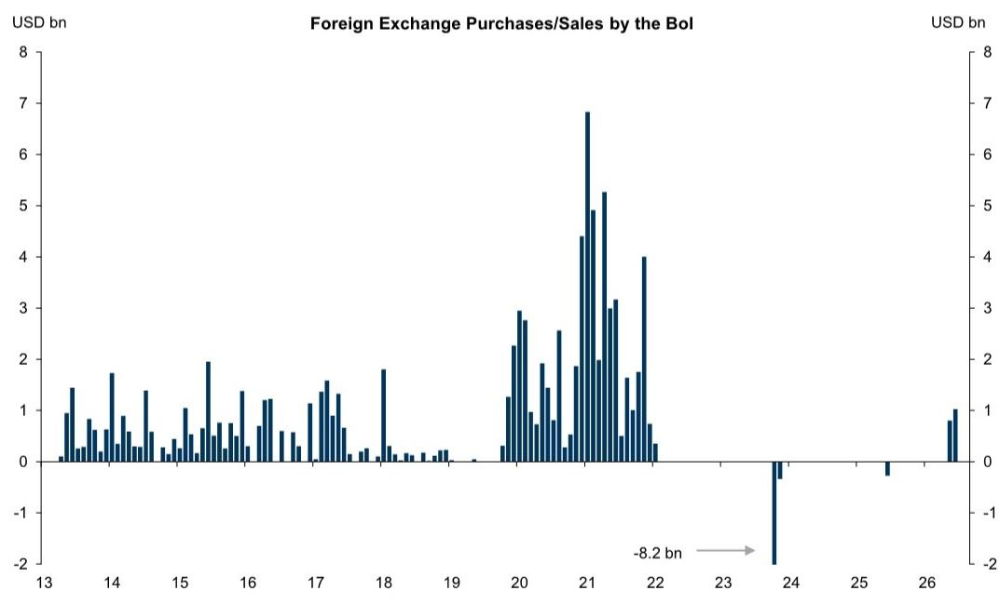
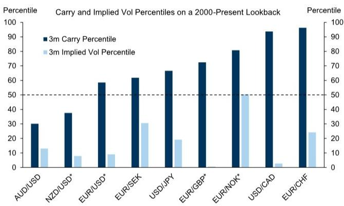
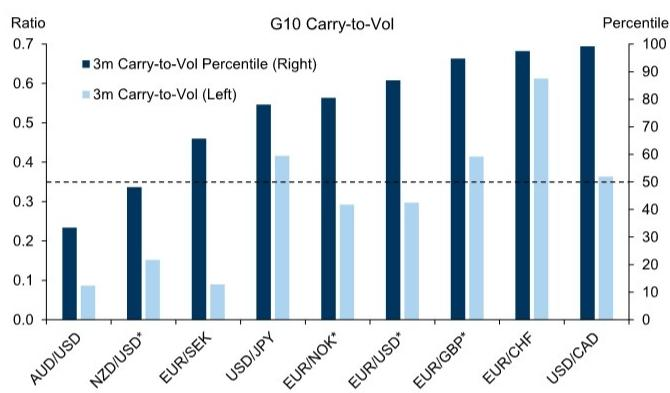

# 全球外汇市场观察

## 分化延续

我们对美元、人民币、欧洲货币、加元与墨西哥比索、匈牙利福林与波兰兹罗提、以色列谢克尔以及G10利差交易的观点

**美元：预期反馈。** 上周我们调整了预测，显示今年剩余时间内美元兑欧元和日元将温和走强，本周我们对其他欧元交叉盘也进行了一些相关调整。同时，我们修正了部分新兴市场外汇预测，显示进一步走强，并强调了利差作为新兴市场和G10总回报驱动因素的重要性；我们预计美元回报的分化将持续。短期内，市场参与者认为我们关于G10中美元走强的预测面临一定风险，这源于我们研究团队的观点——美联储今年将维持利率不变。我们认为这可能在未来几个月对美元构成一定阻力，但幅度有限。虽然对接下来几次会议的定价反映了对政策策略的不确定性，但近期利率曲线各期限的波动继续反映油价变动。但随着这一因素趋于稳定，人工智能热潮带来的升级后的投资预期将对货币构成积极影响。从中期来看，市场参与者担心，鉴于美元估值较高，其贬值趋势可能不久后恢复。我们仍将此视为一种风险，但认为至少会推迟。我们认为，外汇估值在去年回报中发挥了重要作用，因为此前支撑美元强势的因素——优越的资产回报前景——看起来可能性降低。我们注意到，估值差距现在比2025年初窄得多，且更集中于亚洲（我们仍预计这将在政策支持的人民币走强中发挥关键作用——详见人民币部分）。但相对于G10，对估值的关注与相对跨境投资需求相吻合，我们认为自年初以来这一情况已发生显著变化。根据我们的GSBEER模型，欧元在2025年的表现优于利率差异等其他周期性指标约5个百分点，我们认为数据表明这反映了外国读者对美元敞口需求的减少。我们认为这种情况有部分逆转的空间，而对人工智能投资回报的严肃质疑是我们对美元温和走强预期的更显著风险。

**■ 人民币：步伐未止。** 过去一个月美元走强，尤其是兑G10和新兴市场的低收益货币，引发了关于人民币在此背景下能否继续走强的疑问。离岸人民币已缩小与中间价的差距，这是美元走强环境下的典型表现，低收益和低波动的组合导致了一些利差交易结构中的空头头寸，或作为对美元走强的对冲。然而，尽管近期人民币升值步伐可能放缓，但我们不认为这标志着升值趋势的结束。即将公布的月度贸易数据可能进一步印证出口强劲和货币低估的整体图景，随着生产者价格通胀也见顶，我们继续将持续但渐进的各义货币升值视为一种均衡结果。政策当局也似乎对这种路径更加适应，这可能有助于抵御来自世界其他地区的保护主义反弹。反映这一点的是，值得注意的是，即使在美元略微走强的背景下，美元/人民币中间价在过去几周仍创下新低，并在上周五自2023年初以来首次跌破6.80（图表1）。我们继续预计人民币将渐进走强，12个月目标为美元/人民币6.50，并预计其表现将优于欧元或新加坡元等其他低收益货币。

图表1：尽管美元走强，人民币中间价继续走强

来源：GS FICC and Equities, GS Global Investment Research

**欧洲货币：欧元区间波动。** 在上周下调欧元/美元预测后，我们梳理了最新的欧洲外汇观点和预测。我们认为，英镑的优异表现已在7月加速，近期涨幅受到溢价压缩、英镑空头头寸平仓以及异常强劲的跨境并购资金流入支撑。然而，英镑近几周的上涨与利率差异的变化不一致，我们认为这增加了短期内逆转走弱的风险。我们仍认为英镑面临长期关键挑战——最显著的是估值过高和英国央行按兵不动——尽管顺周期的全球背景以及英欧关系可能更紧密的趋势则指向相反方向。我们根据市场情况调整了欧元/英镑预测，预计未来英镑表现将更为温和（图表2），并继续认为英镑/美元中英镑空头头寸的清算空间大于欧元/英镑。斯堪的纳维亚货币近几个月因能源冲击出现明显分化，我们认为油价持续高企为挪威克朗提供了持久支撑，且迄今为止有证据显示贸易条件对挪威克朗/瑞典克朗的影响更为持久。长期来看，我们认为斯堪的纳维亚外汇表现面临的有利因素（顺周期宏观背景、稳健的财政和估值基本面）多于不利因素（全球回报表现上升、能源冲击后的欧洲周期性风险）。我们调整了斯堪的纳维亚外汇预测以反映油价重置后的价格走势，但继续预计未来一年挪威克朗和瑞典克朗兑欧元将稳步走强（图表2）。最后，瑞士法郎作为融资货币继续表现良好，在近期数据显示国内通胀压力温和后，瑞士央行干预政策的潜在转变对瑞士法郎融资的担忧已有所减轻。在众多其他央行加息或考虑加息的环境中，瑞士央行坚定的按兵不动立场使其处于央行光谱的鸽派一端。这种鸽派分化、能源价格下跌带来的通胀压力减弱以及整体风险偏好积极的背景，应会对瑞士法郎构成压力。综合来看，我们预计短期内瑞士法郎将继续表现相对较弱，但黄金涨势的最终恢复仍是通过贸易条件关联对长期瑞士法郎融资的一个关键风险。

图表2：我们修正后的欧洲外汇预测

<table><tr><td rowspan="2"></td><td rowspan="2">即期</td><td colspan="3">新预测</td><td colspan="3">此前预测</td></tr><tr><td>3个月</td><td>6个月</td><td>12个月</td><td>3个月</td><td>6个月</td><td>12个月</td></tr><tr><td>欧元/美元</td><td>1.14</td><td>1.14</td><td>1.12</td><td>1.12</td><td>1.14</td><td>1.18</td><td>1.20</td></tr><tr><td>英镑/美元</td><td>1.34</td><td>1.33</td><td>1.29</td><td>1.28</td><td>1.33</td><td>1.34</td><td>1.33</td></tr><tr><td>美元/瑞郎</td><td>0.81</td><td>0.81</td><td>0.82</td><td>0.82</td><td>0.80</td><td>0.76</td><td>0.73</td></tr><tr><td>美元/挪威克朗</td><td>9.77</td><td>9.56</td><td>9.55</td><td>9.38</td><td>9.30</td><td>8.98</td><td>8.75</td></tr><tr><td>美元/瑞典克朗</td><td>9.65</td><td>9.65</td><td>9.73</td><td>9.55</td><td>9.65</td><td>9.15</td><td>8.75</td></tr><tr><td>欧元/挪威克朗</td><td>11.16</td><td>10.90</td><td>10.70</td><td>10.50</td><td>10.60</td><td>10.60</td><td>10.50</td></tr><tr><td>欧元/瑞典克朗</td><td>11.03</td><td>11.00</td><td>10.90</td><td>10.70</td><td>11.00</td><td>10.80</td><td>10.50</td></tr><tr><td>欧元/英镑</td><td>0.85</td><td>0.86</td><td>0.87</td><td>0.88</td><td>0.86</td><td>0.88</td><td>0.90</td></tr><tr><td>欧元/瑞郎</td><td>0.92</td><td>0.92</td><td>0.92</td><td>0.92</td><td>0.91</td><td>0.90</td><td>0.88</td></tr><tr><td>挪威克朗/瑞典克朗</td><td>0.99</td><td>1.01</td><td>1.02</td><td>1.02</td><td>1.04</td><td>1.02</td><td>1.00</td></tr></table>

来源：GS Global Investment Research

**加元与墨西哥比索：USMCA进入加时。** 美国贸易代表格里尔近期宣布，美国决定不续签USMCA，而是将进行年度审查，这与我们关于谈判可能延至7月1日截止日期之后的预期一致。今年大部分时间，我们一直主张加元作为融资货币，因其能够降低风险敞口并改善相对于美元融资的利差。这些属性依然存在，持续的谈判应会通过扩大美元-加元利率差异继续对加元构成压力，因为不确定性仍然较高，且美加谈判可能比与墨西哥的谈判更为艰难。尽管如此，在经历了过去两个月的明显相对弱势以及近期国内数据（包括本周的就业报告，该报告增加了加拿大经济活动逐步复苏的信号）有所改善之后，加元进一步大幅贬值的理由似乎不那么充分。与此同时，对于墨西哥，政府将近期发展描述为更为积极，重点关注在7月1日截止日期前避免了美国单方面退出的尾部风险。一个美国代表团计划于7月20日访问墨西哥，因此有关USMCA讨论的新闻届时可能成为墨西哥比索的焦点。我们的总体看法是，USMCA谈判对墨西哥比索的影响应有限，因为紧张程度不及加拿大，但贸易关系本身是货币的重要长期锚定因素，在当前强势水平下，这种关系出现重大破裂的风险溢价非常低。尽管国内经济活动依然疲弱——这促使墨西哥央行降息并将墨西哥-美国利率差异收窄至历史低位——但与加元不同，墨西哥比索的表现受本地因素影响较小。相反，比索更多地与其全球贝塔值保持一致，包括对美国股票相对表现的敏感性。此外，有初步迹象显示墨西哥经济活动数据开始复苏，尽管我们的研究团队预计贸易政策不确定性将继续对投资构成影响。总体而言，在我们的基准情景中，我们不认为USMCA谈判是这两种货币即期走势的主要驱动因素，但贸易关系的重大破裂应会导致相对弱势，鉴于起始水平，墨西哥比索的弱势程度将超过加元。

**匈牙利福林与波兰兹罗提：喘息与调整。** 匈牙利福林和波兰兹罗提本周在不同时间点表现相对较弱，原因是油价上涨，以及就波兰兹罗提而言，波兰央行召开了一次鸽派会议。关于第一个因素，我们的分析表明，自3月初以来，福林和兹罗提的走势与油价变动的贝塔值基本一致，表明本周油价的起伏发挥了重要作用。更广泛地说，我们认为欧元/美元的下行趋势在过去一个月也是这些交叉盘的重要因素，并且在我们预计欧元进一步贬值的预测下，应会继续构成阻力。尽管如此，就匈牙利而言，我们认为欧盟资金流入可以抵消能源价格上涨对能源平衡的影响，因此对能源价格上涨的脆弱性应低于2022年。因此，我们将周三欧元/福林的大幅波动归因于头寸动态以及油价变动。我们认为福林进一步升值和贬值风险有限的基本面理由仍然存在，并且认为周三大幅波动的逆转可以进一步延续。尽管如此，随着本地故事已被充分理解，欧元/福林短期内可能继续对全球因素更为敏感，直到新的催化剂出现——例如，我们的研究团队预计2026年底将宣布更低的通胀目标。我们认为，这加上持续流入本地债券的资金，应会继续对福林构成升值压力。就波兰兹罗提而言，我们持相反观点：即在2023-2024年表现优异之后，随着包括鹰派波兰央行在内的升值利好因素消退，不对称性倾向于兹罗提走弱。在此背景下，兹罗提因本周波兰央行的鸽派转向而走弱是合理的。这种立场转变也发生在全球利率重新定价走高、外汇市场参与者寻找可作为利差交易融资货币的低收益货币之时。我们认为，波兰央行降息的空间、仍被高估的兹罗提以及央行行长格拉平斯基关于不担心近期兹罗提走弱的评论，都支持将兹罗提用作融资货币。

**以色列谢克尔：干预意图。** 我们认为谢克尔是对科技股表现高度敏感的投资组合（目前实际上大多数投资组合都是如此）的一个有吸引力的对冲工具，并且也可以作为更广泛利差投资组合的融资货币。这是因为谢克尔对科技股的高度敏感性、其估值过高的信号、做空带来的轻微正利差，以及政策层面对货币走强的抵制日益增加。关于最后一点，我们强调了以色列央行在5月底的鸽派转向，当时它降息并自2022年以来首次开始通过购买美元干预外汇市场。过去一周，这一政策立场保持不变：以色列央行再次降息25个基点至3.50%，工作人员预测现在显示政策利率预测下调50个基点，到2027年第二季度达到3.00%。值得注意的是，央行行长亚龙表示，谢克尔走强对出口和高科技行业构成关键挑战。以色列央行6月储备数据也于本周公布，显示购买了约10亿美元，继5月约8亿美元之后（图表3）。这仍低于2019-2022年间每月平均22亿美元的购买量，但确实标志着外汇政策的重大转变。我们认为，这使得持有谢克尔空头的不对称性更具吸引力，因为在科技表现强劲的环境下，进一步升值可能受到央行政策的限制。

图表3：以色列央行在5月和6月均购买了美元

来源：Haver Analytics, GS Global Investment Research

**G10利差交易的回归。** 我们近期提出，利差对G10外汇市场的相关性现在比自2000年以来的几乎任何其他时点都更高，并且我们继续认为在未来几个月，由G10低收益货币（日元、瑞郎、欧元、加元）融资的利差策略具有价值。G10外汇目前兼具历史高位的直接利差水平和历史低位的波动水平（图表4）。后疫情通胀飙升和近期能源冲击后，G10政策利率在高位且多样化的水平上企稳，有助于形成这种动态，但就外汇市场的实际意义而言，它产生了当前异常高的利差与波动率之比，包括欧元/瑞郎和美元/加元等交叉盘接近数十年高位（图表5）。当前G10利差格局的另一个显著特征是利差与风险敏感度之间关系的瓦解。这使得在近几个月交易中表现为风险中性的交叉盘中存在高利差与波动率之比的品种，以及在风险规避表达（如做多美元兑瑞典克朗或新西兰元）中相对较高的利差与波动率之比。我们认为，在当前背景下，在G10外汇中赚取利差同时相对免受（甚至对冲）风险回撤的机会，是多资产投资组合中的一个有用选项。

图表4：G10外汇市场目前兼具历史高位的利差水平和历史低位的波动水平...

带星号的交叉盘已反转以实现正利差。百分位排名基于2000-2026年各交叉盘每日相对利差与波动率之比的回溯，欧元/瑞郎为2016-2026年。

图表5：...导致G10市场出现异常高的利差与波动率之比

带星号的交叉盘已反转以实现正利差。利差与波动率之比代表3个月远期隐含利差与3个月隐含波动率之比。百分位排名基于2000-2026年各交叉盘每日相对利差与波动率之比的回溯，欧元/瑞郎为2016-2026年。

**全球外汇预测**

<table><tr><td rowspan="2"></td><td rowspan="2">当前即期</td><td colspan="2">3个月展望</td><td colspan="2">6个月展望</td><td colspan="2">12个月展望</td></tr><tr><td>远期</td><td>预测</td><td>远期</td><td>预测</td><td>远期</td><td>预测</td></tr><tr><td colspan="8">G10</td></tr><tr><td>欧元/美元</td><td>1.14</td><td>1.15</td><td>1.14</td><td>1.15</td><td>1.12</td><td>1.16</td><td>1.12</td></tr><tr><td>英镑/美元</td><td>1.34</td><td>1.34</td><td>1.33</td><td>1.34</td><td>1.29</td><td>1.34</td><td>1.28</td></tr><tr><td>澳元/美元</td><td>0.69</td><td>0.69</td><td>0.72</td><td>0.69</td><td>0.73</td><td>0.69</td><td>0.74</td></tr><tr><td>新西兰元/美元</td><td>0.58</td><td>0.58</td><td>0.60</td><td>0.58</td><td>0.61</td><td>0.58</td><td>0.62</td></tr><tr><td>美元/加元</td><td>1.42</td><td>1.41</td><td>1.40</td><td>1.40</td><td>1.38</td><td>1.39</td><td>1.38</td></tr><tr><td>美元/瑞郎</td><td>0.81</td><td>0.80</td><td>0.81</td><td>0.79</td><td>0.82</td><td>0.77</td><td>0.82</td></tr><tr><td>美元/挪威克朗</td><td>9.72</td><td>9.74</td><td>9.56</td><td>9.75</td><td>9.55</td><td>9.78</td><td>9.38</td></tr><tr><td>美元/瑞典克朗</td><td>9.67</td><td>9.62</td><td>9.65</td><td>9.57</td><td>9.73</td><td>9.47</td><td>9.55</td></tr><tr><td>美元/日元</td><td>162</td><td>161</td><td>162</td><td>160</td><td>163</td><td>158</td><td>165</td></tr><tr><td colspan="8">欧洲、中东、非洲</td></tr><tr><td>美元/捷克克朗</td><td>21.2</td><td>21.2</td><td>21.5</td><td>21.2</td><td>21.8</td><td>21.1</td><td>21.6</td></tr><tr><td>美元/匈牙利福林</td><td>312</td><td>314</td><td>311</td><td>314</td><td>313</td><td>315</td><td>308</td></tr><tr><td>美元/波兰兹罗提</td><td>3.79</td><td>3.79</td><td>3.77</td><td>3.79</td><td>3.79</td><td>3.78</td><td>3.79</td></tr><tr><td>美元/罗马尼亚列伊</td><td>4.58</td><td>4.60</td><td>4.52</td><td>4.63</td><td>4.63</td><td>4.67</td><td>4.69</td></tr><tr><td>美元/俄罗斯卢布</td><td>78.80</td><td>78.80</td><td>80.0</td><td>81.07</td><td>85.0</td><td>85.43</td><td>90.0</td></tr><tr><td>美元/乌克兰格里夫纳</td><td>44.5</td><td>45.6</td><td>46.0</td><td>46.9</td><td>48.0</td><td>49.8</td><td>52.0</td></tr><tr><td>美元/土耳其里拉</td><td>46.91</td><td>50.60</td><td>48.0</td><td>54.60</td><td>50.0</td><td>63.69</td><td>54.0</td></tr><tr><td>美元/以色列谢克尔</td><td>3.01</td><td>3.00</td><td>3.00</td><td>2.99</td><td>3.05</td><td>2.97</td><td>3.10</td></tr><tr><td>美元/埃及镑</td><td>49.7</td><td>51.6</td><td>49.0</td><td>53.4</td><td>48.0</td><td>56.9</td><td>46.0</td></tr><tr><td>美元/南非兰特</td><td>16.33</td><td>16.45</td><td>16.50</td><td>16.57</td><td>16.00</td><td>16.80</td><td>15.75</td></tr><tr><td>美元/尼日利亚奈拉</td><td>1378</td><td>1423</td><td>1325</td><td>1466</td><td>1300</td><td>1548</td><td>1250</td></tr><tr><td colspan="8">美洲</td></tr><tr><td>美元/阿根廷比索</td><td>1488</td><td>1564</td><td>1500</td><td>1659</td><td>1600</td><td>1847</td><td>1800</td></tr><tr><td>美元/巴西雷亚尔</td><td>5.12</td><td>5.23</td><td>4.90</td><td>5.33</td><td>5.00</td><td>5.53</td><td>5.00</td></tr><tr><td>美元/墨西哥比索</td><td>17.55</td><td>17.68</td><td>17.75</td><td>17.81</td><td>18.00</td><td>18.06</td><td>18.00</td></tr><tr><td>美元/智利比索</td><td>928</td><td>928</td><td>920</td><td>927</td><td>900</td><td>926</td><td>860</td></tr><tr><td>美元/秘鲁索尔</td><td>3.40</td><td>3.41</td><td>3.40</td><td>3.42</td><td>3.35</td><td>3.44</td><td>3.30</td></tr><tr><td>美元/哥伦比亚比索</td><td>3291</td><td>3366</td><td>3350</td><td>3440</td><td>3300</td><td>3591</td><td>3200</td></tr><tr><td colspan="8">亚洲</td></tr><tr><td>美元/人民币</td><td>6.79</td><td>6.76</td><td>6.80</td><td>6.72</td><td>6.70</td><td>6.63</td><td>6.50</td></tr><tr><td>美元/港币</td><td>7.84</td><td>7.81</td><td>7.80</td><td>7.80</td><td>7.80</td><td>7.77</td><td>7.80</td></tr><tr><td>美元/印度卢比</td><td>95.39</td><td>96.19</td><td>94.00</td><td>96.93</td><td>95.00</td><td>98.28</td><td>96.00</td></tr><tr><td>美元/韩元</td><td>1508</td><td>1503</td><td>1460</td><td>1499</td><td>1440</td><td>1492</td><td>1420</td></tr><tr><td>美元/马来西亚林吉特</td><td>4.08</td><td>4.07</td><td>3.90</td><td>4.05</td><td>3.80</td><td>4.03</td><td>3.70</td></tr><tr><td>美元/新加坡元</td><td>1.29</td><td>1.28</td><td>1.28</td><td>1.28</td><td>1.25</td><td>1.26</td><td>1.24</td></tr><tr><td>美元/新台币</td><td>32.2</td><td>32.2</td><td>31.5</td><td>32.2</td><td>31.0</td><td>32.3</td><td>30.5</td></tr><tr><td>美元/泰铢</td><td>33.43</td><td>33.25</td><td>34.00</td><td>33.07</td><td>33.50</td><td>32.68</td><td>33.00</td></tr><tr><td>美元/印尼盾</td><td>18084</td><td>18215</td><td>17000</td><td>18349</td><td>17100</td><td>18602</td><td>17200</td></tr><tr><td>美元/菲律宾比索</td><td>61.61</td><td>61.77</td><td>62.00</td><td>61.93</td><td>61.00</td><td>62.27</td><td>61.00</td></tr><tr><td colspan="8">欧元交叉盘</td></tr><tr><td>欧元/英镑</td><td>0.85</td><td>0.86</td><td>0.86</td><td>0.86</td><td>0.87</td><td>0.87</td><td>0.88</td></tr><tr><td>欧元/瑞郎</td><td>0.92</td><td>0.92</td><td>0.92</td><td>0.91</td><td>0.92</td><td>0.90</td><td>0.92</td></tr><tr><td>欧元/挪威克朗</td><td>11.12</td><td>11.17</td><td>10.90</td><td>11.23</td><td>10.70</td><td>11.35</td><td>10.50</td></tr><tr><td>欧元/瑞典克朗</td><td>11.05</td><td>11.03</td><td>11.00</td><td>11.02</td><td>10.90</td><td>11.00</td><td>10.70</td></tr><tr><td>欧元/捷克克朗</td><td>24.25</td><td>24.33</td><td>24.50</td><td>24.38</td><td>24.40</td><td>24.52</td><td>24.20</td></tr><tr><td>欧元/匈牙利福林</td><td>357</td><td>360</td><td>355</td><td>362</td><td>350</td><td>365</td><td>345</td></tr><tr><td>欧元/波兰兹罗提</td><td>4.33</td><td>4.35</td><td>4.30</td><td>4.36</td><td>4.25</td><td>4.39</td><td>4.25</td></tr><tr><td>欧元/罗马尼亚列伊</td><td>5.24</td><td>5.28</td><td>5.15</td><td>5.33</td><td>5.18</td><td>5.42</td><td>5.25</td></tr><tr><td>欧元/俄罗斯卢布</td><td>90.1</td><td>90.4</td><td>91.2</td><td>93.4</td><td>95.2</td><td>99.1</td><td>100.8</td></tr></table>

注：即期值为周三收盘价。
查看动态表格（或点击上方图片）：https://publishing.gs.com/content/themes/fx-forecasts.html
来源：GS Global Investment Research

**回报预测与估值**

<table><tr><td rowspan="3"></td><td rowspan="3">当前即期</td><td rowspan="2" colspan="4">预测：12个月回报（%）</td><td colspan="3">GSDEER</td><td colspan="3">GSFEER</td><td rowspan="3">平均估计</td><td rowspan="3">PPP*</td></tr><tr><td rowspan="2">估计</td><td colspan="2">偏差</td><td rowspan="2">估计</td><td colspan="2">偏差</td></tr><tr><td>即期</td><td>利差</td><td>总计</td><td>NEER</td><td>双边</td><td>贸易加权</td><td>双边</td><td>贸易加权</td></tr><tr><td colspan="14">G10</td></tr><tr><td>欧元/美元</td><td>1.14</td><td>-2.0</td><td>-1.5</td><td>-3.5</td><td>-1.5</td><td>1.19</td><td>-4%</td><td>8%</td><td>1.14</td><td>0%</td><td>0%</td><td>1.17</td><td>1.52</td></tr><tr><td>英镑/美元</td><td>1.34</td><td>-4.5</td><td>0.0</td><td>-4.5</td><td>-3.7</td><td>1.19</td><td>12%</td><td>26%</td><td>1.24</td><td>8%</td><td>8%</td><td>1.21</td><td>1.50</td></tr><tr><td>澳元/美元</td><td>0.69</td><td>6.6</td><td>0.5</td><td>7.1</td><td>4.1</td><td>0.79</td><td>-12%</td><td>9%</td><td>0.66</td><td>5%</td><td>11%</td><td>0.74</td><td>0.70</td></tr><tr><td>新西兰元/美元</td><td>0.58</td><td>7.7</td><td>-0.9</td><td>6.8</td><td>4.9</td><td>0.66</td><td>-13%</td><td>3%</td><td>0.58</td><td>-1%</td><td>1%</td><td>0.63</td><td>0.67</td></tr><tr><td>美元/加元</td><td>1.42</td><td>2.7</td><td>-1.6</td><td>1.0</td><td>2.5</td><td>1.25</td><td>-12%</td><td>-7%</td><td>1.38</td><td>-2%</td><td>-1%</td><td>1.30</td><td>1.17</td></tr><tr><td>美元/瑞郎</td><td>0.81</td><td>-1.8</td><td>-4.0</td><td>-5.7</td><td>-0.7</td><td>0.86</td><td>7%</td><td>15%</td><td>0.824</td><td>2%</td><td>3%</td><td>0.85</td><td>0.92</td></tr><tr><td>美元/挪威克朗</td><td>9.72</td><td>3.7</td><td>0.6</td><td>4.3</td><td>4.8</td><td>6.71</td><td>-31%</td><td>-24%</td><td>9.24</td><td>-5%</td><td>-6%</td><td>7.72</td><td>8.87</td></tr><tr><td>美元/瑞典克朗</td><td>9.67</td><td>1.2</td><td>-2.0</td><td>-0.8</td><td>2.2</td><td>7.40</td><td>-23%</td><td>-15%</td><td>9.38</td><td>-3%</td><td>-2%</td><td>8.19</td><td>8.26</td></tr><tr><td>美元/日元</td><td>162.4</td><td>-1.6</td><td>-2.9</td><td>-4.5</td><td>-3.8</td><td>96</td><td>-41%</td><td>-32%</td><td>138</td><td>-15%</td><td>-12%</td><td>113</td><td>93</td></tr><tr><td colspan="14">欧洲、中东、非洲</td></tr><tr><td>美元/捷克克朗</td><td>21.22</td><td>-1.8</td><td>-0.4</td><td>-2.2</td><td>-0.3</td><td>25.6</td><td>21%</td><td>29%</td><td>21.9</td><td>3%</
