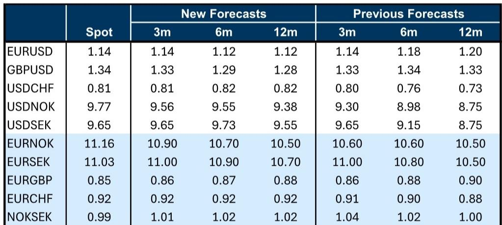

# 美元走势分化而非单边：为何利差交易而非方向判断将主导下半年汇市回报

全球外汇市场最重要的变化并非美元将全面走强或走弱，而是它将同时呈现两种走势——对某些货币升值，对另一些货币贬值——这种分化将为利差交易策略创造异常有利的环境，而非方向性押注。某全球投行的最新外汇研究明确阐述了这一观点：预计美元在今年剩余时间内将对欧元和日元温和升值，但同一份报告上调了新兴市场货币的预测，显示其将进一步走强，尤其是人民币。核心思路是，押注美元单一趋势的读者可能面临挑战，而围绕高息与低息货币之间的利差构建组合的读者，将捕捉到主要的回报驱动因素。

时机选择很重要，因为这种美元分化的环境条件异常契合。G10外汇市场目前同时具备历史高位的直接利差和历史低位的波动性。根据该报告，多个主要货币对的利差波动比接近数十年高位，包括欧元/瑞郎和美元/加元。这并非正常的周期性模式。它反映了疫情后政策利率在高位且分化水平上的稳定，同时能源冲击重置了通胀预期，却没有引发通常会压缩利差机会的宏观波动。策略含义明确：2025年下半年有望成为通过收益获取而非预测美元指数下一次方向性变动来赚取外汇回报的时期。

## 美元估值差距已收窄，但人工智能热潮重新打开了美元走强的研究逻辑

反对美元走强最常见的理由是估值。美元在许多指标上仍然昂贵，读者自然认为高估值最终会修正。报告承认这一风险，但认为它至少被推迟了，原因是跨境投资需求的结构性转变。根据该行的GSBEER模型，欧元在2025年跑赢了利率差异等周期性指标约5个百分点，数据显示这反映了外国读者对美元敞口的需求减少。然而，这一动态现在显示出逆转迹象。

关键机制是人工智能热潮。人工智能带来的投资预期提升，为美元提供了此前周期阶段不存在的新的支撑来源。当估值差距最大时，维持美元强势的因素——优越的资产回报前景——看起来不太可能持续。这种情况已经改变。报告明确指出，随着油价波动趋于稳定，人工智能带来的投资预期提升应对货币有利。这意味着美元的估值溢价现在更集中在亚洲，在那里它有助于政策支持的人民币走强，而不是在G10市场，那里跨境资本流动是主要驱动因素。只关注美元整体高估的读者，可能会忽略高估的构成已经以更可持续的方式发生了转变。

这一观点的风险在于对人工智能投资回报的严重质疑。报告将此视为对其美元温和升值预期的更重大威胁。如果人工智能叙事动摇，美元将失去其最重要的边际支撑，许多读者预期的估值修正将加速。然而，就目前而言，证据平衡指向美元对G10低息货币持续（即使温和）走强，其驱动因素是跨境对美国资产需求的复苏。

## 人民币升值路径不会因美元走强而偏离；政策信号现在比市场持仓更重要

过去一个月，美元对G10和新兴市场的低息货币均走强，导致一些读者质疑人民币升值能否持续。离岸人民币已缩小了与官方定价的差距，这在美元走强环境中是典型行为，低利率和低波动性的组合鼓励了在利差交易结构中的一些空头持仓或作为对美元走强的对冲。这些都是实际存在的阻力，但并非决定性因素。

报告提出了一个令人信服的观点：人民币升值并非市场驱动的趋势，不会轻易被美元走强逆转。这是一个政策支持的均衡结果。即将公布的月度贸易数据可能进一步印证出口强劲和货币低估的图景，随着生产者价格通胀见顶，当局将持续但渐进的汇率升值视为自然的调整机制。更重要的是，政策信号明确：即使在美元走强的背景下，美元/人民币中间价在最近几周创下新低，自2023年初以来首次跌破6.80。这不是一个对升值感到不安或会让美元走强决定其货币路径的央行的行为。

对读者的策略含义是，应将人民币与欧元或新加坡元等其他低息货币区别对待。报告明确预计人民币将优于这些同类货币，12个月美元/人民币目标价为6.50。其机制并非投机性持仓或利差，而是有意的政策选择，允许名义升值作为抵御保护主义反弹的工具，并反映中国出口竞争力的基本面现实。将人民币视为另一种为利差交易提供资金的低息货币的读者，忽略了使这种货币与众不同的结构性支撑。

## 英镑涨势已超前于基本面，形成读者不应忽视的战术性回调风险

英镑是7月份表现最好的G10货币之一，其上涨受到溢价压缩、空头头寸平仓以及异常强劲的跨境并购资金流入支撑。报告指出，这些涨幅与利率差异的变化不一致，这增加了近期回调的风险。这是资金驱动的动能与基本面估值之间的典型张力。

近期风险在于，由持仓驱动的涨势可能已耗尽。英镑空头头寸已基本平仓，而并购资金流入虽然可观，但不太可能无限期地以同样速度持续。报告调整了欧元/英镑预测，预计未来英镑表现将更为温和，这谨慎地表明英镑最疲弱的时期可能已经过去，但涨势最好的阶段也可能已经结束。长期前景更为微妙：英镑面临高估值和仍处于观察模式的英国央行，这些都是明显的阻力，但被顺周期的全球背景和英欧关系可能更紧密的前景所抵消。

读者的决策框架很明确：英镑当前水平包含了不太可能持续的积极资金流和持仓动态溢价。报告认为，英镑空头通过远期合约在英镑/美元中比在欧元/英镑中有更多出清空间，这表明交叉盘中的相对价值交易比美元对更具吸引力。对于组合构建，这意味着英镑应被视为战术性融资货币而非长期持有，尤其是在利差环境继续有利于低息货币作为融资来源的情况下。

## G10利差交易回归不仅是交易策略；它是改变读者思考外汇组合构建方式的制度性转变

报告中最重要的结构性见解并非关于任何单一货币，而是关于外汇回报本身的本质。利差交易对G10外汇市场的重要性现在比自2000年以来几乎任何其他时点都更高，这一说法并非夸张；它得到了多个主要货币对利差波动比处于数十年高位的具体数据的支持。

这并非战术性观察。它反映了宏观环境的根本性变化。疫情后的通胀飙升和近期的能源冲击已将G10政策利率推至历史高位且分化水平，各国央行大多已稳定在这些水平，而不是继续加息或大幅降息。结果是G10外汇市场中，回报表现差异很大，波动性很低，利差与风险敏感度之间的关系已被打破。报告强调了一个显著特征：高利差波动比现在出现在最近几个月作为风险敏感型交易的交叉盘中，以及风险规避型表达中，如做多美元兑瑞典克朗或新西兰元。

对读者而言，这改变了外汇组合构建的考量。在正常环境中，利差伴随着固有的风险敞口——高息货币往往对应风险偏好，低息货币往往对应风险规避。这种关系已显著减弱。报告明确指出，读者现在可以在G10外汇中赚取利差，同时相对免受甚至对冲风险资产回撤的影响。这在多资产组合中是一个有用的选择，特别是对于已经持有风险资产多头并寻找不会放大现有敞口的回报来源的读者。

读者的决策框架是将G10外汇利差视为核心组合构建模块，而非卫星交易。报告将日元、瑞郎、欧元和加元确定为优先融资货币，这意味着利差交易本质上押注低息的欧洲和亚洲货币将继续优于高息替代品。风险在于，宏观冲击——衰退、地缘政治事件或央行预期的急剧重估——可能同时压缩利差并推高波动性。但报告的分析表明，当前的利差波动比为此类情景提供了实质性缓冲，即使对于保守型组合，风险回报也具有吸引力。

*仅供参考。部分内容可能基于源材料通过AI辅助生成、翻译、总结或编辑，可能存在遗漏或错误。请独立核实。这不构成投资、法律、税务、会计或其他专业建议。*

仅供参考。部分内容可能基于源材料通过AI辅助生成、翻译、总结或编辑，可能存在遗漏或错误。请独立核实。这不构成投资、法律、税务、会计或其他专业建议。

