# 全球利率观察

## 能源因素成为市场波动的新变量

人工智能相关发行与资本支出仍是市场的结构性关注点，但能源因素本周重新成为利率波动的主要驱动因素。美国长期端估值已不再偏高，宏观环境应成为支撑回报表现水平的一个因素，但相较于宏观与财政基本面所暗示的水平，目前几乎没有证据表明存在显著的风险溢价。短期能源动态可能影响CPI数据的对称性，但我们的研究人员对通胀数据持温和预期，这或有助于压缩前端风险。欧洲和英国前端利率的回落提醒我们，反通胀进程的停滞对多头头寸构成一定风险。我们认为欧洲央行的定价将围绕一次加息波动，并倾向于在曲线上做多1年1年期。在英国，尽管前端存在风险，我们仍认为未来几个月2年10年期曲线将趋陡。从国际投资头寸角度看，GPIF需求的增加可能对日本国债形成支撑，但可能不足以解决今年推动日本国债波动的潜在宏观失衡问题。

## 美国与加拿大

近期利率波动更多源于能源而非发行因素。美伊冲突的再度升级至少在短期内恢复了能源作为全球共同驱动因素的地位，美国回报表现在本周中期与油价呈现相对同步的走势（图表1）。在通常较为平静的发行期开始时，企业供应持续高企背景下，曲线远端出现较大幅度回落，这增加了市场对AI相关借贷对整体回报表现水平影响的关注。虽然这种关注可以理解，且我们此前曾论证过债务融资的投资周期应对回报表现构成上行压力，但我们注意到近期长期回报表现的反弹已使美国远期利率从此前略偏高的水平回归至大致合理区间。如果不断增加的借贷正在为投资提供资金，进而提升未来增长预期并增加周期性压力，那么这应会推高我们对公允价值的估计。然而，我们认为长期回报表现水平与宏观和财政基本面所暗示的水平之间缺乏明显的脱节，这削弱了企业借贷水平在推动国债估值方面发挥过大作用的观点。美联储官员持续关注通胀方面的使命，这使得下周二公布的6月CPI数据成为焦点。能源价格将在一定程度上影响该数据的对称性，油价走高使市场对更强劲的数据更为敏感。尽管如此，我们认为实现研究人员对核心CPI环比上涨0.17%以及整体CPI环比下降0.11%的预测，应会压缩前端利率的风险分布并削弱加息定价。鉴于市场已定价约45个基点的加息至2027年初，且美联储不确定性溢价已体现在波动率中，我们认为构建有限的下行风险结构以应对美联储按兵不动的情景，是合理的持有成本表达方式。

前端不确定性对票据估值构成阻力。1个月期票据仍获得良好支撑，反映出季节性票据供应偏低、融资条件有利以及货币基金资产管理规模稳健增长。与此同时，3个月和6个月期票据的表现逊于超前端，因货币基金加权平均期限偏向更短（图表2），这也体现在定期票据拍卖中一级交易商认购比例略有上升。我们认为，随着美联储领导层重新定义其反应函数应提供多少指引，政策不确定性上升可能使加权平均期限在短期内保持较短，1个月期票据相对偏贵。我们的票据-OIS估值框架显示，加权平均期限缩短一天，意味着3个月/6个月期票据相对于OIS便宜约0.1个基点，但使1个月期票据贵0.3个基点。夏季更重的票据供应也可能对估值构成阻力。但鉴于政策利率高企且曲线整体平坦，货币基金资产管理规模预计将继续增长，且SOMA经理Perli的谨慎态度可能表明其更愿意等待后再进一步放缓回购操作步伐，我们预计3个月和6个月期票据的贬值压力将保持在可控范围内。

图表1：本周美国回报表现与油价走势基本同步
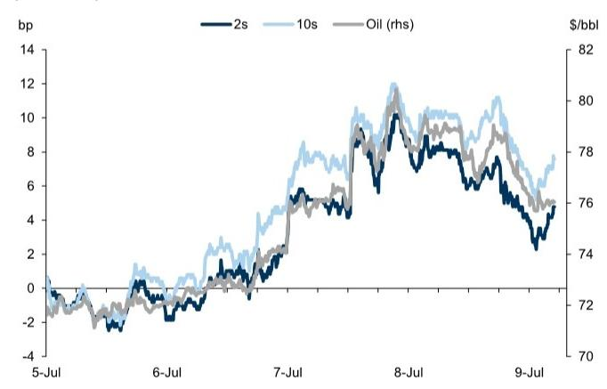
来源：GS全球投资研究，彭博

图表2：随着货币基金缩短加权平均期限，定期票据相对于OIS较短期票据有所贬值
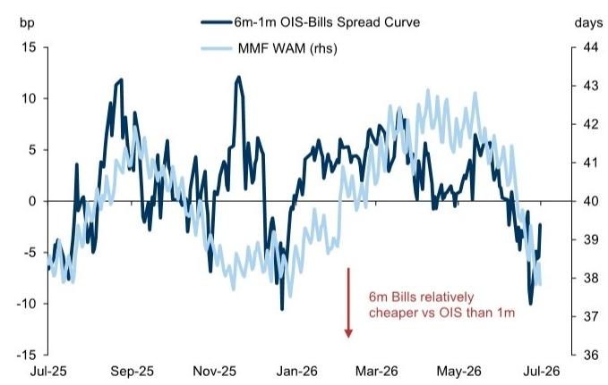
来源：GS全球投资研究，GS FICC与股票，Crane Data

美元强势仍对外国官方需求构成拖累。美元强势仍对外国官方对美国国债的需求构成拖累，TIC和纽约联储托管数据均显示持续净卖出美国国债（图表3）。尽管如此，卖出压力对整体市场的影响有限。我们的外汇策略师近期上调了美元预测，表明美元表现可能继续拖累外国官方需求。虽然这些预测在低收益和高收益货币之间存在差异，但我们发现无论美元强弱来源如何，外国官方美国国债流动的差异并不显著；通常，更广泛的美元背景最为重要。正如我们此前所述，美元表现是外国官方美国国债需求的关键驱动因素，鉴于持续广泛的贬值短期内不太可能重现，这一需求可能保持疲软。然而，美元波动率较低的环境应能限制直接卖出。

USMCA后缺乏明确性，加拿大央行前景未变。对USMCA条款进行年度审查的决定似乎缓解了一些对局势进一步升级的担忧，但并未为加拿大前景提供太多确定性，贸易政策担忧依然存在。在缺乏更多明确性的情况下，我们的研究人员认为这最可能使加拿大央行在下周及今年全年按兵不动。加拿大央行的商业前景调查反映出潜在活动状况依然疲软，但企业似乎也在适应新常态而非期待进一步的贸易缓解，而投资和AI建设方面的预期也指向一定的乐观情绪，劳动力市场似乎已趋于稳定。我们认为这应继续推动加元曲线趋陡，因市场关注最终的正常化（我们的研究人员预计在2027年下半年）。鉴于近期表现，我们平仓了2年5年期陡化交易建议，获得包括持有成本在内的9个基点潜在收益，并将其转为2年10年期陡化交易（入场：53个基点，目标：80个基点，止损：40个基点）。我们预计表现不佳将由5年5年期引领，前端定价可能随时间推移而衰减（图表4）。

图表3：外国官方持有量的下降与美元走强同步
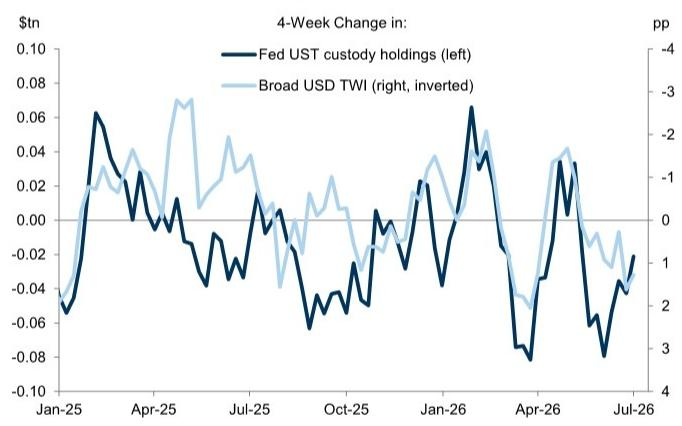
来源：GS全球投资研究，Haver Analytics，纽约联储

图表4：我们预计表现不佳将由加元曲线的5年5年期部分引领
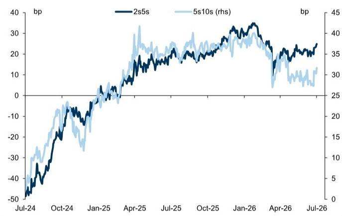
来源：GS全球投资研究，GS FICC与股票

## 欧洲

欧洲波动率下降过程中的波折。欧洲前端利率的反弹本周突然结束，因伊朗再度发生冲突推高了能源价格。新兴叙事是欧洲央行可能放弃未来加息，但能源市场波动率高企、成品油缓解有限以及欧洲天然气价格持续面临上行风险，表明Z6的定价将围绕9月再加息一次波动（我们研究人员的基准情景）。即使欧洲央行不太可能以实质性收紧金融条件的方式加息，我们仍认为前端趋平交易更有价值，市场定价从10月到明年6月约15个基点的加息。趋平敞口可在多种情景下发挥作用。伊朗局势再度升级可能促使市场提前定价加息，并对预测会议赋予相对较少的权重。与此同时，趋陡风险有限，因为通胀风险的逐步下降将侵蚀累计加息定价，包括终端利率。这一观点面临的主要挑战是，长期端回报表现偏高自然通过熊市趋陡风险使曲线偏向陡峭——因此我们建议将前端趋平交易与做空2年2年期利率相结合。或者，我们认为在全球曲线趋陡的背景下，欧元OIS 2年2年期与1年1年期的陡化交易提供了良好的风险回报比。

法国大选前OAT走弱为时过早。欧洲主权利差近几周有所扩大，我们近期触及了做多3年期BTP、Bono、OAT相对于OIS交易的（紧缩）止损，该交易因持有成本获得小幅潜在收益后已平仓。本周法国政治焦点和前端波动率再度上升加剧了这些阻力，但我们预计两者在未来几个月都将消退。如上所述，欧洲央行可能再次加息，但通胀压力似乎不足以使未来加息旨在限制增长，这降低了对主权利差的风险。我们还认为，在距离总统大选如此遥远的情况下，市场持续关注法国政治的门槛较高。勒庞决定在定罪后仍参选并上诉其判决，可能增加国民联盟未来政策平台的不确定性，但在竞选现阶段，民调仍不精确，经济平台尚未成形。我们还认为，与法国财政挑战的规模相比，国民联盟候选人之间的敏感性差异较小。综合来看，我们认为鉴于OAT已定价的溢价，做空OAT的风险回报比较差，并认为持有成本将继续主导未来几个月的回报。

欧元区货币市场紧缩日益临近。总体而言，我们仍认为欧元区银行正在顺利适应流动性较低的环境。欧洲央行的借款仍处于低位，但随着流动性持续流失，未来几个季度情况可能发生变化。欧洲央行常规招标的投标人数有所增加，越来越多的银行财务主管报告准备金正接近其偏好水平。更高的最低准备金要求将降低超额流动性水平，鉴于欧元区准备金分布不均，可能导致融资需求增加。然而，我们预计流动性流失仅会对货币市场利率和基差施加温和压力。主要原因是，我们认为更广泛的条件尚未具备，不会出现急剧扩大；金融与非金融之间的窄利差表明银行信用风险被视为较低，宏观经济不确定性可能呈下降趋势。在此背景下，我们的实证研究表明，前端至中段ESTR-BOR基差看起来合理，且可能仅会随时间推移逐步扩大（图表5）。

图表5：我们的分析指向ESTR-BOR基差面临温和扩大压力
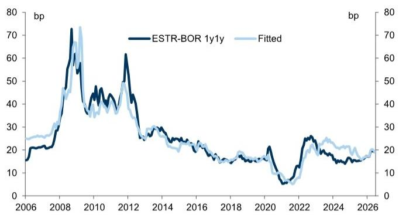
来源：GS FICC与股票，GS全球投资研究

英国前端因能源因素重新定价，但应会反弹。本周数据和央行指引有限，使英国前端对能源价格重新定价做出反应。我们认为前端回落可能因多头头寸而加剧，但这提醒我们，能源缓解进展停滞仍是英国央行定价的风险来源。尽管如此，我们仍认为英国曲线将继续趋陡，因为英国央行加息的障碍不太可能被跨越，但长期财政挑战将持续存在。我们认为，粘性风险溢价在曲线交易中比在资产互换的英国国债中更能有效表达。杠杆率调整应为英国国债创造温和的顺风，根据我们的银行团队估计，这将释放约1500亿英镑的资产负债表容量。按当前银行持有英国国债的份额计算，这将转化为20-30亿英镑的英国国债持有量增加，不太可能对英国国债的水平或相对回报表现产生影响。但通过将杠杆延伸至更广泛的金融体系的间接效应提供了更多支持，在曲线的5年和10年部分，做多资产互换英国国债的持有成本提供了合理的风险回报。

## 日本

日本国债仍处于趋陡路径。10年和30年期日本国债在财务大臣Katayama发表评论后反弹近10个基点，他表示政府"正在寻求采取措施鼓励养老基金，包括GPIF，进一步投资日本金融资产。"GPIF目前持有约26.9%的资产在国内债券中，略高于25%的目标配置，但远在+/-6个百分点的偏差范围内。上周，GPIF总裁Uchida表示，鉴于业绩稳健，该基金不会因短期风险因素改变其战略资产配置；其国内债券组合回报率为-5.1%，而国内股票和外国股票及债券则录得可观收益。虽然从国际投资头寸角度看，GPIF需求增加可能对日本国债形成支撑，但我们怀疑这是否能完全解决潜在的宏观失衡。关键是，今年日本国债的大部分贬值似乎是由宏观因素主导，而非供需失衡——长期端互换利差今年有所扩大，可能受到寿险公司重新买入的支撑，但30年期债券仍有所贬值。从这个角度看，GPIF的转变更可能支撑30年期债券，该期限去年承受了供应主导的贬值压力，但对曲线更远端的影响可能较小，因为近期宏观波动在该区域日益占据主导地位。本周其他报道称，高市早苗政府在基本政策中增加了"通胀稳定"的表述，以缓解对其关于日本央行独立性立场的担忧，日本国债对此反应甚微。财政主导担忧继续推动日本曲线趋陡，这与G3其他地区形成对比，后者曲线今年迄今大多趋平，长期端表现不佳并未因美伊谅解备忘录后通胀定价的缓解而得到抵消。事实上，2年10年期日本国债曲线与10年期通胀交易已开始脱钩，表明更广泛（不仅仅是通胀）的风险溢价仍在上升（图表6）。在此背景下，日元继续走弱，我们的外汇策略师已修正预测，显示未来12个月日元呈贬值趋势。干预仍有可能，并可能加剧日本国债的波动，因为限制日元贬值必然意味着利率成为市场的压力释放阀。只要财政主导担忧仍是焦点，市场似乎可能继续将风险溢价加载到长期端，本月基本政策的发布是关键关注点。

图表6：日本国债曲线趋陡与通胀定价已开始脱钩
2年10年期日本国债曲线与10年期日元通胀互换
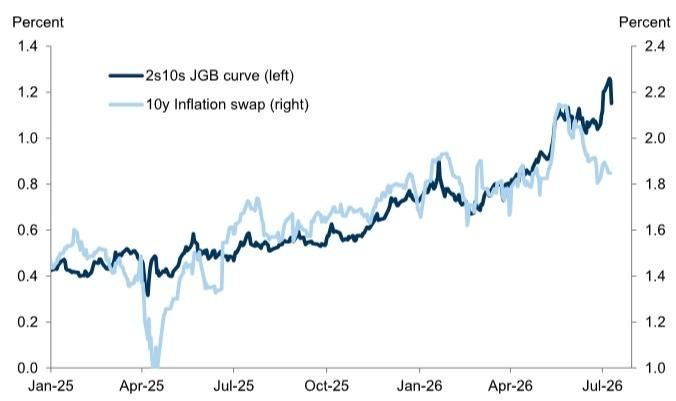
来源：GS FICC与股票，GS全球投资研究

图表7：澳元远期利率应与油价脱钩
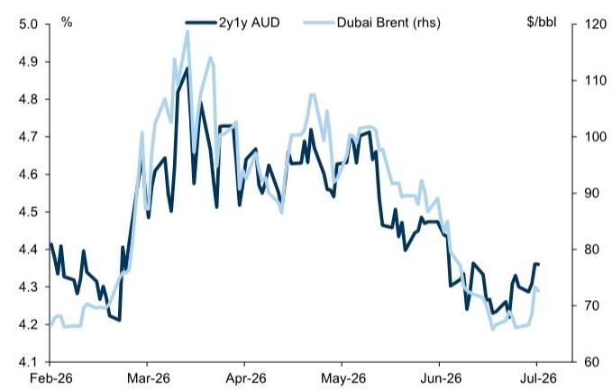
来源：GS全球投资研究，GS FICC与股票

## 澳大利亚与新西兰

■ 新西兰央行开启迷你紧缩周期，但2年10年期仍过于平坦。伊朗敌对行动恢复后油价上涨推高了澳元远期利率。但由于能源价格对更广泛通胀的溢出效应迄今有限，且今年已实施了75个基点的先发制人政策回应，我们认为油价与远期利率之间的高相关性应会减弱（图表7）。尽管远期回报表现上升，但近期澳大利亚央行定价仍相对稳定，未提供我们预期的对冲，使我们的接收澳元2年1年期与支付8月澳大利亚央行交易建议触及止损。然而，我们认为任何由能源价格上涨（而非基本面因素）驱动的回落都是重新参与曲线远端多头头寸的机会，并且仍认为支付近期会议具有良好的风险回报，特别是如果油价再度飙升促使澳大利亚央行对通胀风险采取预防性立场。在新西兰，新西兰央行实施了我们的研究人员预计的两次加息中的第一次，并指引进一步收紧。虽然9月加息是基准情景，但鉴于已定价22个基点，我们认为支付的风险回报较差，并倾向于在超过一次加息后淡化加息溢价。声明承认，闲置产能可能限制任何通胀传导，能源价格对消费和投资构成风险。这应会推迟市场对最终回归更中性立场的预期；我们维持新西兰元2年10年期陡化交易建议。

## 最新专题研究：

全球市场分析师：更新我们的G10期限溢价估计——仍处高位——2026年6月19日

欧元区主权信用监测：欧盟债券——仍在深化——2026年6月12日

全球市场分析师：重新审视美联储资产负债表前景——2026年5月21日

全球利率笔记：美国国债估值与回报表现逆转的条件——2026年5月20日

全球市场分析师：英国国库券：并非英国国债的灵丹妙药——2026年5月11日

## 最新全球市场日报：

欧元区货币市场接近关键时刻——2026年7月8日

偿付能力II审查将强化良性主权信用风险背景——2026年6月23日

G10利率观点——低波动，而非低回报表现——2026年6月22日

美联储沟通与利率波动——2026年6月10日

利率接收方的对冲价值——2026年5月28日

作者感谢Dario Scordamaglia对本报告的贡献。Dario是市场团队的实习生。

## 预测

G10 10年期回报表现预测

<table><tr><td colspan="14">G10 10年期回报表现预测</td></tr><tr><td></td><td>美元</td><td>德国</td><td>法国</td><td>意大利</td><td>西班牙</td><td>英镑</td><td>日元</td><td>加元</td><td>瑞郎</td><td>瑞典克朗</td><td>挪威克朗</td><td>澳元</td><td>新西兰元</td></tr><tr><td>即期</td><td>4.55</td><td>3.07</td><td>3.83</td><td>3.80</td><td>3.51</td><td>4.87</td><td>2.74</td><td>3.51</td><td>0.42</td><td>2.86</td><td>4.35</td><td>4.84</td><td>4.59</td></tr><tr><td>3Q26</td><td>4.45</td><td>2.95</td><td>3.60</td><td>3.65</td><td>3.35</td><td>4.60</td><td>2.50</td><td>3.50</td><td>0.40</td><td>3.20</td><td>4.00</td><td>4.75</td><td>4.50</td></tr><tr><td>4Q26</td><td>4.40</td><td>3.00</td><td>3.70</td><td>3.75</td><td>3.45</td><td>4.50</td><td>2.50</td><td>3.50</td><td>0.50</td><td>3.25</td><td>4.00</td><td>4.70</td><td>4.50</td></tr><tr><td>1Q27</td><td>4.35</td><td>3.00</td><td>3.75</td><td>3.80</td><td>3.50</td><td>4.50</td><td>2.45</td><td>3.50</td><td>0.50</td><td>3.25</td><td>4.00</td><td>4.60</td><td>4.50</td></tr><tr><td>2Q27</td><td>4.30</td><td>3.00</td><td>3.75</td><td>3.85</td><td>3.55</td><td>4.40</td><td>2.40</td><td>3.50</td><td>0.50</td><td>3.25</td><td>4.00</td><td>4.50</td><td>4.50</td></tr><tr><td>3Q27</td><td>4.25</td><td>3.00</td><td>3.75</td><td>3.90</td><td>3.60</td><td>4.40</td><td>2.30</td><td>3.50</td><td>0.50</td><td>3.25</td><td>4.00</td><td>4.50</td><td>4.50</td></tr><tr><td>4Q27</td><td>4.25</td><td>3.00</td><td>3.75</td><td>3.90</td><td>3.60</td><td>4.35</td><td>2.25</td><td>3.50</td><td>0.50</td><td>3.25</td><td>4.00</td><td>4.50</td><td>4.50</td></tr><tr><td>1Q28</td><td>4.25</td><td>3.00</td><td>3.75</td><td>3.90</td><td>3.60</td><td>4.30</td><td>2.20</td><td>3.50</td><td>0.50</td><td>3.25</td><td>4.00</td><td>4.50</td><td>4.50</td></tr></table>

<table><tr><td colspan="14">与远期偏差</td></tr><tr><td></td><td>美元</td><td>德国</td><td>法国</td><td>意大利</td><td>西班牙</td><td>英镑</td><td>日元</td><td>加元</td><td>瑞郎</td><td>瑞典克朗</td><td>挪威克朗</td><td>澳元</td><td>新西兰元</td></tr><tr><td>3Q26</td><td>-0.16</td><td>-0.15</td><td>-0.39</td><td>-0.31</td><td>-0.06</td><td>-0.04</td><td>0.34</td><td>-0.33</td><td>-0.12</td><td>-0.16</td><td>-0.22</td><td>-0.25</td><td>-0.18</td></tr><tr><td>4Q26</td><td>-0.25</td><td>-0.13</td><td>-0.55</td><td>-0.40</td><td>-0.11</td><td>0.03</td><td>0.36</td><td>-0.32</td><td>-0.20</td><td>-0.23</td><td>-0.19</td><td>-0.21</td><td>-0.13</td></tr><tr><td>1Q27</td><td>-0.34</td><td>-0.17</td><td>-0.59</td><td>-0.52</td><td>-0.14</td><td>0.01</td><td>0.33</td><td>-0.31</td><td>-0.32</td><td>-0.31</td><td>-0.19</td><td>-0.22</td><td>-0.13</td></tr><tr><td>2Q27</td><td>-0.43</td><td>-0.21</td><td>-0.74</td><td>-0.65</td><td>-0.18</td><td>-0.01</td><td>0.31</td><td>-0.30</td><td>-0.45</td><td>-0.37</td><td>-0.20</td><td>-0.28</td><td>-0.13</td></tr></table>

来源：GS全球投资研究

## G4曲线预测

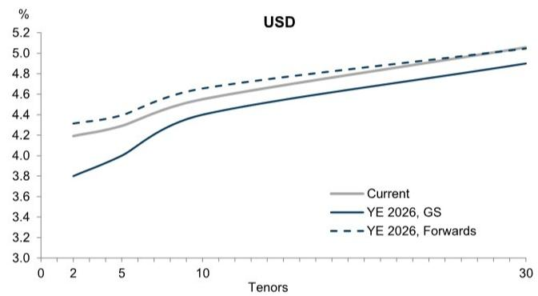

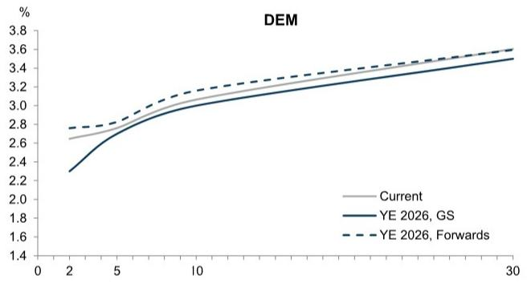

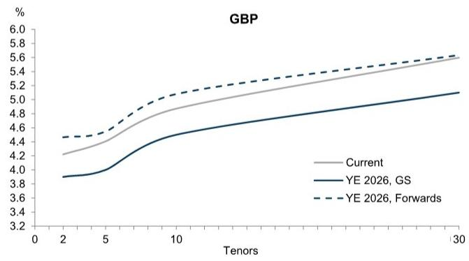
来源：彭博，GS全球投资研究

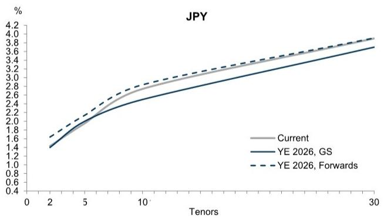

## 央行仪表盘

自今日起定价的累计加息/降息幅度
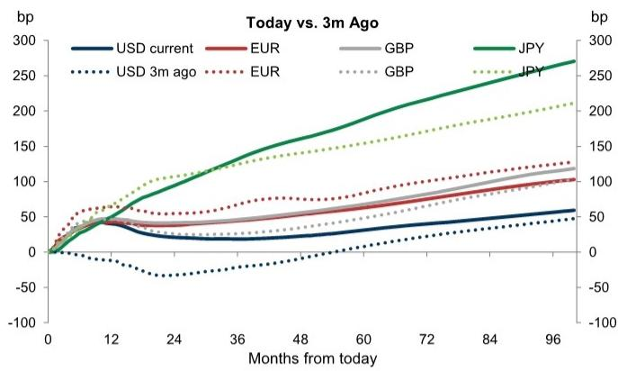
来源：GS全球投资研究

按年份划分的预期加息，GS vs. 市场
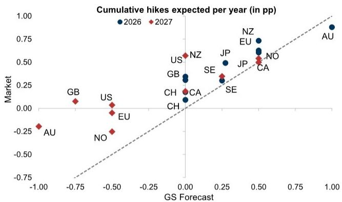
来源：GS全球投资研究

央行持有主权债券情况，当前 vs. 一年前
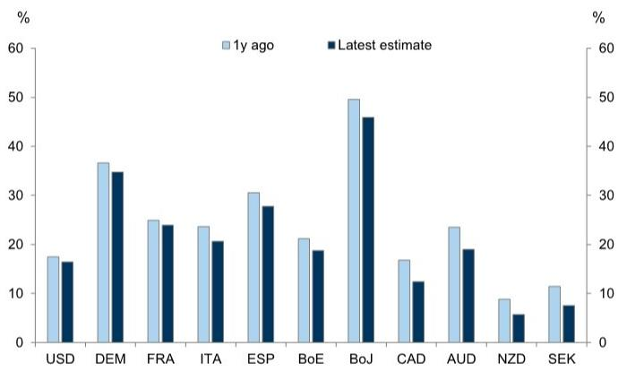
来源：Haver Analytics

央行资产占GDP比重
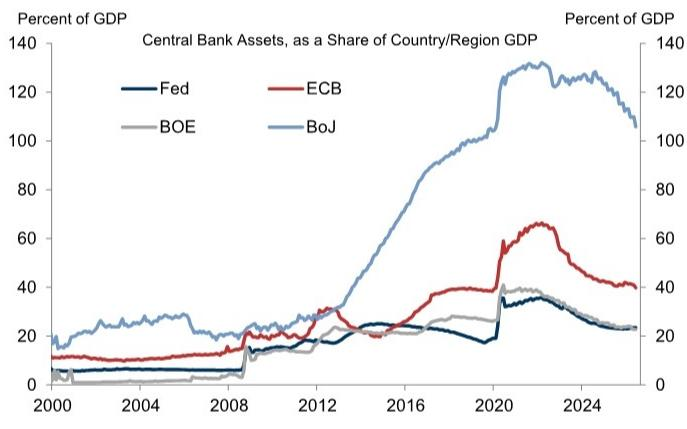
来源：Haver Analytics

## 持仓与资金流监测

期权隐含持仓指标

来源：GS全球投资研究

GS基金持仓指标
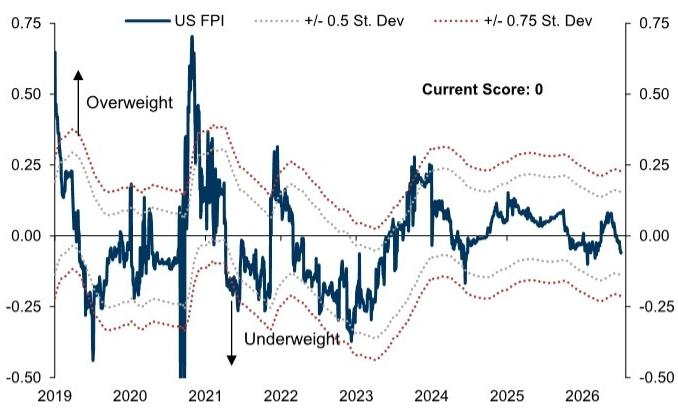
来源：GS全球投资研究

美国数据响应指标
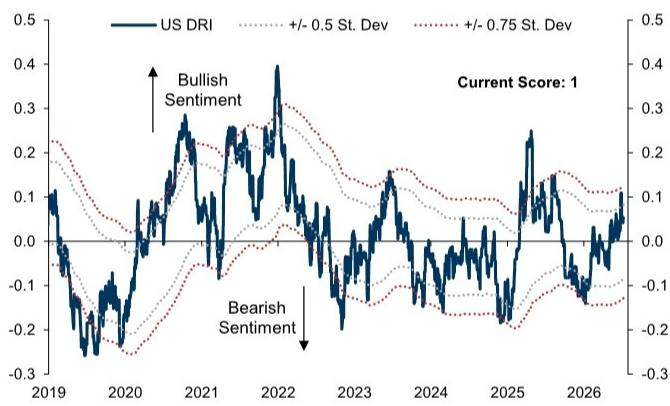

## CFTC持仓报告与金融期货交易商

按读者类型划分的久期加权净头寸

久期加权持仓，按合约划分

<table><tr><td>$mm/bp</td><td>SFR</td><td>TU</td><td>FV</td><td>TY</td><td>TN</td><td>US</td><td>WN</td></tr><tr><td>投机者 当前</td><td>-83.6</td><td>-44.2</td><td>-53.5</td><td>-49.5</td><td>-12.0</td><td>-12.0</td><td>-50.6</td></tr><tr><td>投机者 1周变化</td><td>-2.0</td><td>1.1</td><td>-0.1</td><td>0.4</td><td>-1.5</td><td>10.0</td><td>5.0</td></tr><tr><td>杠杆基金 当前</td><td>-78.2</td><td>-60.0</td><td>-87.5</td><td>-121.6</td><td>-26.9</td><td>-46.0</td><td>-160.8</td></tr><tr><td>杠杆基金 1周变化</td><td>-4.0</td><td>1.2</td><td>0.8</td><td>-2.9</td><td>-5.6</td><td>-1.2</td><td>1.3</td></tr><tr><td>资产管理公司+其他 当前</td><td>-7.5</td><td>72.1</td><td>119.7</td><td>148.2</td><td>60.8</td><td>68.6</td><td>198.6</td></tr><tr><td>资产管理公司+其他 1周变化</td><td>-0.9</td><td>-3.1</td><td>1.4</td><td>-0.9</td><td>6.0</td><td>-8.7</td><td>-4.9</td></tr><tr><td>交易商 当前</td><td>85.5</td><td>-14.4</td><td>-33.9</td><td>-27.6</td><td>-25.7</td><td>-39.3</td><td>-45.2</td></tr><tr><td>交易商 1周变化</td><td>4.8</td><td>2.0</td><td>-1.8</td><td>3.1</td><td>-1.6</td><td>5.9</td><td>0.2</td></tr></table>

欧洲美元净头寸
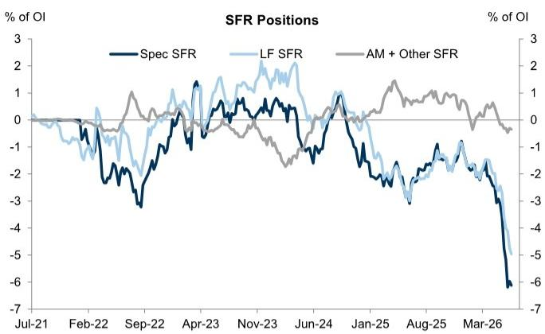
注：久期加权净头寸（多头-空头）占久期加权总敞口（多头+空头+价差）的百分比
来源：CFTC，GS全球投资研究

美国国债期货净头寸
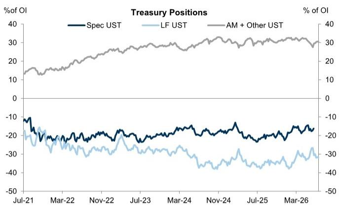
注：久期加权净头寸（多头-空头）占久期加权总敞口（多头+空头+价差）的百分比
来源：CFTC，GS全球投资研究

一级交易商交易 美国国债交易商净头寸
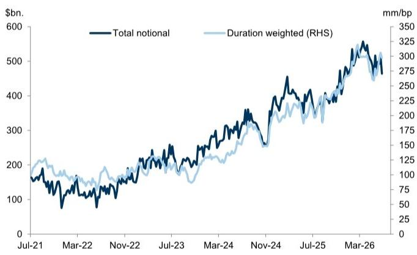
来源：纽约联邦储备银行，GS全球投资研究

美国商业银行持有的国债与机构证券
国内外总持有量，所有商业银行
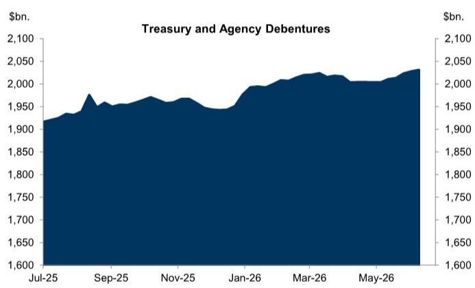
来源：联邦储备委员会

纽约联储托管持有量 可交易美国国债
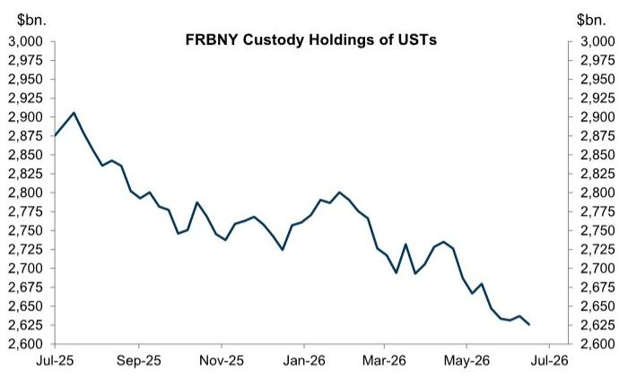
来源：纽约联邦储备银行

## 美国TIC国债流动

按债务持有人划分的估值调整后美国国债持有量12个月变化

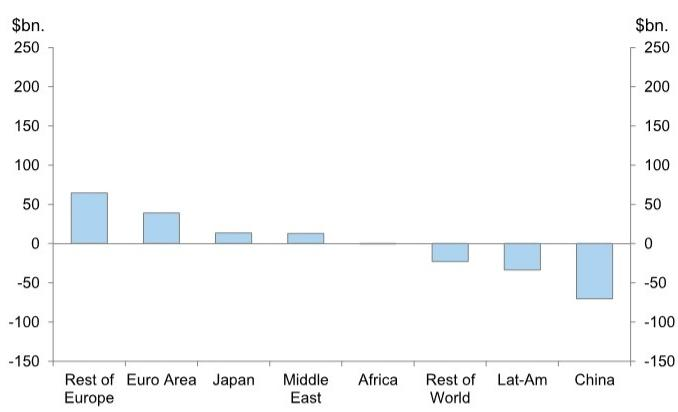
来源：美国财政部，GS全球投资研究

日本读者月度净买入短期和长期美国国债
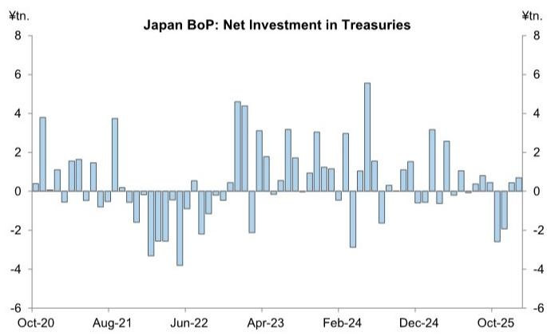
来源：日本央行，Haver Analytics

按行业划分的资金流量年度净买入美国国债
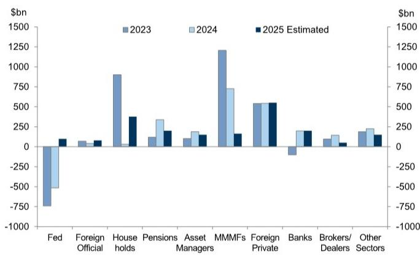
来源：联邦储备委员会，GS全球投资研究

## 持有成本/滚动收益监测

## 直接持有成本

柱状图显示各货币前两大持有成本点，实心表示多头头寸的持有成本，条纹表示空头头寸的持有成本。散点图显示各货币前25个持有成本/波动率点，标注各货币最高点

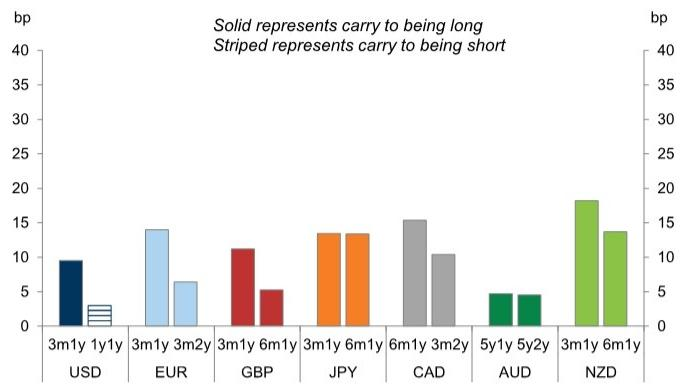
来源：GS全球投资研究

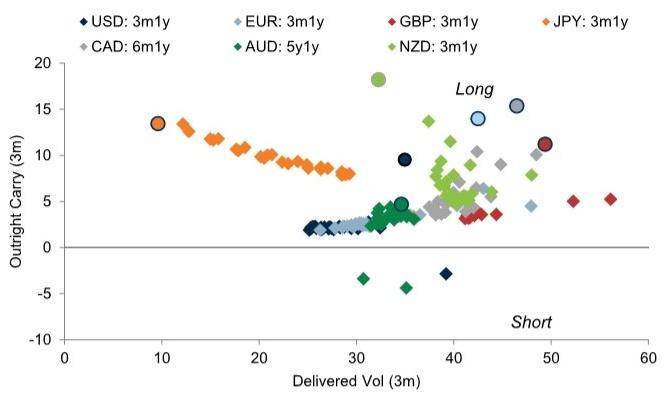

## 曲线持有成本

柱状图显示各货币前两大持有成本曲线，实心表示陡化头寸的持有成本，条纹表示趋平头寸的持有成本。散点图显示各货币前5条持有成本/波动率曲线，标注各货币最高曲线

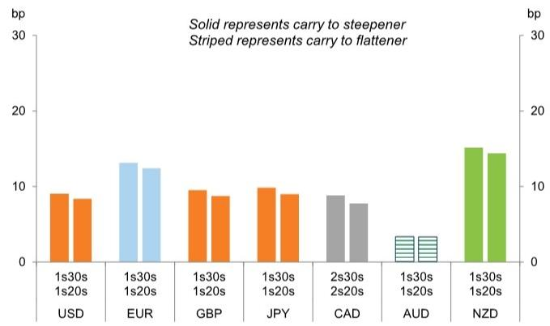

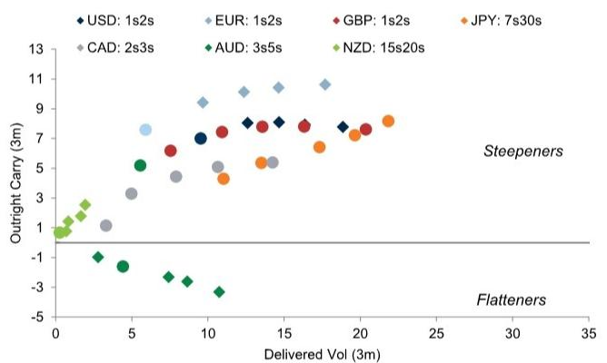
来源：GS全球投资研究

## 蝶式持有成本

柱状图显示各货币前两大持有成本蝶式，实心表示中间端变贵的蝶式，条纹表示中间端变便宜的蝶式。散点图显示各货币前5个持有成本/波动率蝶式，标注各货币最高蝶式

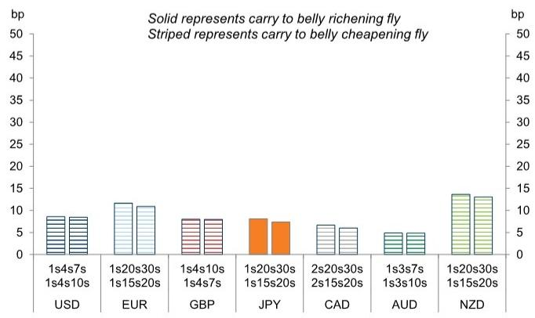
来源：GS全球投资研究

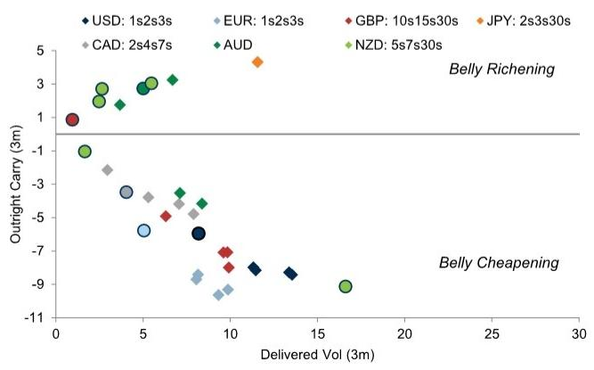

## 国债供应监测

按年末估算的国债拍卖总规模，含GS预测

<table><tr><td colspan="12">日历年末月度拍卖金额（十亿美元）</td></tr><tr><td></td><td>2年浮息债</td><td>2年</td><td>3年</td><td>5年</td><td>7年</td><td>10年</td><td>20年</td><td>30年</td><td>5年TIPS</td><td>10年TIPS</td><td>30年TIPS</td></tr><tr><td>25年末（日历年）</td><td>30 / 28 (r)</td><td>69</td><td>58</td><td>70</td><td>44</td><td>42 / 39 (r)</td><td>16 / 13 (r)</td><td>25 / 22 (r)</td><td>26 / 24 (r)</td><td>21 / 19 (r)</td><td>9 / 8 (r)</td></tr><tr><td>26年末（日历年，GS）</td><td>30 / 28 (r)</td><td>69</td><td>58</td><td>70</td><td>44</td><td>42 / 39 (r)</td><td>16 / 13 (r)</td><td>25 / 22 (r)</td><td>26 / 24 (r)</td><td>21 / 19 (r)</td><td>9 / 8 (r)</td></tr><tr><td>27年末（日历年，GS）</td><td>33 / 30 (r)</td><td>83</td><td>72</td><td>84</td><td>58</td><td>42 / 39 (r)</td><td>16 / 13 (r)</td><td>25 / 22 (r)</td><td>28 / 26 (r)</td><td>21 / 19 (r)</td><td>9 / 8 (r)</td></tr></table>

\* 浮息债、10年、20年、30年和TIPS列示新发行/续发。

<table><tr><td colspan="7">美国国债按日历年净发行（十亿美元）</td></tr><tr><td></td><td>净息票</td><td>美联储</td><td>扣除美联储后净额</td><td>净票据</td><td>美联储</td><td>扣除美联储后净额</td></tr><tr><td>日历年2024</td><td>1346</td><td>-475</td><td>1821</td><td>511</td><td>-23</td><td>534</td></tr><tr><td>日历年2025</td><td>1566</td><td>-115</td><td>1681</td><td>360</td><td>38</td><td>322</td></tr><tr><td>日历年2026，GS</td><td>1254</td><td>-2</td><td>1256</td><td>767</td><td>413</td><td>354</td></tr><tr><td>日历年2027，GS</td><td>1288</td><td>0</td><td>1288</td><td>926</td><td>449</td><td>477</td></tr></table>

来源：
