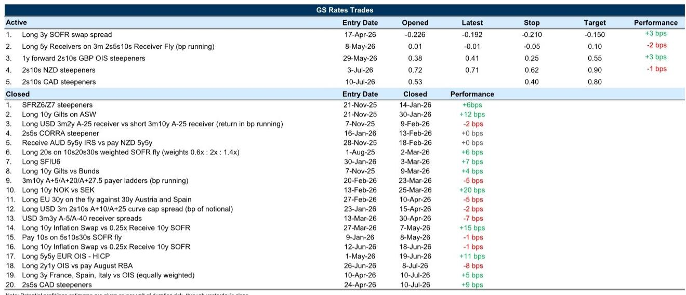
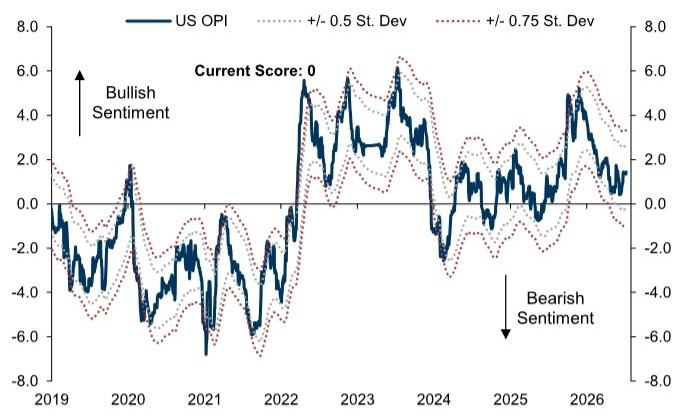

# 能源价格重新成为利率波动的主要驱动因素，但真正的非对称性在于前端

本周全球利率市场最重要的变动并非源于企业借贷或央行指引。美国长期回报表现下跌10个基点，几乎与原油价格同步波动，原因是美伊冲突再度升级，暂时取代了与AI相关的债务发行，成为影响利率的全球性因素。这一转变之所以重要，是因为它改变了围绕即将公布的美国CPI数据的风险分布，重新引发了关于欧洲前端估值可持续性的讨论，并暴露了日本一个结构性矛盾——这一矛盾是任何养老基金购买都无法解决的。近期的非对称性很明确：石油价格将决定前端利率是压缩还是重新定价走高，而最可靠的交易策略是利用市场对央行行动的定价与潜在通胀轨迹之间的差距。

美国远期利率已从略微偏高转为大致合理，长期回报表现与宏观及财政基本面所暗示的水平之间缺乏脱节，这削弱了企业借贷在国债估值中扮演过度角色的论点。债务融资的投资周期应会在一定程度上推高回报表现，因为它提升了未来增长预期，但这一机制已反映在当前定价中。近期波动性的真正来源是能源。如果核心CPI符合经济学家预测的0.17%的增幅，而整体CPI下降0.11%，那么前端利率的风险分布应会压缩，从而侵蚀目前市场定价中到2027年初约45个基点的加息预期。这将使那些押注美联储按兵不动的有限下行方向结构成为合理的持有收益表达。反之，油价上涨会使市场更容易受到更强劲数据的影响，而围绕该数据发布的非对称性是美国利率市场近期最可行的交易机会。

美国曲线前端还存在一个值得关注的结构性扭曲。一个月期国库券仍受到季节性低供给、有利的融资条件以及货币市场基金资产管理规模增长的支撑。但三个月期和六个月期国库券表现相对较弱，原因是货币市场基金的加权平均期限偏向更短，这反映了在美联储领导层重新定义其反应函数应提供多少指引的情况下，政策不确定性的上升。这些数字虽小但具有一致性：加权平均期限缩短一天，大致相当于定期国库券相对于隔夜指数互换利率便宜约0.1个基点，同时使一个月期国库券变贵0.3个基点。夏季更重的国库券供给可能会带来阻力，但由于政策利率偏高且曲线整体趋平，货币基金资产管理规模预计将继续增长，三个月期和六个月期国库券的走便宜压力应会保持可控。这意味着，曲线最前端正在定价一个政策不确定性溢价，而曲线其他部分并未体现，这一差距在美联储提供更清晰的前瞻指引之前不太可能弥合。

## 美元走强将使外国官方对美债的需求保持疲软，但抛售压力不太可能加剧

美元走强仍然是外国官方对美债需求的持续拖累，TIC数据和纽约联储托管持有量均显示美国国债持续净卖出。其机制很简单：美元走强降低了以美元计价的外汇储备价值，使得增量购买美债的吸引力下降。到目前为止，抛售压力对整体市场的影响有限，但外汇策略师近期上调美元预测表明，这一阻力将持续存在。关键在于，无论美元走强是由低收益还是高收益经济体驱动，外国官方资金流动的差异并不显著；更广泛的美元背景才是最重要的。持续、广泛的美元贬值在一段时间内不太可能重现，这意味着外国官方需求将保持疲软。然而，美元波动性较低的环境应能限制直接的抛售，这意味着风险并非外国持有量的突然崩溃，而是一种持续的、温和的拖累，阻止回报表现像原本可能的那样下降。

## 欧洲前端重新定价提醒我们，反通胀进程停滞才是多头持仓的真正风险

本周欧洲前端利率涨势的突然结束是能源价格上涨的直接后果，但更深层的教训在于反通胀叙事的脆弱性。市场目前定价9月大约再加息一次，这与经济学家的基准情景一致，并预计从10月到明年6月之间累计加息约15个基点。新兴的叙事是，欧洲央行可能会跳过未来的加息，但能源市场波动性高企、成品油价格缓解有限以及欧洲天然气价格持续面临上行风险，表明定价将围绕那一次9月加息而波动。策略上的含义是，前端趋陡交易比直接的方向性交易提供更好的风险回报。如果伊朗局势再度升级，市场很可能会将加息预期提前，并对预测会议赋予相对较少的权重；而如果通胀风险逐步下降，则会侵蚀累计的加息预期。这一观点面临的主要挑战是，长期回报表现偏高自然通过熊市趋陡风险使曲线变陡，这就是为什么将前端趋陡交易与做空2y2y利率相结合，或者等价地，在全球曲线趋陡的环境中，为欧元OIS 2y2y相对于1y1y趋陡交易建仓，能提供良好的风险回报。

英国前端利率的回落遵循了同样的模式，有限的数据和央行指引使市场只能对能源价格的重新定价做出反应。前端的变动可能因多头持仓而加剧，但这提醒我们，能源价格缓解进程停滞仍是英国央行定价面临的风险来源。尽管如此，英国曲线应会继续趋陡，因为英国央行加息的门槛不太可能达到，而长期财政挑战依然顽固。调整杠杆比率应能为英国国债创造温和的利好，通过释放约1500亿英镑的资产负债表空间，按目前银行持有英国国债的份额计算，相当于增加20-30亿英镑的持有量。这一直接影响不太可能改变英国国债的回报表现水平或相对利差，但通过将杠杆扩展至更广泛的金融体系而产生的间接影响提供了更多支撑。在资产互换中持有长期英国国债，在曲线的5年期和10年期部分提供了合理的风险回报。

## 法国政治风险已被定价，但财政挑战仍是OAT利差的主要驱动因素

本周欧洲主权利差的扩大是由法国政治焦点和前端波动性再度上升共同驱动的，但这两个因素在未来几个月都可能消退。欧洲央行可能会再次加息，但通胀压力似乎不足以使未来的加息旨在限制增长，这降低了对主权利差的风险。市场在距离总统大选如此遥远的时候持续关注法国政治的门槛也很高。玛丽娜·勒庞尽管被判有罪但仍决定参选并上诉，这可能会增加围绕国民联盟未来政策平台的不确定性，但在竞选现阶段，民调仍不精确，经济纲领也尚未充实。更重要的是，与法国财政挑战的规模相比，国民联盟候选人之间的敏感性差异很小。综合来看，鉴于OAT已经定价了溢价，做空OAT的风险回报不佳，而持有收益将继续决定未来几个月的回报。政治噪音分散了对结构性财政故事的注意力，将其视为主要驱动因素的读者，当焦点回归基本面时，可能会判断失误。

## 欧元区货币市场紧缩正在临近，但压力将是渐进的

目前，欧元区银行正在顺利适应流动性较低的环境，但压力迹象正在累积。在欧洲央行常规招标中的投标者数量有所增加，越来越多的银行财务主管报告称，准备金正接近其偏好的水平。更高的最低准备金要求将减少过剩流动性水平，考虑到欧元区准备金分布不均，这可能导致融资需求增加。然而，流动性流失应只会对货币市场利率和基差施加温和压力。主要原因是，大幅扩大的条件尚不具备：金融与非金融部门之间的利差狭窄表明银行信用风险被视为较低，宏观经济不确定性可能呈下降趋势。实证研究表明，前端至中端的ESTR-BOR基差看起来合理，并且可能只会随着时间的推移逐渐扩大。紧缩正在来临，但这将是一个缓慢的挤压而非突然的断裂，押注大幅扩大可能为时过早。

## 日本国债将继续趋陡，因为宏观失衡压倒了任何养老基金需求

在财务大臣发表关于鼓励养老基金更多投资日本金融资产的言论后，日本国债上涨了10至30个基点，但这只是战术性变动，而非结构性转变。GPIF目前持有约26.9%的资产为国内债券，略高于25%的目标配置，但远在偏离限度之内。虽然更大的GPIF需求可以从国际投资头寸角度支撑日本国债，但这并不能完全解决潜在的宏观失衡问题。关键在于，今年日本国债的大部分走便宜是由宏观因素主导的，而非供需失衡。长期互换利差今年有所扩大，可能受到寿险公司重新买入的支撑，但30年期债券仍然走便宜。GPIF的转变更有可能支撑30年期板块——该板块去年承受了供给主导的走便宜压力——但在曲线更远端，宏观波动性已日益占据主导地位，其影响可能较小。

2s10s日本国债曲线与10年期日元通胀互换的脱钩是最具指示性的信号。这表明更广泛的风险溢价，而不仅仅是通胀溢价，仍在上升。在此背景下，日元持续走弱，干预仍有可能。但干预必然意味着利率成为市场的压力释放阀：限制日元贬值需要更高的回报表现，这反过来又加剧了最初导致曲线趋陡的财政主导担忧。只要财政主导仍是焦点，市场似乎就倾向于继续将风险溢价加载到长期端。本月基本政策的发布是一个关键焦点，但推动日本国债波动的结构性力量不太可能通过单一政策文件得到解决。

## 未来一个月的决策框架

油价、央行反应函数和财政基本面之间的相互作用，创造了一系列独特的可交易非对称性。在美国，非对称性围绕CPI：如果数据符合预期，前端风险应会压缩，加息预期应会侵蚀，这使得有限下行方向结构变得合理。如果油价推高整体通胀，风险分布将向上移动，前端将重新定价。在欧洲，非对称性在于曲线：前端趋陡交易能在多种情景下提供保护，因为局势再度升级会将加息预期提前，而通胀风险下降则会侵蚀累计的预期。在日本，非对称性在于长期端：宏观失衡规模太大，养老基金购买无法解决，只要财政主导担忧仍是焦点，趋陡趋势将持续。共同的主线是，能源价格已重新成为主要的近期驱动因素，但在伊朗局势升级之前就已存在的结构性力量——债务融资的投资周期、财政挑战以及金融体系中流动性分布不均——并未消失。它们只是被新的波动源所覆盖，而最可靠的交易策略是利用市场定价与潜在轨迹之间的差距。

*仅供参考。部分内容可能基于源材料通过AI辅助生成、翻译、总结或编辑，可能存在遗漏或错误。请独立核实。本文不构成投资、法律、税务、会计或其他专业建议。*

仅供参考。部分内容可能基于源材料通过AI辅助生成、翻译、总结或编辑，可能存在遗漏或错误。请独立核实。本文不构成投资、法律、税务、会计或其他专业建议。

