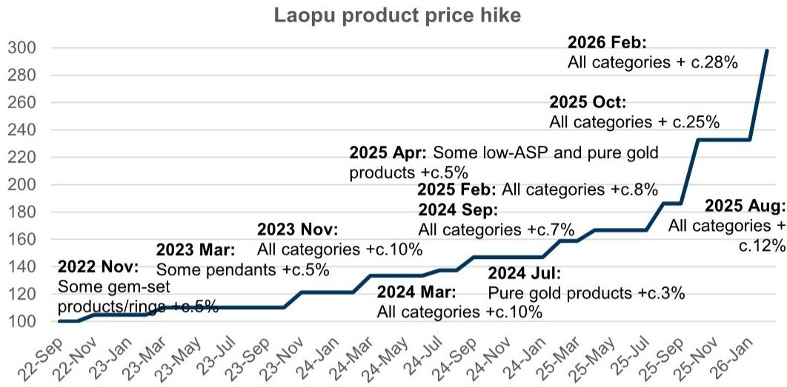
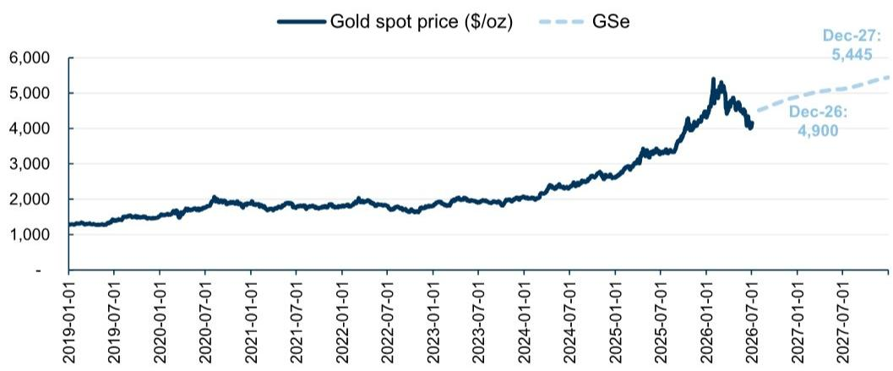
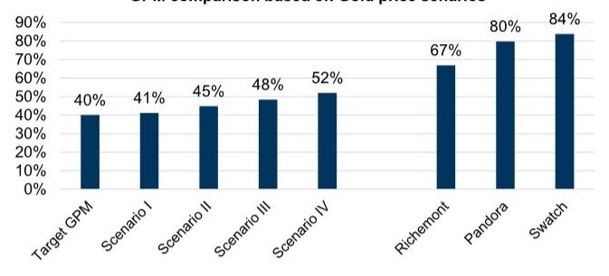
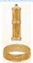
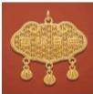
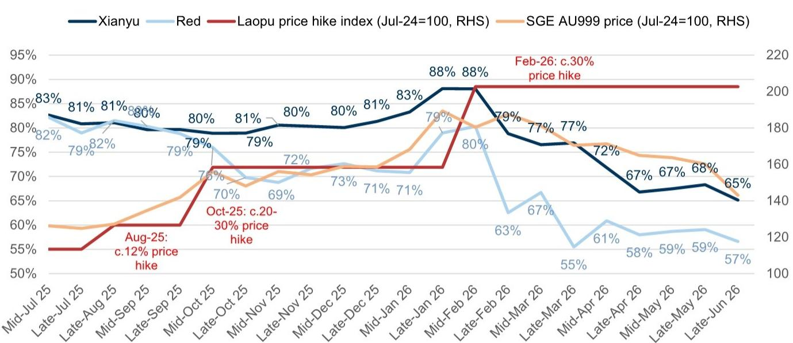

# 老铺黄金（6181.HK）：金价波动影响销售但支撑毛利；因增长放缓下调盈利/目标价，维持正面评级

自老铺2月28日提价以来，金价已回调超过20%至约4100美元/盎司，这对其作为固定价格销售模式的企业销售表现产生了影响。根据我们的跟踪数据，老铺天猫旗舰店第二季度销售额同比下降63%，而第一季度同比增长155%，618期间面临高基数及线下分流压力；尽管我们预计整体线下销售表现将优于线上，且持续获客仍能提供支撑，但相对价格敏感的需求（包括经销商需求）也构成了去年的高基数，我们预计这部分需求将相对偏弱——目前老铺每克价格较按克计价产品溢价幅度在较高双位数至超过100%之间。我们也注意到，在金价回调期间，按克计价产品表现更优，周大福和六福在第二季度均录得稳健的同店销售增长，主要受固定价格产品强劲增长推动。

积极方面，我们注意到老铺的品牌热度保持健康，领先于其他古法金品牌，社交媒体平台上的粉丝数和讨论量均有增长。公司已通过新品推出/促销期间允许叠加会员折扣等方式测试较低价格（低至中个位数降幅），初步对需求产生了积极影响（例如，据社交媒体平台信息，上海新天地店允许叠加折扣，周末出现1-2小时排队）。但若公司进一步推广此类定价策略，也需关注客户对品牌定位的认知变化。

我们将2026年盈利预测下调9%至80亿元人民币，反映下半年在金价回调背景下的增长展望趋缓，而上半年净利润预测维持在47亿元人民币（或调整后净利润48亿元人民币），销售额下调被有利的库存采购价格带来的更高毛利率所部分抵消。对于2027-28年，我们因收入端下调而将盈利预测下调19%-22%。尽管如此，以当前股价计算，2026年市盈率约为7倍，我们认为需求压力已在市场预期中有所反映。若金价企稳或回升（目前约4100美元/盎司，GS预测年底达4900美元），我们预计销售最困难的阶段已经过去，后续将受益于提价后消费情绪逐步恢复、经销商库存消化、以及新品推出（包括降价产品）刺激客户需求。老铺的股息率也较高，约10%。维持正面评级，目标价从1108港元下调至650港元（基于下调后的2026年13倍市盈率）。

阮欣雨  
+852-2978-7347 | xinyu.ruan@gs.com  
GS（亚洲）有限责任公司

郑敏芝  
+852-2978-6631 | michelle.cheng@gs.com  
GS（亚洲）有限责任公司

戴莫莉  
+852-3966-4000 | molly.dai@gs.com  
GS（亚洲）有限责任公司

## 定价：对按克计价产品的溢价扩大；但正在测试更低价格

老铺于2月28日提价20%-30%，当时金价处于相对高位，超过5000美元/盎司。但自提价以来，金价已回调超过20%。虽然我们认为老铺在产品和服务方面的优势支撑了其价格溢价，并持续吸引对价格不那么敏感的客户（截至2026年3月，老铺约80%的客户与全球奢侈品牌重叠），但相对价格敏感的需求（包括来自经销商的购买）也支撑了老铺在2025年/2026年春节期间的强劲销售表现，尤其是在老铺提价幅度低于金价涨幅的情况下。目前，在金价约4100美元/盎司且假设老铺以此水平采购库存的情况下，意味着老铺在折扣后能够达到约50%的毛利率，而公司目标毛利率为40%。这也意味着其每克价格较周大福固定价格产品溢价约十几个百分点，或较当前按克计价产品每克价格溢价在较高双位数（纯金）至超过100%（镶嵌宝石）之间。金价回调给老铺近期销售带来了压力——线上渠道方面，我们的跟踪数据显示第二季度同比下降63%（第一季度为增长155%）；线下渠道方面，我们预计整体表现将优于线上，新店开业（上半年门店数量同比增长低十几个百分点）是支撑因素，同时不同渠道出现分化，经销商占比较高的渠道表现相对较弱。

虽然老铺现有产品价格和折扣幅度（促销期间10%折扣）保持稳定，但我们注意到该品牌正在通过以下方式测试市场对较低价格的反馈：1）部分新推出产品，纯金/镶嵌宝石产品每克价格约2100-2200/2700-2800元人民币（或10%折扣后低于2000/2400-2500元），根据我们的跟踪数据，这比现有产品便宜约3%；2）在部分促销活动中，会员5%折扣可与10%促销折扣叠加，意味着中十几个百分点的折扣水平（此前为10%，或叠加商场积分后最高低十几个百分点）——例如，据社交媒体平台信息，近期升级的上海新天地店在促销期间周末出现1-2小时排队。

图表1：老铺历史提价情况  
  
来源：公司数据，GS全球投资研究

图表2：GS预计COMEX金价到2026年12月将达到4900美元/盎司，较当前约有18%上行空间  
  
来源：Refinitiv Eikon，GS全球投资研究

图表3：2月提价后，金价约5000美元/盎司时老铺可达40%毛利率；金价下跌进一步推升毛利率

<table><tr><td rowspan="2"></td><td colspan="5">情景（2月提价后，含10%折扣）</td></tr><tr><td>目标毛利率</td><td>I</td><td>II</td><td>III</td><td>IV</td></tr><tr><td>金价（美元/盎司）</td><td>5,000</td><td>4,900</td><td>4,600</td><td>4,300</td><td>4,000</td></tr><tr><td>每100元收入的销售成本</td><td>60</td><td>59</td><td>55</td><td>52</td><td>48</td></tr><tr><td>毛利率</td><td>40%</td><td>41%</td><td>45%</td><td>48%</td><td>52%</td></tr></table>

基于金价情景的毛利率比较

  
来源：公司数据，GS全球投资研究

图表4：提价后老铺每克价格较按克计价产品的溢价显著扩大；但公司正在测试新品的较低价格
固定价格产品每克价格（标价）

<table><tr><td colspan="11">固定价格产品每克价格（标价）</td></tr><tr><td>品牌</td><td colspan="4">老铺</td><td colspan="3">Jemper</td><td colspan="3">Borland</td></tr><tr><td>产品类型</td><td>纯金</td><td>镶嵌宝石</td><td>新品纯金</td><td>新品镶嵌宝石</td><td>纯金</td><td>镶嵌宝石</td><td>新品</td><td>纯金</td><td>镶嵌宝石</td><td>新品</td></tr><tr><td>产品图片</td><td></td><td></td><td></td><td></td><td></td><td></td><td></td><td></td><td></td><td></td></tr><tr><td>2026年1月</td><td>1,723</td><td>2,180</td><td></td><td></td><td>不适用</td><td>2,175</td><td></td><td>1,943</td><td>2,669</td><td></td></tr><tr><td>较上金所金价</td><td>52%</td><td>92%</td><td></td><td></td><td></td><td>91%</td><td></td><td>71%</td><td>135%</td><td></td></tr><tr><td>较周大福按克计价金价</td><td>14%</td><td>44%</td><td></td><td></td><td></td><td>43%</td><td></td><td>28%</td><td>76%</td><td></td></tr><tr><td>2026年2月</td><td>2,223</td><td>2,824</td><td></td><td></td><td>不适用</td><td>2,175</td><td></td><td>2,268</td><td>2,988</td><td></td></tr><tr><td>年初至今涨幅（%）</td><td>29%</td><td>30%</td><td></td><td></td><td></td><td>0%</td><td></td><td>17%</td><td>12%</td><td></td></tr><tr><td>较上金所金价</td><td>92%</td><td>144%</td><td></td><td></td><td></td><td>88%</td><td></td><td>96%</td><td>158%</td><td></td></tr><tr><td>较周大福按克计价金价</td><td>40%</td><td>78%</td><td></td><td></td><td></td><td>37%</td><td></td><td>43%</td><td>88%</td><td></td></tr><tr><td>2026年3月</td><td>2,223</td><td>2,824</td><td></td><td></td><td>不适用</td><td>3,123</td><td></td><td>2,268</td><td>2,988</td><td></td></tr><tr><td>年初至今涨幅（%）</td><td>29%</td><td>30%</td><td></td><td></td><td></td><td>44%</td><td></td><td>17%</td><td>12%</td><td></td></tr><tr><td>较上金所金价</td><td>112%</td><td>170%</td><td></td><td></td><td></td><td>198%</td><td></td><td>116%</td><td>185%</td><td></td></tr><tr><td>较周大福按克计价金价</td><td>59%</td><td>102%</td><td></td><td></td><td></td><td>123%</td><td></td><td>62%</td><td>113%</td><td></td></tr><tr><td>2026年4月</td><td>2,223</td><td>2,824</td><td></td><td></td><td>不适用</td><td>3,123</td><td></td><td>2,268</td><td>2,988</td><td></td></tr><tr><td>年初至今涨幅（%）</td><td>29%</td><td>30%</td><td></td><td></td><td></td><td>44%</td><td></td><td>17%</td><td>12%</td><td></td></tr><tr><td>较上金所金价</td><td>119%</td><td>179%</td><td></td><td></td><td></td><td>208%</td><td></td><td>124%</td><td>195%</td><td></td></tr><tr><td>较周大福按克计价金价</td><td>61%</td><td>104%</td><td></td><td></td><td></td><td>125%</td><td></td><td>64%</td><td>116%</td><td></td></tr><tr><td>2026年5月</td><td>2,223</td><td>2,824</td><td></td><td></td><td>不适用</td><td>3,123</td><td></td><td>2,268</td><td>2,988</td><td></td></tr><tr><td>年初至今涨幅（%）</td><td>29%</td><td>30%</td><td></td><td></td><td></td><td>44%</td><td></td><td>17%</td><td>12%</td><td></td></tr><tr><td>较上金所金价</td><td>126%</td><td>187%</td><td></td><td></td><td></td><td>217%</td><td></td><td>130%</td><td>203%</td><td></td></tr><tr><td>较周大福按克计价金价</td><td>63%</td><td>107%</td><td></td><td></td><td></td><td>129%</td><td></td><td>66%</td><td>119%</td><td></td></tr><tr><td>2026年6月</td><td>2,223</td><td>2,824</td><td>2,146</td><td>2,725</td><td>不适用</td><td>3,123</td><td>3,034</td><td>2,268</td><td>2,988</td><td>2,160</td></tr><tr><td>年初至今涨幅（%）</td><td>29%</td><td>30%</td><td></td><td></td><td></td><td>44%</td><td></td><td>17%</td><td>12%</td><td></td></tr><tr><td>较上金所金价</td><td>153%</td><td>221%</td><td>144%</td><td>210%</td><td></td><td>255%</td><td>245%</td><td>158%</td><td>240%</td><td>146%</td></tr><tr><td>较周大福按克计价金价</td><td>81%</td><td>131%</td><td>75%</td><td>122%</td><td></td><td>155%</td><td>148%</td><td>85%</td><td>144%</td><td>76%</td></tr></table>

以人民币计。基于标价。
来源：淘宝，公司数据，GS全球投资研究

图表5：老铺二手转售折扣随金价回调而调整
平台交易价格
老铺黄金保值率：转售价格/原价
  
来源：闲鱼，小红书，公司数据，GS全球投资研究

图表6：老铺线上销售在第二季度面临压力

<table><tr><td rowspan="2">天猫旗舰店</td><td colspan="10"></td></tr><tr><td>1Q24</td><td>2Q24</td><td>3Q24</td><td>4Q24</td><td>1Q25</td><td>2Q25</td><td>3Q25</td><td>4Q25</td><td>1Q26</td><td>2Q26</td></tr><tr><td colspan="11">本土品牌</td></tr><tr><td>老铺黄金</td><td>185%</td><td>137%</td><td>176%</td><td>248%</td><td>545%</td><td>288%</td><td>784%</td><td>232%</td><td>155%</td><td>-63%</td></tr><tr><td>周大福</td><td>10%</td><td>6%</td><td>10%</td><td>187%</td><td>127%</td><td>38%</td><td>60%</td><td>-23%</td><td>-18%</td><td>8%</td></tr><tr><td>六福</td><td>16%</td><td>-23%</td><td>-16%</td><td>21%</td><td>54%</td><td>67%</td><td>127%</td><td>15%</td><td>12%</td><td>8%</td></tr><tr><td>周大生</td><td>90%</td><td>18%</td><td>28%</td><td>-13%</td><td>3%</td><td>-6%</td><td>17%</td><td>31%</td><td>-30%</td><td>-30%</td></tr><tr><td>周生生</td><td>12%</td><td>14%</td><td>26%</td><td>48%</td><td>139%</td><td>58%</td><td>-32%</td><td>-9%</td><td>-35%</td><td>-9%</td></tr><tr><td colspan="11">国际品牌</td></tr><tr><td>施华洛世奇</td><td>-8%</td><td>不适用</td><td>-18%</td><td>-16%</td><td>17%</td><td>不适用</td><td>27%</td><td>-8%</td><td>-19%</td><td>0%</td></tr><tr><td>APM</td><td>-26%</td><td>不适用</td><td>20%</td><td>108%</td><td>97%</td><td>不适用</td><td>13%</td><td>50%</td><td>23%</td><td>3%</td></tr><tr><td>潘多拉</td><td>-38%</td><td>不适用</td><td>-48%</td><td>20%</td><td>16%</td><td>不适用</td><td>18%</td><td>-31%</td><td>-4%</td><td>4%</td></tr></table>

<table><tr><td>2026年4月</td><td>2026年5月</td><td>2026年6月</td></tr><tr><td>-64%</td><td>-50%</td><td>-71%</td></tr><tr><td>10%</td><td>-32%</td><td>61%</td></tr><tr><td>-34%</td><td>0%</td><td>73%</td></tr><tr><td>-53%</td><td>-32%</td><td>-4%</td></tr><tr><td>-16%</td><td>-32%</td><td>45%</td></tr><tr><td>50%</td><td>10%</td><td>-23%</td></tr><tr><td>9%</td><td>0%</td><td>3%</td></tr><tr><td>53%</td><td>-20%</td><td>8%</td></tr></table>

来源：魔镜，GS全球投资研究

## 竞争格局：新进入者涌现但规模仍远小于老铺；金价回调期间按克计价产品表现更优

多个古法金品牌涌现并在高端购物中心体系扩张。虽然我们认为进入购物中心并非必然障碍——购物中心渴望抓住古法金潮流（万象城、南京德基、上海IFC等均有多个古法金品牌入驻），但我们认为老铺拥有以下护城河：1）凭借品牌在体系内已验证的销售表现，在购物中心占据更优位置；2）更强的品牌认知度和客户意识，老铺作为古法金行业先驱，其社交媒体平台粉丝数显著高于其他古法金品牌，且持续以可观速度增长；3）规模更大，使老铺在库存准备、门店投资和营销方面拥有更充足的资源。事实上，根据我们的估算，2025年老铺的销售规模是第二大古法金品牌Jemper的30倍以上，且单店产出领先。

然而，在金价回调期间，按克计价产品相比固定价格产品更具吸引力。第二季度，周大福/六福在同店销售增长中表现更优，主要受按克计价产品驱动。同时，固定价格产品的定价相比第一季度提价的领先古法金品牌也相对有利——周大福撤回了原计划于3月进行的提价；六福也根据金价趋势调整了价格/折扣。

图表7：中国古法金品牌与跨国硬奢品牌对比表

<table><tr><td rowspan="2"></td><td colspan="5">中国古法金品牌</td><td colspan="2">跨国硬奢</td></tr><tr><td>老铺黄金</td><td>Jemper</td><td>BWF Gold</td><td>Borland</td><td>LamChiu</td><td>卡地亚</td><td>蒂芙尼</td></tr><tr><td>成立年份</td><td>2009</td><td>2004</td><td>2012</td><td>1988</td><td>2006</td><td>1847</td><td>1837</td></tr><tr><td>创始人背景</td><td>徐高明（前工艺美术管理者）</td><td>深耕翡翠与高级珠宝镶嵌的专家</td><td>不适用</td><td>北京金匠世家后裔</td><td>马朝先（兰州第二代工匠，家族自1977年从事金匠业）</td><td>路易-弗朗索瓦·卡地亚（珠宝学徒）</td><td>查尔斯·刘易斯·蒂芙尼（文具店老板起家）</td></tr><tr><td>（潜在/核心）奢侈定位驱动因素</td><td>古法金先驱，独特工艺与服务</td><td>东方新潮，独特工艺</td><td>宫廷工艺</td><td>宫廷工艺</td><td>纯手工与篆刻</td><td>曾服务几乎所有欧洲皇室</td><td>标志性“蒂芙尼蓝”，开创六爪镶嵌，电影影响力</td></tr><tr><td>定位市场</td><td></td><td></td><td colspan="3">古法金珠宝</td><td>珠宝与腕表</td><td>珠宝</td></tr><tr><td>消费者画像</td><td></td><td colspan="4">欣赏非物质文化遗产的高净值人群</td><td>全球高净值人群</td><td>全球高净值人群</td></tr><tr><td>高级定制</td><td>不适用</td><td>不适用</td><td>不适用</td><td>不适用</td><td>不适用</td><td>可通过私人沙龙预约，提供历史传承</td><td>专为VVIP定制设计及稀有彩色宝石</td></tr><tr><td>拍卖（佳士得拍品数量）</td><td>不适用</td><td>不适用</td><td>不适用</td><td>不适用</td><td>不适用</td><td>约2万</td><td>约9千</td></tr><tr><td rowspan="2">标志性产品及价格</td><td></td><td></td><td></td><td></td><td></td><td></td><td></td></tr><tr><td>纯金、钻石、红宝石（约15克）43,896元</td><td>纯金、钻石、红宝石（约15克）41,830元</td><td>纯金、钻石、红宝石（约15克）43,000元</td><td>纯金（约15克）32,229元</td><td>纯金（约15克）36,900元</td><td>18K金、钻石42,500元</td><td>18K金、钻石17,400元</td></tr><tr><td>稀缺性 常规SKU转售折扣（截至2026年6月）</td><td>库存充足 约32%折扣</td><td>库存充足 约32%折扣</td><td>库存充足 不适用</td><td>库存充足 约44%折扣</td><td>交货期>6个月 约40%折扣</td><td>库存充足 约43%折扣</td><td>库存充足 约63%折扣</td></tr><tr><td>各渠道GMV</td><td></td><td></td><td></td><td></td><td></td><td></td><td></td></tr><tr><td>GMV（百万元人民币）</td><td>31,440</td><td>900</td><td>不适用</td><td>300</td><td>500</td><td>11,584</td><td>8,085</td></tr><tr><td>精品店数量（2025年）</td><td>45</td><td>8</td><td>7</td><td>3</td><td>1</td><td>52</td><td>34</td></tr><tr><td>单店平均销售额（百万元人民币）</td><td>559</td><td>150</td><td>不适用</td><td>100</td><td>500</td><td>204</td><td>237</td></tr><tr><td>线上GMV（百万元人民币）</td><td>5,363</td><td>156</td><td>不适用</td><td>不适用</td><td>208</td><td>962</td><td>10</td></tr><tr><td>线上GMV占比</td><td>17%</td><td>17%</td><td>不适用</td><td>不适用</td><td>42%</td><td>8%</td><td>0.1%</td></tr><tr><td>全球化历史路径</td><td>海外收入占比过去5年增长约15%，将拓展至新加坡/东京（除香港/澳门外），聚焦全球华人</td><td>不适用</td><td>不适用</td><td>不适用</td><td>不适用</td><td>美国：自1900年代聚焦上流社会礼品；中国：1992年以腕表专家身份进入，后主导婚庆领域</td><td>欧洲：自1980年代定位为清新浪漫替代品；中国：自2000年代投资Z世代及数字营销</td></tr><tr><td>本土市场GMV占比（%）</td><td>86%</td><td>约100%</td><td>约100%</td><td>约100%</td><td>约100%</td><td>法国：约8%</td><td>美国：约30%</td></tr><tr><td>营销费用占销售比 - 集团层面</td><td>广告费用率：0.4%</td><td>不适用</td><td>不适用</td><td>不适用</td><td>不适用</td><td>历峰集团 - 沟通费用率：8.9%</td><td>LVMH - 广告费用率：11.4%</td></tr><tr><td>小红书粉丝数（截至2026年6月，千）</td><td>253</td><td>73</td><td>3</td><td>23</td><td>183</td><td>262</td><td>357</td></tr><tr><td>小红书提及笔记数（过去30天）</td><td>6,300</td><td>2,000</td><td>68</td><td>180</td><td>200</td><td>7,500</td><td>3,000</td></tr><tr><td>渠道策略</td><td>聚焦高质量奢侈购物中心</td><td>聚焦高质量奢侈购物中心及小红书数字营销</td><td>跨线城市开店</td><td>聚焦高质量奢侈购物中心</td><td>优先追求稀缺性</td><td>利用高端百货及知名红毯赞助</td><td>主导全球核心零售枢纽，利用Instagram数字营销</td></tr><tr><td>财务数据（2025年）</td><td></td><td></td><td></td><td></td><td></td><td></td><td></td></tr><tr><td>收入 - 集团层面（百万美元）</td><td>3,792</td><td>不适用</td><td>不适用</td><td>不适用</td><td>不适用</td><td>历峰集团：26,007</td><td>LVMH：93,736</td></tr><tr><td>毛利率 - 集团层面</td><td>38%</td><td>不适用</td><td>不适用</td><td>不适用</td><td>不适用</td><td>历峰集团：64.4%</td><td>LVMH：66.2%</td></tr><tr><td>净利率 - 集团层面</td><td>18%</td><td>不适用</td><td>不适用</td><td>不适用</td><td>不适用</td><td>历峰集团：15.5%</td><td>LVMH：13.5%</td></tr></table>

来源：天猫，闲鱼，公司数据，GS全球投资研究

图表8：中国古法金品牌门店位置

<table><tr><td>购物中心数量</td><td>老铺黄金</td><td>Jemper</td><td>Borland</td><td>LamChiu</td><td>BWF Gold</td><td>LAWANIA</td><td>Duobao Pavilion</td><td>Gong's Jewelry</td><td>LaoDian Gold</td><td>Dun Gold</td></tr><tr><td>中国大陆</td><td></td><td>29</td><td>13</td><td>4</td><td>2</td><td>8</td><td>3</td><td>3</td><td>4</td><td>2</td></tr><tr><td>香港及澳门</td><td></td><td>5</td><td>0</td><td>0</td><td>0</td><td>0</td><td>0</td><td>0</td><td>0</td><td>0</td></tr><tr><td>总计</td><td></td><td>34</td><td>13</td><td>4</td><td>2</td><td>8</td><td>3</td><td>3</td><td>4</td><td>2</td></tr><tr><td>城市</td><td>老铺黄金</td><td>Jemper</td><td>Borland</td><td>LamChiu</td><td>BWF Gold</td><td>LAWANIA</td><td>Duobao Pavilion</td><td>Gong's Jewelry</td><td>LaoDian Gold</td><td>Dun Gold</td></tr><tr><td>一线城市</td><td></td><td></td><td></td><td></td><td></td><td></td><td></td><td></td><td></td><td></td></tr><tr><td>北京</td><td>国贸*2 WF Central SKP*4 东方广场 精品店*2 工美大厦 王府井百货 DT51</td><td>国贸</td><td></td><td></td><td></td><td></td><td></td><td></td><td></td><td></td></tr><tr><td rowspan="4">上海</td><td></td><td></td><td></td><td></td><td></td><td></td><td></td><td></td><td></td><td></td></tr><tr><td rowspan="3">IFC 恒隆广场 港汇恒隆 豫园 上海新天地</td><td>IFC</td><td></td><td></td><td>IFC 恒隆广场</td><td></td><td></td><td></td><td></td><td></td></tr><tr><td>豫园</td><td></td><td></td><td></td><td></td><td></td><td></td><td></td><td>豫园</td></tr><tr><td></td><td></td><td></td><td>环贸iapm</td><td></td><td></td><td></td><td></td><td></td></tr><tr><td>深圳</td><td>万象城*4 深圳湾万象城 万象天地</td><td>万象城 深圳湾万象城</td><td>万象城</td><td></td><td></td><td></td><td>深圳湾万象城</td><td></td><td></td><td></td></tr><tr><td>广州</td><td>太古汇*2</td><td>太古汇</td><td></td><td></td><td></td><td></td><td></td><td></td><td></td><td></td></tr><tr><td>新一线城市</td><td></td><td></td><td></td><td></td><td></td><td></td><td></td><td></td><td></td><td></td></tr><tr><td>南京</td><td>德基广场*2 IFC</td><td>德基广场</td><td>德基广场</td><td>德基广场</td><td></td><td>德基广场</td><td>德基广场</td><td>德基广场</td><td></td><td></td></tr><tr><td>西安</td><td>SKP</td><td></td><td></td><td></td><td></td><td></td><td></td><td></td><td></td><td></td></
