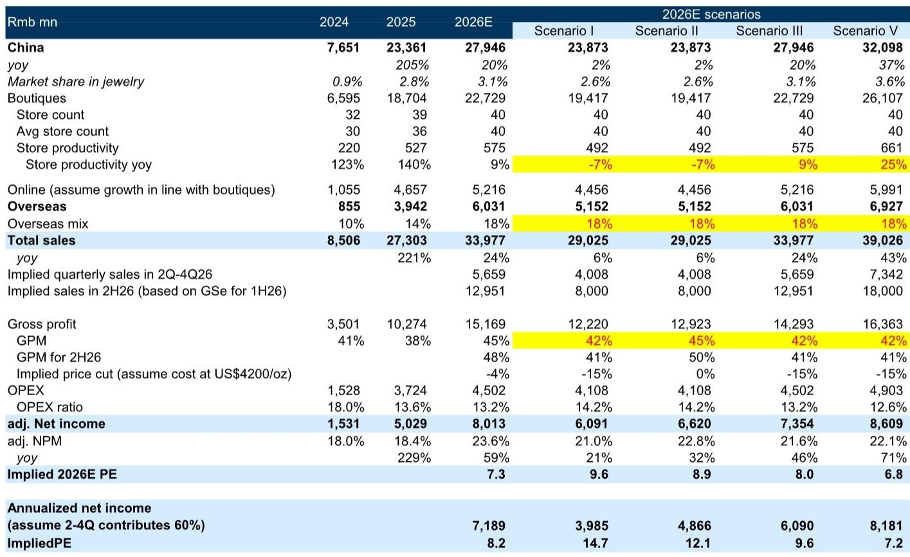
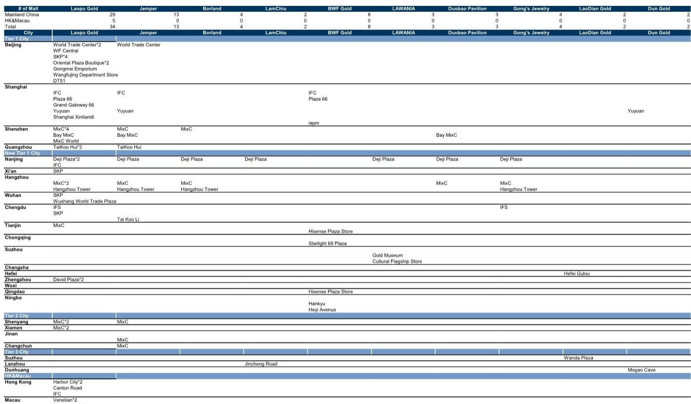
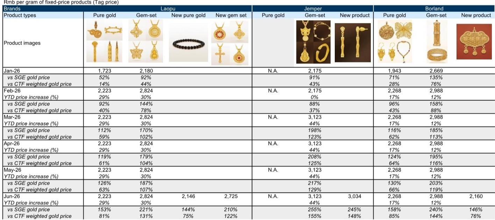

# GS：金价回调20%，老铺黄金的定价权反而面临真正考验

今年2月28日，老铺黄金将产品价格上调20%-30%，彼时金价处于每盎司5000美元以上的高位。此后COMEX黄金价格回调超过20%，目前约在4100美元附近。这一价格变动对老铺黄金的销售产生了直接影响——其天猫旗舰店二季度销售额同比下滑63%，而一季度还是增长155%。GS在最新报告中指出，作为固定定价模式的代表，老铺黄金在金价回调周期中面临的不确定性，比同行更为显著。

但报告同时强调，老铺黄金的品牌热度依然健康，社交媒体粉丝数和讨论量持续增长。公司已开始通过新品定价和促销折扣组合测试更低价格，上海新天地店在叠加会员折扣后，周末出现了1-2小时的排队现象。GS将2026年盈利预测下调9%至80亿元人民币，但认为当前7倍2026年市盈率已反映需求不确定性。如果金价企稳或回升至GS预测的年底4900美元，销售最差的阶段可能已经过去。

> **KC评论：** 这份报告的核心矛盾在于：老铺黄金在金价上涨时通过提价放大了利润弹性，但在金价回调时，固定定价模式反而成为销售阻力。读者需要关注的不是金价本身，而是老铺能否在不损伤品牌定位的前提下，灵活调整定价策略。

## 1. 金价回调暴露了固定定价模式的脆弱性，但毛利率反而受益

老铺黄金的定价机制决定了其与金价走势的特殊关系。2月提价后，其每克价格对按克计价产品的溢价已从年初的14%-44%扩大至81%-131%。金价下跌意味着采购成本下降，而售价维持不变，公司毛利率反而上升。GS测算，若金价维持在4000美元，老铺黄金在10%折扣后的毛利率可达52%，远超40%的目标水平。

但问题在于销售端。二季度天猫旗舰店销售额同比下滑63%，其中6月降幅达71%。GS认为线下表现会好于线上，新店扩张（上半年门店数同比低双位数增长）提供了支撑，但经销商渠道占比较高的门店表现明显偏弱。金价回调还影响了老铺黄金的二手市场折价率，从年初的约20%扩大至32%，这进一步削弱了研究性需求。

## 2. 竞争格局正在变化：按克计价产品重获青睐，新品牌涌入但规模差距悬殊

金价回调改变了消费者的选择偏好。按克计价产品因价格透明、溢价低，重新获得吸引力。周大福和六福珠宝二季度的同店销售增长表现优于老铺黄金，主要驱动力正是按克计价产品。周大福甚至撤回了3月计划的提价，六福也根据金价走势调整了折扣力度。

在古法金赛道，多个新兴品牌正在进入高端购物中心。但GS认为老铺黄金的护城河依然清晰：其在商场中占据更优位置，社交媒体粉丝数远超同行，2025年销售额估计是第二大古法金品牌Jemper的30倍以上。单店产出方面，老铺黄金平均每店5.59亿元，而Jemper仅1.5亿元。规模优势体现在库存准备、门店研究和营销资源上。

> **KC评论：** 老铺黄金的真正护城河不是工艺或设计，而是规模带来的运营效率和商场议价权。当新品牌还在争取进入MixC、德基广场时，老铺已经在这些商场里占据最好的位置。这种先发优势短期内难以被复制。

## 3. 品牌正在试探价格弹性，但定位不确定性需要持续观察

GS注意到，老铺黄金已开始通过两种方式测试更低价格：一是推出新品，纯金产品每克定价约2100-2200元，比现有产品便宜约3%；二是在部分促销活动中，允许会员折扣与促销折扣叠加，使总折扣率达到中双位数，而此前最高仅为低双位数。

上海新天地店升级后的促销效果明显，社交媒体显示周末排队1-2小时。但报告也提醒，如果公司进一步推广这类定价动作，消费者对品牌定位的感知需要密切关注。老铺黄金约80%的客户与全球奢侈品牌重叠，这部分客群对价格敏感度相对较低，但经销商和研究性需求对价格更为敏感——后者正是2025年及2026年春节销售高增长的重要推手。

GS将2027-2028年盈利预测下调19%-22%，主要反映收入端不确定性。但当前估值已处于历史低位，约10%的股息回报表现也提供了节奏变化保护。如果金价如GS预期在年底回升至4900美元，经销商库存消化完毕，叠加新品推出和价格调整带来的需求刺激，销售环境有望逐步改善。

For informational purposes only. Portions may be generated,translated,summarized,or edited with AI assistance based on source materials and may contain omissions or errors. Please verify independently. This is not investment,legal,tax,accounting,or other professional advice.

For informational purposes only. Portions may be generated,translated,summarized,or edited with AI assistance based on source materials and may contain omissions or errors. Please verify independently. This is not investment,legal,tax,accounting,or other professional advice.

