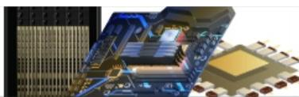
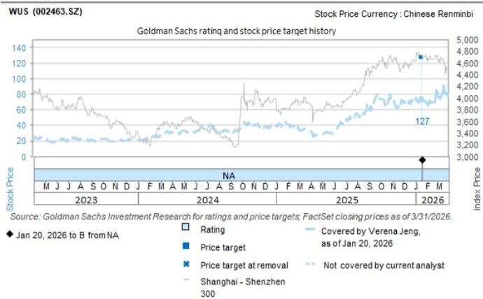

# 沪士电子（002463.SZ）：泰国技术考察：产能多元化持续推进；AI网络需求前景可期

## 泰国技术考察

探索多元化生产趋势 了解更多 >

Verena Jeng
+852-2978-1681 | verena.jeng@gs.com
GS (Asia) L.L.C.

Allen Chang  
+852-2978-2930 |  
allen.k.chang@gs.com  
GS (Asia) L.L.C.

我们在泰国/越南技术考察期间（7月7日至10日）参观了沪士电子的泰国工厂。泰国工厂的产能持续提升，预计到2026年第一季度利用率将超过90%，且超过70%的全球级数据通信客户已完成工厂验证，为泰国工厂的未来发展提供支撑。我们持续关注沪士电子在AI网络PCB市场的领先地位，这将推动产品组合升级和公司盈利能力提升。公司的海外产能将有助于其更好地把握全球AI PCB终端需求的增长，并在宏观环境不确定性中增强产品交付能力。

Yifan Hu  
+852-2978-0996 | yifan.hu@gs.com  
GS (Asia) L.L.C.

主要观察：管理层提到，泰国工厂在2026年第一季度的利用率已超过90%（链接），净销售额为2.95亿元人民币（2025年为2.89亿元），反映出沪士电子受益于全球客户终端需求的增长。沪士电子已实施泰国工厂产能扩张计划，预计新产能将于2026年第二季度投产，提升公司大规模生产效率。公司泰国工厂的汽车业务单元于2025年第四季度开始试生产，并于2026年进入量产阶段，产能逐步提升。管理层还提到，数据通信业务单元中超过70%的海外客户已完成对沪士电子泰国工厂的验证，使公司能够更好地利用海外产能满足客户不断增长的终端需求。

估值分析：我们基于23倍2027年预期每股收益的市盈率，得出12个月目标价为142元人民币。23倍的目标市盈率是根据沪士电子同行的市盈率与每股收益增长之间的相关性推导得出，基于公司2027-2028年预期每股收益的同比增长。

主要风险：（1）高端AI服务器和高速交换机迁移速度慢于预期；（2）AI PCB市场竞争激烈程度超预期；（3）新产能扩张速度慢于预期。

<table><tr><td>002463.SZ</td><td>12个月目标价：142.00元</td><td>现价：137.30元</td><td>潜在空间：3.4%</td></tr></table>

<table><tr><td></td><td colspan="5">GS预测</td></tr><tr><td></td><td></td><td>2025年12月</td><td>2026年12月E</td><td>2027年12月E</td><td>2028年12月E</td></tr><tr><td>市值：</td><td>收入（百万元人民币）</td><td>18,945.2</td><td>28,966.7</td><td>46,964.1</td><td>63,467.1</td></tr><tr><td>2642亿元人民币/389亿美元</td><td>EBITDA（百万元人民币）</td><td>5,116.0</td><td>8,362.6</td><td>15,237.7</td><td>21,585.3</td></tr><tr><td>企业价值：</td><td>每股收益（人民币）</td><td>1.99</td><td>3.38</td><td>6.18</td><td>8.75</td></tr><tr><td>2667亿元人民币/392亿美元</td><td>市盈率（倍）</td><td>25.2</td><td>40.6</td><td>22.2</td><td>15.7</td></tr><tr><td>3个月日均交易量：101亿元人民币/15亿美元</td><td>市净率（倍）</td><td>6.4</td><td>12.8</td><td>8.4</td><td>5.7</td></tr><tr><td rowspan="4">中国 大中华区科技并购排名：3 租赁包含在净债务及企业价值中？：否</td><td>股息回报表现（%）</td><td>1.0</td><td>0.4</td><td>0.5</td><td>0.6</td></tr><tr><td>净债务/EBITDA（不含租赁，倍）</td><td>0.4</td><td>0.3</td><td>0.1</td><td>(0.5)</td></tr><tr><td>CROCI（%）</td><td>36.6</td><td>38.7</td><td>47.4</td><td>51.4</td></tr><tr><td>自由现金流回报表现（%）</td><td>0.7</td><td>0.2</td><td>0.6</td><td>5.1</td></tr><tr><td></td><td></td><td>2026年3月</td><td>2026年6月E</td><td>2026年9月E</td><td>2026年12月E</td></tr><tr><td></td><td>每股收益（人民币）</td><td>0.65</td><td>0.75</td><td>0.91</td><td>1.08</td></tr></table>

来源：公司数据、GS估计、FactSet。价格截至2026年7月9日收盘。

## 附录

## 监管声明

我们，Verena Jeng、Allen Chang和Yifan Hu，特此证明本报告中表达的所有观点准确反映了我们个人对相关公司及其证券的看法。我们还证明，我们的薪酬中没有任何部分直接或间接与本报告中表达的具体建议或观点相关。

除非另有说明，本报告封面所列人员为GS全球研究部门的分析师。

撰稿人：Verena Jeng GS (Asia) L.L.C.、Allen Chang GS (Asia) L.L.C.、Yifan Hu GS (Asia) L.L.C.。

除非另有说明，本报告撰稿人披露中列出的个人为GS全球研究部门的分析师。

## GS因子概况

GS因子概况通过将关键属性与市场（即我们的评级股票池）及其行业同行进行比较，提供股票的研究背景。所描绘的四个关键属性是：增长、财务回报、估值倍数（如估值）和综合（增长、财务回报和估值的复合）。增长、财务回报和估值倍数是通过使用每只股票特定指标的标准化排名计算得出。然后将指标的标准化排名平均并转换为相关属性的百分位数。每个指标的具体计算可能因财年、行业和地区而异，但标准方法如下：

增长基于股票的前瞻性销售增长、EBITDA增长和每股收益增长（对于金融股，仅每股收益和销售增长），百分位数越高表示公司增长越高。财务回报基于股票的前瞻性ROE、ROCE和CROCI（对于金融股，仅ROE），百分位数越高表示公司财务回报越高。估值倍数基于股票的前瞻性市盈率、市净率、价格/股息（P/D）、EV/EBITDA、EV/FCF和EV/债务调整后现金流（DACF）（对于金融股，仅市盈率、市净率和P/D），百分位数越高表示股票交易倍数越高。综合百分位数计算为增长百分位数、财务回报百分位数和（100% - 估值倍数百分位数）的平均值。

财务回报和估值倍数使用GS分析师对未来至少三个季度后的财年末的预测。增长使用对未来至少七个季度后的财年与未来至少三个季度后的财年相比的输入（所有指标均按每股计算）。

有关我们如何计算GS因子概况的更详细说明，请联系您的GS代表。

## 并购排名

在我们的全球覆盖范围内，我们使用并购框架审视股票，考虑定性因素和定量因素（可能因行业和地区而异），以纳入某些公司可能被收购的可能性。然后我们分配并购排名，对我们评级覆盖范围内的公司从1到3进行评分，1表示公司成为收购目标的可能性较高（30%-50%），2表示中等可能性（15%-30%），3表示较低可能性（0%-15%）。对于排名为1或2的公司，根据我们的标准部门指南，我们将并购因素纳入目标价。并购排名3被视为不重要，因此不计入我们的目标价，可能在研究中讨论也可能不讨论。

## Quantum

Quantum是GS的专有数据库，提供详细的财务报表历史、预测和比率。可用于对单一公司进行深入分析，或在不同行业和市场的公司之间进行比较。

## 披露

沪士电子的评级相对于其覆盖范围内的其他公司：AAC、ACM Research、AMEC、ASMPT、AVC、AccoTest、Anji Micro、Asus、Auras、BOE、BYDE、Biren、CR Micro、Cambricon、Chenbro、中国移动（香港）、中国电信、中国铁塔股份有限公司、中国联通、中软国际、Compal、德赛西威、E Ink、E-Town Semis、亿航智能、Empyrean、Eoptolink、FOCI、Fositek、工业富联、技嘉、Gigadevice、广联达、宏达电、海康威视、鸿海、地平线、华虹、华测导航、华勤技术（A股）、华勤技术（H股）、华海清科、InnoScience、中际旭创、浪潮、Insta360、Inventec、长电科技、Kematik、King Slide、金蝶、金山办公、LandMark、大立光、联想、领益智造、卓胜微、美图、MetaX、Mitac、Montage（A股）、Montage（H股）、北方华创、NSIG、Nexchip、OmniVision、和硕、小马智行（ADR）、小马智行（H股）、广达、RoboTechnik、锐捷网络、圣邦微、SICC、中芯国际（A股）、中芯国际（H股）、SZS、深信服、商汤科技、生益科技、深南电路、斯达半导、舜宇光学、TFC Optical、中科创达、通宇通讯、传音、UMT、UNIS、VPEC、Vanchip、VeriSilicon、Victory Giant、WNC、沪士电子、文远知行、纬创、纬颖、YJ Semitech、长飞光纤、用友、中兴通讯（A股）、中兴通讯（H股）、科大讯飞

## 公司特定监管披露

以下披露涉及GS集团（及其关联公司，“GS”）与GS全球研究覆盖的公司之间的关系。

GS预计在未来3个月内寻求或打算寻求投资银行服务报酬：沪士电子（137.30元人民币）

GS在过去12个月内与以下公司存在投资银行服务客户关系：沪士电子（137.30元人民币）

## 评级/投资银行关系分布

GS研究全球股票覆盖范围

<table><tr><td rowspan="2"></td><td colspan="3">评级分布</td><td colspan="3">投资银行关系</td></tr><tr><td>买入</td><td>持有</td><td>卖出</td><td>买入</td><td>持有</td><td>卖出</td></tr><tr><td>全球</td><td>50%</td><td>34%</td><td>16%</td><td>65%</td><td>60%</td><td>45%</td></tr></table>

截至2026年4月1日，GS全球研究对3,074只股票进行了评级。GS将股票分配为各区域投资清单上的买入和卖出；未如此分配的股票被视为中性。此类分配等同于FINRA规则要求的上述披露中的买入、持有和卖出。请参见下文“评级、覆盖范围和相关定义”。投资银行关系图表反映了每个评级类别中GS在过去十二个月内提供过投资银行服务的公司百分比。

## 目标价和评级历史图表

  
所示目标价应结合所有先前发布的GS报告（可能包含也可能不包含目标价）以及公司、行业和金融市场的发展情况来考虑。

## 目标价历史表格 沪士电子（002463.SZ）

报告日期 目标价（人民币） 收盘价（人民币）

2026年5月10日 142.00 108.71

2026年1月20日 127.00 71.13

表格中显示的目标价未针对公司行为进行调整。

## 监管披露

## 美国法律法规要求的披露

请参见上述公司特定监管披露，了解本报告中提及的公司所需的任何以下披露：待处理交易中的经理或联合经理；1%或以上的所有权；特定服务的报酬；客户关系类型；以前期间的承销/联合承销公开发行；董事职位；对于股票，做市和/或专家角色。GS作为自营交易商交易或可能交易本报告中讨论的发行人的债务证券（或相关衍生品）。

以下是额外要求的披露：所有权和重大利益冲突：GS政策禁止其分析师、向分析师报告的专业人员及其家庭成员持有分析师覆盖范围内的任何公司的证券。分析师薪酬：分析师的薪酬部分基于GS的盈利能力，其中包括投资银行收入。分析师作为高管或董事：GS政策通常禁止其分析师、向分析师报告的人员或其家庭成员担任分析师覆盖范围内任何公司的高管、董事或顾问。非美国分析师：非美国分析师可能不是GS & Co. LLC的关联人员，因此可能不受FINRA规则2241或FINRA规则2242关于与主题公司沟通、公开露面以及交易分析师所覆盖证券的限制。

## 美国以外司法管辖区法律和法规要求的额外披露

以下披露是相关司法管辖区要求的，除非已根据美国法律在上述范围内作出。澳大利亚：GS Australia Pty Ltd及其关联公司不是澳大利亚的授权存款机构（该术语在1959年银行法（联邦）中定义），不提供银行服务，也不在澳大利亚开展银行业务。除非GS另有约定，本研究及其任何访问仅面向澳大利亚公司法意义上的“批发客户”。在制作研究报告时，GS Australia全球研究成员可能会参加其研究报告主题的公司和其他实体举办的现场访问和其他会议。在某些情况下，如果GS Australia认为在特定情况下与现场访问或会议相关且合理，此类现场访问或会议的费用可能部分或全部由相关发行人承担。如果本文档内容包含任何金融产品建议，则仅为一般性建议，由GS在未考虑客户目标、财务状况或需求的情况下编制。客户在根据任何此类建议采取行动之前，应考虑该建议是否适合其自身目标、财务状况和需求。GS Australia和New Zealand的某些利益披露以及GS澳大利亚卖方研究独立性政策声明的副本可在以下网址获取：https://www.goldmansachs.com/disclosures/australia-new-zealand/index.html。巴西：有关CVM第20号决议的披露信息可在https://www.gs.com/worldwide/brazil/area/gir/index.html获取。在适用的情况下，根据CVM第20号决议第20条定义，本研究报告内容的主要巴西注册分析师为本报告开头指定的第一作者，除非文本末尾另有说明。加拿大：此信息仅供您参考，在任何情况下均不应被解释为GS & Co. LLC为在加拿大购买证券而向加拿大交易任何加拿大证券的广告、要约或招揽。GS & Co. LLC未在加拿大任何司法管辖区根据适用的加拿大证券法注册为交易商，通常不被允许交易加拿大证券，并且可能被禁止在加拿大的某些司法管辖区销售某些证券和产品。如果您希望在加拿大交易任何加拿大证券或其他产品，请联系GS Canada Inc.（GS集团关联公司）或其他注册的加拿大交易商。香港：可根据要求从GS (Asia) L.L.C.获取本研究中提及的所覆盖公司证券的进一步信息。印度：可从GS (India) Securities Private Limited获取本研究中提及的主题公司或公司的进一步信息，研究分析师 - SEBI注册号INH000001493，地址：10th Floor, Ascent-Worli, Sudam Kalu Ahire Marg, Worli, Mumbai-400 025, India，公司识别号U74140MH2006FTC160634，电话+91 22 6616 9000，传真+91 22 6616 9001。GS可能实益拥有本研究报告提及的主题公司或公司1%或以上的证券（该术语在1956年印度证券合同（监管）法第2(h)条中定义）。SEBI的注册和NISM的认证不以任何方式保证中介机构的业绩或向读者提供任何回报保证。GS (India) Securities Private Limited合规官和读者投诉联系详情、年度合规审计报告副本以及其他相关信息和披露可在以下链接获取：

https://www.goldmansachs.com/worldwide/india/research-analyst。日本：见下文。韩国：除非GS另有约定，本研究及其任何访问仅面向金融服务和资本市场法意义上的“专业读者”。可从GS (Asia) L.L.C.首尔分行获取本研究中提及的主题公司或公司的进一步信息。新西兰：GS New Zealand Limited及其关联公司不是新西兰的“注册银行”或“存款接受者”（定义见1989年新西兰储备银行法）。除非GS另有约定，本研究及其任何访问面向“批发客户”（定义见2008年金融顾问法）。GS Australia和New Zealand的某些利益披露副本可在以下网址获取：https://www.goldmansachs.com/disclosures/australia-new-zealand/index.html。俄罗斯：在俄罗斯联邦分发的研究报告不是俄罗斯立法定义中的广告，而是信息和分析，其主要目的不是产品推广，并且不提供俄罗斯评估活动立法意义上的评估。研究报告不构成俄罗斯法律法规定义的个人化研究交流，不针对特定客户，并且是在未分析客户财务状况、投资概况或风险概况的情况下编制的。GS不对客户或任何其他人基于本研究可能做出的任何投资决策承担责任。新加坡：GS (Singapore) Pte.（公司编号：198602165W），受新加坡金融管理局监管，对本研究承担法律责任，如有任何问题或与本研究报告相关的事项，请联系该公司。台湾：此材料仅供参考，未经许可不得转载。读者应仔细考虑自身的投资风险。投资结果由个人读者自行负责。英国：在英国将被归类为零售客户的个人（该术语定义见金融行为监管局规则）应结合先前关于本研究中提及的所覆盖公司的GS报告阅读本研究，并应参考GS International已发送给他们的风险警告。这些风险警告的副本以及本报告中使用的某些金融术语的词汇表，可向GS International索取。

欧盟和英国：关于欧盟委员会授权条例（EU）（2016/958）第6(2)条（包括该授权条例在英国脱离欧盟和欧洲经济区后转化为英国国内法律和法规的情况）补充欧洲议会和理事会条例（EU）第596/2014号关于研究交流或其他建议或暗示投资策略的信息客观呈现的技术安排以及特定利益或利益冲突迹象披露的技术标准的披露信息，可在https://www.gs.com/disclosures/europeanpolicy.html获取，其中说明了与投资研究相关的利益冲突管理欧洲政策。

日本：GS Japan Co., Ltd.是在关东财务局注册的金融工具交易商，注册号Kinsho 69，是日本证券交易商协会、金融期货协会日本、第二类金融工具交易商协会和日本投资管理协会的成员。股票买卖需支付与客户预先确定的佣金加上消费税。有关日本证券交易所、日本证券交易商协会或日本证券金融公司要求的任何适用披露，请参见公司特定披露。

## 评级、覆盖范围和相关定义

买入（B）、中性（N）、卖出（S）分析师推荐股票作为各区域投资清单上的买入或卖出。被分配为投资清单上的买入或卖出取决于股票相对于其覆盖范围的总回报潜力。任何未被分配为投资清单上的买入或卖出且具有有效评级（即未暂停评级、未评级、早期生物技术、暂停覆盖或未覆盖的股票）的股票被视为中性。每个区域管理区域确信清单，这些清单选自各自区域投资清单上的报告评级股票，代表专注于总回报潜力大小和/或在其各自覆盖区域内实现回报可能性的研究交流。此类确信清单的添加或移除由各区域的审查委员会或其他指定委员会管理，并不代表分析师对这些股票评级的变化。

总回报潜力代表当前股价与目标价之间的上行或下行差异，包括目标价相关时间范围内所有已支付或预期股息。所有覆盖的股票都需要目标价。总回报潜力、目标价和相关时间范围在每份添加或重申投资清单成员资格的报告中有说明。

覆盖范围：每个覆盖范围内的所有股票列表可通过主要分析师、股票和覆盖范围在https://www.gs.com/research/hedge.html获取。

未评级（NR）。当GS在此公司涉及并购或战略交易中担任顾问角色时，当由于GS参与交易而存在法律、监管或政策限制时，以及在某些其他情况下，根据GS政策，评级、目标价和盈利预测（如相关）将被移除。早期生物技术（ES）。当此公司既没有通过II期临床试验的药物、治疗或医疗设备，也没有获得分发后II期药物、治疗或医疗设备的许可时，根据GS政策，不分配评级和目标价。评级暂停（RS）。GS已暂停此股票的评级和目标价，因为没有足够的基本面基础来确定评级或目标价。先前的评级和目标价（如有）不再对此股票有效，不应依赖。覆盖暂停（CS）。GS已暂停对此公司的覆盖。未覆盖（NC）。GS未覆盖此公司。

## 全球产品；分发实体

GS全球研究为GS客户在全球范围内制作和分发研究产品。位于全球GS办公室的分析师对行业和公司以及宏观经济、货币、商品和投资组合策略进行研究。本研究在澳大利亚由GS Australia Pty Ltd（ABN 21 006 797 897）分发；在巴西由GS do Brasil Corretora de Títulos e Valores Mobiliários S.A.分发；GS巴西公共沟通渠道：0800 727 5764和/或contatogoldmanbrasil@gs.com。工作日（节假日除外），上午9点至下午6点。在加拿大由GS & Co. LLC分发；在香港由GS (Asia) L.L.C.分发；在印度由GS (India) Securities Private Ltd.分发；在日本由GS Japan Co., Ltd.分发；在韩国由GS (Asia) L.L.C.首尔分行分发；在新西兰由GS New Zealand Limited分发；在俄罗斯由OOO GS分发；在新加坡由GS (Singapore) Pte.（公司编号：198602165W）分发；在美国由GS & Co. LLC分发。GS International已批准本研究在英国的分发。

GS International（“GSI”），由审慎监管局（“PRA”）授权，受金融行为监管局（“FCA”）和PRA监管，已批准本研究在英国的分发。

欧洲经济区：GS Bank Europe SE（“GSBE”）是在德国注册的信贷机构，在单一监管机制下，受欧洲中央银行直接审慎监管，并在其他方面受德国联邦金融监管局（BaFin）和德意志联邦银行监管，并在欧洲经济区内分发研究。

## 一般披露

本研究仅供我们的客户使用。除与GS相关的披露外，本研究基于我们认为可靠的当前公开信息，但我们不保证其准确或完整，也不应依赖于此。本文所含信息、意见、估计和预测截至本文日期，如有更改，恕不另行通知。我们寻求适当更新我们的研究，但各种法规可能阻止我们这样做。除某些定期发布的行业报告外，大多数报告根据分析师的判断不定期发布。

GS开展全球全方位服务、综合投资银行、投资管理和经纪业务。我们与全球研究覆盖的相当大比例的公司存在投资银行和其他业务关系。GS & Co. LLC，美国经纪交易商，是SIPC成员（https://www.sipc.org）。

我们的销售人员、交易员和其他专业人员可能向我们的客户和自营交易部门提供口头或书面的市场评论或交易策略，这些评论或策略反映的观点可能与本研究表达的观点相反。我们的资产管理领域、自营交易部门和投资业务可能做出与本研究中表达的建议或观点不一致的投资决策。

本报告中指定的分析师可能不时与我们的客户（包括GS销售人员和交易员）讨论，或可能在本报告中讨论，交易策略涉及可能对本报告中讨论的股票市场价格产生短期影响的催化剂或事件，这种影响可能方向性地与分析师的已发布目标价预期相反。任何此类交易策略都不同于且不影响分析师对这些股票的基本评级，该评级反映了股票相对于其覆盖范围的总回报潜力，如本文所述。

我们和我们的关联公司、高级职员、董事和员工可能不时持有本研究中提及的证券或衍生品（如有）的多头或空头头寸，作为自营交易商进行买卖，除非法规或GS政策禁止。

在GS组织的会议上第三方演讲者所表达的观点，包括来自GS其他部门的个人，不一定反映全球研究的观点，也不是GS的官方观点。

本文引用的任何第三方，包括任何销售人员、交易员和其他专业人员或其家庭成员，可能持有与本报告指定分析师表达的观点不一致的上述产品的头寸。

本研究不构成在任何司法管辖区出售或购买任何证券的要约或招揽，如果此类要约或招揽在该司法管辖区将是非法的。它不构成个人建议，也未考虑个别客户的具体投资目标、财务状况或需求。客户应考虑本研究中的任何建议或推荐是否适合其特定情况，并在适当情况下寻求专业建议，包括税务建议。本研究中提及的投资的价格和价值以及从中获得的收入可能会波动。过去的表现并不预示未来的结果，未来回报不保证，可能发生原始资本损失。汇率波动可能对某些投资的价值或价格或从中获得的收入产生不利影响。

某些交易，包括涉及期货、期权和其他衍生品的交易，会产生重大风险，并不适合所有读者。读者应审查当前的期权和期货披露文件，可从GS销售代表或https://www.theocc.com/about/publications/character-risks.jsp和https://www.goldmansachs.com/disclosures/cftc_fcm_disclosures获取。在需要多次买卖期权的期权策略（如价差）中，交易成本可能很大。将根据要求提供支持文件。

全球研究提供的不同服务级别：GS全球研究向您提供的服务级别和类型可能与向GS内部和其他外部客户提供的服务不同，取决于多种因素，包括您个人对沟通频率和方式的偏好、您的风险状况和投资重点及视角（例如，市场范围、行业特定、长期、短期）、您与GS整体客户关系的规模和范围，以及法律和监管限制。例如，某些客户可能要求在特定证券的研究发布时收到通知，某些客户可能要求将分析师基本面分析的基础数据通过数据馈送或其他方式以电子方式交付给他们。分析师基本面研究观点的任何变化（例如，对股票的评级、目标价或盈利预测的重大变化）都不会在通过电子方式广泛发布到我们的内部客户网站或通过其他方式分发给所有有权接收此类报告的客户之前传达给任何客户。

所有研究报告同时通过电子方式发布到我们的内部客户网站，供所有客户使用。并非所有研究内容都重新分发给我们的客户或提供给第三方聚合商，GS也不对第三方聚合商重新分发我们的研究负责。有关一个或多个证券、市场或资产类别的研究、模型或其他数据（包括相关服务），请联系您的GS代表或访问https://research.gs.com。

披露信息也可在https://www.gs.com/research/hedge.html或联系Research Compliance, 200 West Street, New York, NY 10282获取。

## © 2026 GS.

您仅可为自己使用而存储、显示、分析、修改、重新格式化及打印通过本服务提供的信息。未经GS明确书面同意，您不得转售或逆向工程此信息以计算或开发任何用于披露和/或营销的指数，或创建任何其他衍生作品或商业产品、数据或产品。未经GS明确书面同意，您不得以任何格式向任何第三方发布、传输或以其他方式复制此信息的全部或部分。前述限制包括但不限于使用、提取、下载或检索此信息的全部或部分，以训练或微调机器学习或人工智能系统，或向任何此类系统提供或复制此信息的全部或部分作为提示或输入。
