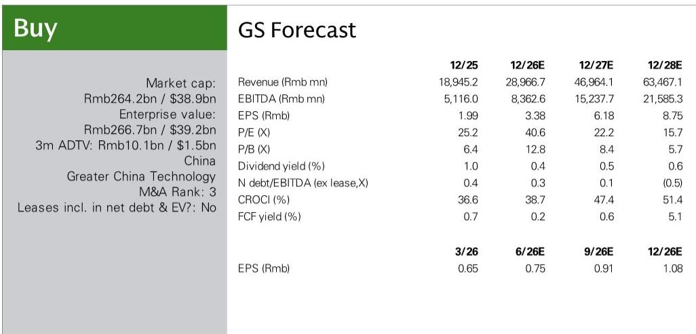

# GS：沪电股份泰国产能爬坡超预期，GS，AI网络需求是真正推手

一份来自GS近期泰国/越南科技考察的研报，给出了一个值得关注的信号：沪电股份在泰国的产能爬坡速度，比市场预期的要快。报告显示，其泰国工厂的产能利用率在2026年第一季度已超过90%，且超过70%的数据通信海外客户已完成工厂验证。这意味着，这家中国PCB龙头在海外产能的落地效率，正在成为其承接全球AI网络需求的关键变量。

产能转移不再是故事，而是正在发生的现实。而真正驱动这家公司价值中枢上移的，并非简单的产能转移，而是AI网络对高端PCB的需求结构升级。

## 1. 泰国工厂的爬坡速度，验证了海外交付能力

报告中最硬核的数字来自泰国工厂。2026年第一季度，该工厂产能利用率超过90%，净销售额达到2.95亿元人民币。更关键的是，管理层已启动二期扩产，新产能预计在2026年第二季度开始投产。这组数据说明，沪电股份的海外产能并非“试水”，而是已经进入满产状态，且客户验证进度远超预期——超过70%的数据通信海外客户已完成工厂验证。

> **KC评论：** 产能利用率90%以上，意味着泰国工厂已经接近满产。这解释了为什么公司要立刻启动二期扩产。对于读者而言，关注的焦点应从“能不能建好”转向“扩产速度能否跟上订单增长”。

## 2. AI网络需求，才是产品结构升级的真正推手

报告反复强调一个判断：沪电股份在AI网络PCB市场中的领先地位，正在推动其产品组合升级和盈利能力改善。这不是一个泛泛的行业趋势描述，而是有具体业务支撑的。公司的数据通信业务是泰国工厂的主要客户来源，而AI服务器和高速交换机对PCB的层数、材料、工艺要求远高于传统产品。GS认为，沪电股份的海外产能布局，使其能更好地捕捉全球AI PCB的终端需求，同时在地缘政治不确定性中增强交付韧性。

## 3. 汽车业务是第二增长曲线，但尚在早期

报告还提及了泰国工厂的汽车业务进展：该产线于2025年第四季度开始试产，2026年进入量产，产能正在逐步爬坡。这是一个值得关注的信号，但报告并未给出具体的客户或订单数据。汽车PCB的认证周期通常比通信更长，因此这一块的贡献可能还需要几个季度才能体现在财务数据中。

## 4. 一个可复用的观察框架：产能利用率+客户验证率

对于跟踪PCB产业链的读者，这份报告提供了一个简洁但有效的观察框架：**产能利用率和客户验证率，是判断一家公司海外产能落地效率的核心先行指标。** 产能利用率反映的是现有订单的饱满程度，客户验证率则决定了未来订单的可持续性。沪电股份在这两个指标上的表现，意味着其海外工厂已经从一个“成本选项”变成了“战略资产”。

For informational purposes only. Portions may be generated,translated,summarized,or edited with AI assistance based on source materials and may contain omissions or errors. Please verify independently. This is not investment,legal,tax,accounting,or other professional advice.

