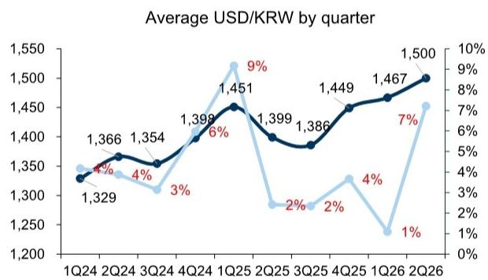
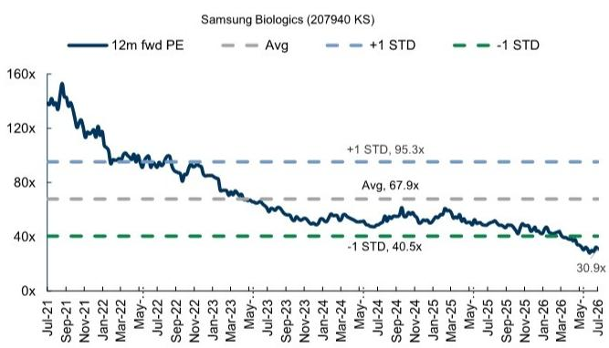
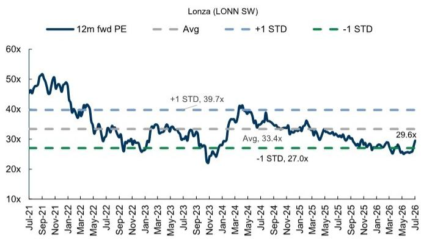
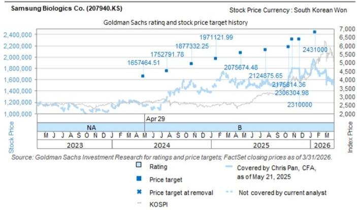

# Samsung Biologics Co. (207940.KS)

## 2Q26 Preview: 汇率因素支撑稳健表现；罢工影响延至3Q，后续逐步恢复

三星生物制剂计划于7月23日公布2Q26业绩，我们预计将迎来又一个表现强劲的季度。2Q26营收同比增长约30%，CDMO业务调整后净利润同比增长约41%，达到1,314/4,700亿韩元，较市场一致预期分别高出0%/7%。这一表现得益于1-4号工厂持续满负荷运转，以及5号工厂在更有利的汇率环境下初步爬坡，推动营业利润率维持在40%左右。值得注意的是，尽管5号工厂开始贡献收入，但由于其相对于现有韩国设施的规模较小，且管理层强调的运营效率持续改善，我们预计利润率稀释有限。

**研究观点：** 我们认为近期的价格调整提供了值得关注的窗口，随着围绕劳资谈判的不确定性逐步消退，以及未来几个季度订单转化更加清晰，市场情绪有望改善。我们认为长期发展逻辑依然稳固，现有设施高利用率、持续产能扩张以及全球生物药外包需求的支撑作用不变。当前估值约为未来12个月预期回报的31倍，而五年历史均值约为68倍，从长期增长前景来看，当前估值水平具有一定吸引力。

在汇率方面，2Q26美元兑韩元汇率约为1,500，仍比管理层假设的约1,400高出7%，这应能部分抵消短期运营层面的影响，并为FY26营收增长15-20%的指引提供一定缓冲。我们预计在纳入新合并的美国设施后，营收增长可达23%。根据我们之前的分析，公司95%的营收以美元计价，而大部分成本以韩元计价，美元兑韩元汇率每变动2.5%，将导致息税前利润变动约5%（详见此前报告中的图表13）。

■ 关于劳资动态，5月初的局部罢工预计不会对2Q业绩产生实质性影响，与管理层此前表示运营已恢复、核心流程未受干扰且未观察到订单取消的表述一致。潜在影响可能集中在3Q，此前讨论提及可能出现短期扰动，但部分可在后续季度恢复，相对较高的固定成本结构也有助于缓冲波动。

此外，公司于6月宣布了多项合同修订，包括一家亚洲药企追加约6,290万美元订单、一家美国药企追加约6,900万美元订单，以及一家欧洲药企追加约3,430万美元订单。我们认为，更多大规模合同的中标有助于增强市场对中期盈利增长可持续性的信心。

展望2Q26业绩电话会议（韩国时间7月23日上午10点/香港时间上午9点），我们预计市场关注点将集中在：(1) 指引敏感性，特别是汇率、工厂爬坡和人工成本动态；(2) 劳资谈判进展及应急预案；(3) 产能扩张更新，包括6号工厂时间安排及新业务领域（如ADC、CGT）的资本配置优先级；(4) 订单管道可见性，包括潜在的大型多年期合同以及美国基地或双基地生产策略的早期进展。

**图表1：2Q26平均美元兑韩元汇率为1,500，而公司指引中假设为1,400**

**图表2：三星生物制剂当前交易于31倍未来12个月预期回报（数据截至2026年7月6日）**

**图表3：……对比龙沙集团30倍未来12个月预期回报（数据截至2026年7月6日）**

来源：彭博

**图表4：我们认为三星生物制剂在3Q上调指引的可能性较大**

| | 2023年1-3月 4-6月 7-9月 10-12月 | 2024年1-3月 4-6月 7-9月 10-12月 | 2025年1-3月 4-6月 7-9月 10-12月 | 2026年1-3月 4-5月 | 最新指引 |
|---|---|---|---|---|---|
| **中国和韩国** | | | | | |
| 三星生物 | — ▲ — ▲ | — — — ▲ | — — ▲ — | — — | FY26营收同比增长15-20% |
| 药明康德 | — — ▼ ▼ | ▼ — — — | — — ▲ — | — — | FY26持续经营业务营收增长18-22%（或按固定汇率计算22-26%） |
| 药明生物 | — — ▼ ▼ | ▼ — — — | — — ▲ — | — — | FY26营收同比增长13-17%（按固定汇率计算16-20%） |
| 药明合联 | n.a. n.a. n.a. n.a. | — — — — | — — ▲ — | — — | FY26集团营收按固定汇率同类基础增长35%（含BioDlink）或按备考基础增长40% |
| 康龙化成 | — — ▼ ▼ | — — — ▼ | — — — ▲ | — — | FY26营收同比增长12-18%，包含约3%美元贬值影响 |
| 凯莱英 | — — ▼ — | — — ▼ — | — — ▲ — | — — | FY26营收同比增长19-22%，包含2-3%汇率影响 |
| **欧盟和美国** | | | | | |
| 龙沙集团 | — — ▼ ▼ | ▲ — — — | — — ▲ — | — ▲ | FY26 CDMO固定汇率销售增长11-12%；FY26 CDMO核心EBITDA利润率>32% |
| 赛默飞世尔 | — — ▼ ▼ | — ▲ ▲ — | — — ▼ ▲ | ▲ — | FY26有机营收增长3-4% |
| **印度** | | | | | |
| Piramal | n.a. n.a. — ▲ | — — — — | — — ▼ — | — ▼ | FY27营收低至中双位数增长，EBITDA/利润增速快于营收增速 |
| Divi's Lab | — n.a. n.a. n.a. | — — — — | — — — — | — — | FY27双位数增长，利润率稳定 |
| Syngene | ▲ — ▼ ▼ | ▼ — — ▼ | ▼ ▼ — — | — ▼ | FY27营收持平（H1预计较弱），利润率20%左右 |
| Laurus | ▼ — n.a. n.a. | — ▼ — — | — — ▲ — | — — | FY27预计维持强劲CDMO增长 |
| Neuland | n.a. ▲ — ▼ | — — — ▼ | — — ▼ — | — ▼ | FY27预计健康增长 |
| Cohance | ▼ n.a. n.a. ▼ | — — — — | — — n.a. ▼ | ▼ ▼ | FY27增长将恢复，但呈后置特征：管理层预计Q1FY27较弱，Q2稳定，H2FY27恢复更明显 |

来源：公司数据，GS全球研究汇编

**估值与风险：** 我们上调2026-28年每股盈利预测+2.9%/1.0%/0.6%，以反映新收购的美国设施及更强的汇率支撑。我们较市场一致预期分别高出4%/8%/6%，主要基于对营收增长可持续性的更乐观判断。我们的12个月目标价为2,000,000韩元（此前为2,105,000韩元），基于未来12个月预期回报的40倍（此前为45倍，按市价调整），隐含41%的上行空间。主要下行风险包括：1）来自国内外参与者的竞争加剧；2）产能爬坡慢于预期；3）多药品审批机构的监管风险；4）公司治理，如诉讼和交叉持股。

## 附录

## Reg AC

我们，Chris Pan, CFA 和 Ziyi Chen，特此证明本报告中表达的所有观点准确反映我们个人对相关公司及其证券的看法。我们还证明，我们的薪酬中没有任何部分直接或间接与本次报告中表达的具体建议或观点相关。

除非另有说明，本报告封面所列人员为GS全球研究部门的分析师。

贡献作者：Chris Pan, CFA GS (Asia) L.L.C., Ziyi Chen GS (Asia) L.L.C.

除非另有说明，本报告贡献作者披露中列出的人员为GS全球研究部门的分析师。

## GS因子概况

GS因子概况通过将关键属性与市场（即我们的评级股票池）及其行业同行进行比较，提供股票的投资背景。所描绘的四个关键属性是：增长、财务回报、倍数（如估值）和综合（增长、财务回报和倍数的组合）。增长、财务回报和倍数是通过使用每只股票特定指标的标准化排名计算得出的。各指标的标准化排名随后被平均并转换为相关属性的百分位数。每个指标的具体计算可能因财年、行业和地区而异，但标准方法如下：

增长基于股票的前瞻性销售增长、EBITDA增长和每股盈利增长（对于金融股，仅每股盈利和销售增长），百分位数越高表示增长公司越强。财务回报基于股票的前瞻性ROE、ROCE和CROCI（对于金融股，仅ROE），百分位数越高表示财务回报越高。倍数基于股票的前瞻性市盈率、市净率、股息率、EV/EBITDA、EV/FCF和EV/债务调整后现金流（对于金融股，仅市盈率、市净率和股息率），百分位数越高表示股票交易倍数越高。综合百分位数计算为增长百分位数、财务回报百分位数和（100% - 倍数百分位数）的平均值。

财务回报和倍数使用至少三个季度后财年末的GS分析师预测。增长使用至少七个季度后财年的输入数据，与至少三个季度后财年进行比较（所有指标均按每股基础计算）。

有关我们如何计算GS因子概况的更详细描述，请联系您的GS代表。

## M&A排名

在我们的全球覆盖范围内，我们使用M&A框架审视股票，考虑定性因素和定量因素（可能因行业和地区而异），以纳入某些公司可能被收购的可能性。然后，我们将M&A排名作为对我们评级覆盖范围内的公司进行评分的方法，从1到3，其中1表示公司成为收购目标的可能性较高（30%-50%），2表示中等可能性（15%-30%），3表示较低可能性（0%-15%）。对于排名为1或2的公司，按照我们的标准部门指南，我们将M&A组成部分纳入我们的目标价。M&A排名3被视为不重要，因此不计入我们的目标价，可能在研究中讨论也可能不讨论。

## Quantum

Quantum是GS的专有数据库，提供详细的财务报表历史、预测和比率。它可用于对单一公司进行深入分析，或比较不同行业和市场的公司。

## 披露

三星生物制剂有限公司的评级相对于其覆盖范围内的其他公司：AK Medical, Angelalign Technology, 凯莱英(A), 凯莱英(H), 华润医药, Edge Medical, 方达控股, 金斯瑞生物科技, 固生堂, 海吉亚医疗, 锦欣生殖, 微创医疗机器人, 微创医疗, 康龙化成(A), 康龙化成(H), 三星生物制剂有限公司, 威高集团, 上海医药, 国药控股, 泰格医药(A), 泰格医药(H), 天智航, 通策医疗, 微创心通, 药明康德(A), 药明康德(H), 药明生物, 药明合联

## 公司特定监管披露

以下披露涉及GS集团（及其关联公司，"GS"）与GS全球投资研究所覆盖公司之间的关系。

GS预计在未来3个月内寻求或打算寻求投资银行服务报酬：三星生物制剂有限公司（W1,363,000）

GS在过去12个月内与以下公司存在投资银行服务客户关系：三星生物制剂有限公司（W1,363,000）

## 评级/投资银行关系分布

GS投资研究全球股票覆盖范围

| | 评级分布 | | | 投资银行关系 | | |
|---|---|---|---|---|---|---|
| | 买入 | 持有 | 卖出 | 买入 | 持有 | 卖出 |
| 全球 | 50% | 34% | 16% | 65% | 60% | 45% |

截至2026年4月1日，GS全球投资研究对3,074只股票有投资评级。GS将股票指定为买入和卖出，列入各区域投资清单；未如此指定的股票被视为中性。根据FINRA规则要求，此类指定等同于买入、持有和卖出。请参阅下文"评级、覆盖范围及相关定义"。投资银行关系图表反映了每个评级类别中GS在过去十二个月内提供过投资银行服务的公司百分比。

## 目标价和评级历史图表

所示目标价应结合所有先前发布的GS报告（可能包含或不包含目标价）以及公司、行业和金融市场的发展情况来考虑。

## 目标价历史表 三星生物制剂有限公司 (207940.KS)

## 报告日期 目标价 (W) 收盘价 (W)

| 2026年5月28日 | 2,105,000 | 1,373,000 |
|---|---|---|
| 2026年4月22日 | 2,371,000 | 1,561,000 |
| 2026年1月21日 | 2,431,000 | 1,873,000 |
| 2025年11月24日 | 2,310,000 | 1,789,000 |
| 2025年10月28日 | 1,500,000 | 1,813,189 |
| 2025年10月16日 | 1,415,000 | 1,667,487 |
| 2025年7月23日 | 1,382,000 | 1,565,936 |
| 2025年4月23日 | 1,350,000 | 1,568,880 |
| 2025年1月22日 | 1,282,000 | 1,492,349 |
| 2024年10月23日 | 1,221,000 | 1,558,577 |
| 2024年7月24日 | 1,140,000 | 1,299,550 |
| 2024年4月29日 | 1,078,000 | 1,140,602 |

表中所示目标价未针对公司行为进行调整。

## 监管披露

## 美国法律法规要求的披露

请参阅上述公司特定监管披露，了解本报告所提及公司的任何以下要求披露的信息：待定交易中的主承销商或联合主承销商；1%或以上的所有权；特定服务的报酬；客户关系类型；先前期间管理/联合管理的公开发行；董事职位；对于股票证券，做市和/或专家角色。GS可能作为本金交易或可能交易本报告讨论的发行人的债务证券（或相关衍生品）。

以下为额外要求的披露：所有权和重大利益冲突：GS政策禁止其分析师、向分析师报告的专业人员及其家庭成员持有分析师覆盖范围内的任何公司的证券。分析师薪酬：分析师的薪酬部分基于GS的盈利能力，其中包括投资银行收入。分析师作为高管或董事：GS政策通常禁止其分析师、向分析师报告的人员或其家庭成员担任分析师覆盖范围内任何公司的高管、董事或顾问。非美国分析师：非美国分析师可能不是GS & Co. LLC的关联人员，因此可能不受FINRA规则2241或FINRA规则2242关于与主题公司沟通、公开露面以及交易分析师所覆盖证券的限制。

## 美国以外司法管辖区法律和法规要求的额外披露

以下为所指示司法管辖区要求的披露，除非已根据美国法律法规在上文作出。澳大利亚：GS Australia Pty Ltd及其关联公司不是澳大利亚的授权存款机构（如《1959年银行法》（联邦）所定义），在澳大利亚不提供银行服务，也不从事银行业务。除非GS另有约定，本研究及其任何访问仅面向澳大利亚《公司法》含义内的"批发客户"。在编制研究报告时，GS Australia全球投资研究成员可能参加由研究报告所涉及公司和其他实体主办的现场访问和其他会议。在某些情况下，如果GS Australia认为在特定情况下与现场访问或会议相关的费用合理且适当，这些费用可能部分或全部由相关发行人承担。如果本文件内容包含任何金融产品建议，则仅为一般性建议，由GS在未考虑客户的目标、财务状况或需求的情况下编制。客户在根据任何此类建议采取行动前，应考虑该建议是否适合其自身的目标、财务状况和需求。某些GS Australia和New Zealand利益披露以及GS澳大利亚卖方研究独立性政策声明的副本可在以下网址获取：https://www.goldmansachs.com/disclosures/australia-new-zealand/index.html。巴西：有关CVM决议第20号的披露信息可在https://www.gs.com/worldwide/brazil/area/gir/index.html获取。在适用的情况下，根据CVM决议第20号第20条定义，对本研究报告内容负主要责任的巴西注册分析师为本报告开头指定的第一作者，除非文本末尾另有说明。加拿大：此信息仅供您参考，在任何情况下均不应被解释为GS & Co. LLC为在加拿大购买证券而在加拿大进行的广告、要约或招揽。GS & Co. LLC未在任何加拿大司法管辖区根据适用的加拿大证券法注册为交易商，通常不被允许交易加拿大证券，并可能被禁止在加拿大的某些司法管辖区销售某些证券和产品。如果您希望在加拿大交易任何加拿大证券或其他产品，请联系GS Canada Inc.（GS集团公司的关联公司）或其他注册的加拿大交易商。香港：可向GS (Asia) L.L.C.索取本研究报告所涉及覆盖公司证券的进一步信息。印度：可从GS (India) Securities Private Limited获取本研究报告所涉及公司或公司的进一步信息，研究分析师 - SEBI注册号INH000001493，地址：10th Floor, Ascent-Worli, Sudam Kalu Ahire Marg, Worli, Mumbai-400 025, India，公司识别号U74140MH2006FTC160634，电话+91 22 6616 9000，传真+91 22 6616 9001。GS可能实益拥有本研究报告所涉及公司或公司1%或以上的证券（如1956年印度证券合同（监管）法第2(h)条所定义）。SEBI的注册和NISM的认证不以任何方式保证中介机构的业绩或向读者提供任何回报保证。GS (India) Securities Private Limited合规官和读者投诉联系详情、年度合规审计报告副本以及其他相关信息和披露可在以下链接找到：https://www.goldmansachs.com/worldwide/india/research-analyst。日本：见下文。韩国：除非GS另有约定，本研究及其任何访问仅面向《金融服务和资本市场法》含义内的"专业读者"。可从GS (Asia) L.L.C.首尔分行获取本研究报告所涉及公司或公司的进一步信息。新西兰：GS New Zealand Limited及其关联公司在新西兰既不是"注册银行"也不是"存款接受者"（如1989年新西兰储备银行法所定义）。除非GS另有约定，本研究及其任何访问面向《2008年金融顾问法》含义内的"批发客户"。某些GS Australia和New Zealand利益披露副本可在以下网址获取：https://www.goldmansachs.com/disclosures/australia-new-zealand/index.html。俄罗斯：在俄罗斯联邦分发的研究报告不是俄罗斯立法所定义的广告，而是信息和分析，其主要目的不是产品推广，并且不提供俄罗斯评估活动立法含义内的评估。研究报告不构成俄罗斯法律法规所定义的个性化研究交流，不针对特定客户，并且在未分析客户的财务状况、投资概况或风险概况的情况下编制。GS对客户或任何其他人基于本研究报告可能做出的任何投资决策不承担任何责任。新加坡：GS (Singapore) Pte.（公司编号：198602165W），受新加坡金融管理局监管，接受对本研究的法律责任，如有任何与本研究报告相关的事宜，应联系该公司。台湾：此材料仅供参考，未经许可不得转载。读者应仔细考虑其自身的投资风险。投资结果由个人读者自行负责。英国：在英国将被归类为零售客户的人员（如金融行为监管局规则所定义）应结合先前GS关于本报告所涉及公司的报告阅读本研究，并应参考GS International已发送给他们的风险警告。这些风险警告的副本以及本报告中使用的某些金融术语的词汇表，可向GS International索取。

欧盟和英国：关于欧盟委员会授权条例(EU) (2016/958)第6(2)条的披露信息（补充欧洲议会和理事会条例(EU) No 596/2014，包括该授权条例在英国脱离欧盟和欧洲经济区后作为英国国内法律和法规实施），涉及研究交流客观呈现的技术安排以及特定利益或利益冲突迹象的披露的技术标准，可在https://www.gs.com/disclosures/europeanpolicy.html获取，其中说明了与投资研究相关的利益冲突管理欧洲政策。

日本：GS Japan Co., Ltd.是在关东财务局注册的金融工具交易商，注册号Kinsho 69，是日本证券交易商协会、日本金融期货协会、第二类金融工具交易商协会和日本投资管理协会的成员。股票买卖需支付与客户预先确定的佣金加上消费税。有关日本证券交易所、日本证券交易商协会或日本证券金融公司要求的任何适用披露，请参阅公司特定披露。

## 评级、覆盖范围及相关定义

买入(B)、中性(N)、卖出(S) 分析师建议将股票作为买入或卖出列入各区域投资清单。被指定为买入或卖出投资清单取决于股票相对于其覆盖范围的总回报潜力。任何未被指定为买入或卖出投资清单且具有有效评级（即非评级暂停、未评级、早期生物技术、覆盖暂停或未覆盖）的股票被视为中性。每个区域管理区域确信清单，这些清单从各自区域投资清单中的报告评级股票中选出，代表基于总回报潜力大小和/或在其各自覆盖区域内实现回报的可能性的研究交流。此类确信清单中股票的添加或移除由各区域的投资审查委员会或其他指定委员会管理，并不代表分析师对该等股票投资评级的变更。

总回报潜力代表当前股价与目标价之间的上行或下行差异，包括所有已支付或预期股息，在目标价相关的时间范围内预期。所有覆盖股票均需设定目标价。总回报潜力、目标价和相关时间范围在每份添加或重申投资清单成员资格的报告中有说明。

覆盖范围：每个覆盖范围的所有股票列表可通过主要分析师、股票和覆盖范围在https://www.gs.com/research/hedge.html获取。

未评级(NR)。当GS在此公司的合并或战略交易中担任顾问角色时，当存在法律、监管或政策限制时，以及在特定其他情况下，根据GS政策移除投资评级、目标价和盈利预测（如适用）。早期生物技术(ES)。当此公司既没有通过II期临床试验的药物、治疗或医疗设备，也没有分销后II期药物、治疗或医疗设备的许可时，根据GS政策不分配投资评级和目标价。评级暂停(RS)。GS已暂停此股票的投资评级和目标价，因为没有足够的基本面基础来确定投资评级或目标价。此股票之前的投资评级和目标价（如有）不再有效，不应依赖。覆盖暂停(CS)。GS已暂停对此公司的覆盖。未覆盖(NC)。GS不覆盖此公司。

## 全球产品；分发实体

GS全球投资研究为GS客户在全球范围内制作和分发研究产品。位于GS全球各办事处的分析师对行业和公司进行研究，并对宏观经济、货币、大宗商品和投资组合策略进行研究。本研究由GS Australia Pty Ltd (ABN 21 006 797 897)在澳大利亚分发；由GS do Brasil Corretora de Títulos e Valores Mobiliários S.A.在巴西分发；公共沟通渠道GS Brazil：0800 727 5764和/或contatogoldmanbrasil@gs.com。工作日（节假日除外）上午9点至下午6点开放。Canal de Comunicação com o Público GS Brasil：0800 727 5764 e/ou contatogoldmanbrasil@gs.com。Horário de funcionamento：segunda-feira à sexta-feira (exceto feriados)，das 9h às 18h；由GS & Co. LLC在加拿大分发；由GS (Asia) L.L.C.在香港分发；由GS (India) Securities Private Ltd.在印度分发；由GS Japan Co., Ltd.在日本分发；由GS (Asia) L.L.C.首尔分行在韩国分发；由GS New Zealand Limited在新西兰分发；由OOO GS在俄罗斯分发；由GS (Singapore) Pte.（公司编号：198602165W）在新加坡分发；由GS & Co. LLC在美国分发。GS International已批准本研究在英国的分发。

GS International ("GSI")，由审慎监管局授权并由金融行为监管局和审慎监管局监管，已批准本研究在英国的分发。

欧洲经济区：GS Bank Europe SE ("GSBE")是一家在德国注册的信贷机构，在单一监管机制内，受欧洲中央银行直接审慎监管，并在其他方面受德国联邦金融监管局和德意志联邦银行监管，并在欧洲经济区内分发研究。

## 一般披露

本研究仅供我们的客户使用。除与GS相关的披露外，本研究基于我们认为可靠的当前公开信息，但我们不保证其准确或完整，且不应依赖于此。本文所含信息、意见、估计和预测截至本文日期，如有变更，恕不另行通知。我们力求适时更新我们的研究，但各种法规可能阻止我们这样做。除某些定期发布的行业报告外，大部分报告根据分析师的判断不定期发布。

GS开展全球全方位、综合性的投资银行、投资管理和经纪业务。我们与全球投资研究所覆盖的相当大比例的公司存在投资银行和其他业务关系。GS & Co. LLC，美国经纪交易商，是SIPC成员（https://www.sipc.org）。

我们的销售人员、交易员和其他专业人士可能向我们的客户和自营交易部门提供口头或书面的市场评论或交易策略，这些评论或策略反映的观点可能与本研究表达的观点相反。我们的资产管理部、自营交易部门和投资业务可能做出与本研究中表达的建议或观点不一致的投资决策。

本报告中指定的分析师可能不时与我们的客户（包括GS销售人员和交易员）讨论，或可能在本报告中讨论，涉及可能对本报告所讨论股票证券市场价格产生短期影响的催化剂或事件的交易策略，该影响可能在方向上与分析师对该等股票公布的预期目标价相反。任何此类交易策略均不同于且不影响分析师对该等股票的基本面评级，该评级反映股票相对于其覆盖范围的总回报潜力，如本文所述。

我们及我们的关联公司、高级职员、董事和员工将不时持有本研究报告所提及证券或衍生品的多头或空头头寸，作为本金进行交易，以及买入或卖出，除非法规或GS政策另有禁止。

GS安排会议上第三方演讲者（包括来自GS其他部门的个人）所持观点不一定反映全球投资研究的观点，也不是GS的官方观点。

本文引用的任何第三方，包括任何销售人员、交易员和其他专业人士或其家庭成员，可能持有与本报告指定分析师所表达观点不一致的上述产品的头寸。

本研究不构成在任何司法管辖区出售或购买任何证券的要约或招揽，如果此类要约或招揽在该司法管辖区是非法的。它不构成个人建议，也未考虑个别客户的特定投资目标、财务状况或需求。客户应考虑本研究中的任何建议或推荐是否适合其特定情况，并在适当时寻求专业建议，包括税务建议。本研究所提及投资的价格和价值以及从中获得的收入可能波动。过往表现并非未来表现的指引，未来回报不保证，且可能损失原始资本。汇率波动可能对某些投资的價值或价格或从中获得的收入产生不利影响。

某些交易，包括涉及期货、期权和其他衍生品的交易，具有重大风险，不适合所有读者。读者应查阅当前的期权和期货披露文件，这些文件可从GS销售代表处获取，或访问https://www.theocc.com/about/publications/character-risks.jsp和https://www.goldmansachs.com/disclosures/cftc_fcm_disclosures。在涉及多次买卖期权的策略（如价差）中，交易成本可能很高。将应要求提供支持文件。

全球投资研究提供的不同服务水平：GS全球投资研究向您提供的服务水平和类型可能与向GS内部和其他外部客户提供的服务有所不同，具体取决于多种因素，包括您个人对沟通频率和方式的偏好、您的风险概况和投资重点及视角（如市场范围、行业特定、长期、短期）、您与GS整体客户关系的规模和范围，以及法律和监管限制。例如，某些客户可能要求在特定证券的研究发布时收到通知，某些客户可能要求将分析师基本面分析中可用的特定数据通过数据推送或其他方式以电子方式交付给他们。分析师基本面研究观点的任何变更（例如，股票证券的评级、目标价或盈利预测的重大变更）将在通过电子方式广泛发布到我们内部客户网站或通过其他必要方式向所有有权接收此类报告的客户发布之前，不会传达给任何客户。

所有研究报告通过电子方式发布到我们内部客户网站，同时向所有客户分发。并非所有研究内容都重新分发给我们的客户或提供给第三方聚合商，GS也不对第三方聚合商重新分发我们的研究负责。对于与一个或多个证券、市场或资产类别（包括相关服务）相关的研究、模型或其他数据（可能对您可用），请联系您的GS代表或访问https://research.gs.com。

披露信息也可在https://www.gs.com/research/hedge.html获取，或联系Research Compliance, 200 West Street, New York, NY 10282。

## © 2026 GS.

您仅可为自己使用而存储、显示、分析、修改、重新格式化及打印通过本服务向您提供的信息。未经GS明确书面同意，您不得转售或逆向工程此信息以计算或开发任何用于披露和/或营销的指数，或创建任何其他衍生作品、商业产品、数据或产品。未经GS明确书面同意，您不得以任何格式向任何第三方发布、传输或以其他方式复制此信息的全部或部分。前述限制包括但不限于使用、提取、下载或检索此信息的全部或部分，以训练或微调机器学习或人工智能系统，或向任何此类系统提供或复制此信息的全部或部分作为提示或输入。
