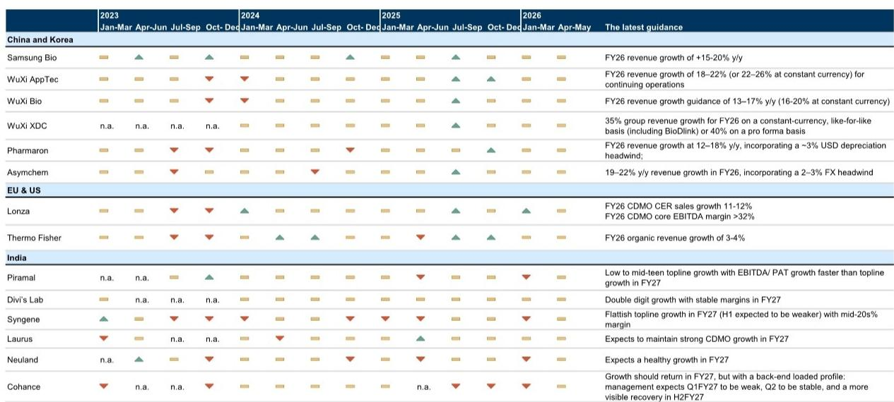
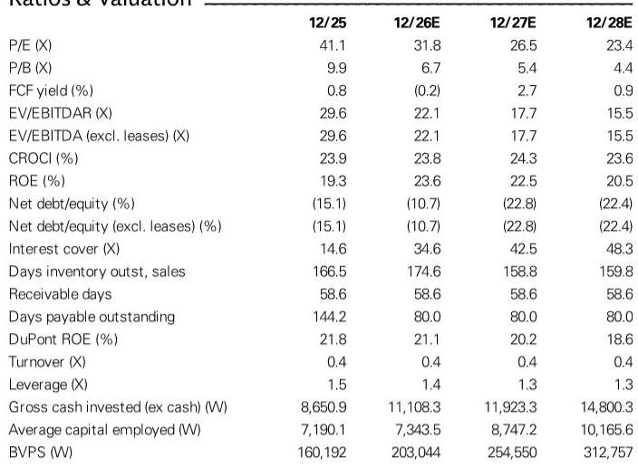
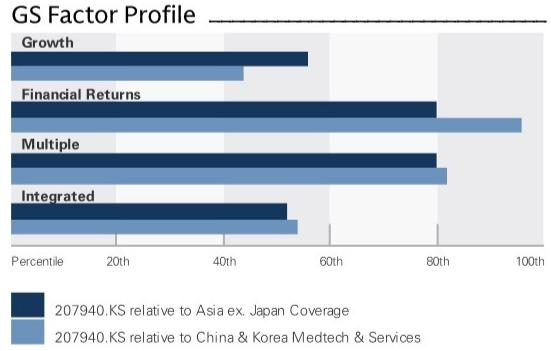

# GS：三星生物制剂最被低估的变量是汇率，不是罢工

三星生物制剂将在7月23日发布二季度业绩。GS在最新报告中给出一个核心判断：市场对5月初的罢工事件关注过度，真正支撑二季度盈利的变量是韩元汇率。报告预计二季度CDMO业务收入同比增长约30%，调整后净利润同比增长约41%，分别达到1.314万亿韩元和4700亿韩元，较市场一致预期高出0%和7%。

这份报告的价值不在于重复产能利用率高、工厂满产这些已知信息，而在于它拆解了三个容易被忽视的细节：汇率如何成为利润的隐形杠杆、罢工影响为何被高估、以及订单修正透露了什么信号。

## 1. 韩元每贬值2.5%，营业利润就多5%

三星生物制剂95%的收入以美元计价，而大部分成本以韩元结算。二季度美元兑韩元平均汇率约1500，比公司管理层在年初指引中假设的1400高出7%。GS测算，汇率每变动2.5%，营业利润就会同向变动约5%。

这意味着，仅汇率一项，二季度就能为公司贡献约14%的营业利润增量。报告认为，这足以部分抵消任何短期运营扰动，并降低全年15-20%收入增长指引的节奏变化不确定性。GS自己给出的全年收入增速预测是23%，已经高于公司指引的上沿，其中包含了新整合的美国工厂贡献。

> **KC评论：** 汇率对这家公司的影响被多数读者低估。报告中的敏感性分析——2.5%汇率变动对应5%利润变动——是一个可以直接套用的观察框架。二季度汇率环境明显优于公司假设，这是利润超预期的最大来源，而不是运营效率的突然提升。

## 2. 5月罢工的实际冲击被推迟到三季度，且部分可恢复

5月初的局部罢工并未对二季度业绩造成实质性影响。管理层已经确认核心流程未受干扰，也没有观察到订单取消。GS认为，罢工对盈利的潜在冲击更可能集中在三季度，但公司相对高的固定成本结构有助于缓冲波动，且部分影响可在后续季度恢复。

这个判断的关键支撑来自三星生物制剂的成本结构。固定成本占比高意味着，短期产能利用率下降对利润的冲击有限，而一旦恢复生产，利润弹性也会较快体现。报告没有给出具体的量化测算，但这一逻辑在CDMO行业已被多次验证。

## 3. 6月合同修正案透露了订单加速的信号

公司在6月宣布了多项合同修正，包括来自一家亚洲药企的追加订单6290万美元、一家美国药企的追加订单6900万美元、以及一家欧洲药企的追加订单3430万美元。这些增量订单虽不算巨额，但出现在市场对罢工影响最不确定的时点，信号意义大于金额本身。

GS认为，更多大规模合同的落地，将有助于增强读者对中期盈利可持续性的信心。报告特别提到，读者在二季度业绩会上应重点关注四个议题：汇率和工厂爬坡对指引的敏感性、劳资谈判进展、六号工厂的产能扩张时间表和新模式（ADC、CGT）的资本配置优先级、以及订单管道可见度，包括潜在的大型多年合同和美国双厂制造策略的早期进展。

## 4. 当前估值已接近历史低点，但市场仍在消化不确定性

报告显示，三星生物制剂当前12个月远期市盈率约31倍，而五年历史均值约为68倍。即使与全球CDMO同行Lonza的30倍相比，也没有明显溢价。GS认为，随着罢工不确定性逐步消退、订单转化在未来几个季度变得更加可见，市场情绪有望改善。

但报告也隐含了一个条件：估值修复的前提是订单可见度提升。6月的合同修正案是一个积极信号，但距离支撑估值系统性重估所需的大规模订单仍有距离。二季度业绩会上的订单管道更新，将是下一个关键观察节点。

> **KC评论：** 31倍市盈率放在全球CDMO行业并不算便宜，但相对于三星生物制剂自身的历史估值中枢，确实处于低位。关键在于，市场是否愿意为一家产能持续扩张、且受益于汇率顺风的公司给出高于同行的估值溢价。这取决于订单增长的可见度，而非短期利润波动。

For informational purposes only. Portions may be generated,translated,summarized,or edited with AI assistance based on source materials and may contain omissions or errors. Please verify independently. This is not investment,legal,tax,accounting,or other professional advice.

For informational purposes only. Portions may be generated,translated,summarized,or edited with AI assistance based on source materials and may contain omissions or errors. Please verify independently. This is not investment,legal,tax,accounting,or other professional advice.

