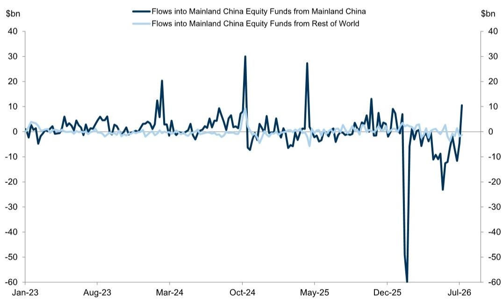
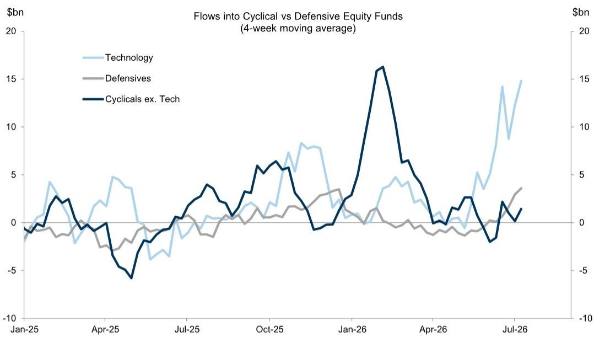
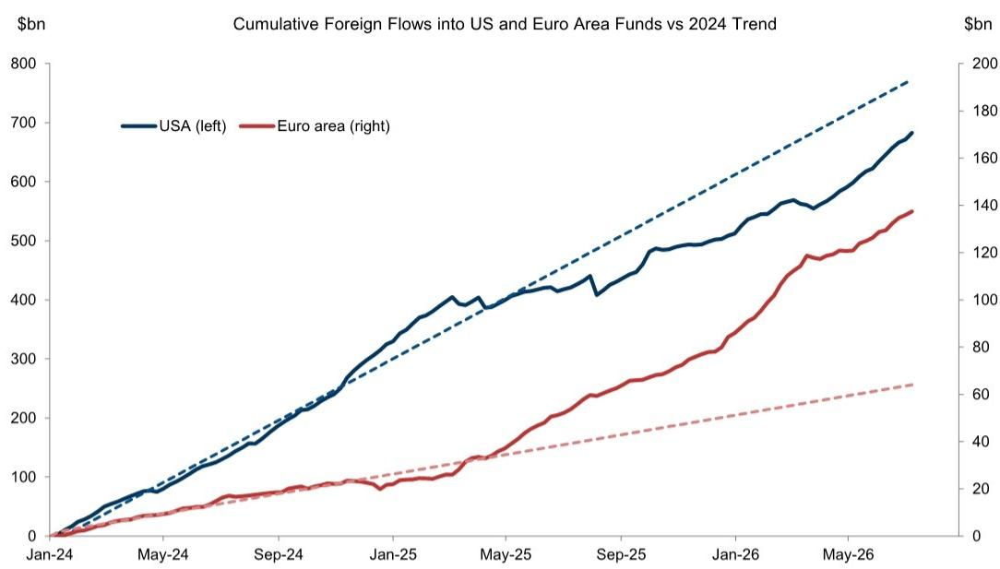

# GS：不是全面回暖而是高度集中，GS称记忆体超级周期主导资金流向

全球资金流向在7月第一周出现了一个值得关注的转向。根据GS最新发布的资金流周报，截至7月8日当周，全球公司产品净流入约563亿美元，扭转了此前一周约140亿美元的净流出。这一反转并非均匀分布——驱动力量高度集中在少数几个市场与行业。

发达市场中，美国产品贡献了主要的净流入。而在新兴市场内部，中国大陆、韩国和台湾地区的产品成为资金回流的引擎。其中韩国与台湾地区产品今年以来的资金流入增速尤为显著。GS策略团队认为，支撑这一趋势的核心变量是“记忆体超级周期”（memory super-cycle）带来的强劲盈利增长预期，尽管他们也提示了伴随而来的波动性上升。

> **KC评论：** 所谓“记忆体超级周期”，指的是存储芯片（DRAM、NAND）需求与价格同步大幅上升的周期。GS报告将其视为韩国和台湾地区市场资金流入的核心驱动力。读者可以留意这一判断与半导体行业库存周期、AI算力需求之间的关联。

## 1. 科技板块吸金能力远超其他行业，单周流入近290亿美元

在行业层面，科技板块是当周资金流入的相对主力。GS数据显示，科技行业产品单周净流入约288.6亿美元，远高于其他行业。资金、医疗保健、工业等板块的流入规模均在10亿至30亿美元区间，与科技板块不在一个量级。这一差距在四周累计数据中更加明显：科技板块四周累计流入约592亿美元，而排名第二的资金板块仅为85亿美元。

这意味着，当前全球资金对权益资产的偏好并非全面回暖，而是高度集中于科技——尤其是与半导体、AI基础设施相关的领域。报告中的行业资金流图表清晰显示，科技板块的Z-score（衡量流入强度的统计指标）达到4.50，远超其他行业，属于统计上的极端值。

## 2. 韩国与台湾地区成为新兴市场资金流入的“双引擎”

GS报告特别以“本周图表”形式展示了韩国与台湾地区产品今年以来的资金流入趋势。数据显示，截至7月8日当周，韩国产品净流入约40亿美元，台湾地区产品净流入约26亿美元，两者合计占当周新兴市场公司产品净流入（约150亿美元）的近一半。

报告进一步指出，GS策略团队预计，由记忆体超级周期驱动的强劲盈利增长，将为这两个市场的表现提供持续支撑。但报告也明确提到，这种支撑伴随着“较高的波动性”。对于关注亚太市场的读者而言，这意味着韩国和台湾地区的半导体出口数据、存储芯片价格走势，将成为判断资金流向可持续性的关键观测指标。

## 3. 固定收益与货币市场同样获得支撑，但结构分化明显

权益市场的回暖并非孤立现象。GS数据显示，全球固定收益产品当周净流入约314亿美元，四周累计约962亿美元。其中，短期债券产品和通胀保护债券产品持续获得资金青睐，显示出读者在追求收益的同时，仍对利率不确定性和通胀保持警惕。

货币市场产品资产当周增加约400亿美元，四周累计增加约941亿美元。这一规模与公司产品相当，说明市场整体不确定性偏好虽有改善，但并未出现资金从防御性资产大规模撤离的迹象。跨境外汇资金流也整体偏正，美元需求较强，而人民币则录得最大净流出——这一对比本身也反映了当前全球资金对不同地区的差异化判断。

> **KC评论：** 人民币在跨境资金流中持续净流出，与韩国、台湾地区资金大幅流入形成对照。这背后既有出口结构差异（存储芯片 vs 更广泛的制造业），也有读者对各自宏观周期的不同定价。报告没有展开分析，但这一对比值得持续跟踪。

---

这份GS周报的核心信息其实很简洁：全球资金正在沿着一条明确的产业主线重新配置——记忆体超级周期驱动下的科技与半导体产业链。韩国、台湾地区、科技板块是这条主线的直接受益者。而其他市场与行业，即便也获得资金流入，其规模和强度都远不及这一主线。

对于产业决策者和专业读者而言，真正需要追问的不是“资金会不会继续流入”，而是“记忆体超级周期的盈利兑现节奏是否匹配当前资金流入的强度”。GS报告没有给出明确答案，但它提供了足够清晰的观测框架：关注韩国和台湾地区的出口数据、存储芯片价格走势，以及科技板块盈利预期的变化。

For informational purposes only. Portions may be generated,translated,summarized,or edited with AI assistance based on source materials and may contain omissions or errors. Please verify independently. This is not investment,legal,tax,accounting,or other professional advice.

For informational purposes only. Portions may be generated,translated,summarized,or edited with AI assistance based on source materials and may contain omissions or errors. Please verify independently. This is not investment,legal,tax,accounting,or other professional advice.

