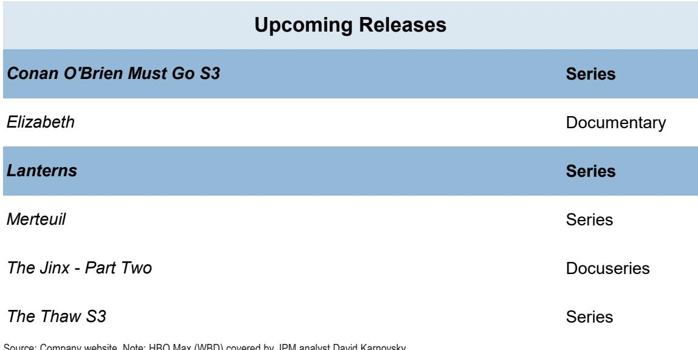
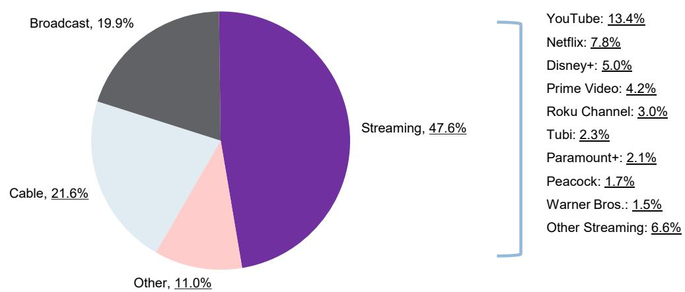
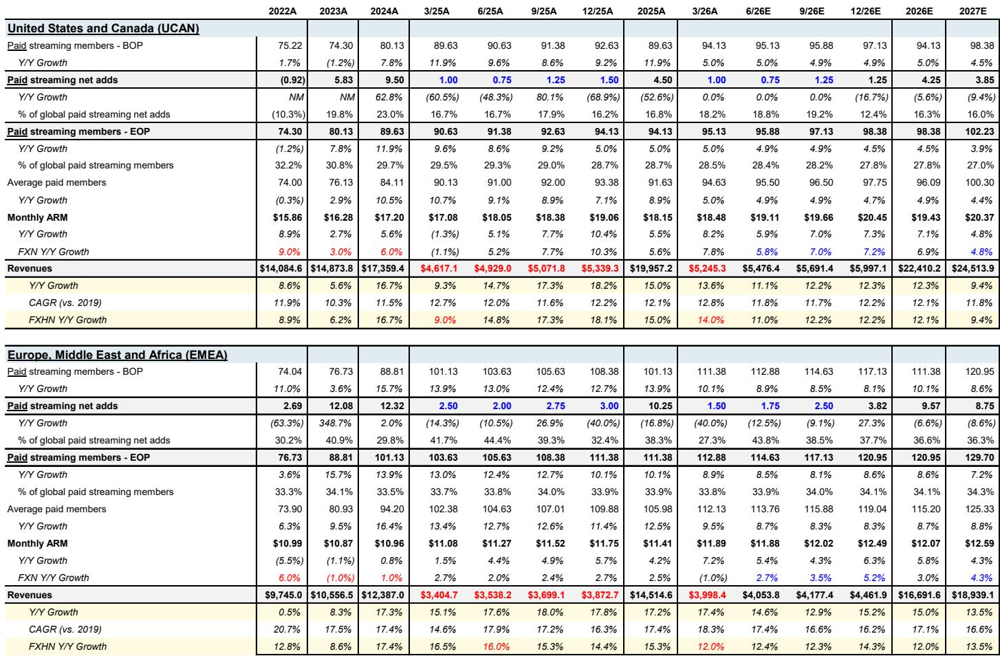

# 从用户增长到效率变现：Netflix 的商业模式正在发生结构性转变

市场对Netflix即将发布的第二季度财报持谨慎态度，公司报价自一季度报告以来出现明显调整。然而，这种调整与公司实际经营状况之间可能存在认知差异。

Netflix目前拥有超过3.25亿全球用户，年收入达450亿美元。在这样的规模下，用户使用时长已不再是收入增长的主要驱动力。市场可能仍在用传统线性电视的框架来评估一个已经转向多引擎收入模式的平台。定价能力、广告收入和国际化拓展，现在比用户每天多看几分钟更重要。

公司预计2026年收入将达到507亿至517亿美元，同比增长12%至14%，运营利润率扩大至31.5%。这些数据反映的是一家正在从纯用户增长向变现效率转型的公司，而非经营出现问题的企业。

## 市场对用户参与度的解读可能存在偏差

市场对Netflix的主要担忧集中在用户参与度上。公司半年度的参与度报告预计将显示同比增长2%至3%。表面上看，这些数字对于一家历史上参与度增长更快的公司来说显得温和。

但这种解读隐含的假设是：参与度增长与收入增长仍然紧密相关。实际上，这种相关性早已减弱。Netflix内部的核心质量参与度指标在2026年第一季度创下历史新高，表明用户满意度——以用户实际价值衡量，而非仅仅登录时长——比以往更强。更重要的是，在超过3.25亿用户的基础上，增量参与时长带来的边际收入回报正在递减。

关于“取消Netflix”的全球搜索兴趣数据也支持这一判断。该指标在2026年3月美国提价后出现峰值，但随后已恢复正常。管理层在财报电话会议上表示，用户流失率仍在预期范围内。

## 定价能力与广告收入成为增长新引擎

美国市场提价预计将在2025年基础上产生约17亿美元的增量年化收入，为全年贡献约250个基点的增长。这不是推测，而是基于现有用户基数和已公布的定价调整的算术结果。

国际市场提价则代表了尚未完全反映在当前预期中的额外空间。Netflix在内容库和品牌影响力持续增强的背景下，在欧洲、拉美和亚太市场拥有提价空间。公司全球可触达市场仍有渗透空间：在全球约8亿联网电视家庭中，Netflix的渗透率不足45%。

广告业务已不再是实验性质。广告支持层目前拥有超过2.5亿月活跃观众，在可用国家中占新用户注册量的60%以上。预计2026年广告收入约31亿美元，较2025年弹性较高，2027年达到53亿美元。广告收入带来的边际利润率显著高于订阅收入，因为内容成本基本固定。

## 下半年运营利润增长有望加速

2026年下半年最值得关注的催化剂是运营利润的增长形态。上半年因内容摊销时间安排和交易相关费用，运营利润增长受到压缩。下半年费用增长将显著放缓至约7%，而收入增长保持在低至中双位数，运营利润增长有望在下半年加速至30%以上。

全年来看，预计2026年运营利润164亿美元，收入517亿美元，运营利润率31.7%，略高于管理层指引的31.5%。自由现金流预计127亿美元，同比增长34%，支持约93亿美元的股份回购。

## 观察框架：区分短期情绪与结构性变化

当前市场环境呈现短期情绪与中期基本面之间的典型张力。以下是几个值得关注的维度：

第一，收入增长机制是否改变？答案是否定的。2026年收入增长由三个独立驱动因素支撑：低渗透市场的用户增长、美国及国际市场的定价能力、快速扩张的广告业务。每个驱动因素都可量化。

第二，利润轨迹是否完整？证据显示是，但需注意时间因素。上半年费用增长因内容安排和交易成本而偏高，下半年将显著放缓。全年运营利润率31.5%至31.7%代表稳步扩张。

第三，当前报价是否反映了公司潜力？以当前约75美元的价格计算，估值水平相对于增长轨迹和自由现金流回报表现而言，有其合理性。

值得关注的风险是大型并购的可能性。任何重大交易都可能引入整合风险，分散对有机增长的关注。公司内部质量参与度指标创历史新高表明，有机内容投资正在发挥作用。

核心逻辑清晰：Netflix已从单一引擎增长业务转变为多引擎复合增长模式。市场关注的可能并非关键指标。用户参与度增长放缓，但收入增长和利润增长正在加速。2026年下半年，这种分化将在财务数据中显现。

*仅供参考。部分内容可能基于原始资料通过AI辅助生成、翻译、摘要或编辑，可能存在遗漏或错误。请独立核实。本文不构成任何专业建议。*

仅供参考。部分内容可能基于原始资料通过AI辅助生成、翻译、摘要或编辑，可能存在遗漏或错误。请独立核实。本文不构成任何专业建议。

