本材料无意向中国大陆读者分发，亦不构成在中国大陆境内提供证券投资咨询服务。未经JPM书面同意，不得转载、出售或重新分发本材料或其任何部分。

## 中国汽车行业观察

## 6月数据：国内需求平稳，出口表现强劲；中国品牌在欧洲市场份额持续提升

中国汽车工业协会（CAAM）6月销量数据基本符合预期，行业仍呈现出口动能强劲与国内需求相对平稳的分化格局。我们认为，国内乘用车需求持续处于调整阶段，是6月中国汽车板块表现的一个背景因素。6月国内乘用车销量同比下降26%至150万辆，而乘用车出口同比增长80%至90万辆，这进一步印证了我们的观点：行业近期的积极基本面仍主要由出口驱动，而非国内市场。在此背景下，我们认为当前的市场调整提供了选择性关注的机会，尤其是那些在8月即将到来的中期业绩期中有望实现业绩超预期的公司（例如吉利汽车、蔚来，而比亚迪预计符合预期），而非对整个板块的全面判断。我们会在看到以下更明确的信号后，才会采取更积极的看法：1）国内乘用车需求企稳；2）定价与盈利纪律；3）出口的持续性。我们继续看好那些具备出口增长韧性、海外竞争力提升以及盈利预期趋势向好的整车厂。我们在2026年下半年的关注方向包括吉利汽车、比亚迪和蔚来。事件方面，我们将密切关注：1）8月中下旬即将到来的中期业绩期；2）暂定于9月下旬举行的下一轮高层会晤，以观察美国方面对中国汽车行业可能出现的政策变化。

在本报告中，我们持续关注中国整车厂的结构性海外扩张周期，重点聚焦三个领域：1）最新出口动态，包括增长动能和区域结构；2）动力总成趋势，特别是插电式混合动力车（PHEV）日益重要的作用，我们认为其海外市场的普及路径可能复制中国市场的经验，这或令海外读者感到惊喜；3）中国整车厂在欧洲的新能源汽车市场份额，该份额持续上升，正成为其全球竞争力的重要佐证。

- CAAM 6月数据显示出温和的环比复苏，但内部结构仍不均衡（表1）。6月：1）乘用车总批发量达到240万辆，环比增长7%，但同比下降5%。2）国内销售仍处于调整阶段（环比增长4%，但同比下降23%），而出口创下新高，继续部分吸收国内市场的富余产能。3）乘用车新能源汽车渗透率进一步升至创纪录的63%，高于5月的61%。4）商用车是相对亮点，总销量同比增长10%，出口持续强劲，带动2026年上半年增速达到8%。

- 2026年上半年乘用车出口保持强劲势头，同比增长超过70%：出口为中国品牌提供了有意义的增长和盈利机会。根据CAAM数据，2026年上半年，中国出口超过440万辆乘用车（同比增长72%）。根据ThinkerCar 2026年5月海关数据，欧洲（包括西欧和东欧）占总量的37%，是中国品牌最大的出口目的地，其次是亚洲（30%）和南美洲（17%）。

- 中国品牌在欧洲的新能源汽车份额持续上升，2026年5月达到约17%，5月为19%。根据注册数据，中国品牌在整个欧洲新能源汽车注册量中的份额从2025年的约11%显著上升至2026年5月的约17%。5月，中国品牌占整个欧洲新能源汽车注册量的19%（图1-2），在西欧五国约占21%。此外，中国品牌在整个欧洲/西欧五国的乘用车份额也在稳步提升，5月达到约10%/11%（图3-4）。这支持了我们的观点：中国整车厂的海外份额增长日益呈现结构性特征，而非周期性波动，驱动因素包括：1）更强的新能源汽车产品竞争力；2）从纯电动到插电式混合动力及燃油/混动的多种动力总成选择；3）更快的车型推出速度；4）有吸引力的功能与价格定位；5）海外市场品牌接受度的提升。

中国的出口结构正迅速向新能源汽车倾斜：根据ThinkerCar海关数据，2026年5月，新能源汽车占乘用车出口的52%，高于2024年的42%。在新能源汽车内部，插电式混合动力车扮演着越来越重要的角色，到2026年5月占新能源汽车出口总量的38%，而2024年1月仅为11%（图10-11）。

- 主要中国整车厂的出口结构正变得更加区域多元化，但各厂商路径不同：在选定的厂商中：上汽集团是最明显的以欧洲为主导的案例，欧洲在其出口中的份额从2024年的34%上升到2026年5月的46%。奇瑞汽车和比亚迪也显示出向欧洲和南美洲的转移，而亚洲的份额有所下降。对于吉利汽车，亚洲仍是最大区域，但份额从2025财年的50%降至2026年5月的37%，欧洲是第二大区域，占28%，而南美洲的份额从2024年的4%大幅上升至2026年5月的18%。相比之下，长城汽车正将重心移出欧洲，欧洲在其海外销量中的份额从去年的65%降至38%，而亚洲和南美洲的份额相对上升。总体而言，我们发现中国整车厂的海外扩张正变得更加均衡，而非依赖单一区域。我们在图13-25中总结了主要出口厂商按区域划分的出口结构。

JPM“中国汽车购买者情绪指数”仍显示潜在需求平淡：我们基于人工智能/数据驱动的专有情绪指数显示，整体购买者兴趣仍处于低位——在7月第一周低于25%分位数，此前在6月底出现温和反弹。从历史经验看，我们发现“购买者情绪指数”在以下情况下是公司表现拐点的有用指标：1）该指数出现连续超过两周的方向性变动——特别是从75%高分位数向下突破，或从25%低分位数向上突破；2）将情绪趋势与基本面分析（如行业销量或公司新车型发布）相结合。鉴于购买者情绪平淡，我们认为中国汽车板块短期内可能仍以区间震荡为主。

- 6月价格折扣有所收窄：国内市场的平均价格折扣（以厂商建议零售价减去实际成交价衡量）在2026年第二季度稳步收窄，从3月初的17.5%降至6月底的15.7%（图27-30）。这令人鼓舞，尽管折扣的相对幅度仍然较大。

## 中国汽车月度销量

表1：2026年6月中国汽车批发量分析

|  | 2026年6月销量（千辆） | 2026年6月（环比%） | 2026年6月（同比%） | 年初至今（同比%） |
| :--- | :--- | :--- | :--- | :--- |
| 汽车总计 | 2,810 | 6.9% | -3.2% | -4.0% |
| 乘用车 | 2,402 | 6.6% | -5.3% | -6.0% |
| 轿车 | 781 | 4.0% | -25.5% | -22.6% |
| MPV | 103 | 21.7% | -2.8% | -15.2% |
| SUV | 1,494 | 7.4% | 10.3% | 8.4% |
| 跨界车 | 24 | -8.5% | -11.9% | -23.3% |
| 商用车 | 409 | 8.5% | 10.7% | 8.3% |
| 客车 | 62 | 16.4% | 16.6% | 5.0% |
| 卡车 | 347 | 7.3% | 9.7% | 8.7% |

来源：CAAM

中国品牌在欧洲的市场份额
图1：中国品牌在欧洲的新能源汽车市场份额（年度）
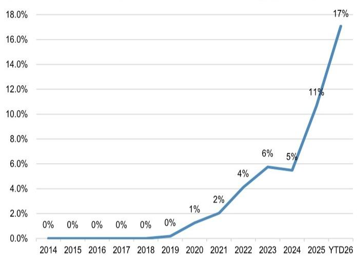
来源：彭博财经、JATO dynamics（注册数据）

图2：中国品牌在欧洲的新能源汽车市场份额（月度）
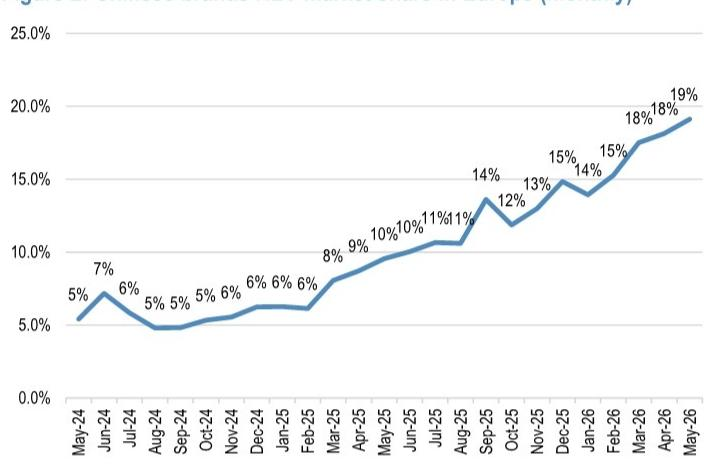

图3：中国品牌在西欧五国的新能源汽车市场份额（年度）
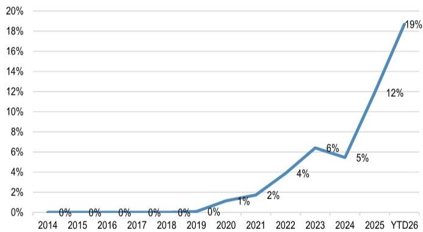
来源：彭博财经、JATO dynamics
来源：彭博财经、JATO dynamics

图4：中国品牌在西欧五国的新能源汽车市场份额（月度）
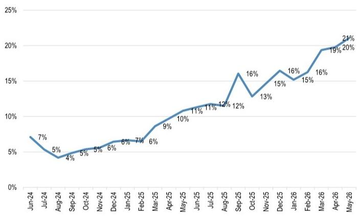
来源：彭博财经、JATO dynamics

图5：中国品牌在欧洲的乘用车市场份额（年度）
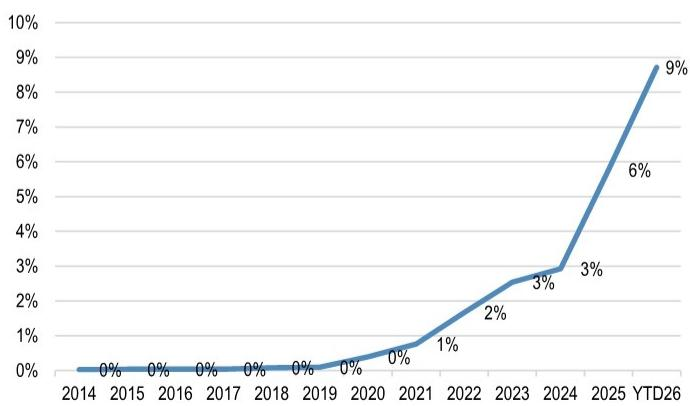
来源：彭博财经、JATO Dynamics

图6：中国品牌在欧洲的乘用车市场份额（月度）
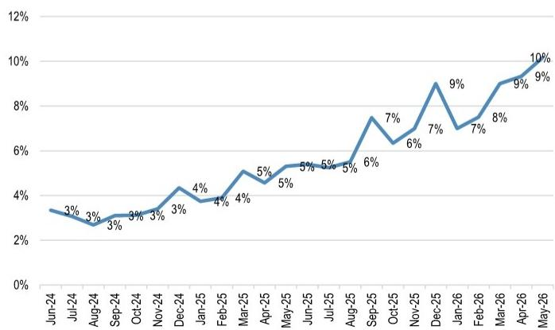
来源：彭博财经、JATO Dynamics

图7：中国品牌在西欧五国的乘用车市场份额（年度）
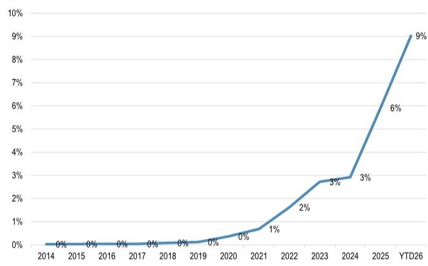
来源：彭博财经、JATO Dynamics

图8：中国品牌在西欧五国的乘用车市场份额（月度）
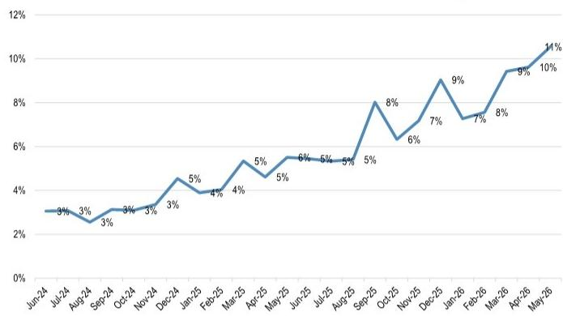
来源：彭博财经、JATO Dynamics
中国出口

图9：中国乘用车出口：纯电动和插电式混合动力占比
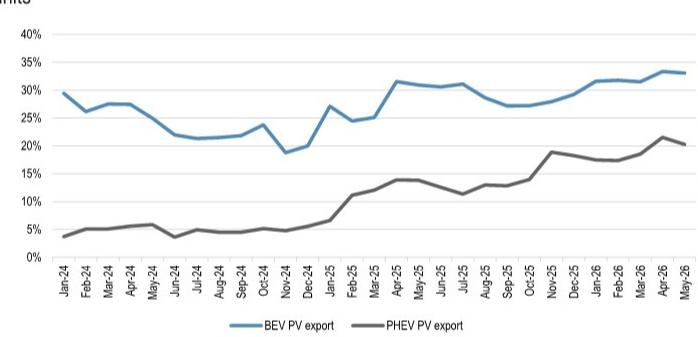
来源：ThinkerCar、JPM

图10：2024年以来插电式混合动力占中国乘用车新能源汽车出口总量的比例，5月达到38%
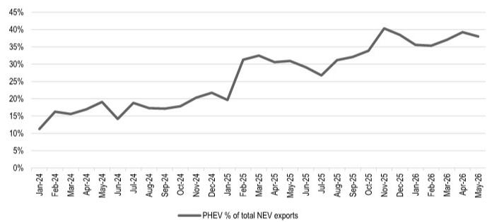
来源：ThinkerCar、JPM

图11：主要中国出口商——月度销量
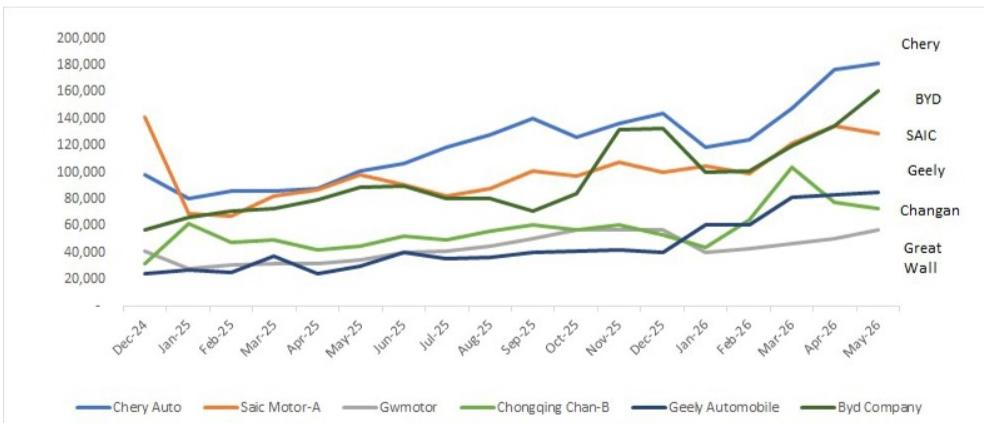
来源：CAAM、JPM

图12：2008年至2026年至今中国国内乘用车市场按品牌来源划分的整体市场份额趋势（零售）

中国品牌在国内乘用车市场的份额整体呈上升趋势。这一份额增长主要得益于中国整车厂在智能新能源汽车领域更具竞争力的产品。

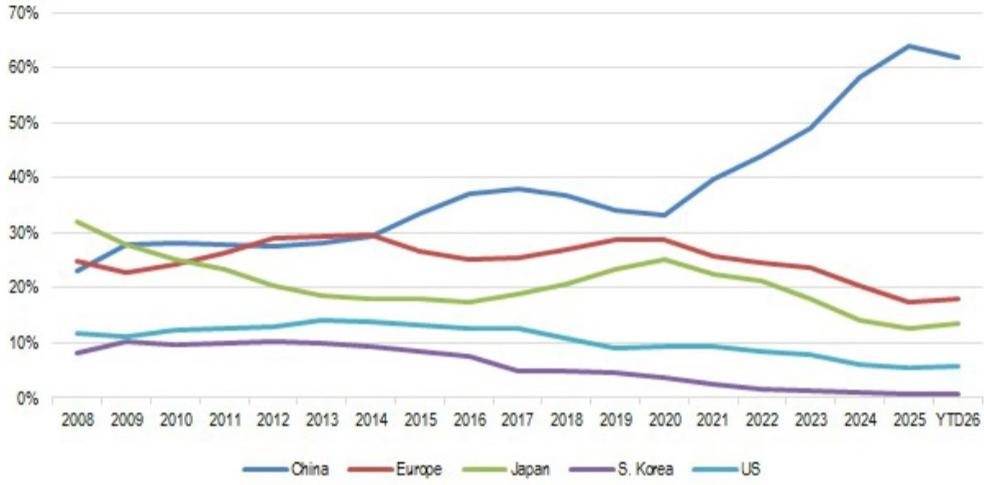
来源：彭博财经、JPM。

图13：奇瑞出口量按区域划分
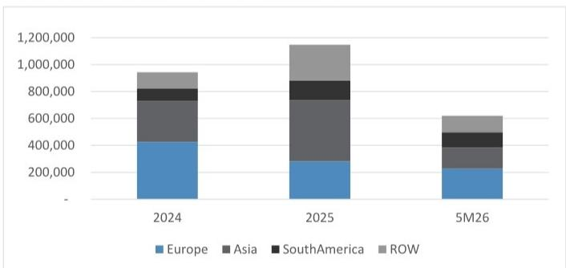
来源：ThinkerCar、JPM

图14：奇瑞出口结构按区域划分
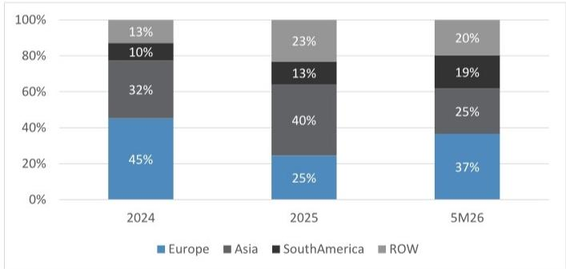
来源：ThinkerCar、JPM

图15：比亚迪出口量按区域划分
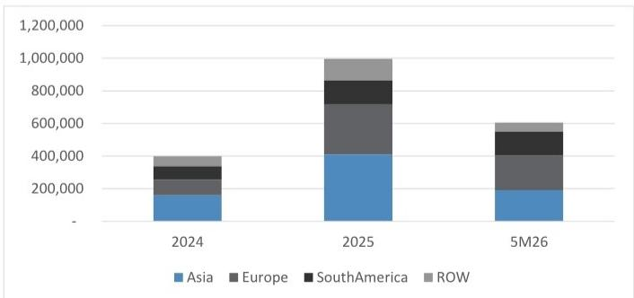
来源：ThinkerCar、JPM

图16：比亚迪出口结构按区域划分
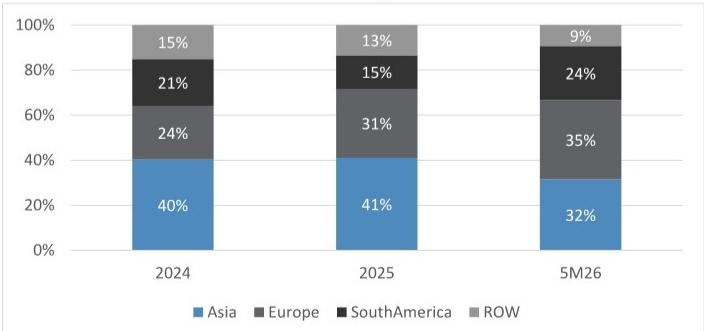
来源：ThinkerCar、JPM

图17：上汽自主品牌出口量按区域划分
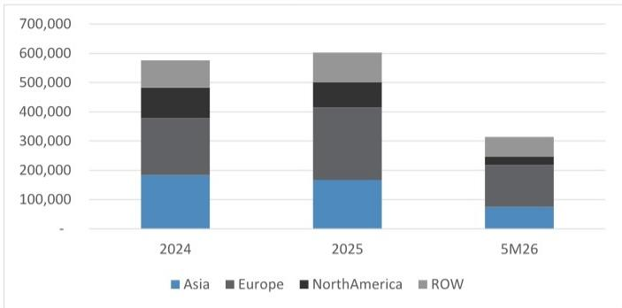
来源：ThinkerCar、JPM

图18：上汽自主品牌出口结构按区域划分
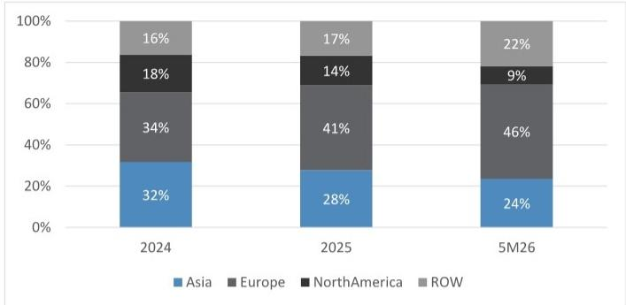
来源：ThinkerCar、JPM

图19：吉利出口量按区域划分
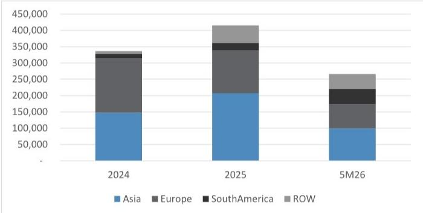
来源：ThinkerCar、JPM

图20：吉利出口结构按区域划分
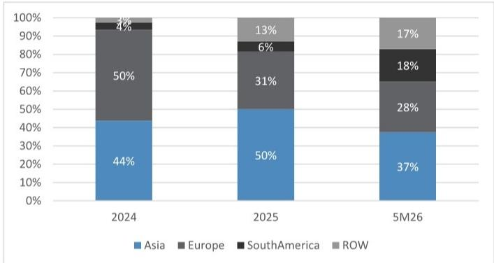
来源：ThinkerCar、JPM

图21：奇瑞出口量按动力总成划分
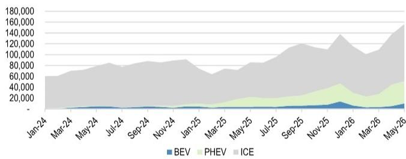
来源：ThinkerCar、JPM

图22：比亚迪出口量按动力总成划分
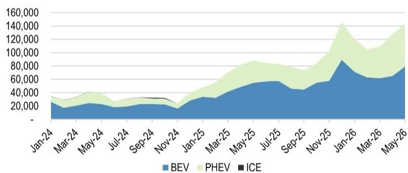
来源：ThinkerCar、JPM

图23：吉利出口量按动力总成划分
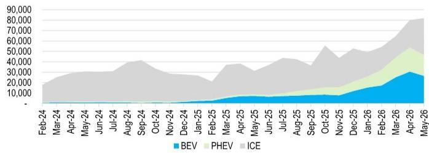

图24：零跑出口量按动力总成划分
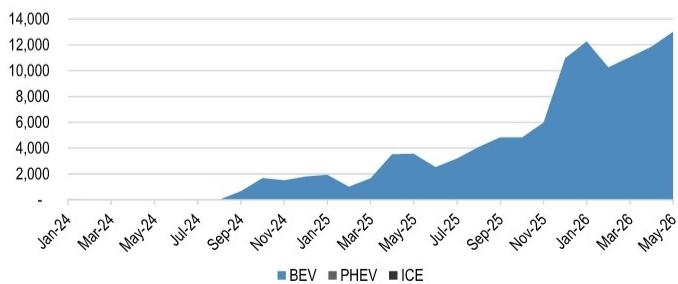
来源：ThinkerCar、JPM

图25：上汽自主品牌出口量按动力总成划分
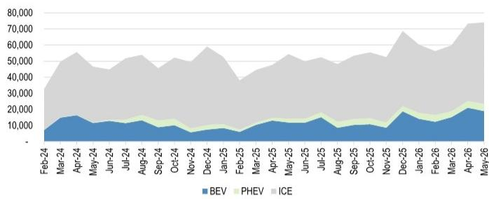
来源：ThinkerCar、JPM

## JPM中国汽车行业情绪指数

图26：JPM中国汽车行业情绪指数
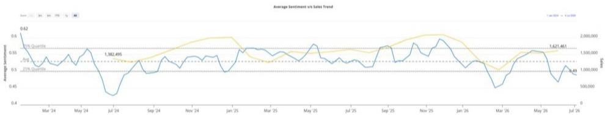
来源：JPM、彭博财经

## 平均价格折扣

图27：国产车型与进口车型的平均价格折扣
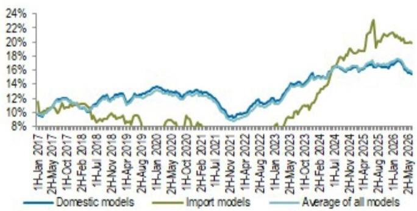

图28：按细分市场划分的国产车型平均价格折扣（国产车型）
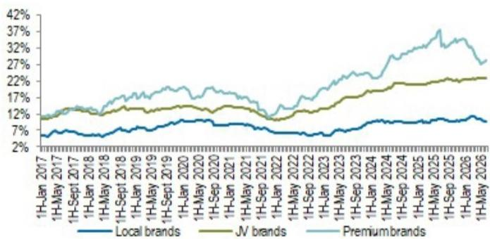

图29：按尺寸划分的国产车型平均零售价（国产车型）
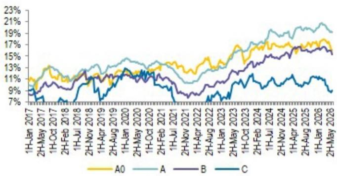
来源：中国汽车市场

图30：按能源类型划分的国产车型平均价格折扣（国产车型）
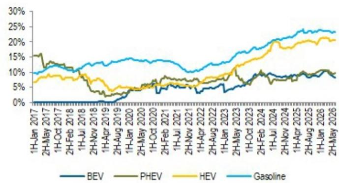
来源：中国汽车市场

本报告讨论的公司（除非另有说明，本报告所有价格均为2026年7月9日市场收盘价）比亚迪股份有限公司 - A股（002594.SZ/人民币86.87元/OW），比亚迪股份有限公司 - H股（1211.HK/港币82.65元/OW），吉利汽车控股有限公司（0175）（0175.HK/港币18.13元/OW），蔚来（NIO/4.90美元[2026年7月8日]/OW）

分析师认证：本报告封面标注“AC”的研究分析师（或当多位研究分析师主要负责本报告时，封面或文件内标注“AC”的研究分析师就其在本研究中涵盖的每个证券或发行人分别认证）：(1) 本报告中表达的所有观点准确反映了研究分析师对任何及所有标的证券或发行人的个人观点；(2) 研究分析师薪酬的任何部分过去、现在或将来均未直接或间接地与本研究报告中研究分析师提出的具体建议或观点相关联。对于封面列出的所有韩国研究分析师（如适用），他们还根据KOFIA要求认证，研究分析师的分析是善意进行的，且观点反映了研究分析师自身的意见，没有受到不当影响或干预。

除非另有说明，本报告中列出的所有作者均为制作独立研究的研究分析师。在欧洲，行业专家（销售和交易）可能作为联系人出现在本报告中，但并非报告作者或研究部门成员。

## 重要披露

• 做市商：JPM证券有限责任公司是蔚来或相关实体证券的做市商。

- 做市商/流动性提供者：JPM是比亚迪股份有限公司 - A股、比亚迪股份有限公司 - H股、蔚来或相关实体金融工具的做市商和/或流动性提供者。

- 做市商/流动性提供者（香港）：JPM证券（亚太）有限公司和/或JPM经纪（香港）有限公司和/或关联公司是比亚迪股份有限公司 - A股、比亚迪股份有限公司 - H股、吉利汽车控股有限公司（0175）、蔚来或相关实体及/或其权证或期权的做市商和/或流动性提供者，这些证券在香港联合交易所有限公司上市或交易。

- 客户：JPM目前拥有，或在过去12个月内曾拥有以下实体作为客户：比亚迪股份有限公司 - A股、比亚迪股份有限公司 - H股、吉利汽车控股有限公司（0175）、蔚来或相关实体。

- 客户/非投资银行、证券相关：JPM目前拥有，或在过去12个月内曾拥有以下实体作为客户，且提供的服务为非投资银行、证券相关服务：比亚迪股份有限公司 - A股、比亚迪股份有限公司 - H股、吉利汽车控股有限公司（0175）、蔚来或相关实体。

- 客户/非证券相关：JPM目前拥有，或在过去12个月内曾拥有以下实体作为客户，且提供的服务为非证券相关服务：比亚迪股份有限公司 - A股、比亚迪股份有限公司 - H股、吉利汽车控股有限公司（0175）、蔚来或相关实体。

- 潜在投资银行报酬：JPM预计在未来三个月内将从比亚迪股份有限公司 - A股、比亚迪股份有限公司 - H股、蔚来或相关实体收取或寻求投资银行服务报酬。

• 已收非投资银行报酬：JPM在过去12个月内已从比亚迪股份有限公司 - A股、比亚迪股份有限公司 - H股、吉利汽车控股有限公司（0175）、蔚来或相关实体收取了投资银行以外的产品或服务报酬。

- 债务头寸：JPM可能持有比亚迪股份有限公司 - A股、比亚迪股份有限公司 - H股、吉利汽车控股有限公司（0175）、蔚来或相关实体的债务证券头寸（如有）。

公司特定披露：JPM确实并且寻求与其研究报告所覆盖的公司开展业务。因此，读者应注意，该公司可能存在利益冲突，可能影响本报告的客观性。读者应将本报告仅视为其做出决策的单一因素。重要披露，包括价格图表和信用意见历史表（如适用），可通过访问https://www.jpmm.com/research/disclosures、致电1-800-477-0406或发送电子邮件至research.disclosure.inquiries@JPM.com获取。

比亚迪股份有限公司 - A股（002594.SZ，002594 CH）价格图表
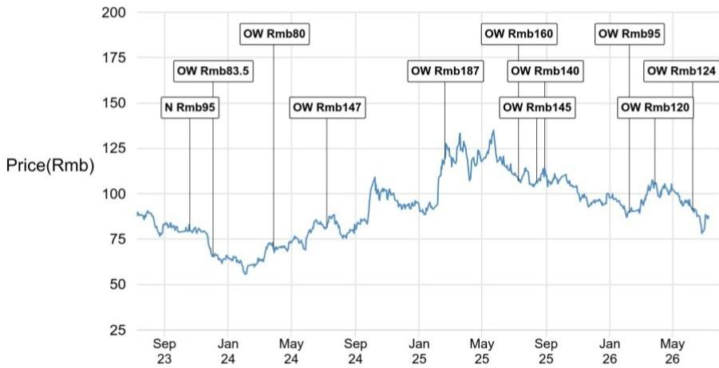

| 日期 | 评级 | 价格（人民币） | 目标价（人民币） |
| :--- | :--- | :--- | :--- |
| 2023年10月20日 | N | 80.20 | 95 |
| 2023年12月3日 | OW | 65.68 | 83.5 |
| 2024年3月29日 | OW | 69.46 | 80 |
| 2024年7月9日 | OW | 81.66 | 147 |
| 2025年2月20日 | OW | 119.50 | 187 |
| 2025年7月11日 | OW | 107.08 | 160 |
| 2025年8月14日 | OW | 106.83 | 145 |
| 2025年8月30日 | OW | 114.06 | 140 |
| 2026年2月8日 | OW | 89.82 | 95 |
| 2026年3月29日 | OW | 105.30 | 120 |
| 2026年6月9日 | OW | 91.19 | 124 |

来源：彭博财经和JPM；价格数据已根据股票分割和股息进行调整。覆盖起始日期：2014年12月3日。所有股价均为前一个交易日市场收盘价。
比亚迪股份有限公司 - H股（1211.HK，1211 HK）价格图表

| 日期 | 评级 | 价格（港币） | 目标价（港币） |
| :--- | :--- | :--- | :--- |
| 2023年10月20日 | OW | 82.67 | 103.5 |
| 2023年12月3日 | OW | 68.67 | 90 |
| 2024年3月29日 | OW | 67.20 | 85 |
| 2024年7月9日 | OW | 77.73 | 158.5 |
| 2025年2月20日 | OW | 122.73 | 200 |
| 2025年7月11日 | OW | 119.50 | 180 |
| 2025年8月14日 | OW | 115.00 | 160 |
| 2025年8月30日 | OW | 114.40 | 150 |
| 2026年2月8日 | OW | 92.30 | 110 |
| 2026年3月29日 | OW | 106.50 | 120 |
| 2026年6月9日 | OW | 88.05 | 124 |

来源：彭博财经和JPM；价格数据已根据股票分割和股息进行调整。覆盖起始日期：2002年9月24日。所有股价均为前一个交易日市场收盘价。

吉利汽车控股有限公司（0175）（0175.HK，175 HK）价格图表
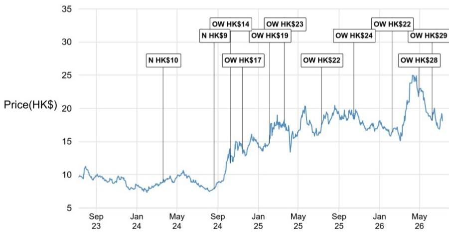
来源：彭博财经和JPM；价格数据已根据股票分割和股息进行调整。覆盖起始日期：2010年9月26日。所有股价均为前一个交易日市场收盘价。

| 日期 | 评级 | 价格（港币） | 目标价（港币） |
| :--- | :--- | :--- | :--- |
| 2024年3月21日 | N | 8.83 | 10 |
| 2024年8月22日 | N | 7.88 | 9 |
| 2024年10月10日 | OW | 11.78 | 14 |
| 2024年11月15日 | OW | 13.90 | 17 |
| 2025年2月4日 | OW | 14.78 | 19 |
| 2025年3月21日 | OW | 18.24 | 23 |
| 2025年7月11日 | OW | 17.60 | 22 |
| 2025年10月16日 | OW | 19.17 | 24 |
| 2026年2月8日 | OW | 16.31 | 22 |
| 2026年4月30日 | OW | 22.34 | 28 |
| 2026年6月9日 | OW | 18.17 | 29 |

蔚来（NIO，NIO US）价格图表
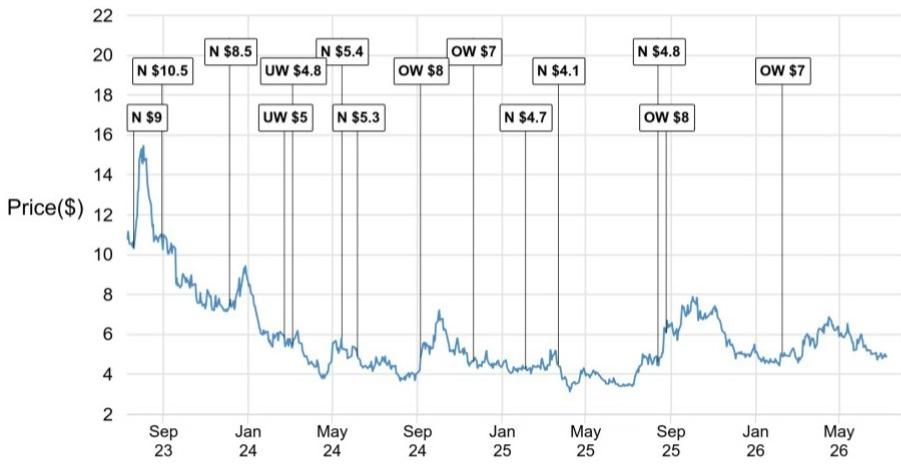
来源：彭博财经和JPM；价格数据已根据股票分割和股息进行调整。覆盖起始日期：2018年10月8日。所有股价均为前一个交易日市场收盘价。

| 日期 | 评级 | 价格（美元） | 目标价（美元） |
| :--- | :--- | :--- | :--- |
| 2023年7月21日 | N | 10.32 | 9 |
| 2023年8月30日 | N | 10.89 | 10.5 |
| 2023年12月6日 | N | 7.43 | 8.5 |
| 2024年2月23日 | UW | 5.85 | 5 |
| 2024年3月6日 | UW | 5.48 | 4.8 |
| 2024年5月15日 | N | 5.79 | 5.4 |
| 2024年6月7日 | N | 4.91 | 5.3 |
| 2024年9月6日 | OW | 4.85 | 8 |
| 2024年11月21日 | OW | 4.65 | 7 |
| 2025年2月4日 | N | 4.28 | 4.7 |
| 2025年3月23日 | N | 4.50 | 4.1 |
| 2025年8月14日 | N | 4.62 | 4.8 |
| 2025年8月26日 | OW | 6.09 | 8 |
| 2026年2月8日 | OW | 5.04 | 7 |

图表显示了JPM对这些股票的持续覆盖；当前分析师可能并未在整个期间内覆盖这些股票。JPM评级或名称：OW = 增持，N = 中性，UW = 减持，NR = 未评级

## 股票研究评级、名称和分析师覆盖范围说明：

JPM使用以下评级系统：增持（在本报告所示目标价期间内，我们预期该股票的表现将优于研究分析师或其团队覆盖范围内股票的平均总回报）；中性（在本报告所示目标价期间内，我们预期该股票的表现将与研究分析师或其团队覆盖范围内股票的平均总回报一致）；减持（在本报告所示目标价期间内，我们预期该股票的表现将逊于研究分析师或其团队覆盖范围内股票的平均总回报。NR为未评级。在这种情况下，JPM已移除该股票的评级以及（如适用）目标价，原因可能是缺乏足够的基本面依据，或出于法律、监管或政策原因。先前的评级以及（如适用）目标价不应再被依赖。NR名称并非推荐或评级。部分被覆盖的股票有评级但无目标价；在这些情况下，我们预期该股票的表现将优于/一致/逊于研究分析师或其团队覆盖范围内股票在相关区域相应期间的平均总回报。在我们的亚洲（除澳大利亚和印度外）和英国中小盘股票研究中，每只股票的预期总回报是与基准国家市场指数的预期总回报进行比较，而非与研究分析师的覆盖范围进行比较。如果本报告的重要披露部分未显示，认证研究分析师的覆盖范围可在JPM网站https://www.JPMmarkets.com上找到。

覆盖范围：Lai, Nick YC：北京汽车（1958.HK），比亚迪股份有限公司 - A股（002594.SZ），比亚迪股份有限公司 - H股（1211.HK），华晨中国（1114.HK），重庆长安汽车 - A股（000625.SZ），重庆长安汽车 - B股（200625.SZ），吉利汽车控股有限公司（0175）（0175.HK），长城汽车 - A股（601633.SS），长城汽车 - H股（2333.HK），广汽集团 - A股（601238.SS），广汽集团 - H股（2238.HK），理想汽车（2015.HK），理想汽车 - ADR（LI），蔚来（NIO），上汽集团 - A股（600104.SS），中国重汽（3808.HK），小鹏汽车（XPEV），小鹏汽车 - H股（9868.HK），永达汽车（3669.HK），浙江零跑科技股份有限公司（9863.HK），中升控股（0881.HK）

JPM股票研究评级分布，截至2026年7月4日

|  | 增持（买入） | 中性（持有） | 减持（卖出） |
| :--- | :--- | :--- | :--- |
| JPM全球股票研究覆盖* | 53% | 36% | 12% |
| 投行客户** | 83% | 80% | 73% |
| JPM证券股票研究覆盖* | 51% | 37% | 12% |
| 投行客户** | 95% | 92% | 87% |

*请注意，由于四舍五入，百分比可能未加总至100%。
**在过去12个月内，JPM为其提供投资银行服务的“买入”、“持有”和“卖出”类别中各标的公司的百分比。

仅就FINRA评级分布规则而言，我们的增持评级属于报告评级类别；中性评级属于持有评级类别；减持评级属于报告评级类别。请注意，标有NR的股票未包含在上述表格中。此信息截至最近一个日历季度末。

股票估值与风险：有关被覆盖公司或目标价的估值方法和风险，请参阅http://www.JPMmarkets.com上最新的公司特定研究报告，联系主要分析师或您的JPM代表，或发送电子邮件至research.disclosure.inquiries@JPM.com。有关所用专有模型的实质性信息，请参阅公司特定研究报告中的财务摘要和公司概览表，这些可在我们客户网站http://www.JPMmarkets.com的公司页面上下载。本报告还阐述了其中使用的基本假设。

## 研究交流历史：

过去12个月内发布的JPM交流历史可在http://www.JPMmarkets.com的研究与评论页面上访问，您也可以按分析师姓名、行业或金融工具进行搜索。

分析师薪酬：负责编写本报告的研究分析师的薪酬基于多种因素，包括研究和分析的质量和准确性、客户反馈、竞争因素以及公司整体收入。

非美国分析师的注册：除非另有说明，本报告封面上列出的非美国分析师是非美国JPM证券有限责任公司关联公司的员工，可能未根据FINRA规则注册为研究分析师，可能不是JPM证券有限责任公司的关联人士，并且可能不受FINRA规则2241或2242关于与被覆盖公司沟通、公开露面以及交易研究分析师账户持有的证券的限制。

## 其他披露

JPM是JPM公司及其全球子公司和关联公司投资银行业务的营销名称。

英国MiFID FICC研究分拆豁免：英国客户应参阅英国MiFID研究分拆豁免，了解JPM实施FICC研究豁免的详细信息以及相关FICC研究分类的指导。

除非相关法律特别允许，所有向客户提供的研究材料均同时在我们的客户网站JPM市场上提供。并非所有研究内容都会重新分发、通过电子邮件发送或提供给第三方聚合商。如需获取特定股票的所有研究材料，请联系您的销售代表。

本研究材料中提及中国、香港、台湾和澳门的任何长格式名称分别为中国大陆、中国香港特别行政区、中国台湾和中国澳门特别行政区。

JPM可能不时撰写关于受美国、欧盟、英国或其他相关司法管辖区政府当局实施或管理的经济或金融制裁所针对的发行人或证券（受制裁证券）的文章。本报告中的任何内容均无意被解读为鼓励、促进、推动或以其他方式批准对这类受制裁证券的投资或交易。客户在做出决策时应了解自己的法律和合规义务。

本研究报告中讨论的任何数字或加密资产均受快速变化的监管环境影响。有关加密资产（包括比特币和以太坊）的相关监管建议，请参阅https://www.JPM.com/disclosures/cryptoasset-disclosure。

本研究报告的作者可能未获许可在您的司法管辖区开展受监管活动，如果未获许可，则不会声称自己能够这样做。

交易所交易基金（ETF）：JPM证券有限责任公司（“JPMS”）作为几乎所有美国上市ETF的授权参与者。如果本报告中提及任何ETF，JPMS可能因分销这些ETF份额而赚取佣金和基于交易的报酬，并可能因执行其他交易相关服务（如向ETF份额的空头卖家提供证券借贷）而赚取费用。JPMS还可能为ETF本身提供服务，包括担任ETF的经纪商或交易商。此外，JPMS的关联公司可能为ETF提供服务，包括信托、托管、管理、借贷、指数计算和/或维护以及其他服务。

期权和期货相关研究：如果此处包含的信息涉及期权或期货相关研究，则该信息仅提供给已收到适当期权或期货风险披露文件的人士。请联系您的JPM代表或访问https://www.theocc.com/components/docs/riskstoc.pdf获取期权清算公司的标准化期权的特征和风险，或访问https://www.finra.org/sites/default/files/2020-08/Security_Futures_Risk_Disclosure_Statement_2020.pdf获取证券期货风险披露声明。

银行间同业拆借利率（IBOR）及其他基准利率的变更：某些利率基准目前或将来可能受到持续的国际、国内及其他监管指导、改革和改革提案的影响。更多信息，请查阅：https://www.JPM.com/global/disclosures/interbank_offered_rates

私人银行客户：如果您作为JPM公司及其子公司（“JPM私人银行”）提供的私人银行业务的客户接收研究，则研究由JPM私人银行提供给您，而非JPM任何其他部门，包括但不限于JPM企业与投资银行及其全球研究部门。

负责制作和分发研究的法律实体：在Reg AC研究分析师姓名下方标识的法律实体是负责制作本研究的法律实体。如果多位Reg AC研究分析师共同编写了本材料，且其姓名下方标识了不同的法律实体，则这些法律实体共同负责制作本研究。如果分析师姓名下列出多个法律实体，则除非另有说明，第一个法律实体负责制作。来自不同JPM关联公司的研究分析师可能对本材料的制作有所贡献，但可能未获许可在您的司法管辖区开展受监管活动（并且不会声称自己能够这样做）。除非下文法律实体披露中另有说明，本材料已由负责制作的法律实体分发，或者如果分析师姓名下列出多个法律实体，则第一个法律实体负责分发。如果您有任何疑问，请联系您所在司法管辖区的相关研究分析师或分发本研究材料的实体。

## 法律实体披露及国家/地区特定披露：

阿根廷：JPM银行阿根廷布宜诺斯艾利斯分行受阿根廷中央银行（BCRA）和阿根廷国家证券委员会（CNV - ALYC y AN Integral N°51）监管。
澳大利亚：JPM证券澳大利亚有限公司（JPMSAL）（ABN 61 003 245 234/AFS牌照号：238066）受澳大利亚证券和投资委员会监管，是ASX Limited的市场参与者、ASX Clear Pty Limited的清算和结算参与者以及ASX Clear（Futures）Pty Limited的清算参与者。本材料由JPMSAL或其代表在澳大利亚仅向“批发客户”（定义见《2001年公司法》第761G条）发行和分发。所有涵盖的金融产品清单可通过访问https://www.jpmm.com/research/disclosures找到。JPM力求覆盖所有全球行业分类标准（GICS）行业中与国内外读者基础相关的公司，以及各种市值规模的公司。如适用，在对标的公司进行公开尽职调查过程中，研究分析师团队有时可能通过公司访问、与公司代表讨论、管理层演示等公司接触方式进行尽职调查。由JPMSAL发布的研究已按照JPM澳大利亚研究独立性政策编制，该政策可在以下链接找到
