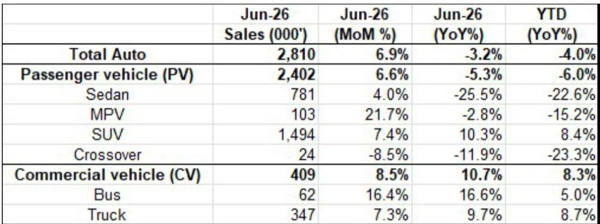
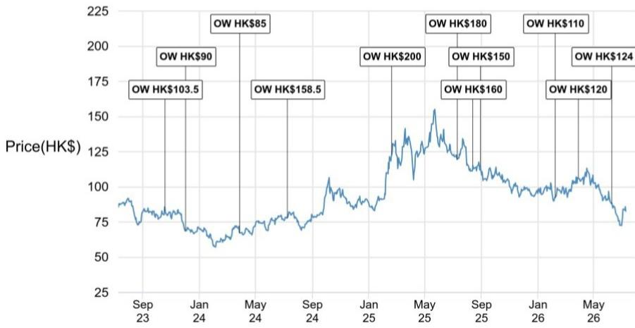

# 中国汽车产业观察：出口与欧洲市场份额的结构性增长

中国汽车产业在6月呈现出明显的分化态势。国内乘用车销量同比下降23%，而出口量则增长80%，达到创纪录的90万辆。MSCI中国汽车指数6月下跌19%，跌幅是MSCI中国指数（下跌8%）的两倍以上，市场正在重新评估一个现实：短期基本面几乎完全由出口驱动。对于观察者而言，这意味着该领域的估值基础取决于海外扩张的可持续性，而非尚不明朗的国内复苏。

国内市场的调整并非暂时现象。根据中国汽车工业协会数据，6月乘用车批发总销量为240万辆，尽管环比5月小幅回升7%，但同比仍下降5%。具体结构呈现明显分化：SUV销量同比增长10%，而轿车销量则下降26%。新能源汽车渗透率达到创纪录的63%，高于5月的61%，但这一里程碑是在国内整体市场收缩的背景下实现的。商用车板块是相对少见的相对亮点，同比增长10%，但其体量尚不足以抵消乘用车的拖累。

这种格局需要战略层面的重新审视。等待国内需求企稳后再做决策的观察者，可能会错过该领域最重要的转型：中国汽车制造商已不再仅仅是面向新兴市场的低成本制造商，他们正在成为欧洲——全球利润最高、要求最严苛的汽车市场——的真正竞争者。截至2026年5月的数据显示，中国品牌在欧洲新能源汽车注册量中的占比已从2025年的11%升至17%。仅5月单月，这一比例就达到19%。在五个最大的西欧经济体中，这一比例达到21%。这些并非由临时激励措施或车型换代带来的周期性增长。

## 中国品牌在欧洲市场份额加速增长，这一转变是结构性的，而非周期性的

欧洲的注册数据揭示了一个国内批发数据无法反映的故事。中国品牌在欧洲新能源汽车市场的份额已从2025年全年的约11%上升至2026年前五个月的17%。月度趋势更为明显：5月达到19%。就包括内燃机和混合动力车型在内的全部乘用车而言，中国品牌目前在欧洲市场约占10%的份额，在西欧五大经济体中约占11%。

支撑这一势头的有五个结构性驱动因素，且短期内均不可逆转。第一，中国新能源汽车的产品竞争力显著提升，在续航里程、软件集成和制造质量方面正接近或超越现有标准。第二，中国主机厂提供多种动力总成选项——纯电动、插电式混合动力、混合动力和内燃机——使其能够适应欧洲多样化的消费者偏好和监管环境。第三，车型推出周期更快，从概念到展厅的时间被压缩。第四，功能与价格的定位仍具吸引力：中国品牌在相同或更低的价格点上提供更高水平的标准配置和数字功能。第五，也是最重要的一点，海外市场的品牌接受度正在提高，这减少了中国汽车制造商为克服消费者疑虑而必须提供的折扣。

观察者应将欧洲市场份额的增长视为长期回报表现的最重要先行指标。欧洲是一个高利润市场，传统主机厂历史上在此产生了其全球利润的大部分。如果中国品牌能够维持15-20%的新能源汽车市场份额，并有可能进一步增长，其对盈利的影响将是深远的。市场目前对中国汽车公司的定价，似乎仍将其海外业务视为边缘利润来源。而数据表明，这些业务正成为核心。

## 插电式混合动力汽车是中国出口组合中的无声颠覆者，海外观察者低估了其发展轨迹

在中国出口激增的背景下，动力总成组合的变化速度超过了大多数市场参与者的认知。2026年前五个月，新能源汽车占乘用车总出口的52%，高于2024年全年的42%。但关键的次级趋势是插电式混合动力汽车的崛起。到2026年5月，插电式混合动力汽车占新能源汽车总出口的38%，而2024年1月这一比例仅为11%。这一增长是指数级的，而非线性的。

这一点之所以重要，是因为插电式混合动力汽车解决了海外市场对中国新能源汽车最持久的两个疑虑：续航焦虑和充电基础设施不足。插电式混合动力汽车为日常通勤提供电动驾驶，同时配备内燃机用于长途旅行，使其成为那些尚未准备好完全转向纯电动汽车的消费者更实用的过渡产品。在中国，插电式混合动力汽车的普及遵循了类似的S曲线，曾令那些将混合动力视为过渡性技术、认为其持久力有限的观察者感到意外。同样的模式现在正在出口领域上演。

对于个别主机厂而言，插电式混合动力汽车的转向正在重塑出口战略。比亚迪的出口组合历史上以纯电动汽车为主，现在越来越多地纳入插电式混合动力车型。吉利出口的动力总成构成也显示出类似的多元化趋势。对观察者而言，这意味着仅凭出口量增长会低估盈利潜力。由于电池含量较低，且在消费者看重双动力总成灵活性的市场中交易价格更高，插电式混合动力汽车通常比纯电动汽车具有更高的利润率。随着插电式混合动力汽车在出口量中的占比增大，每辆出口车辆的利润应会改善。

## 出口地理分布快速多元化，降低了对单一地区的依赖并增强了韧性

中国汽车出口故事中一个未被充分认识的发展是正在发生的地理分布多元化。2026年前五个月，欧洲占中国乘用车总出口的37%，成为最大的目的地。亚洲紧随其后，占30%，南美洲占17%。但总体数据掩盖了不同主机厂之间的显著差异，而这种差异揭示了战略上的分化。

上汽集团是最明显的以欧洲为中心的案例：欧洲在其出口中的份额从2024年的34%上升到2026年前五个月的46%。奇瑞和比亚迪也在向欧洲和南美洲倾斜，而亚洲的份额有所下降。吉利呈现出更均衡的图景：亚洲仍是其最大的地区，占37%，低于2025年的50%，而欧洲占28%，南美洲则从4%飙升至18%。长城汽车则朝着相反的方向发展，将欧洲在其海外销售中的份额从65%降至38%，同时增加了对亚洲和南美洲的敞口。

这种多元化在战略上很重要，原因有二。首先，它降低了对单一地区的依赖以及相关的政治风险。欧洲对中国电动汽车的关税政策仍不确定，任何不利变化都将对欧洲敞口集中的主机厂产生不成比例的影响。其次，这表明中国汽车制造商正在构建真正的全球分销网络，而不仅仅是利用暂时的出口机会。一个能够同时在欧洲、东南亚和南美洲取得成功的主机厂，已经展示了难以复制的综合能力。

对于观察者而言，关键问题不在于中国主机厂能否出口更多数量，而在于其地理分布是否使其能够无视任何单一地区的政策冲击而维持增长。当前数据支持这样一种观点：多元化的进展速度比共识预期的要快。

## 自主买方情绪指数与收窄的折扣为时机把握提供了决策框架

对中国汽车公司进行选择性关注的宏观依据建立在三个条件之上：国内乘用车市场企稳、定价与盈利纪律、以及出口的可持续性。基于人工智能驱动的数据，自主中国汽车买方情绪指数为第一个条件提供了实时检验。截至7月初，该指数仍低于第25百分位，表明买方兴趣持续低迷。从历史经验看，从这一低水平持续的方向性变动曾是有用的转折信号，但仅当与基本面催化剂（如新车型发布或行业销量数据）相结合时才有效。目前，尚未观察到此类催化剂。

令人鼓舞的对比点是定价。国内市场的平均价格折扣在第二季度稳步收窄，从3月初的17.5%降至6月底的15.7%。趋势是积极的，但相对水平仍然较高。如此幅度的折扣压缩了整个行业的利润率，表明竞争强度尚未恢复正常化。折扣收窄是该领域重新定价的必要条件，但并非充分条件。

这为观察者提供了一个清晰的决策框架。出口故事和欧洲市场份额的增长为关注特定主机厂提供了结构性依据。国内市场的疲软和低迷的情绪则带来了时机上的挑战。解决方案取决于8月中下旬即将到来的中期业绩报告季，届时盈利超出或低于预期的表现，将区分出哪些公司能够将出口增长转化为盈利能力，哪些不能。暂定于9月下旬举行的下一轮高层会晤，引入了一项二元政策风险：任何美国对中国汽车加征关税的行动，都将考验出口论点的韧性。

最审慎的做法是将当前的回落视为一个选择性关注的切入点，对象是那些展现出出口势头、海外竞争力提升以及盈利修正趋势积极的主机厂。一个广泛的领域性判断需要所有三个条件都有更清晰的证据。截至6月的数据支持前两个条件——出口可持续性已得到验证，定价正在企稳——但第三个条件，即国内需求企稳，仍未解决。在该条件得到满足之前，该领域的估值将仍与出口叙事挂钩，而这一叙事依然成立，但仅限于那些正在执行它的公司。

*仅供参考。部分内容可能基于源材料通过人工智能辅助生成、翻译、总结或编辑，可能存在遗漏或错误。请独立核实。本文不构成任何专业建议。*

仅供参考。部分内容可能基于源材料通过人工智能辅助生成、翻译、总结或编辑，可能存在遗漏或错误。请独立核实。本文不构成任何专业建议。

