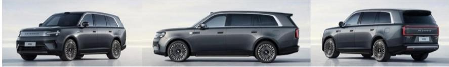
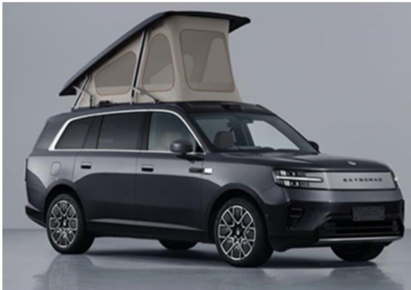
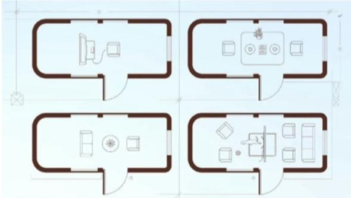

# Xiaomi Corp. (1810.HK)

Sharpening the scene ahead of SkyNomad launch and continued AI progress

On Jul 10, Xiaomi filed SkyNomad N70 & N90 models as part of its 2nd NEV series with China's Ministry of Industry and Information Technology (MIIT), which are positioned as intelligent, configurable and spacious SUVs that accommodate a range of use cases beyond solely family/business needs, and cater to different consumer demand from SU7/YU7 which focus on driving dynamics.

This kicked off a catalyst-rich 3Q as discussed in our Setting the Scene note, which we believe may provide a potential turnaround opportunity for the share price from both narrative and financial perspectives (share price +19% QTD vs. HSTECH +6%). Specifically, we highlight:

■ Multiple complementary variants to address broader demand: We see SkyNomad N90 as the flagship long wheelbase 5/7-seater and SkyNomad N70 as a standard wheelbase 5-seater catering to small families with a focus on urban agility, aiming for a high-value-for-money smart mobility experience. Size wise, SkyNomad N70 is comparable to Li Auto L6/L7 and Seres AITO M6/M7, while N90 is comparable to Li Auto L9, Seres AITO M9, Zeekr 9X, etc. Additionally, SkyNomad N90 Max provides innovative optional features such as a built-in rooftop tent which turns the SUV into a big camper (Exhibit 3).

Long range support, key value proposition to attract ICE consumers: SkyNomad carries a large-capacity battery (52/76kWh for N70 and 76kWh for N90) enabling a 265-370km range, the longest pure-electric range among its peer models, along with a 1.5T, 112kW range extender provided by Harbin Dongan Auto Engine (600178.SS, Not Covered). Despite a bigger battery capacity, vehicle weight of SkyNomad is comparable to peers, which we partially attribute to Xiaomi's innovative left-and-right split layout for EREV's front compartment to enhance structural safety and space utilization, which also reduces overall vehicle power consumption through lightweighting.

\- Intelligent and fully configurable interior, a refreshing feature on the new manufacturing platform: As per management, interior configuration including functionality and use scenarios is the starting point of SkyNomad vehicle design. SkyNomad features a flat floor with rails on which different equipment can slide, enabling seamless and intelligent interior space transformation. Xiaomi showcases various configurations (Exhibit 4) with a lie-flat bed, a workstation, a 2-person meeting setup, and four seats around a central table, among other possibilities.

What else are we looking for? We expect the official launch of SkyNomad by Aug-end and see below factors as critical to its success. 1) Mechanical durability of its configurable interior & EREV system; we draw confidence from Xiaomi's extensive road testing over the past two years and leading smart manufacturing capabilities; 2) Integration with Xiaomi's AIoT ecosystem; 3) PR/marketing strategy and competition pre-/post-launch; 4) Balance between order momentum and manufacturing capability ramp-up; we believe Xiaomi has enhanced abilities to smooth peak orders at initial launch and sustain healthy order volume post initial launch (e.g. SU7 new facelift) meanwhile scaling up manufacturing capacity.

GSe 240k volume in 2026E or 500k in the bull-case: As detailed in our prior note, we expect Xiaomi will likely price SkyNomad N70 at a competitive level as the volume anchor, to capture the entry-level premium space (e.g. starting from Rmb200k+) enabled by supply chain capabilities and more favorable battery costs, yet offer a wide pricing spectrum for higher-end complementary variants and features (e.g. N90 up to Rmb400-500k) to establish premium parity with peers. We model 110k/240k delivery volume in 2026E/27E for SkyNomad, with 2027E volume equivalent to $15\%$ of the 1.6mn+ SUV units (ex. BEVs) with starting prices at Rmb200-400k sold in 2025 (Exhibit 6); in our bull case, if Xiaomi is able to capture part of the trade-up/ICE demand from the mass market, we could see potential for c.500k volume in 2027 based on $10\%$ of the 5mn SUV units (ex. BEVs) with starting price from Rmb100-400k.

Apart from EV, we take confidence from recent AI developments at Xiaomi which we believe are underappreciated by the market. We estimate that MiMo might be at the run rate of c.6-7tn daily tokens currently led by coding and agentic tasks. While MiMo continues to push the efficiency frontiers of LLMs in terms of inference cost thanks to inference engineering optimization (e.g. MiMo-V3 may adopt a more aggressive 11:1 sparsity ratio), pricing power also emerges with V2.5-Pro-UltraSpeed that charges US\$1.3/US\$2.6 per mn input (cache miss)/output tokens (only cheaper than GLM-5.2 and Qwen3.7-Max), by offering 1k TPS throughput on standard commodity hardware. That said, we see Xiaomi's positioning within the LLM industry different from the LLM pure-plays, with its AI monetization strategy taking shape across to-C, to-B and in the physical world (details in our Setting the Scene note).

## SkyNomad: Intelligent, configurable and spacious SUV series

Exhibit 1: Comparable models to Xiaomi SkyNomad

<table><tr><td colspan="2">OEM</td><td colspan="2">Xiaomi SkyNomad</td><td colspan="4">AITO</td><td colspan="4">Li Auto</td><td colspan="2">NO</td><td colspan="2">Zeekr</td><td colspan="2">ONVO</td><td>Leapmotor</td></tr><tr><td colspan="2">5-seater SUV model</td><td>N70/N70 Max</td><td>N90 Max</td><td>M6</td><td>M7</td><td>M8</td><td>M9</td><td>L6</td><td>L7</td><td>L8</td><td>L9</td><td>E58</td><td>E59</td><td>BX</td><td>9X</td><td>L80</td><td>L90</td><td>D19</td></tr><tr><td>Launch</td><td>Model launch date</td><td>3Q26</td><td>3Q26</td><td>Apr-26</td><td>Jul-22</td><td>Apr-25</td><td>Dec-23</td><td>Apr-25</td><td>Jun-22</td><td>Sep-22</td><td>Sep-22</td><td>Dec-17</td><td>May-26</td><td>Apr-26</td><td>Sep-25</td><td>May-26</td><td>Jul-25</td><td>Apr-26</td></tr><tr><td>Power</td><td>Powertrain type</td><td>EREV</td><td>EREV</td><td>EREV/EV</td><td>EREV/BEV</td><td>EREV/BEV</td><td>EREV/BEV</td><td>EREV</td><td>EREV</td><td>EREV</td><td>EREV</td><td>BEV (Battery Swap)</td><td>BEV (Battery Swap)</td><td>PHEV</td><td>PHEV</td><td>BEV (Battery Swap)</td><td>BEV (Battery Swap)</td><td>EREV/BEV</td></tr><tr><td>Version</td><td># of version (ex. EV)</td><td>2</td><td>2</td><td>2</td><td>7</td><td>6</td><td>3</td><td>2</td><td>3</td><td>3</td><td>2</td><td>3</td><td>6</td><td>7</td><td>5</td><td>3</td><td>3</td><td>2</td></tr><tr><td>Price</td><td>Price range (Rmb k)</td><td>NA</td><td>NA</td><td>260 - 280</td><td>280 - 350</td><td>370 - 460</td><td>490 - 660</td><td>250 - 280</td><td>302 - 360</td><td>322 - 380</td><td>460 - 510</td><td>407 - 457</td><td>498 - 628</td><td>357 - 501</td><td>466 - 600</td><td>243 - 280</td><td>266 - 300</td><td>220 - 240</td></tr><tr><td rowspan="5">Size</td><td>Length (mm)</td><td>4.960</td><td>5.285</td><td>4.960</td><td>5.080</td><td>5.190</td><td>5.285/5.402</td><td>4.925</td><td>5.050</td><td>5.080</td><td>5.255</td><td>5.280</td><td>5.365</td><td>5.100</td><td>5.239</td><td>5.145</td><td>5.145</td><td>5.252</td></tr><tr><td>Width (mm)</td><td>1.998</td><td>1.998</td><td>1.985</td><td>1.999</td><td>1.999</td><td>2.026</td><td>1.960</td><td>1.995</td><td>1.995</td><td>2.000</td><td>2.010</td><td>2.029</td><td>1.998</td><td>2.019/2.029</td><td>1.998</td><td>1.998</td><td>1.995</td></tr><tr><td>Height (mm)</td><td>1765/1785</td><td>1825/1925</td><td>1.736</td><td>1.780</td><td>1.795</td><td>1.845</td><td>1.735</td><td>1.750</td><td>1.800</td><td>1.810</td><td>1.800</td><td>1.870</td><td>1.780</td><td>1.819</td><td>1.766</td><td>1.766</td><td>1.780</td></tr><tr><td>Wheelbase(mm)</td><td>2.950</td><td>3.080</td><td>2.950</td><td>3.030</td><td>3.105</td><td>3.125/3.236</td><td>2.920</td><td>3.005</td><td>3.005</td><td>3.125</td><td>3.130</td><td>3.250</td><td>3.069</td><td>3.169</td><td>3.110</td><td>3.110</td><td>3.110</td></tr><tr><td>Minimum turning radius (m)</td><td></td><td></td><td>5.5</td><td>5.8</td><td>5.9</td><td>5.1/5.2</td><td>5.9</td><td>5.9</td><td>5.9</td><td>5.3</td><td>5.7</td><td>5.4</td><td>5.9</td><td>6.0</td><td>5.7</td><td>5.7</td><td>6.2</td></tr><tr><td rowspan="7">Range</td><td>Battery type</td><td>LFP/NMC</td><td>NMC</td><td>LFP/NMC</td><td>LFP/NMC</td><td>LFP/NMC</td><td>NMC</td><td>LFP</td><td>NMC</td><td>NMC</td><td>NMC</td><td>NMC</td><td>NMC</td><td>NMC</td><td>NMC</td><td>NMC</td><td>NMC</td><td>LFP</td></tr><tr><td>Battery capacity (kWh)</td><td>52/76</td><td>76</td><td>37/53</td><td>37/53</td><td>37/53</td><td>60/75.4</td><td>37</td><td>43/52</td><td>43/52</td><td>72.7</td><td>102</td><td>102</td><td>55/70</td><td>55/70</td><td>85</td><td>85</td><td>64/80</td></tr><tr><td>Battery cell (brand)</td><td>Sunwoda/CALB</td><td>CALB</td><td>CATL</td><td>CATL</td><td>CATL</td><td>CATL</td><td>Sunwoda/CATL</td><td>Sunwoda/SVOLT/CATL</td><td>Sunwoda/CATL</td><td>CATL</td><td>CATL</td><td>CATL</td><td>CATL</td><td>CATL</td><td>CALB/CATL</td><td>CALB/CATL</td><td>CATL</td></tr><tr><td>Electric W.LTC (km)</td><td>265/270/375/380</td><td>363/370</td><td>180/260</td><td>175/265/255</td><td>170/255/246</td><td>280/355/310</td><td>182</td><td>190/240</td><td>190/235</td><td>350</td><td>635</td><td>620/600</td><td>257/328/256/268</td><td>235/230/302/280</td><td>615/570</td><td>600/570</td><td>400/500</td></tr><tr><td>Fuel consumption(L/100km)</td><td>5.7/5/8/6.1/6.2</td><td>6.26/6.28</td><td>6.1</td><td>6.2/6.5</td><td>6.6</td><td>6.9/7.3</td><td>6.9</td><td>7.4</td><td>6.2/6.3</td><td>6.3/6.4</td><td></td><td></td><td>6.43/6.45/6.49/7.45</td><td>6.78/6.98/7.1/7.45</td><td></td><td></td><td>6.6/6.7</td></tr><tr><td>Total W.LTC (km)</td><td>NA</td><td>NA</td><td>1,285/1,425</td><td>1,345/1,500/1.435</td><td>1,250/1,375/1.326</td><td>1,345/1,405/1.260</td><td>1,160</td><td>1,135/1,185</td><td>1,135/1,180</td><td>1370.00</td><td>635</td><td>620/600</td><td>1,152/1,205/1,148/1,037</td><td>1,200/1,160/1,250/1,165</td><td>615/570</td><td>600/570</td><td>1,050/972</td></tr><tr><td>Curb weight (kg)</td><td>2453/2505/2561/2610</td><td>2800/2840</td><td>2,545/2,565</td><td>2,600/2,540/2.615</td><td>2,695/2,715</td><td>2,920/2,995/3.200</td><td>2,330/2,345</td><td>2,460/2,500</td><td>2,490/2,530</td><td>2,755/2,835</td><td>2,630</td><td>2,845/2,915</td><td>2,260/2,790/2,730/2,870</td><td>2,840/2,970/3,045/3150</td><td>2,250/2,270/2.360</td><td>2,300/2,385</td><td>2,635/2,740</td></tr><tr><td rowspan="7">Performance</td><td>Range extender brand</td><td>DAAE</td><td>DAAE</td><td>Seres</td><td>Seres</td><td>Seres</td><td>Seres</td><td>Li Auto &amp; Xinchen Power</td><td>Li Auto &amp; Xinchen Power</td><td>Li Auto &amp; Xinchen Power</td><td>Li Auto &amp; Xinchen Power</td><td>NA</td><td>NA</td><td>Geely</td><td>Geely</td><td>NA</td><td>NA</td><td>Horse Powertrain (Geely &amp; Renault)</td></tr><tr><td>Range extender displacement (T)</td><td>1.5T</td><td>1.5T</td><td>1.5T</td><td>1.5T</td><td>1.5T</td><td>1.5T/2.0T</td><td>1.5T</td><td>1.5T</td><td>1.5T</td><td>1.5T</td><td>NA</td><td>NA</td><td>2.0T</td><td>2.0T</td><td>NA</td><td>NA</td><td>1.5T</td></tr><tr><td>Range extender max power (kW)</td><td>112</td><td>112</td><td>112</td><td>118</td><td>118</td><td>118/133</td><td>113</td><td>113</td><td>113</td><td>115</td><td>NA</td><td>NA</td><td>205</td><td>205</td><td>NA</td><td>NA</td><td>95</td></tr><tr><td>Electric motor max power (kW)</td><td>210/320</td><td>320</td><td>345</td><td>227/392</td><td>227/392</td><td>497/664</td><td>300</td><td>330</td><td>330</td><td>420</td><td>520</td><td>520</td><td>660/1,030</td><td>660/1,030</td><td>340/440</td><td>340/440</td><td>300</td></tr><tr><td># of electric motors</td><td>1/2</td><td>1/2</td><td>2</td><td>1/2</td><td>1/2</td><td>2/3</td><td>2</td><td>2</td><td>2</td><td>2</td><td>2</td><td>2</td><td>2/3</td><td>2/3</td><td>1/2</td><td>1/2</td><td>2</td></tr><tr><td>Maximum speed (km/h)</td><td>190</td><td>190</td><td>200</td><td>190/200</td><td>190/200</td><td>220/251</td><td>180</td><td>180</td><td>180</td><td>200</td><td>220</td><td>220</td><td>220/230</td><td>240</td><td>200</td><td>200</td><td>180</td></tr><tr><td>0-100km/h acceleration time (s)</td><td>NA</td><td>NA</td><td>5.2</td><td>8.2/5/5.1</td><td>5.3/5.2</td><td>4.5/4.6/3.99</td><td>5.4</td><td>5.3</td><td>5.3</td><td>4.9</td><td>4.0</td><td>4.3</td><td>3.7/2.96</td><td>3.9/4.2/3.1</td><td>5.7/4.5</td><td>5.9/4.7</td><td>6.0</td></tr><tr><td rowspan="3">Volume</td><td>LTM retail volume (May 26)</td><td></td><td></td><td>23.037</td><td>152.875</td><td>163.799</td><td>85.769</td><td>115.231</td><td>$3.704</td><td>25.543</td><td>30.170</td><td>114.111</td><td>3.108</td><td>8.281</td><td>61.965</td><td>5.949</td><td>55.662</td><td>11.476</td></tr><tr><td>LTM annualized retail volume (May 26)</td><td></td><td></td><td>92.148</td><td>152.875</td><td>163.799</td><td>85.769</td><td>115.231</td><td>$3.704</td><td>25.543</td><td>30.170</td><td>114.111</td><td>37.296</td><td>33.124</td><td>82.620</td><td>71.388</td><td>68.794</td><td>68.856</td></tr><tr><td>LTM peak monthly retail volume (May 26)</td><td></td><td></td><td>18.148</td><td>29.368</td><td>21.564</td><td>13.718</td><td>16.471</td><td>8.273</td><td>4.338</td><td>4.893</td><td>22.258</td><td>3.108</td><td>6.103</td><td>10.060</td><td>5.949</td><td>11.722</td><td>7.021</td></tr></table>

Source: Company data, Autohome, Data compiled by GS Global Investment Research

Exhibit 2: Exterior design of Xiaomi SkyNomad N90  
  
Source: Company data  
Exhibit 3: Xiaomi SkyNomad N90 Max features a built-in pop-up rooftop tent

  
Source: Company data

Exhibit 4: SkyNomad offers configurable layouts which could act as a studio, a cafe, a meeting room and a living room

Fully configurable layout for SkyNomad

  
Source: Company data

Exhibit 5: SUV models with starting prices at Rmb200-400k sold 3.2mn units in 2025, representing $27\% / 13\%$ of China's SUV/auto retail volume

<table><tr><td colspan="2">Volume by starting price (mn)</td><td>2024</td><td colspan="5">2025</td><td colspan="5">Jan-May 2026</td></tr><tr><td>Model type</td><td>Powertrain</td><td>Total</td><td colspan="5">&lt;Rmb100k Rmb100-200k Rmb200-300k Rmb300-400k Total</td><td colspan="5">&lt;Rmb100k Rmb100-200k Rmb200-300k Rmb300-400k Total</td></tr><tr><td rowspan="3">Sedan</td><td>NEV</td><td>5.1</td><td>3.8</td><td>1.3</td><td>0.8</td><td>0.0</td><td>6.0</td><td>0.8</td><td>0.4</td><td>0.2</td><td>0.0</td><td>1.4</td></tr><tr><td>ICE</td><td>5.4</td><td>1.9</td><td>1.8</td><td>0.6</td><td>0.5</td><td>4.8</td><td>0.6</td><td>0.5</td><td>0.2</td><td>0.2</td><td>1.4</td></tr><tr><td>Subtotal</td><td>10.4</td><td>5.7</td><td>3.1</td><td>1.4</td><td>0.5</td><td>10.8</td><td>1.4</td><td>0.9</td><td>0.4</td><td>0.2</td><td>2.9</td></tr><tr><td rowspan="4">SUV</td><td>NEV</td><td>4.9</td><td>0.6</td><td>3.0</td><td>1.7</td><td>0.5</td><td>6.1</td><td>0.2</td><td>0.9</td><td>0.6</td><td>0.1</td><td>2.1</td></tr><tr><td>EREV</td><td>1.1</td><td>0.0</td><td>0.2</td><td>0.4</td><td>0.3</td><td>1.1</td><td>0.0</td><td>0.1</td><td>0.1</td><td>0.1</td><td>0.3</td></tr><tr><td>ICE</td><td>6.3</td><td>1.4</td><td>3.2</td><td>0.4</td><td>0.5</td><td>5.6</td><td>0.5</td><td>1.0</td><td>0.1</td><td>0.2</td><td>1.8</td></tr><tr><td>Subtotal</td><td>11.2</td><td>2.0</td><td>6.2</td><td>2.2</td><td>1.0</td><td>11.8</td><td>0.7</td><td>1.9</td><td>0.8</td><td>0.3</td><td>3.8</td></tr><tr><td rowspan="3">MPV</td><td>NEV</td><td>0.4</td><td>0.0</td><td>0.1</td><td>0.2</td><td>0.2</td><td>0.5</td><td>0.0</td><td>0.0</td><td>0.0</td><td>0.1</td><td>0.2</td></tr><tr><td>ICE</td><td>0.7</td><td>0.2</td><td>0.1</td><td>0.3</td><td>0.0</td><td>0.6</td><td>0.1</td><td>0.0</td><td>0.1</td><td>0.0</td><td>0.2</td></tr><tr><td>Subtotal</td><td>1.1</td><td>0.2</td><td>0.1</td><td>0.4</td><td>0.2</td><td>1.1</td><td>0.1</td><td>0.1</td><td>0.1</td><td>0.1</td><td>0.3</td></tr><tr><td rowspan="3">Total</td><td>NEV</td><td>10.3</td><td>4.4</td><td>4.4</td><td>2.7</td><td>0.7</td><td>12.6</td><td>1.1</td><td>1.3</td><td>0.9</td><td>0.2</td><td>3.7</td></tr><tr><td>ICE</td><td>12.4</td><td>3.5</td><td>5.1</td><td>1.3</td><td>1.0</td><td>11.0</td><td>1.1</td><td>1.5</td><td>0.4</td><td>0.3</td><td>3.4</td></tr><tr><td>Grand total</td><td>22.7</td><td>7.9</td><td>9.5</td><td>4.0</td><td>1.7</td><td>23.6</td><td>2.2</td><td>2.8</td><td>1.3</td><td>0.5</td><td>7.0</td></tr></table>

<table><tr><td colspan="2">Volume yoy (%)</td><td>2024</td><td colspan="6">2025</td><td colspan="6">Jan-May 2026</td></tr><tr><td>Model type</td><td>Powertrain</td><td>Total</td><td colspan="6">&lt;Rmb100k Rmb100-200k Rmb200-300k Rmb300-400k Total</td><td colspan="6">&lt;Rmb100k Rmb100-200k Rmb200-300k Rmb300-400k Total</td></tr><tr><td rowspan="3">Sedan</td><td>NEV</td><td>49%</td><td>18%</td><td>22%</td><td>46%</td><td>-74%</td><td>19%</td><td>-37%</td><td>-22%</td><td>-35%</td><td>97%</td><td>-33%</td><td></td><td></td></tr><tr><td>ICE</td><td>-21%</td><td>-13%</td><td>-13%</td><td>-27%</td><td>66%</td><td>-11%</td><td>-27%</td><td>-27%</td><td>-18%</td><td>-14%</td><td>-25%</td><td></td><td></td></tr><tr><td>Subtotal</td><td>2%</td><td>5%</td><td>-1%</td><td>4%</td><td>10%</td><td>3%</td><td>-33%</td><td>-25%</td><td>-29%</td><td>-8%</td><td>-29%</td><td></td><td></td></tr><tr><td rowspan="3">SUV</td><td>NEV</td><td>42%</td><td>50%</td><td>20%</td><td>36%</td><td>27%</td><td>25%</td><td>24%</td><td>-18%</td><td>29%</td><td>-22%</td><td>1%</td><td></td><td></td></tr><tr><td>ICE</td><td>-4%</td><td>-9%</td><td>-7%</td><td>-31%</td><td>-13%</td><td>-11%</td><td>-17%</td><td>-25%</td><td>-26%</td><td>-18%</td><td>-22%</td><td></td><td></td></tr><tr><td>Subtotal</td><td>12%</td><td>4%</td><td>4%</td><td>14%</td><td>3%</td><td>5%</td><td>-6%</td><td>-22%</td><td>14%</td><td>-20%</td><td>-11%</td><td></td><td></td></tr><tr><td rowspan="3">MPV</td><td>NEV</td><td>53%</td><td>6395%</td><td>10%</td><td>96%</td><td>3%</td><td>33%</td><td>12%</td><td>-7%</td><td>27%</td><td>-30%</td><td>-7%</td><td></td><td></td></tr><tr><td>ICE</td><td>-16%</td><td>-29%</td><td
