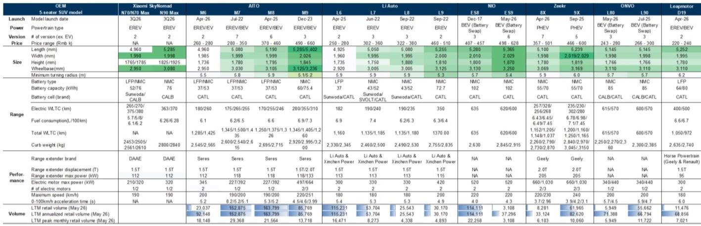
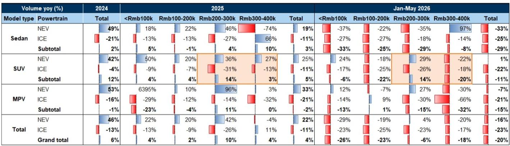
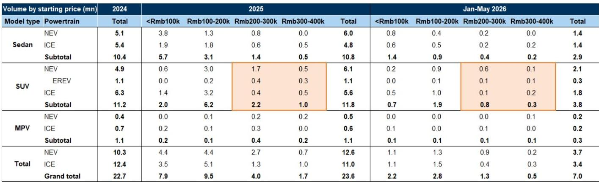

# 小米SkyNomad发布：从性能细分到大众市场SUV的战略拓展，开启第二增长曲线

7月10日，小米向工信部提交了其第二款新能源车型——SkyNomad N70和N90的申报信息。这一申报远不止是产品线的更新，它标志着公司从单一车型、性能导向的电动车策略，向多车型、面向大众市场的SUV产品矩阵的战略转变，目标直指中国汽车市场中规模最大、竞争最激烈的细分领域。这一时间节点具有关键意义。小米的报价在当季已较恒生科技指数有更明显的表现，显示市场正在逐步消化这一叙事转变。但真正的机会在于理解SkyNomad的架构、定位和生态整合如何构建出与SU7截然不同的竞争态势。

核心逻辑清晰：小米并非仅仅增加第二款车型，而是在构建一个产品家族，旨在覆盖20万至50万人民币的价格区间，瞄准该区间内年销量超过160万辆的SUV市场。如果成功，这一策略可能将小米从一个小众的电动车新进入者，转变为中国高端SUV市场的重要参与者，并对其收入结构、利润率表现和市场定价产生深远影响。该报告模型预测，到2027年，SkyNomad的交付量将达到24万辆，乐观情景下，若小米能有效吸引传统燃油车用户的升级需求，这一数字可达50万辆。理解这些数字背后的机制，需要深入分析产品结构、电池与续航策略、内饰创新以及被低估的人工智能变现潜力。

## 双车型SUV架构构建清晰价格阶梯，同时覆盖入门级高端与旗舰需求

小米的SkyNomad系列并非单一车型的配置变体，而是一个双平台策略，各自承担明确的市场角色。N70是一款标准轴距、五座SUV，尺寸与理想L6、L7以及赛力斯问界M6、M7相当。它被定位为销量基石，面向小家庭用户，强调城市灵活性和高性价比。N90则是一款长轴距、五/七座旗舰车型，对标理想L9、问界M9和极氪9X。这种结构使小米能够在广泛的价格区间内竞争，而不会稀释品牌定位。报告显示，N70的起售价可能在20万人民币左右，而N90 Max版本可能达到40万至50万人民币。这一价格阶梯至关重要，因为它使小米能够同时吸引大众市场的升级用户和高端客户，这一策略在理想汽车构建其L系列产品线时已被证明是有效的。

这种方法的重要意义在于，它避免了单一车型依赖的风险。SU7证明了小米有能力设计和营销一款有吸引力的性能轿车，但轿车在中国高端电动车市场中占比较小。SUV，尤其是增程式电动车，主导了增长曲线。通过在同一代产品中推出两款不同的SUV平台，小米有效地对冲了销量风险，同时最大化其可触达的市场范围。N70瞄准了市场中最核心、销量最大的部分，而N90则在该品牌在更高价位区间建立能力，产生光环效应，惠及整个产品线。

## 同级最长纯电续航的增程动力系统，直接回应燃油车用户转换需求

SkyNomad申报信息中一个战略意义重大的规格是电池容量。N70提供52千瓦时和76千瓦时两种选择，而N90则使用76千瓦时电池包。这些电池支持265至370公里的纯电续航，报告指出这是同级竞品中最长的。这并非一项简单的工程成就。它直接回应了燃油车用户转向电动车的主要障碍：里程焦虑。通过提供覆盖绝大多数日常通勤需求的纯电续航，小米将SkyNomad定位为一款日常通勤可作为纯电车使用，长途旅行则依靠来自哈尔滨东安汽车发动机的1.5T、112千瓦增程器的车型。

增程器策略在中国已相当成熟，由理想汽车率先采用。但小米的方法有两个不同之处。首先，更大的电池容量意味着车辆在纯电模式下运行时间更长，这降低了使用成本并改善了用户体验。其次，报告指出，尽管电池更大，但得益于创新的前舱布局和结构轻量化，车辆重量与同级竞品相当。这种重量效率是一个真正的工程差异化优势，因为它降低了整体能耗并改善了驾驶动态。对于一家进入第二个电动车产品周期的公司而言，在提供更优续航的同时实现与成熟厂商的重量持平，是制造能力成熟的有力信号。

对观察者而言，这意味着SkyNomad并非一个简单的跟随型增程式电动车。它是一个旨在通过消除阻碍燃油车用户转换的关键妥协点来吸引他们的产品。报告模型预测，SkyNomad在2026年的交付量为11万辆，2027年为24万辆，这大约相当于2025年20万至40万价格区间内超过160万辆非纯电SUV销量的15%。在乐观情景下，如果能在10万至40万价格区间的500万辆非纯电SUV市场中占据10%的份额，则销量可达50万辆。如果续航优势和定价具有吸引力，这些目标是雄心勃勃但并非不合理的。

## 配备滑轨系统的可配置内饰，代表车辆使用场景多功能性的范式转变，而非仅仅是功能

SkyNomad与竞品的区别不仅在于续航或价格，更在于对内部空间的根本性重新思考。据管理层介绍，内饰配置是车辆设计的起点。SkyNomad采用带有集成滑轨的纯平地板，不同设备可在滑轨上移动，实现多种使用场景的无缝切换。报告列出的配置包括：平躺床、工作站、双人会议模式以及围绕中央桌的四座布局。这并非噱头，而是一项深思熟虑的策略，旨在将车辆的应用场景从通勤和家庭运输扩展到移动办公、露营和社交场合。

这种方法具有直接的战略逻辑。中国的SUV市场竞争日益激烈，来自理想、问界、极氪、蔚来乐道和零跑等品牌的产品都在争夺同一客户群体。仅凭驾驶动态进行差异化越来越困难，尤其对于新进入者而言。通过提供可重新配置的内饰，小米创造了一个竞品难以轻易复制的使用场景优势，除非他们重新设计整个平台架构。N90 Max可选配的车顶帐篷进一步延伸了这一逻辑，将SUV转变为户外爱好者的露营车。这是一种巧妙的方式，可以吸引那些原本可能考虑专用露营车或传统汽车制造商大型SUV的生活方式买家。

这里的风险在于机械耐久性。带有多个可配置模块的滑轨系统引入了固定内饰所没有的复杂性和潜在故障点。报告承认了这一点，指出可配置内饰和增程系统的机械耐久性是关键成功因素之一。然而，报告从小米过去两年广泛的道路测试及其领先的智能制造能力中获得了信心。如果小米能够提供耐用、可靠的可配置内饰，它将拥有一个竞品难以快速复制的真正产品护城河。

## 小米的人工智能变现路径与纯大模型公司有结构性差异，市场低估其物理世界整合能力

除了汽车叙事，报告还强调了小米价值中一个常被忽视的驱动因素：其人工智能能力，特别是MiMo大语言模型。据估计，MiMo每日处理的token量已达6至7万亿，主要由编码和智能体任务驱动，这表明其规模可与专业人工智能公司媲美。但战略重点不在于原始的token量，而在于变现路径。小米并非一家必须完全依赖API定价或订阅收入的纯大模型公司。其人工智能变现策略涵盖三个不同的渠道：面向消费者、面向企业，以及通过其物联网和汽车生态系统实现的物理世界整合。

报告指出，MiMo-V3可能采用更激进的11:1稀疏率，进一步推动推理成本效率，而V2.5-Pro-UltraSpeed模型在标准商用硬件上已可实现每秒1000 token的吞吐量。以每百万输入token 1.3美元（缓存未命中）和每百万输出token 2.6美元的定价，MiMo与中国领先模型相比具有竞争力，仅比GLM-5.2和Qwen3.7-Max便宜。但真正的杠杆作用来自于将这种人工智能嵌入小米的产品中。例如，SkyNomad的智能内饰几乎肯定会与小米的AIoT生态系统整合，在智能手机、家居设备和车辆之间创造无缝体验。这是任何传统汽车制造商或纯人工智能公司都无法复制的竞争优势。

对于观察者而言，这意味着小米的电动车业务不应仅基于汽车利润率来评估。人工智能和生态整合创造了更高的客户生命周期价值、经常性软件收入和网络数据效应的潜力。市场历来难以评估小米的人工智能能力，因为其变现是间接的。但随着SkyNomad的发布和整合变得可见，这一被低估的资产可能成为价值重估的重要驱动力。

## 评估SkyNomad商业可行性的四维决策框架

对于评估小米第二个电动车产品周期的读者，以下框架综合了决定SkyNomad能否达到、超越或低于模型预测的2027年24万辆销量目标的关键因素。

第一个维度是产品市场契合度与定价纪律。20万至50万人民币的价格区间虽然拥挤，但也是中国最大的高端SUV细分市场。小米必须避免为了获取市场份额而过度低价竞争，这会压缩利润率并损害品牌定位。报告建议将N70的起售价定在具有竞争力的水平作为销量基石，并为高端版本设定更宽的价格范围，这是正确的方法。关键观察点在于，小米能否在订单势头较强的初始发布阶段保持定价纪律。

第二个维度是制造产能爬坡与订单平滑。SU7的发布表明小米能够产生强劲的初始需求，但在发布后维持健康的订单量同时扩大产能，则是一个不同的挑战。报告指出，小米已增强了在初始发布时平滑峰值订单的能力，并以SU7改款为例证。关键问题在于，SkyNomad的双平台策略是否会拉紧制造产能，还是能创造运营杠杆。鉴于模型预测2027年交付24万辆，从2026年的11万辆爬坡意味着一个重大的规模化挑战。观察者应将交付节奏和等待时间作为领先指标进行跟踪。

第三个维度是生态整合与软件粘性。SkyNomad的可配置内饰是一个硬件特性，但其长期价值取决于软件支持的应用场景。与MiMo及更广泛的AIoT生态系统的整合，将决定该车辆是成为经常性收入的平台，还是一次性销售。报告对人工智能发展的强调表明，小米将车辆视为更大生态系统中的一个节点，而非独立产品。这一策略的成功将体现在可选配置的选装率、软件订阅采用率以及跨设备互动指标上。

第四个维度是竞争反应与市场份额动态。报告将SkyNomad与理想、问界、极氪、乐道和零跑等品牌的车型进行了比较。这些并非静态的竞争对手。他们将通过价格调整、功能升级和新车型发布来回应小米的进入。报告乐观情景下的50万辆销量，假设小米在一个500万辆的市场中占据10%的份额。这只有在小米的产品优势得以维持，且竞争对手未能通过激进的反制措施削弱它的情况下才可能实现。发布后的前六个月将是确立SkyNomad竞争地位的关键时期。

## 电动车销量爬坡与人工智能变现的结合，创造了当前估值尚未充分反映的复合增长轨迹

报告的财务预测显示，收入将从2025年的4570亿人民币增长至2028年的6700亿人民币，EBITDA从2026年预计的366亿人民币低谷恢复至2028年的610亿人民币。每股收益轨迹类似，从2025年的1.47元降至2026年的1.02元，然后反弹至2028年的1.73元。这些数字反映了电动车业务的投入阶段，即初始生产爬坡在规模效应显现之前压低了利润率。市盈率从2025年的30.6倍压缩至2026年的21.9倍，再到2028年的13.0倍，表明市场已在为复苏定价。

但这种估值可能尚未完全捕捉到电动车销量增长和人工智能变现的复合效应。如果SkyNomad在2027年达到24万辆的目标，并且MiMo继续扩大其token量和定价能力，收入结构将随时间推移转向利润率更高的软件和生态系统收入。报告预测的EBITDA利润率从2025年的12.4%降至2028年的9.1%，对于一个拥有不断增长的人工智能和服务收入的公司而言，似乎较为保守。如果小米能够证明电动车业务并非资本密集型负担，而是生态系统变现的平台，那么估值倍数的扩张可能是显著的。

这一论点的主要风险在于执行。可配置内饰的耐久性、制造产能爬坡以及竞争反应都是未知数。但战略方向是明确的。小米正在构建一个产品架构，利用其在人工智能、制造和生态整合方面的优势，在中国汽车市场最大的细分领域进行竞争。SkyNomad将是检验这一策略能否大规模奏效的车型。未来十二个月将给出答案。

*仅供参考。部分内容可能基于源材料通过人工智能辅助生成、翻译、总结或编辑，可能存在遗漏或错误。请独立核实。本文不构成任何专业建议。*

仅供参考。部分内容可能基于源材料通过人工智能辅助生成、翻译、总结或编辑，可能存在遗漏或错误。请独立核实。本文不构成任何专业建议。

