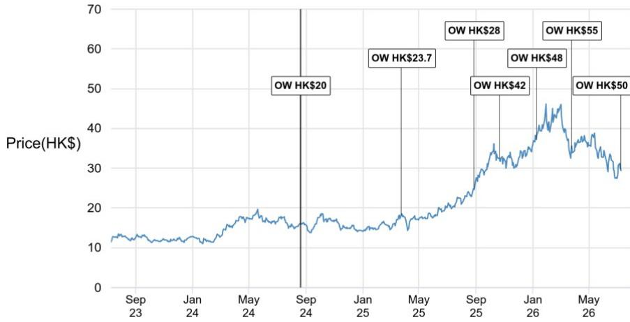
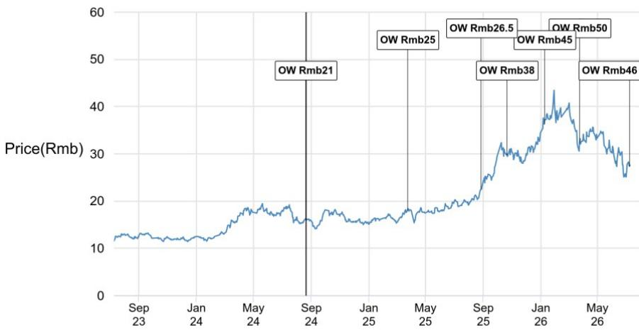
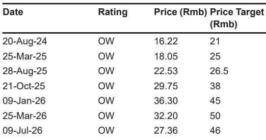

# JPM：紫金矿业与紫金黄金业绩分化，铜金双主线逻辑未变

紫金矿业发布2026年上半年业绩预告，第二季度核心净利润约194亿元，环比增长5%，同比增长66%，但低于JPM此前预期的215亿元。紫金矿业和紫金黄金国际的业绩均低于预期，主要原因是金价环比下跌9%、铜金产量完成率不足50%，以及成本上升。但JPM仍将紫金矿业列为行业首选，核心逻辑是大部分产量爬坡集中在2026年下半年。

这份报告提供了一个观察窗口：当一家资源巨头的产量节奏与市场预期出现错位时，真正的判断依据不是单季度的利润偏差，而是下半年能否兑现产量指引。

## 1. 产量完成率不足50%，但下半年才是关键

上半年紫金矿业黄金产量47吨、铜产量53.4万吨、锂产量4.3万吨，分别只完成JPM全年预期的42%、48%和35%。紫金黄金的矿产金产量约27吨，完成全年预期的45%。产量释放慢于预期，是业绩低于预期的主要驱动因素之一。

但报告同时指出，这种节奏并非异常。紫金矿业历史上产量往往集中在下半年释放，而紫金黄金的Manono锂矿项目预计在2026年下半年贡献更明显的产量。因此，上半年完成率偏低本身并不构成趋势反转的信号，关键在于下半年能否加速追赶。

> **KC评论：** 资源类公司的产量季节性分布是常见现象，但读者往往对“低于50%”这个数字反应过度。真正需要关注的是下半年产量能否达到全年指引的55%以上，以及成本端是否出现结构性上升。

## 2. 成本上升是另一个影响，但信息仍不完整

紫金黄金的业绩偏差还受到成本上升的影响，主要是柴油和特许权使用费。报告指出，公司尚未提供详细的成本上升信息，市场需要等待管理层对2026年剩余时间成本走势的进一步指引。

成本不确定性在资源行业并不罕见，但这里的关键变量是：成本上升是暂时的（如柴油价格波动），还是结构性的（如矿山品位下降或开采难度增加）。报告没有给出明确判断，这意味着成本端的透明度将是后续市场定价的重要变量。

## 3. 市场预期可能面临修正，但方向不同

JPM认为，紫金矿业的盈利预期可能保持平稳，而紫金黄金的盈利预期可能面临下调。原因有三：产量完成率低于50%、金价受利率预期变化和地缘政治不确定性压制、生产成本走势不确定。

这意味着两家公司的市场定价逻辑可能出现分化。紫金矿业作为铜金双主线标的，铜价供给偏紧的逻辑依然成立，而紫金黄金更依赖金价和成本控制，面临的修正不确定性更大。

## 4. 可复用的观察框架：产量节奏、成本透明度、价格趋势

对于资源类公司的业绩跟踪，这份报告提供了一个三层判断框架：第一层是产量节奏是否在历史季节性范围内，第二层是成本上升是暂时还是结构性，第三层是商品价格趋势是否支持下半年盈利修复。三个变量叠加，才能判断单季度的业绩偏差是噪音还是趋势信号。

紫金矿业和紫金黄金的案例说明，当产量完成率低于50%时，不能简单归因于“低于预期”，而要看下半年的追赶能力、成本走势和商品价格环境。这三个维度中，只要有两个方向向好，单季度的偏差就可能是买入窗口而非卖出信号。

For informational purposes only. Portions may be generated,translated,summarized,or edited with AI assistance based on source materials and may contain omissions or errors. Please verify independently. This is not investment,legal,tax,accounting,or other professional advice.

For informational purposes only. Portions may be generated,translated,summarized,or edited with AI assistance based on source materials and may contain omissions or errors. Please verify independently. This is not investment,legal,tax,accounting,or other professional advice.
