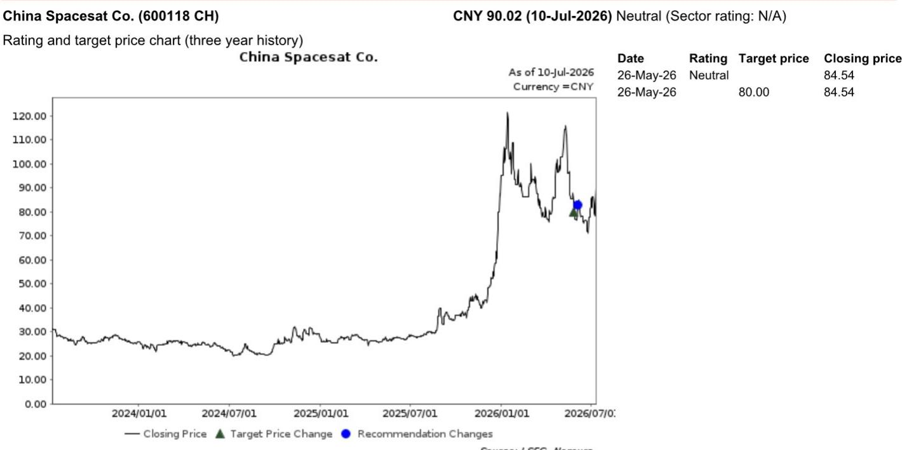
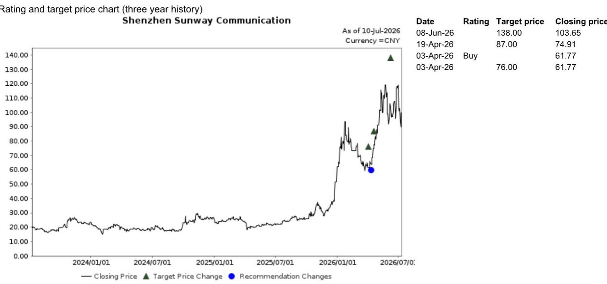

# China’s Net-Catch Rocket Recovery Is Not a Technical Novelty—It Is a Cost Inflection That Reshapes the Satellite Industry

On 10 July 2026,the Long March 10B lifted off from Hainan,and six minutes after stage separation,its first stage executed a controlled vertical return and was caught in a net aboard a purpose-built 25,000-tonne recovery vessel named Navigator. This was China’s first controlled recovery of an orbital launcher’s first stage and the world’s first net-system rocket capture. The event matters not because China has demonstrated a new way to bring a booster back—it matters because it closes the technology gap with the United States and opens a cost trajectory that will restructure the domestic launch market and accelerate the two national satellite constellation projects,Guowang and Qianfan.

The net-catch method is not a gimmick. It replaces landing legs—typically several tonnes of dead weight—with hooks on the airframe,recovering payload capacity that legged landings sacrifice. It also relaxes landing-precision requirements compared with tower-based chopstick capture. The vessel’s mobility means the recovery can occur downrange along the flight path,incurring far smaller payload penalties than return-to-launch-site operations. For a country with coastal launch sites and an inland geography that forced earlier efforts toward land recovery,this is a more creative and practical route than copying the Falcon 9 droneship model.

But the strategic significance of the LM-10B mission extends beyond engineering. The real question for investors is whether China can now move from single-mission recovery to high-cadence reliable reuse—a capability that SpaceX only industrialised after 2020,five years after its first successful booster landing. The answer will determine how quickly per-kilogram launch costs fall,which firms survive the coming shakeout,and whether the constellation build-out meets its deployment timelines.

## The Net-Catch Route Solves a Structural Problem That Legged Landings Cannot Fix at Scale for China’s Geography

Rocket recovery targets reuse of the first stage,which accounts for roughly 60-65% of total vehicle cost. The mainstream technology routes are legged vertical landing on land or droneships,parachute-and-splashdown,tower chopstick capture,and now net-system capture. Each has a trade-off between payload penalty,landing precision,and operational safety. Legged landings require the booster to carry several tonnes of landing gear that never contributes to ascent performance. Parachute splashdown exposes the stage to saltwater corrosion. Tower capture demands extreme precision and a fixed infrastructure that limits recovery to a single location.

The net-catch approach shifts the buffer structures from the rocket to the vessel. The booster carries only hooks;the vessel carries the net and the damping system. That saves mass on the vehicle,increasing payload fraction by an estimated 10-15% relative to a legged design. More importantly,the vessel’s mobility means the recovery point can be positioned downrange along the flight path,which is critical for coastal launch sites like Hainan. A downrange recovery imposes a much smaller payload penalty than a return-to-launch-site maneuver because the booster does not have to reverse its velocity vector.

China’s geography makes this advantage decisive. Inland launch sites force land recovery,which is safer but imposes the full payload penalty of a boost-back burn. Coastal sites favor sea recovery,but a rolling deck challenges legged landings—a weakness the net system avoids. The net-catch method is therefore not an eccentric choice;it is the most rational engineering solution for China’s specific launch infrastructure. Vertical takeoff and landing trials in China began in 2019,and by 2025,CASC,LandSpace,i-Space,and peers had moved into engineering flight validation. The LM-10B mission is the culmination of that progression,but it is also the beginning of a new phase:scaling recovery from a demonstration to a routine operation.

## The Remaining Gap Is Not Single-Mission Recovery but High-Cadence Reliable Reuse,a Capability SpaceX Only Industrialised After Five Years of Operational Experience

SpaceX remains the benchmark for rocket reuse. Its S-1 filing discloses approximately 620 Falcon 9 launches with over 99% mission success,and boosters have been reflown up to 34 times,with qualification now extended to 40 flights. Falcon 9’s payload fraction of about 4.2% compares with 1.8-3.0% for global peers. The new Raptor-3 engine delivers roughly 250 tonnes of thrust per engine at about 1.5 tonnes weight,yielding a thrust-to-weight ratio of approximately 164,with chamber pressure above 30 MPa versus roughly 10 MPa typical of domestic Chinese engines.

By these metrics,China is roughly 10 years behind. SpaceX landed its first booster on land in 2015 and at sea in 2016. The LM-10B net catch in July 2026 is China’s first controlled recovery of an orbital launcher’s first stage. Views among industry participants split on whether the gap is narrowing or widening. Some argue that validated technical routes compress the catch-up period because China does not need to invent the concept of reuse—only to engineer it for domestic conditions. Others point out that SpaceX’s costlier,faster iteration cycle,enabled by a private-company governance structure and a captive demand source in Starlink,is pulling away faster than China can follow.

The more precise framing is that the gap is not about the first recovery but about the tenth,the fiftieth,and the hundredth. SpaceX only achieved high-cadence reliable reuse after 2020,when it had accumulated enough flight data to predict refurbishment costs,extend booster life,and standardise turnaround procedures. A single successful net catch does not prove that China can turn a booster around in 72 hours,re-fly it ten times,and maintain mission assurance. That capability requires not just a recovery method but a supply chain for refurbishment,a data feedback loop for engineering changes,and a regulatory framework that permits rapid re-flight. All of those elements are at an early stage in China.

Furthermore,Starship’s 12th flight,which achieved most of its primary test objectives but suffered a booster recovery failure on re-ignition,illustrates how hard reuse remains even for the industry leader. SpaceX targets an orbital land recovery in 2027,while domestic second-stage recovery in China remains at the feasibility stage,with i-Space trials estimated around 2030. The technology gap is real,but the direction of travel is clear:China now has a recovery method that can scale,and the question is how fast the operational learning curve bends.

## Per-Kilogram Launch Economics,Not Recovery Headlines,Will Decide the Industry Shakeout Between 2027 and 2029

Reuse economics are best read at the mission level,not the engineering level. According to SpaceX,Falcon 9’s launch cost of approximately USD 2,700 per kilogram compares with roughly USD 18,500 per kilogram historically. Industry surveys indicate that the all-in internal cost for a Starlink mission could fall below USD 10 million,or about USD 1,000 per kilogram,split between an expendable second stage closer to USD 5 million,roughly USD 1 million for landing and refurbishment,and a few hundred thousand dollars for propellant. Booster qualification has been extended from 10 to 40 flights,with 50-60 deemed feasible. An expendable Falcon 9 mission costs approximately USD 67 million,versus USD 34-37 million on a high-reflight booster.

By comparison,China’s current pricing of roughly CNY 60,000 per kilogram (about USD 8,400) is approximately three times Falcon 9’s disclosed cost. The LM-10B targets CNY 20,000 per kilogram (about USD 2,800),with net recovery eliminating landing legs to lift payload by 10-15% and targeting a 72-hour turnaround over more than ten reuses. Putting these numbers together yields a clear cost curve for the domestic market. A 20-tonne expendable rocket at CNY 200 million (CNY 10 million per tonne) falls to roughly CNY 120 million (CNY 7.5 million per tonne) with first-stage reuse,and to CNY 70-80 million (CNY 5.8 million per tonne) with full reuse.

The critical insight is not the absolute cost level but the cost advantage relative to expendable rockets. Expendable rockets are typically priced within 10-20% of one another,meaning no single expendable player can break out on cost alone. Reusables,by contrast,enjoy a 30%-plus cost advantage at scale. That advantage will decide the shakeout in the industry between 2027 and 2029,because it shifts the basis of competition from engineering capability to operational economics. A reusable rocket operator can underprice an expendable competitor by a wide margin and still maintain healthy margins,while the expendable operator faces a structural cost floor that cannot be improved without abandoning its existing architecture.

This dynamic has direct implications for the two constellation projects. Guowang and Qianfan together require thousands of satellites deployed over the next decade. The launch-capacity bottleneck has been a persistent constraint on deployment timelines. Every reusable mission that succeeds not only cuts cost but also increases cadence,because the same booster can fly again within days rather than being built from scratch. The recovery success on 10 July should therefore accelerate constellation roll-out,drive order growth across rockets,satellites,and ground equipment,and create a virtuous cycle in which higher launch volume further reduces per-unit cost.

## A Decision Framework for Investors:Track Three Metrics That Separate Signal from Noise in the Reuse Story

For investors trying to assess which companies and segments benefit from the LM-10B milestone,three metrics cut through the noise.

First,track the refly cadence. A single recovery is a headline. A booster that flies again within 72 hours is a proof point. A booster that flies ten times with no major refurbishment is a transformation. The critical threshold is not the first catch but the time between the first and second flight of the same booster. If CASC or LandSpace can demonstrate a turnaround time measured in days rather than months,the cost curve shifts immediately. If turnaround takes weeks or months,the economics still improve but the competitive advantage is smaller and the industry shakeout is delayed.

Second,track the per-kilogram cost disclosed by operators,not the engineering specifications. The LM-10B target of CNY 20,000 per kilogram is aspirational. The actual cost will depend on refurbishment cost,booster life,launch cadence,and the share of missions that are fully expendable versus reusable. Investors should compare disclosed or estimated per-kilogram costs across operators and track the trajectory over time. The operator that reaches CNY 15,000 per kilogram first will likely capture disproportionate share of constellation launch contracts,because the constellation projects are price-sensitive and volume-driven.

Third,track constellation contract awards. The Guowang and Qianfan projects are the largest domestic demand sources for launch services. If these projects award launch contracts to operators with reusable rockets at prices below the expendable floor,that is the strongest signal that reuse has moved from engineering validation to commercial reality. Conversely,if the constellations continue to award contracts to expendable operators at prevailing prices,it suggests that reusable rockets are not yet cost-competitive at scale,regardless of recovery headlines.

In the China aerospace sector,Sunway Communicat China Spacesat ward applications,but valuation caps upside. These ratings reflect the differentiated impact of the reuse inflection:satellite component suppliers benefit from higher deployment volume regardless of which rocket operator wins,while satellite manufacturers face margin compression if constellation projects drive down procurement prices.

The net-catch recovery is a genuine milestone,but it is the beginning of a cost transformation,not the end. The companies and investors that focus on cadence,cost,and contract awards will see the signal through the noise.

*For informational purposes only. Portions may be generated,translated,summarized,or edited with AI assistance based on source materials and may contain omissions or errors. Please verify independently. This is not investment,legal,tax,accounting,or other professional advice.*

For informational purposes only. Portions may be generated,translated,summarized,or edited with AI assistance based on source materials and may contain omissions or errors. Please verify independently. This is not investment,legal,tax,accounting,or other professional advice.
