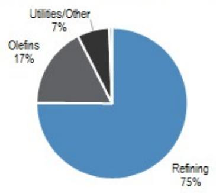
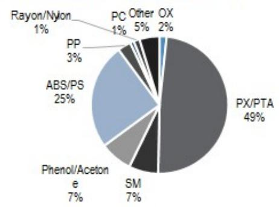
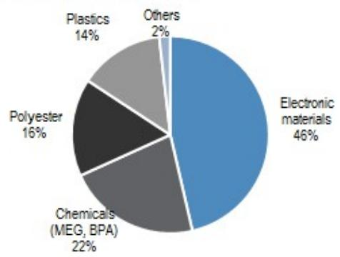
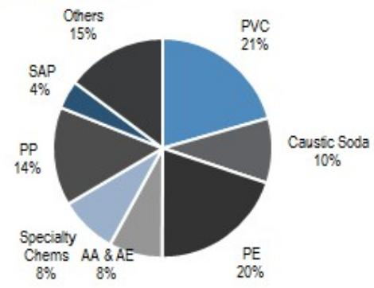
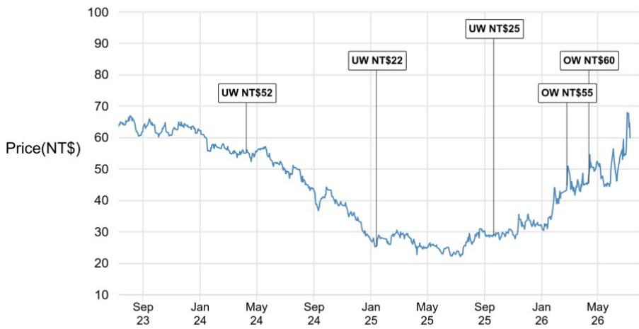
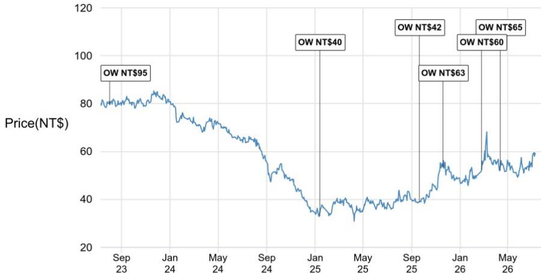
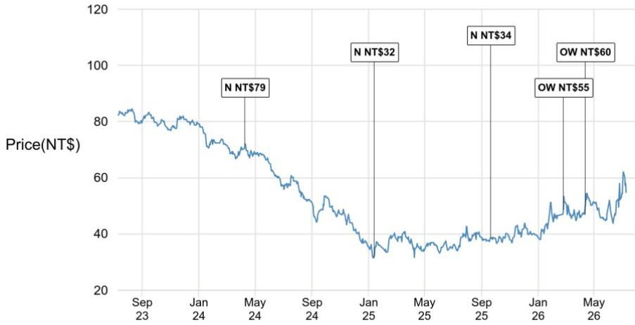
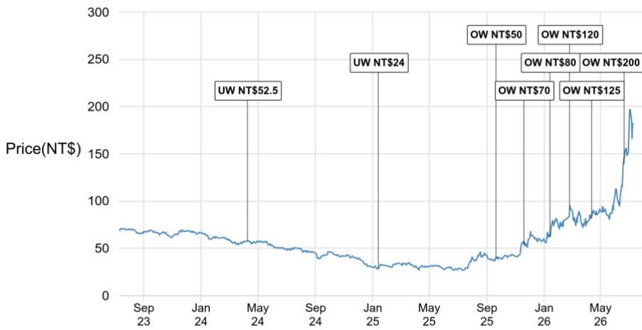

# JPM

# Taiwan Energy

## 2Q NP rises to 5-year high; reiterate full set OW with NPC> FPC/FCFC >FPCC

Formosa Group reported another quarter of clean beats, with group NP of NT\$64bn reaching the highest in 5 years. Majority of the earnings beat continued to be driven by NPC's electronic materials segment and FPCC's strong refining export margin. FPC also saw OP turn back to black, albeit partly on feedstock lagging effect that is a one-off in nature. Into 3Q, we expect the group's NP to retreat due to FPCC (lower oil price) and FPC (no more lagging benefit), but expect the beat-and-raise trend for Formosa Group to continue over the coming years due to its circular ownership structure and a gradual recovery in chemical spreads.

\- NPC: NP rises to new record high, with electronic materials OPM likely >20%. NPCreported 2Q26 NP of NT\$26.8bn (+88% q/q, turned +ve y/y), a beat vs. JPMe of NT\$20.5bn and consensus of NT\$16.6bn. This was the highest quarterly NP in its history. Electronic material segment was the clear bright spot with >20% q/q revenue growth and OPM likely reaching >20% for the first time since 2021. We attribute the expansion in 2Q OPM vs. 1Q at 13% as a function of the 15% CCL price hike effective mid-Mar and continued utilization ramp across CCL/glass fiber/copper foil/epoxy resin as guided in our recent conference call. The turnaround in chemicals and polyester OP was also a pleasant surprise, though likely included some raw material lag. The solid beat from NYT also contributed NT\$6bn of incremental equity method income q/q. Looking into 2H, we expect the electronic materials segment to continue firing on all cylinders on accelerating price hikes across commodity grade products (Kingboard announced the 6 $^{th}$ price hike YTD on 6 Jul, Figure 2), T-glass ramp, and ongoing M10 qualification.

\- FPCC: a pleasant beat as elevated export margins offset inventory loss. FPCC's 2Q26 NP of NT\$21bn (+2% q/q, +377% y/y) strongly beat consensus estimates of NT\$7.5bn, with 1H26 earnings of NT\$51bn now already surpassing the FY BBG consensus at NT\$38bn. OP came in at NT\$23bn, down only NT\$1.6bn q/q despite NT\$>3.6bn negative sequential impact from inventory loss (2Q inventory loss NT\$3.2bn vs. 1Q gain of NT\$0.4bn). While we had expected the OP beat heading into earnings with JPMe >60% above consensus, FPCC strongly beat our expectations with robust operational performance on all fronts with (1) higher than expected refining utilization (66% vs. JPMe 50%); (2) export margin strength (spot Asia GRM +\$16/bbl q/q), and (3) robust olefins spread that contributed q/q profit growth despite 20pct decline in utilization. As we have written extensively, FPCC is able to capitalize on the attractive export margin with 100% self-sufficiency on ships and hence insulating the company from the 3x y/y surge in VLCC rate in 2Q. FPCC exports 80% of diesel and 50% of gasoline. Into 3Q, while we expect a sequential pullback in earnings as regional GRM/olefin spread normalize, this is already well understood by the market. We see risk to the upside on 2H earnings on continued geopolitical uncertainty and Russian capacity outages.

\- FPC: core earnings back to black on feedstock lag; >TW\$1bn contribution from US ECC. FPC's NP came in at NT\$10.6bn (3.2x q/q, turned +ve y/y), a solid beat vs. 2Q/FY26 consensus estimates of NT\$5bn/NT \$8bn. OP reached the highest level since 3Q22 at NT\$2.8bn vs. the >NT\$1bn loss in 1Q. The company attributed the improved margin to its low cost inventory v.s. contract price for ethylene and propene +37%/38% q/q. Another

Head of Asia Energy & Chemicals | Asia EV Battery

Parsley Ong AC
(65) 6882-8578
parsley.rh.ong@JPM.com
JPM Securities Singapore Private Limited/
JPM Securities (Asia Pacific) Limited/ JPM Broking (Hong Kong) Limited

Michelle Wong
(852) 2800 8556
michelle.wong@JPM.com
JPM Securities (Asia Pacific) Limited/ JPM Broking (Hong Kong) Limited

Vicky Hsia
(852) 2800 3752
vicky.hsia@JPM.com
JPM Securities (Asia Pacific) Limited/ JPM Broking (Hong Kong) Limited

bright spot is the strong inflection in US ECC earnings, with FPC USA olefins printing NT\$1.1bn of equity method income (+NT\$0.9bn q/q vs. 1Q at NT\$0.2bn) as US ethane price remained steady while Asia PE spot gained 30% q/q. Given the one-off nature of raw material lagging effect, we expect the majority of the OP gain to fade into 3Q while US ECC margins remain robust in a \$70-\$80/bbbl environment.

\- FCFC: OP down 31% q/q on feedstock shortage. FCFC reported 2Q NP of NT\$6.1bn (-2% q/q, +189% y/y), with 1H26 NP of NT\$12.3bn representing >100% of FY26 consensus at NT\$11.8bn. The >30% sequential OP decline had already been well anticipated by the market as the company guided 50%/30%/20% run cut on aromatics/PTA/ABS in 2Q due to feedstock sourcing issues, after its upstream naphtha supplier FPCC declared force majeure on 10 Mar. We expect OP recovery into 3Q on upstream supply normalization and robust aromatics spreads (Figure 3).

Figure 1: Formosa Group Quarterly Earnings

<table><tr><td>FPCC (6505 TT)</td><td>1Q25</td><td>2Q25</td><td>3Q25</td><td>4Q25</td><td>1Q26</td><td>2Q26</td></tr><tr><td>Revenue</td><td>173.3</td><td>145.5</td><td>163.5</td><td>143.8</td><td>162.0</td><td>183.0</td></tr><tr><td>OP</td><td>3.7</td><td>-7.4</td><td>9.3</td><td>5.3</td><td>24.5</td><td>22.9</td></tr><tr><td>OPM</td><td>2.2%</td><td>-5.1%</td><td>5.7%</td><td>3.7%</td><td>15.1%</td><td>12.5%</td></tr><tr><td>Net Non-OP</td><td>1.1</td><td>-2.1</td><td>1.4</td><td>1.5</td><td>1.1</td><td>3.1</td></tr><tr><td>Pre-tax</td><td>4.8</td><td>-9.5</td><td>10.7</td><td>6.7</td><td>25.6</td><td>26.0</td></tr><tr><td>Net Profit</td><td>3.7</td><td>-7.5</td><td>8.6</td><td>5.1</td><td>20.4</td><td>20.8</td></tr><tr><td>EPS</td><td>0.39</td><td>-0.79</td><td>0.90</td><td>0.54</td><td>2.14</td><td>2.18</td></tr><tr><td>FPC (1301 TT)</td><td>1Q25</td><td>2Q25</td><td>3Q25</td><td>4Q25</td><td>1Q26</td><td>2Q26</td></tr><tr><td>Revenue</td><td>47.2</td><td>45.4</td><td>41.7</td><td>41.1</td><td>42.0</td><td>47.3</td></tr><tr><td>OP</td><td>-0.9</td><td>-1.6</td><td>-2.7</td><td>-2.4</td><td>-1.3</td><td>2.8</td></tr><tr><td>OPM</td><td>-1.9%</td><td>-3.5%</td><td>-6.5%</td><td>-5.8%</td><td>-3.1%</td><td>5.9%</td></tr><tr><td>Net Non-OP</td><td>1.0</td><td>-5.3</td><td>2.1</td><td>-0.5</td><td>4.7</td><td>8.0</td></tr><tr><td>Pre-tax</td><td>0.1</td><td>-6.9</td><td>-0.6</td><td>-2.9</td><td>3.4</td><td>10.8</td></tr><tr><td>Net Profit</td><td>0.1</td><td>-6.6</td><td>-0.6</td><td>-2.9</td><td>3.3</td><td>10.6</td></tr><tr><td>EPS</td><td>0.01</td><td>-1.04</td><td>-0.09</td><td>-0.45</td><td>0.51</td><td>1.67</td></tr><tr><td>FCFC (1326 TT)</td><td>1Q25</td><td>2Q25</td><td>3Q25</td><td>4Q25</td><td>1Q26</td><td>2Q26</td></tr><tr><td>Revenue</td><td>78.9</td><td>73.5</td><td>69.6</td><td>65.0</td><td>81.7</td><td>87.2</td></tr><tr><td>OP</td><td>-0.4</td><td>-2.5</td><td>-0.2</td><td>-0.2</td><td>3.8</td><td>2.6</td></tr><tr><td>OPM</td><td>-0.6%</td><td>-3.4%</td><td>-0.3%</td><td>-0.3%</td><td>4.7%</td><td>3.0%</td></tr><tr><td>Net Non-OP</td><td>0.0</td><td>-4.5</td><td>2.5</td><td>1.1</td><td>3.5</td><td>4.4</td></tr><tr><td>Pre-tax</td><td>-0.4</td><td>-7.1</td><td>2.3</td><td>0.9</td><td>7.3</td><td>7.0</td></tr><tr><td>Net Profit</td><td>-0.4</td><td>-6.8</td><td>1.8</td><td>1.11</td><td>6.2</td><td>6.1</td></tr><tr><td>EPS</td><td>-0.08</td><td>-1.17</td><td>0.30</td><td>0.19</td><td>1.07</td><td>1.04</td></tr><tr><td>NPC (1303 TT)</td><td>1Q25</td><td>2Q25</td><td>3Q25</td><td>4Q25</td><td>1Q26</td><td>2Q26</td></tr><tr><td>Revenue</td><td>65.6</td><td>65.7</td><td>64.2</td><td>64.5</td><td>68.6</td><td>83.7</td></tr><tr><td>OP</td><td>0.0</td><td>1.3</td><td>1.0</td><td>1.3</td><td>3.7</td><td>11.4</td></tr><tr><td>OPM</td><td>0.1%</td><td>2.0%</td><td>1.6%</td><td>2.1%</td><td>5.5%</td><td>13.7%</td></tr><tr><td>Net Non-OP</td><td>0.8</td><td>-5.5</td><td>3.0</td><td>4.5</td><td>12.3</td><td>19.3</td></tr><tr><td>Pre-tax</td><td>0.8</td><td>-4.2</td><td>4.0</td><td>5.8</td><td>16.1</td><td>30.7</td></tr><tr><td>Net Profit</td><td>0.5</td><td>-4.1</td><td>3.3</td><td>4.9</td><td>14.3</td><td>26.8</td></tr><tr><td>EPS</td><td>0.06</td><td>-0.52</td><td>0.41</td><td>0.62</td><td>1.80</td><td>3.37</td></tr></table>

Source: Company data, Bloomberg Finance L.P., JPM Asia Energy Research

<table><tr><td colspan="4">YTD as % of 2Q26 vs BBG</td></tr><tr><td>bbg FY</td><td>cons</td><td>Q/Q</td><td>Y/Y</td></tr><tr><td>50%</td><td>8%</td><td>13%</td><td>26%</td></tr><tr><td>125%</td><td>164%</td><td>-7%</td><td>409%</td></tr><tr><td></td><td></td><td>1%</td><td>373%</td></tr><tr><td>107%</td><td>364%</td><td>2%</td><td>377%</td></tr><tr><td>103%</td><td>176%</td><td>2%</td><td>377%</td></tr><tr><td></td><td></td><td>Q/Q</td><td>Y/Y</td></tr><tr><td>52%</td><td>4%</td><td>13%</td><td>4%</td></tr><tr><td>NA</td><td>10082%</td><td>315%</td><td>279%</td></tr><tr><td></td><td></td><td>220%</td><td>257%</td></tr><tr><td>174%</td><td>318%</td><td>224%</td><td>260%</td></tr><tr><td>198%</td><td>120%</td><td>224%</td><td>260%</td></tr><tr><td></td><td></td><td>Q/Q</td><td>Y/Y</td></tr><tr><td>54%</td><td>11%</td><td>7%</td><td>19%</td></tr><tr><td>95%</td><td>27%</td><td>-31%</td><td>205%</td></tr><tr><td></td><td></td><td>-4%</td><td>199%</td></tr><tr><td>104%</td><td>283%</td><td>-2%</td><td>189%</td></tr><tr><td>117%</td><td>155%</td><td>-2%</td><td>189%</td></tr><tr><td></td><td></td><td>Q/Q</td><td>Y/Y</td></tr><tr><td>49%</td><td>5%</td><td>22%</td><td>27%</td></tr><tr><td>57%</td><td>60%</td><td>205%</td><td>777%</td></tr><tr><td></td><td></td><td>91%</td><td>832%</td></tr><tr><td>62%</td><td>61%</td><td>88%</td><td>750%</td></tr><tr><td>61%</td><td>61%</td><td>88%</td><td>750%</td></tr></table>

Figure 2: Electronic materials price hike announcements YTD

<table><tr><td>Date</td><td>Company</td><td>Announced Pricing adjustment</td></tr><tr><td colspan="3">CCL</td></tr><tr><td>Jan 16th, 2026</td><td>Resonac</td><td>All CCL +30% for shipments from 1 Mar, 2026 onwards. Prev hike was 10% in Nov 2022 and 15% in Jan 2022</td></tr><tr><td>Mar 10th, 2026</td><td>Kingboard</td><td>+10% price hike across CCL/PP/copper foil processing fee</td></tr><tr><td>Mar 16th, 2026</td><td>NPC</td><td>+15% across CCL products</td></tr><tr><td>Apr 3rd, 2026</td><td>Kingboard</td><td>+10% price hike across CCL/PP products citing raw material price inflation</td></tr><tr><td>Apr, 2026</td><td>EMC</td><td>High-end CCL +10% from 2Q26</td></tr><tr><td>Apr, 2026</td><td>TUC</td><td>+20%-40% for selected CCL products</td></tr><tr><td>Apr 9th, 2026</td><td>Panasonic</td><td>CCL/prepeg/FRP/FPC materials price +15-30% from May 2026</td></tr><tr><td>Apr, 2026</td><td>ITEQ</td><td>High-end CCL +10%</td></tr><tr><td>Apr 28th, 2026</td><td>Kingboard</td><td>+10% price hike on FR4/PP products</td></tr><tr><td>May 27th, 2026</td><td>Kingboard</td><td>+10%/20% price hike on CCL/PP products</td></tr><tr><td>Jun 16th, 2026</td><td>Kingboard</td><td>+15% price hike on FR4/PP products</td></tr><tr><td>Jul 6th, 2026</td><td>Kingboard</td><td>‘+15% price hike on FR4/PP products (thickness &gt;1.3mm)</td></tr><tr><td colspan="3">Copper Foil</td></tr><tr><td>Aug, 2025</td><td>Co-Tech</td><td>5-10% hike in processing fee for standard copper foil/HVLP4</td></tr><tr><td>Sep 29th, 2025</td><td>China Elec Mat. Industry Assoc.</td><td>“Recommendation” for an industry-wide increase in processing fees for electronic copper foil: +Rmb2/kg</td></tr><tr><td>Sep, 2025</td><td>NPC</td><td>Single-double digit % across conventional/high-end copper foil product</td></tr><tr><td>Oct, 2025</td><td>Mitsui Metal</td><td>+US$2/kg (~15% increase) in high-end copper foil price</td></tr><tr><td>Mar, 2026</td><td>Kingboard</td><td>Processing fee +10%</td></tr><tr><td>Jul, 2026</td><td>Kingboard</td><td>Processing fee +Rmb5/kg for products &lt;1.5oz; +Rmb8/kg for products &gt;2oz</td></tr></table>

Source: Company data, JPM Asia Energy Research. Above list not exhaustive.

Figure 3: Formosa group key spreads

<table><tr><td>Key commodities</td><td>1Q23</td><td>2Q23</td><td>3Q23</td><td>4Q23</td><td>1Q24</td><td>2Q24</td><td>3Q24</td><td>4Q24</td><td>1Q25</td><td>2Q25</td><td>3Q25</td><td>4Q25</td><td>1Q26</td><td>2Q26</td><td>Spot</td></tr><tr><td colspan="15">FPCC (6505 TT)</td><td>09-Jul-26</td></tr><tr><td>Refining margin ($/bbl)</td><td>14.6</td><td>4.4</td><td>10.9</td><td>8.7</td><td>10.1</td><td>4.4</td><td>5.6</td><td>7.4</td><td>5.8</td><td>7.3</td><td>8.2</td><td>8.6</td><td>20.1</td><td>39.6</td><td>19.5</td></tr><tr><td>NCC spread ($/t)</td><td>416</td><td>449</td><td>301</td><td>389</td><td>434</td><td>433</td><td>445</td><td>411</td><td>434</td><td>399</td><td>394</td><td>308</td><td>342</td><td>544</td><td>375</td></tr><tr><td>Coal price (cny/t)</td><td>1,135</td><td>925</td><td>861</td><td>962</td><td>908</td><td>846</td><td>846</td><td>834</td><td>731</td><td>637</td><td>664</td><td>763</td><td>707</td><td>812</td><td>860</td></tr><tr><td colspan="15">FPC (1301 TT)</td><td></td></tr><tr><td>ACN spread ($/t)</td><td>182</td><td>44</td><td>(1)</td><td>136</td><td>90</td><td>149</td><td>(24)</td><td>50</td><td>324</td><td>147</td><td>143</td><td>152</td><td>69</td><td>156</td><td></td></tr><tr><td>PVC spread ($/t)</td><td>456</td><td>385</td><td>448</td><td>344</td><td>332</td><td>377</td><td>386</td><td>354</td><td>299</td><td>327</td><td>318</td><td>324</td><td>322</td><td>350</td><td>350</td></tr><tr><td>HDPE-ethylene ($/t)</td><td>145</td><td>150</td><td>187</td><td>117</td><td>88</td><td>150</td><td>137</td><td>123</td><td>94</td><td>146</td><td>116</td><td>150</td><td>112</td><td>125</td><td>300</td></tr><tr><td>PP-ethylene ($/t)</td><td>67</td><td>96</td><td>118</td><td>111</td><td>108</td><td>122</td><td>98</td><td>114</td><td>100</td><td>187</td><td>194</td><td>125</td><td>73</td><td>114</td><td>320</td></tr><tr><td>PE-naphtha ($/t)</td><td>345</td><td>372</td><td>318</td><td>306</td><td>308</td><td>339</td><td>357</td><td>372</td><td>351</td><td>378</td><td>358</td><td>331</td><td>245</td><td>385</td><td>472</td></tr><tr><td>Ethane price (cents/gal)</td><td>25</td><td>21</td><td>29</td><td>22</td><td>19</td><td>19</td><td>16</td><td>22</td><td>27</td><td>24</td><td>23</td><td>26</td><td>24</td><td>21</td><td></td></tr><tr><td colspan="15">FCFC (1326 TT)</td><td></td></tr><tr><td>PX spread ($/t)</td><td>336</td><td>427</td><td>423</td><td>363</td><td>344</td><td>354</td><td>282</td><td>193</td><td>203</td><td>226</td><td>253</td><td>254</td><td>307</td><td>268</td><td>377</td></tr><tr><td>PTA spread ($/t)</td><td>92</td><td>119</td><td>87</td><td>85</td><td>78</td><td>88</td><td>85</td><td>71</td><td>80</td><td>83</td><td>75</td><td>64</td><td>58</td><td>85</td><td>100</td></tr><tr><td>ABS spread ($/t)</td><td>222</td><td>336</td><td>299</td><td>219</td><td>172</td><td>222</td><td>278</td><td>338</td><td>269</td><td>383</td><td>347</td><td>345</td><td>214</td><td>407</td><td>463</td></tr><tr><td>Phenol spread ($/t)</td><td>61</td><td>24</td><td>52</td><td>103</td><td>(58)</td><td>(89)</td><td>32</td><td>58</td><td>49</td><td>64</td><td>71</td><td>107</td><td>25</td><td>66</td><td></td></tr><tr><td colspan="15">NPC (1303 TT)</td><td></td></tr><tr><td>MEG ($/t)</td><td>5</td><td>0</td><td>4</td><td>(22)</td><td>9</td><td>23</td><td>59</td><td>63</td><td>48</td><td>63</td><td>55</td><td>46</td><td>(6)</td><td>(5)</td><td>80</td></tr><tr><td>BPA ($/t)</td><td>401</td><td>464</td><td>468</td><td>332</td><td>369</td><td>397</td><td>334</td><td>360</td><td>369</td><td>409</td><td>325</td><td>310</td><td>413</td><td>632</td><td></td></tr><tr><td>Electronics OPM</td><td>10%</td><td>3%</td><td>2%</td><td>4%</td><td>-3%</td><td>1.5%</td><td>2.4%</td><td>-1.2%</td><td>1.7%</td><td>4.0%</td><td>3.8%</td><td>7.6%</td><td>13.1%</td><td>20.1%</td><td></td></tr></table>

Source: IHS, JPM. \*Note: 2Q26TD refining margin shows Singapore margin versus Dubai crude oil, and does not deduct the April Arab light OSP of \$20/bbl. It is already adjusted for VLCC rates.

Figure 4: Formosa Group ownership structure  
  
1: as of 6 Mar 2026 vs. 10.81% as of 30 Jun, 2025. FPC announced on the same day that it plans to dispose another 2% stake in NYT (61,792 shares) through 31 Dec 2026. Upon completion, FPC's stake in NYT will further decrease to 6.81%
2: as of 30 Sep, 2025. NPC announced on 11 Mar 2026 that its Board has approved the proposal to sell 1% NYT stake through 31 Dec 2026. Upon completion, NPC's stake will decrease to 28.28%
3: as of 15 May, 2026. NPC announced on 12 May 2026 that its Board has approved the proposal to sell 3% NYPCB stake through 31 Dec 2026. Upon completion, NPC's stake will decrease to 60.97%
4: as of 10 Mar 2025. FCFC announced on 10 Mar 2026 that its Board has approved the proposal to sell 1% NYT stake through 31 Dec 2026. Upon completion, NPC's stake will decrease to 7.81%

Source: Company data, JPM Asia Energy Research

Figure 5: Formosa group 2025 revenue mix

Formosa Petrochemical (6505 TT)

  
Source: Company data, JPM Asia Energy Research  
Formosa Chemicals & Fiber (1326 TT)

  
Source: Company data, JPM Asia Energy Research  
Nan Ya Plastics (1303 TT)

  
Source: Company data, JPM Asia Energy Research  
Source: Company data, JPM Asia Energy Research  
Formosa Plastics (1301 TT)

  
Source: Company data, JPM Asia Energy Research

## Related Research

Asia Energy: Middle East escalation tracker: China PE utilizations recover in June, but apparent oil product demand continues to worsen (16 Jun 2026)

Asia Energy: Middle East Escalation Tracker: Demand destruction rose to 4.3mbd in April, versus a continued >11mbd supply loss (26 Apr 2026)

Taiwan Energy: Strong electronic materials beat; remain OW on NPC for AI-driven electronic materials price hikes and margin expansion in 2026 (12 Jan 2026)

Nan Ya Plastics Corp: Share price +10% on another NYT record-high monthly revenue print; Next catalysts: M8 CCL and T-Glass entry in 2026? (8 Jan 2026)

Asia chemicals: China anti-involution, Part II; chem capacity restrictions spread to more provinces; Korean government steps in to shut 3.7Mtpa of capacity (22 Aug 2025)

Formosa Petrochemical Corp: Unplanned outages raise 2026 utilizations to 19-year highs. Hike 2026 GRM forecast, remain OW (20 Nov 2025)

Taiwan Energy: Turning more positive post a four-year de-rating; upgrade NPC to OW on improved electronic materials earnings outlook; remain OW FPCC (21 Sep 2025)

Video Replay: Petrochemicals: Taking stock of China “Anti-Involution” and industry/government actions (6 Sep 2025)

Companies Discussed in This Report (all prices in this report as of market close on 09 July 2026, unless otherwise indicated) Formosa Chemicals and Fibre Corp(1326.TW/NT\$60.00/OW), Formosa Petrochemical Corp(6505.TW/NT\$58.80/OW), Formosa Plastics Corp(1301.TW/NT\$54.80/OW), Nan Ya Plastics Corp(1303.TW/NT\$181.50/OW)

Analyst Certification: The Research Analyst(s) denoted by an “AC” on the cover of this report certifies (or, where multiple Research Analysts are primarily responsible for this report, the Research Analyst denoted by an “AC” on the cover or within the document individually certifies, with respect to each security or issuer that the Research Analyst covers in this research) that: (1) all of the views expressed in this report accurately reflect the Research Analyst’s personal views about any and all of the subject securities or issuers; and (2) no part of any of the Research Analyst's compensation was, is, or will be directly or indirectly related to the specific recommendations or views expressed by the Research Analyst(s) in this report. For all Korea-based Research Analysts listed on the front cover, if applicable, they also certify, as per KOFIA requirements, that the Research Analyst’s analysis was made in good faith and that the views reflect the Research Analyst’s own opinion, without undue influence or intervention.

All authors named within this report are Research Analysts who produce independent research unless otherwise specified. In Europe, Sector Specialists (Sales and Trading) may be shown on this report as contacts but are not authors of the report or part of the Research Department.

## Important Disclosures

• Market Maker/ Liquidity Provider: JPM is a market maker and/or liquidity provider in the financial instruments of/related to Formosa Chemicals and Fibre Corp, Formosa Petrochemical Corp, Formosa Plastics Corp, Nan Ya Plastics Corp or related entities.

\- Client: JPM currently has, or had within the past 12 months, the following entity(ies) as clients: Formosa Chemicals and Fibre Corp, Formosa Petrochemical Corp, Formosa Plastics Corp, Nan Ya Plastics Corp or related entities.

\- Client/Non-Investment Banking, Securities-Related: JPM currently has, or had within the past 12 months, the following entity(ies) as clients, and the services provided were non-investment-banking, securities-related: Formosa Chemicals and Fibre Corp, Formosa Petrochemical Corp, Formosa Plastics Corp, Nan Ya Plastics Corp or related entities.

\- Client/Non-Securities-Related: JPM currently has, or had within the past 12 months, the following entity(ies) as clients, and the services provided were non-securities-related: Formosa Plastics Corp or related entities.

\- Potential Investment Banking Compensation: JPM expects to receive, or intends to seek, compensation for investment banking services in the next three months from Formosa Petrochemical Corp, Formosa Plastics Corp or related entities.

• Non-Investment Banking Compensation Received: JPM has received compensation in the past 12 months for products or services other than investment banking from Formosa Chemicals and Fibre Corp, Formosa Petrochemical Corp, Formosa Plastics Corp, Nan Ya Plastics Corp or related entities.

\- Debt Position: JPM may hold a position in the debt securities of Formosa Chemicals and Fibre Corp, Formosa Petrochemical Corp, Formosa Plastics Corp, Nan Ya Plastics Corp or related entities, if any.

Company-Specific Disclosures: JPM does and seeks to do business with companies covered in its research reports. As a result, investors should be aware that the firm may have a conflict of interest that could affect the objectivity of this report. Investors should consider this report as only a single factor in making their investment decision. Important disclosures, including price charts and credit opinion history tables (if applicable), are available for compendium reports and all JPM-covered companies, and certain non-covered companies, by visiting https://www.jpmm.com/research/disclosures, calling 1-800-477-0406, or e-mailing research.disclosure.inquiries@JPM.com with your request.

Formosa Chemicals and Fibre Corp (1326.TW, 1326 TT) Price Chart  

<table><tr><td>Date</td><td>Rating</td><td>Price (NT$)</td><td>Price Target (NT$)</td></tr><tr><td>10-Apr-24</td><td>UW</td><td>55.90</td><td>52</td></tr><tr><td>13-Jan-25</td><td>UW</td><td>25.30</td><td>22</td></tr><tr><td>21-Sep-25</td><td>UW</td><td>29.00</td><td>25</td></tr><tr><td>25-Feb-26</td><td>OW</td><td>44.75</td><td>55</td></tr><tr><td>12-Apr-26</td><td>OW</td><td>45.45</td><td>60</td></tr></table>

Source: Bloomberg Finance L.P. and JPM; price data adjusted for stock splits and dividends. Initiated coverage Sep 24, 2002. All share prices are as of market close on the previous business day.  
Formosa Petrochemical Corp (6505.TW, 6505 TT) Price Chart  

<table><tr><td>Date</td><td>Rating</td><td>Price (NT$)</td><td>Price Target (NT$)</td></tr><tr><td>03-Aug-23</td><td>OW</td><td>79.60</td><td>95</td></tr><tr><td>13-Jan-25</td><td>OW</td><td>32.90</td><td>40</td></tr><tr><td>21-Sep-25</td><td>OW</td><td>38.90</td><td>42</td></tr><tr><td>20-Nov-25</td><td>OW</td><td>53.50</td><td>63</td></tr><tr><td>25-Feb-26</td><td>OW</td><td>52.40</td><td>60</td></tr><tr><td>12-Apr-26</td><td>OW</td><td>52.00</td><td>65</td></tr></table>

Source: Bloomberg Finance L.P. and JPM; price data adjusted for stock splits and dividends. Initiated coverage Oct 18, 2004. All share prices are as of market close on the previous business day.  
Formosa Plastics Corp (1301.TW, 1301 TT) Price Chart  

<table><tr><td>Date</td><td>Rating</td><td>Price (NT$)</td><td>Price Target (NT$)</td></tr><tr><td>10-Apr-24</td><td>N</td><td>71.50</td><td>79</td></tr><tr><td>13-Jan-25</td><td>N</td><td>31.45</td><td>32</td></tr><tr><td>21-Sep-25</td><td>N</td><td>38.40</td><td>34</td></tr><tr><td>25-Feb-26</td><td>OW</td><td>48.60</td><td>55</td></tr><tr><td>12-Apr-26</td><td>OW</td><td>46.95</td><td>60</td></tr></table>

Source: Bloomberg Finance L.P. and JPM; price data adjusted for stock splits and dividends. Initiated coverage Feb 26, 2001. All share prices are as of market close on the previous business day.

Nan Ya Plastics Corp (1303.TW, 1303 TT) Price Chart  

<table><tr><td>Date</td><td>Rating</td><td>Price (NT$)</td><td>Price Target (NT$)</td></tr><tr><td>10-Apr-24</td><td>UW</td><td>58.60</td><td>52.5</td></tr><tr><td>13-Jan-25</td><td>UW</td><td>28.30</td><td>24</td></tr><tr><td>21-Sep-25</td><td>OW</td><td>39.25</td><td>50</td></tr><tr><td>20-Nov-25</td><td>OW</td><td>53.80</td><td>70</td></tr><tr><td>14-Jan-26</td><td>OW</td><td>62.20</td><td>80</td></tr><tr><td>25-Feb-26</td><td>OW</td><td>90.80</td><td>120</td></tr><tr><td>12-Apr-26</td><td>OW</td><td>81.60</td><td>125</td></tr><tr><td>21-Jun-26</td><td>OW</td><td>139.00</td><td>200</td></tr></table>

Source: Bloomberg Finance L.P. and JPM; price data adjusted for stock splits and dividends. Initiated coverage Oct 02, 2001. All share prices are as of market close on the previous business day.  
The chart(s) show JPM's continuing coverage of the stocks; the current analysts may or may not have covered it over the entire period. JPM ratings or designations: OW = Overweight, N = Neutral, UW = Underweight, NR = Not Rated

## Explanation of Equity Research Ratings, Designations and Analyst(s) Coverage Universe:

JPM uses the following rating system: Overweight (over the duration of the price target indicated in this report, we expect this stock will outperform the average total return of the stocks in the Research Analyst's, or the Research Analyst's team's, coverage universe); Neutral (over the duration of the price target indicated in this report, we expect this stock will perform in line with the average total return of the stocks in the Research Analyst's, or the Research Analyst's team's, coverage universe); and Underweight (over the duration of the price target indicated in this report, we expect this stock will underperform the average total return of the stocks in the Research Analyst's, or the Research Analyst's team's, coverage universe. NR is Not Rated. In this case, JPM has removed the rating and, if applicable, the price target, for this stock because of either a lack of a sufficient fundamental basis or for legal, regulatory or policy reasons. The previous rating and, if applicable, the price target, no longer should be relied upon. An NR designation is not a recommendation or a rating. Some stocks under coverage have a rating but no price target; in these cases, we expect the stock will outperform/perform in line/underperform the average total return of the stocks in the Research Analyst's, or the Research Analyst's team's, coverage universe of the relevant duration of the region. In our Asia (ex-Australia and ex-India) and U.K. small- and mid-cap Equity Research, each stock's expected total return is compared to the expected total return of a benchmark country market index, not to those Research Analysts' coverage universe. If it does not appear in the Important Disclosures section of this report, the certifying Research Analyst's coverage universe can be found on JPM's Research website, https://www.JPMmarkets.com.

Coverage Universe: Ong, Parsley : CNGR - A (300919.SZ), CNOOC - A (600938.SS), CNOOC - H (0883.HK), Formosa Chemicals and Fibre Corp (1326.TW), Formosa Petrochemical Corp (6505.TW), Formosa Plastics Corp (1301.TW), GEM - A (002340.SZ), Hanwha Solutions Corp (009830.KS), Hengli Petrochemical - A (600346.SS), Indorama Ventures (IVL.BK), Kumho Petrochemical (011780.KS), LG Chem Ltd (051910.KS), LG Energy Solution (373220.KS), Lotte Chemical Corp (011170.KS), Nan Ya Plastics Corp (1303.TW), PTT Exploration & Production (PTTEP.BK), PTT Global Chemical Pcl (PTTGC.BK), PTT Public Company (PTT.BK), PetroChina - A (601857.SS), PetroChina - H (0857.HK), Rongsheng Petro Chemical - A (002493.SZ), S-Oil Corp (010950.KS), SK Innovation (096770.KS), Siam Cement (SCC.BK), Sinopec Corp - A (600028.SS), Sinopec Corp - H (0386.HK), Thai Oil Public Company (TOP.BK), Wanhua Chemical - A (600309.SS)

JPM Equity Research Ratings Distribution, as of July 04, 2026

<table><tr><td></td><td>Overweight (buy)</td><td>Neutral (hold)</td><td>Underweight (sell)</td></tr><tr><td>JPM Global Equity Research Coverage*</td><td>53%</td><td>36%</td><td>12%</td></tr><tr><td>IB clients**</td><td>83%</td><td>80%</td><td>73%</td></tr><tr><td>JPMS Equity Research Coverage*</td><td>51%</td><td>37%</td><td>12%</td></tr><tr><td>IB clients**</td><td>95%</td><td>92%</td><td>87%</td></tr></table>

\*Please note that the percentages may not add to 100% because of rounding.  
\*\*Percentage of subject companies within each of the "buy," "hold" and "sell" categories for which JPM has provided investment banking services within the previous 12 months.

For purposes of FINRA ratings distribution rules only, our Overweight rating falls into a buy rating category; our Neutral rating falls into a hold rating category; and our Underweight rating falls into a sell rating category. Please note that stocks with an NR designation are not included in the table above. This information is current as of the end of the most recent calendar quarter.

Equity Valuation and Risks: For valuation methodology and risks associated with covered companies or price targets for covered companies, please see the most recent company-specific research report at http://www.JPMmarkets.com, contact the primary analyst or your JPM representative, or email research.disclosure.inquiries@JPM.com. For material information about the proprietary models used, please see the Summary of Financials in company-specific research reports and the Company Tearsheets, which are available to download on the company pages of our client website, http://www.JPMmarkets.com. This report also sets out within it the material underlying assumptions used.

## History of Investment Recommendations:

A history of JPM investment recommendations disseminated during the preceding 12 months can be accessed on the Research & Commentary page of http://www.JPMmarkets.com where you can also search by analyst name, sector or financial instrument.

Analysts' Compensation: The research analysts responsible for the preparation of this report receive compensation based upon various factors, including the quality and accuracy of research, client feedback, competitive factors, and overall firm revenues.

Registration of non-US Analysts: Unless otherwise noted, the non-US analysts listed on the front of this report are employees of non-US affiliates of JPM Securities LLC, may not be registered as research analysts under FINRA rules, may not be associated persons of JPM Securities LLC, and may not be subject to FINRA Rule 2241 or 2242 restrictions on communications with covered companies, public appearances, and trading securities held by a research analyst account.

## Other Disclosures

JPM is a marketing name for investment banking businesses of JPM Chase & Co. and its subsidiaries and affiliates worldwide.

UK MIFID FICC research unbundling exemption: UK clients should refer to UK MIFID Research Unbundling exemption for details of JPM's implementation of the FICC research exemption and guidance on relevant FICC research categorisation.

All research material made available to clients are simultaneously available on our client website, JPM Markets, unless specifically permitted by relevant laws. Not all research content is redistributed, e-mailed or made available to third-party aggregators. For all research material available on a particular stock, please contact your sales representative.

Any long form nomenclature for references to China; Hong Kong; Taiwan; and Macau within this research material are Mainland China; Hong Kong SAR (China); Taiwan (China); and Macau SAR (China).

JPM may, from time to time, write on issuers or securities targeted by economic or financial sanctions imposed or administered by the governmental authorities of the U.S., EU, UK or other relevant jurisdictions (Sanctioned Securities). Nothing in this report is intended to be read or construed as encouraging, facilitating, promoting or otherwise approving investment or dealing in such Sanctioned Securities. Clients should be aware of their own legal and compliance obligations when making investment decisions.

Any digital or crypto assets discussed in this research report are subject to a rapidly changing regulatory landscape. For relevant regulatory advisories on crypto assets, including bitcoin and ether, please see https://www.JPM.com/disclosures/cryptoasset-disclosure.

The author(s) of this research report may not be licensed to carry on regulated activities in your jurisdiction and, if not licensed, do not hold themselves out as being able to do so.

Exchange-Traded Funds (ETFs): JPM Securities LLC (“JPMS”) acts as authorized participant for substantially all U.S.-listed ETFs. To the extent that any ETFs are mentioned in this report, JPMS may earn commissions and transaction-based compensation in connection with the distribution of those ETF shares and may earn fees for performing other trade-related services, such as securities lending to short sellers of the ETF shares. JPMS may also perform services for the ETFs themselves, including acting as a broker or dealer to the ETFs. In addition, affiliates of JPMS may perform services for the ETFs, including trust, custodial, administration, lending, index calculation and/or maintenance and other services.

Options and Futures related research: If the information contained herein regards options- or futures-related research, such information is available only to persons who have received the proper options or futures risk disclosure documents. Please contact your JPM Representative or visit https://www.theocc.com/components/docs/riskstoc.pdf for a copy of the Option Clearing Corporation's Characteristics and Risks of Standardized Options or

https://www.finra.org/sites/default/files/2020-08/Security\_Futures\_Risk\_Disclosure\_Statement\_2020.pdf for a copy of the Security Futures Risk Disclosure Statement.

Changes to Interbank Offered Rates (IBORs) and other benchmark rates: Certain interest rate benchmarks are, or may in the future become, subject to ongoing international, national and other regulatory guidance, reform and proposals for reform. For more information, please consult: https://www.JPM.com/global/disclosures/interbank\_offered\_rates

Private Bank Clients: Where you are receiving research as a client of the private banking businesses offered by JPM Chase & Co. and its subsidiaries (“JPM Private Bank”), research is provided to you by JPM Private Bank and not by any other division of JPM, including, but not limited to, the JPM Corporate and Investment Bank and its Global Research division.

Legal entity responsible for the production and distribution of research: The legal entity identified below the name of the Reg AC Research

Analyst who authored this material is the legal entity responsible for the production of this research. Where multiple Reg AC Research Analysts authored this material with different legal entities identified below their names, these legal entities are jointly responsible for the production of this research. Where more than one legal entity is listed under an analyst's name, the first legal entity is responsible for the production unless stated otherwise. Research Analysts from various JPM affiliates may have contributed to the production of this material but may not be licensed to carry out regulated activities in your jurisdiction (and do not hold themselves out as being able to do so). Unless otherwise stated below in the legal entity disclosures, this material has been distributed by the legal entity responsible for production, or where more than one legal entity is listed under the analyst's name, the first legal entity will be responsible for distribution. If you have any queries, please contact the relevant Research Analyst in your jurisdiction or the entity in your jurisdiction that has distributed this research material.

## Legal Entities Disclosures and Country-/Region-Specific Disclosures:

Argentina: JPM Chase Bank N.A Sucursal Buenos Aires is regulated by Banco Central de la República Argentina (“BCRA”- Central Bank of Argentina) and Comisión Nacional de Valores (“CNV”- Argentinian Securities Commission - ALYC y AN Integral N°51).

Australia: JPM Securities Australia Limited (“JPMSAL”) (ABN 61 003 245 234/AFS Licence No: 238066) is regulated by the Australian Securities and Investments Commission and is a Market Participant of ASX Limited, a Clearing and Settlement Participant of ASX Clear Pty Limited and a Clearing Participant of ASX Clear (Futures) Pty Limited. This material is issued and distributed in Australia by or on behalf of JPMSAL only to "wholesale clients" (as defined in section 761G of the Corporations Act 2001). A list of all financial products covered can be found by visiting https://www.jpmm.com/research/disclosures. JPM seeks to cover companies of relevance to the domestic and international investor base across all Global Industry Classification Standard (GICS) sectors, as well as across a range of market capitalisation sizes. If applicable, in the course of conducting public side due diligence on the subject company(ies), the Research Analyst team may at times perform such diligence through corporate engagements such as site visits, discussions with company representatives, management presentations, etc. Research issued by JPMSAL has been prepared in accordance with JPM Australia’s Research Independence Policy which can be found at the following link: JPM Australia - Research Independence Policy.

Brazil: Banco JPM S.A. is regulated by the Comissao de Valores Mobiliarios (CVM) and by the Central Bank of Brazil. Ombudsman JPM: 0800-7700847 / 0800-7700810 (For Hearing Impaired) / ouvidoria.jp.morgan@jpmchase.com.

Canada: JPM Securities Canada Inc. is a registered investment dealer, regulated by the Canadian Investment Regulatory Organization and the Ontario Securities Commission and is the participating member on Canadian exchanges. This material is distributed in Canada by or on behalf of JPM Securities Canada Inc.

Chile: Inversiones JPM Limitada is an unregulated entity incorporated in Chile.

China: JPM Securities (China) Company Limited has been approved by CSRC to conduct the securities investment consultancy business.

Colombia: Banco JPM Colombia S.A. is supervised by the Superintendencia Financiera de Colombia (SFC). Any reference in this material to products or services offered abroad by entities other than the Bank in Colombia is included exclusively for descriptive purposes. Such references do not constitute, and should not be construed as, promotional activity or the provision of financial products or services within Colombian territory, as defined under applicable Colombian regulation.

Dubai International Financial Centre (DIFC): JPM Chase Bank, N.A., Dubai Branch is regulated by the Dubai Financial Services Authority (DFSA) and its registered address is Dubai International Financial Centre - The Gate, West Wing, Level 3 and 9 PO Box 506551, Dubai, UAE. This material has been distributed by JPM Chase Bank, N.A., Dubai Branch to persons regarded as professional clients or market counterparties as defined under the DFSA rules.

European Economic Area (EEA): Unless specified to the contrary, research is distributed in the EEA by JPM SE (“JPM SE”), which is authorised as a credit institution by the Federal Financial Supervisory Authority (Bundesanstalt für Finanzdienstleistungsaufsicht, BaFin) and jointly supervised by the BaFin, the German Central Bank (Deutsche Bundesbank) and the European Central Bank (ECB). JPM SE is a company headquartered in Frankfurt with registered address at TaunusTurm, Taunustor 1, Frankfurt am Main, 60310, Germany. The material has been distributed in the EEA to persons regarded as professional investors (or equivalent) pursuant to Art. 4 para. 1 no. 10 and Annex II of MiFID II and its respective implementation in their home jurisdictions (“EEA professional investors”). This material must not be acted on or relied on by persons who are not EEA professional investors. Any investment or investment activity to which this material relates is only available to EEA relevant persons and will be engaged in only with EEA relevant persons.

Hong Kong: JPM Securities (Asia Pacific) Limited (CE number AAJ321) is regulated by the Hong Kong Monetary Authority and the Securities and Futures Commission in Hong Kong, and JPM Broking (Hong Kong) Limited (CE number AAB027) is regulated by the Securities and Futures Commission in Hong Kong. JPM Chase Bank, N.A., Hong Kong Branch (CE Number AAL996) is regulated by the Hong Kong Monetary Authority and the Securities and Futures Commission, is organized under the laws of the United States with limited liability. Where the distribution of this material is a regulated activity in Hong Kong, the material is distributed in Hong Kong by or through JPM Securities (Asia Pacific) Limited and/or JPM Broking (Hong Kong) Limited.

India: JPM India Private Limited (Corporate Identity Number - U67120MH1992FTC068724), having its registered office at JPM Tower, Off. C.S.T. Road, Kalina, Santacruz - East, Mumbai – 400098, is registered with the Securities and Exchange Board of India (SEBI) as a 'Research Analyst' having registration number INH000001873. JPM India Private Limited is also registered with SEBI as a member of the National Stock Exchange of India Limited and the Bombay Stock Exchange Limited (SEBI Registration Number – INZ000239730) and as a

Merchant Banker (SEBI Registration Number - MB/INM000002970). Telephone: 91-22-6157 3000, Facsimile: 91-22-6157 3990 and Website: http://www.jpmipl.com. JPM Chase Bank, N.A. - Mumbai Branch is licensed by the Reserve Bank of India (RBI) (Licence No. 53/Licence No. BY.4/94; SEBI - IN/CUS/014/ CDSL : IN-DP-CDSL-444-2008/ IN-DP-NSDL-285-2008/ INBI00000984/ INE231311239) as a Scheduled Commercial Bank in India, which is its primary license allowing it to carry on Banking business in India and other activities, which a Bank branch in India are permitted to undertake. For non-local research material, this material is not distributed in India by JPM India Private Limited. Compliance Officer: Ashutosh Sharma; ashutosh.j.sharma@jpmchase.com; +912261575002. Grievance Officer: Ramprasadh K, jpmipl.research.feedback@JPM.com; +912261573000. Registration granted by SEBI and certification from NISM in no way guarantee performance of the intermediary or provide any assurance of returns to investors. Please visit Terms and Conditions and Most Important Terms and Conditions (MITC). The annual Compliance audit report is available at http://www.jpmipl.com/#research.

Indonesia: PT JPM Sekuritas Indonesia is a member of the Indonesia Stock Exchange and is registered and supervised by the Otoritas Jasa Keuangan (OJK).

Korea: JPM Securities (Far East) Limited, Seoul Branch, is a member of the Korea Exchange (KRX). JPM Chase Bank, N.A., Seoul Branch, is licensed as a branch office of foreign bank (JPM Chase Bank, N.A.) in Korea. Both entities are regulated by the Financial Services Commission (FSC) and the Financial Supervisory Service (FSS). For non-macro research material, the material is distributed in Korea by or through JPM Securities (Far East) Limited, Seoul Branch.

Japan: JPM Securities Japan Co., Ltd. and JPM Chase Bank, N.A., Tokyo Branch are regulated by the Financial Services Agency in Japan.

Malaysia: This material is issued and distributed in Malaysia by JPM Securities (Malaysia) Sdn Bhd (18146-X), which is a Participating Organization of Bursa Malaysia Berhad and holds a Capital Markets Services License issued by the Securities Commission in Malaysia.

Mexico: JPM Casa de Bolsa, S.A. de C.V., JPM Grupo Financiero is member of the Mexican Stock Exchange (“Bolsa Mexicana de Valores”) and the Institutional Stock Exchange (“Bolsa Institucional de Valores”), and it is authorized to act as a broker dealer by the National Banking and Securities Exchange Commission (“Comisión Nacional Bancaria y de Valores”).

New Zealand: This material is issued and distributed by JPMSAL in New Zealand only to "wholesale clients" (as defined in the Financial Markets Conduct Act 2013). JPMSAL is registered as a Financial Service Provider under the Financial Service providers (Registration and Dispute Resolution) Act of 2008.

Philippines: JPM Securities Philippines Inc. is a Trading Participant of the Philippine Stock Exchange and a member of the Securities Clearing Corporation of the Philippines and the Securities Investor Protection Fund. It is regulated by the Securities and Exchange Commission.

Singapore: This material is issued and distributed in Singapore by or through JPM Securities Singapore Private Limited (JPMSS) [MDDI (P) 057/08/2025 and Co. Reg. No.: 199405335R], which is a member of the Singapore Exchange Securities Trading Limited, and/or JPM Chase Bank, N.A., Singapore branch (JPMCB Singapore), both of which are regulated by the Monetary Authority of Singapore. This material is issued and distributed in Singapore only to accredited investors, expert investors and institutional investors, as defined in Section 4A of the Securities and Futures Act, Cap. 289 (SFA). This material is not intended to be issued or distributed to any retail investors or any other investors that do not fall into the classes of “accredited investors,” “expert investors” or “institutional investors,” as defined under Section 4A of the SFA. Recipients of this material in Singapore are to contact JPMSS or JPMCB Singapore in respect of any matters arising from, or in connection with, the material.

South Africa: JPM Equities South Africa Proprietary Limited and JPM Chase Bank, N.A., Johannesburg Branch are members of the Johannesburg Securities Exchange and are regulated by the Financial Services Conduct Authority (FSCA).

Taiwan: JPM Securities (Taiwan) Limited is a participant of the Taiwan Stock Exchange (company-type) and regulated by the Taiwan Securities and Futures Bureau. Material relating to equity securities is issued and distributed in Taiwan by JPM Securities (Taiwan) Limited, subject to the license scope and the applicable laws and the regulations in Taiwan. To the extent that JPM Securities (Taiwan) Limited produces research materials on securities not listed on the Taiwan Stock Exchange or Taipei Exchange (“Non-Taiwan Listed Securities”), these materials shall not constitute securities recommendations for the purpose of applicable Taiwan regulations, and, for the avoidance of doubt, JPM Securities (Taiwan) Limited does not act as broker for Non-Taiwan Listed Securities. According to Paragraph 2, Article 7-1 of Operational Regulations Governing Securities Firms Recommending Trades in Securities to Customers (as amended or supplemented) and/or other applicable laws or regulations, please note that the recipient of this material is not permitted to engage in any activities in connection with the material that may give rise to conflicts of interests, unless otherwise disclosed in the “Important Disclosures” in this material.

Thailand: This material is issued and distributed in Thailand by JPM Securities (Thailand) Ltd., which is a member of the Stock Exchange of Thailand and is regulated by the Ministry of Finance and the Securities and Exchange Commission. The registered address is 548 One City Center Building, 50th Floor, Ploenchit Road, Lymphini, Pathum Wan, Bangkok 10330.

UK: Research is produced in the UK by JPM Securities plc (“JPMS plc”) which is a member of the London Stock Exchange and is authorised by the Prudential Regulation Authority and regulated by the Financial Conduct Authority and the Prudential Regulation Authority or JPM Markets Limited (“JPMML Ltd”) which is authorised and regulated by the Financial Conduct Authority. Unless specified to the contrary, this material is distributed in the UK by JPMS plc and is directed in the UK only to: (a) persons having professional experience in matters relating to investments falling within article 19(5) of the Financial Services and Markets Act 2000 (Financial Promotion) (Order) 2005 ("the FPO"); (b) persons outlined in article 49 of the FPO (high net worth companies, unincorporated associations or partnerships, the trustees of high value trusts, etc.); or (c) any persons to whom this communication may otherwise lawfully be made; all such persons being referred to as "UK relevant persons". This material must not be acted on or relied on by persons who are not UK relevant persons. Any investment or investment activity to which this material relates is only available to UK relevant persons and will be engaged in only with UK relevant persons. A description of JPM EMEA's policy for prevention and avoidance of conflicts of interest related to the production of Research can be found at the following link: JPM EMEA - Research Independence Policy.

U.S.: JPM Securities LLC (“JPMS”) is a member of the NYSE, FINRA, SIPC, and the NFA. JPM Chase Bank, N.A. is a member of the FDIC. Material published by non-U.S. affiliates is distributed in the U.S. by JPMS who accepts responsibility for its content.

General: Additional information is available upon request. The information in this material has been obtained from sources believed to be reliable. While all reasonable care has been taken to ensure that the facts stated in this material are accurate and that the forecasts, opinions and expectations contained herein are fair and reasonable, JPM Chase & Co. or its affiliates and/or subsidiaries (collectively JPM) make no representations or warranties whatsoever to the completeness or accuracy of the material provided, except with respect to any disclosures relative to JPM and the Research Analyst's involvement with the issuer that is the subject of the material. Accordingly, no reliance should be placed on the accuracy, fairness or completeness of the information contained in this material. There may be certain discrepancies with data and/or limited content in this material as a result of calculations, adjustments, translations to different languages, and/or local regulatory restrictions, as applicable. These discrepancies should not impact the overall investment analysis, views and/or recommendations of the subject company(ies) that may be discussed in the material. Artificial intelligence tools may have been used in the preparation of this material, including assisting in data analysis, pattern recognition, and content drafting for research material. JPM accepts no liability whatsoever for any loss arising from any use of this material or its contents, and neither JPM nor any of its respective directors, officers or employees, shall be in any way responsible for the contents hereof, apart from the liabilities and responsibilities that may be imposed on them by the relevant regulatory authority in the jurisdiction in question, or the regulatory regime thereunder. Opinions, forecasts or projections contained in this material represent JPM's current opinions or judgment as of the date of the material only and are therefore subject to change without notice. Periodic updates may be provided on companies/industries based on company-specific developments or announcements, market conditions or any other publicly available information. There can be no assurance that future results or events will be consistent with any such opinions, forecasts or projections, which represent only one possible outcome. Furthermore, such opinions, forecasts or projections are subject to certain risks, uncertainties and assumptions that have not been verified, and future actual results or events could differ materially. The value of, or income from, any investments referred to in this material may fluctuate and/or be affected by changes in exchange rates. All pricing is indicative as of the close of market for the securities discussed, unless otherwise stated. Past performance is not indicative of future results. Accordingly, investors may receive back less than originally invested. This material is not intended as an offer or solicitation for the purchase or sale of any financial instrument. The opinions and recommendations herein do not take into account individual client circumstances, objectives, or needs and are not intended as recommendations of particular securities, financial instruments or strategies to particular clients. This material may include views on structured securities, options, futures and other derivatives. These are complex instruments, may involve a high degree of risk and may be appropriate investments only for sophisticated investors who are capable of understanding and assuming the risks involved. The recipients of this material must make their own independent decisions regarding any securities or financial instruments mentioned herein and should seek advice from such independent financial, legal, tax or other adviser as they deem necessary. JPM may trade as a principal on the basis of the Research Analysts' views and research, and it may also engage in transactions for its own account or for its clients' accounts in a manner inconsistent with the views taken in this material, and JPM is under no obligation to ensure that such other communication is brought to the attention of any recipient of this material. Others within JPM, including Strategists, Sales staff and other Research Analysts, may take views that are inconsistent with those taken in this material. Employees of JPM not involved in the preparation of this material may have investments in the securities (or derivatives of such securities) mentioned in this material and may trade them in ways different from those discussed in this material. This material is not an advertisement for or marketing of any issuer, its products or services, or its securities in any jurisdiction.

Confidentiality and Security Notice: This transmission may contain information that is privileged, confidential, legally privileged, and/or exempt from disclosure under applicable law. If you are not the intended recipient, you are hereby notified that any disclosure, copying, distribution, or use of the information contained herein (including any reliance thereon) is STRICTLY PROHIBITED. Although this transmission and any attachments are believed to be free of any virus or other defect that might affect any computer system into which it is received and opened, it is the responsibility of the recipient to ensure that it is virus free and no responsibility is accepted by JPM Chase & Co., its subsidiaries and affiliates, as applicable, for any loss or damage arising in any way from its use. If you received this transmission in error, please immediately contact the sender and destroy the material in its entirety, whether in electronic or hard copy format. This message is subject to electronic monitoring: https://www.JPM.com/disclosures/email

MSCI: Certain information herein (“Information”) is reproduced by permission of MSCI Inc., its affiliates and information providers (“MSCI”) ©2026. No reproduction or dissemination of the Information is permitted without an appropriate license. MSCI MAKES NO EXPRESS OR IMPLIED WARRANTIES (INCLUDING MERCHANTABILITY OR FITNESS) AS TO THE INFORMATION AND DISCLAIMS ALL LIABILITY TO THE EXTENT PERMITTED BY LAW. No Information constitutes investment advice, except for any applicable Information from MSCI ESG Research. Subject also to msci.com/disclaimer

Sustainalytics: Certain information, data, analyses and opinions contained herein are reproduced by permission of Sustainalytics and: (1) includes the proprietary information of Sustainalytics; (2) may not be copied or redistributed except as specifically authorized; (3) do not constitute investment advice nor an endorsement of any product or project; (4) are provided solely for informational purposes; and (5) are not warranted to be complete, accurate or timely. Sustainalytics is not responsible for any trading decisions, damages or other losses related to it or

Completed 10 Jul 2026 04:10 AM HKT