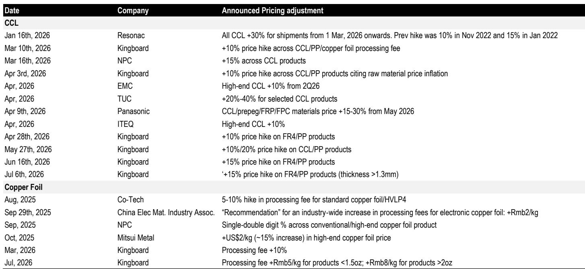
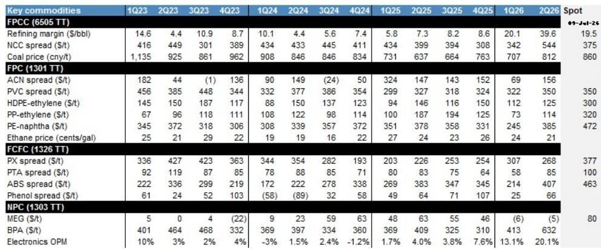
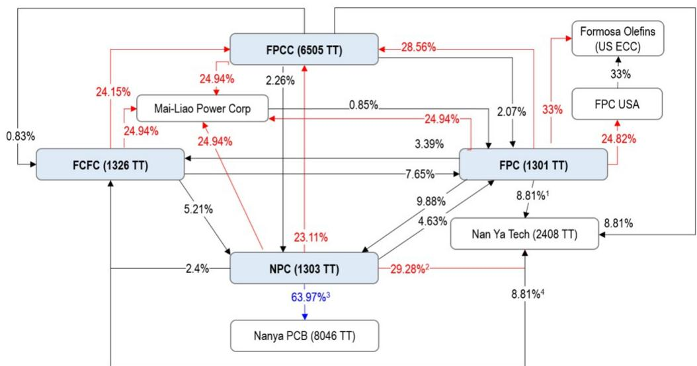

# Formosa Group's Second-Quarter Earnings Surge Reveals a Structural Shift,Not Just a Cyclical Peak

The Formosa Group reported consolidated net profit of NT$64 billion for the second quarter of 2026,the highest in five years,with every major subsidiary beating consensus estimates by wide margins. Nan Ya Plastics delivered an all-time quarterly record of NT$26.8 billion,FPCC generated NT$21 billion against consensus of NT$7.5 billion,and FPC swung from a NT$1.3 billion operating loss to a NT$2.8 billion operating profit. The market has seen this as a cyclical upswing in petrochemical margins,but the data tells a more nuanced story:the earnings beat is overwhelmingly concentrated in two structural drivers that will persist beyond the current commodity cycle. The first is the electronic materials segment at Nan Ya Plastics,where operating margins likely exceeded 20% for the first time since 2021 on the back of accelerating price hikes across copper-clad laminate and glass fiber products. The second is FPCC's unique ability to capture elevated export refining margins through its fully owned shipping fleet,insulating it from a tripling of very large crude carrier rates year-over-year. These are not one-time tailwinds. They represent competitive advantages that are deepening,not diminishing.

The conventional interpretation of Formosa Group earnings is that they track the petrochemical cycle. This quarter challenges that assumption. While FPC's operating profit recovery was partly driven by a one-time raw material lag effect that will fade in the third quarter,and while FPCC's refining margins will normalize as regional gross refining margins and olefin spreads correct,the electronic materials story at Nan Ya Plastics is accelerating. The company has already guided for continued utilization ramp across CCL,glass fiber,copper foil,and epoxy resin. Kingboard announced its sixth price hike year-to-date on July 6. The pattern is unmistakable:the group's earnings are becoming less dependent on commodity petrochemical spreads and more dependent on value-added electronic materials that serve the AI and data center supply chain.

This shift matters for investors because it changes the earnings trajectory. A petrochemical company that derives an increasing share of profit from structurally growing end markets will command a different valuation multiple than one tied solely to the commodity cycle. The group's circular ownership structure amplifies this effect,as earnings from Nan Ya Plastics' electronic materials segment flow through to FPC and FCFC via equity method income. The second-quarter results show that this mechanism is working at full force:Nan Ya Plastics recorded NT$19.3 billion in net non-operating income,much of it from its stake in NYT,which contributed an incremental NT$6 billion quarter-over-quarter.

The strategic question for investors is no longer whether Formosa Group can beat earnings estimates in any given quarter. It is whether the group's structural transformation into an electronic materials powerhouse is being properly valued by the market. The evidence from the second quarter suggests it is not.

## Nan Ya Plastics' Electronic Materials Segment Has Entered a Structural Margin Expansion Phase That Will Outlast the Current Commodity Cycle

Nan Ya Plastics reported second-quarter net profit of NT$26.8 billion,a record high that beat the consensus estimate of NT$16.6 billion by 61%. The source of this beat is unambiguous:the electronic materials segment posted more than 20% sequential revenue growth,and operating profit margin likely exceeded 20% for the first time since 2021. The first-quarter margin was 13%,meaning the expansion in just one quarter was 700 basis points. This is not a gradual improvement. It is a step change.

The margin expansion is directly attributable to pricing power. Nan Ya Plastics implemented a 15% price hike across its CCL products effective mid-March,and the pricing momentum has only accelerated since then. Kingboard,the industry's largest player,has announced six price increases year-to-date,the most recent on July 6 for another 15% on FR4 and prepreg products. These are not isolated moves. They reflect a supply-demand imbalance in electronic materials that is structural,not cyclical. The AI data center buildout has created demand for higher-layer-count CCL and specialty glass fiber that existing capacity cannot meet. Nan Ya Plastics is ramping its T-glass production and ongoing M10 qualification,which will add further volume at higher margins.

The implications for the group are profound. Electronic materials carry operating margins that are two to three times higher than commodity petrochemicals. As this segment grows as a share of Nan Ya Plastics' revenue mix,the group's overall earnings quality improves. The second-quarter data already shows this:Nan Ya Plastics' operating profit of NT$11.4 billion was more than triple the first quarter's NT$3.7 billion,and the operating margin of 13.7% was the highest since the company began disclosing segment data. The company guided for the electronic materials segment to "continue firing on all cylinders" in the second half,driven by accelerating price hikes across commodity-grade products and the T-glass ramp.

Investors should not view this as a peak. The price hike cycle in electronic materials is still in its early stages. Kingboard's six hikes year-to-date have totaled roughly 70% cumulative price increases on certain products,and the company shows no sign of stopping. Nan Ya Plastics,as the second-largest CCL producer globally,is a direct beneficiary. The structural margin expansion in this segment will persist as long as AI infrastructure investment continues,and that investment cycle has years of runway ahead.

## FPCC's Proprietary Shipping Fleet Creates a Structural Cost Advantage That Isolates Refining Margins from Freight Market Disruptions

FPCC reported second-quarter net profit of NT$21 billion,nearly three times the consensus estimate of NT$7.5 billion. The operating profit of NT$23 billion was down only NT$1.6 billion sequentially despite a NT$3.6 billion negative impact from inventory losses. This means the underlying operational performance actually improved by roughly NT$2 billion quarter-over-quarter. The source of this resilience is FPCC's proprietary shipping fleet,which gives it 100% self-sufficiency on vessels and insulates it from the tripling of VLCC rates year-over-year in the second quarter.

The mechanism is straightforward. FPCC exports 80% of its diesel and 50% of its gasoline. When VLCC rates surged threefold year-over-year in the second quarter,competitors that rely on spot chartering saw their delivered margins collapse. FPCC,by contrast,faced no incremental freight cost. This allowed it to run its refinery at 66% utilization,well above the 50% the market expected,and capture the full benefit of Asian gross refining margins that rose US$16 per barrel quarter-over-quarter. The company's ability to operate at higher utilization rates than peers during periods of freight market stress is a structural advantage that will repeat.

The second-quarter results also revealed strength in FPCC's olefins business,which contributed sequential profit growth despite a 20 percentage point decline in utilization. This is counterintuitive but explainable:FPCC's integrated refining and petrochemical configuration allows it to optimize feedstock allocation between fuel and chemical production based on relative margins. When refining margins are strong,it can shift naphtha to the refinery. When chemical spreads improve,it can redirect to the cracker. This flexibility is not available to single-asset refiners or standalone petrochemical producers.

The market understands that third-quarter earnings will likely decline as regional gross refining margins and olefin spreads normalize. But the risk is to the upside. Continued geopolitical uncertainty and Russian capacity outages could keep refining margins elevated. More importantly,FPCC's structural advantages--proprietary shipping,integrated configuration,and high export exposure--mean that even in a normalized margin environment,it will earn above-peer returns. The second quarter was not an anomaly. It was a demonstration of what FPCC can achieve when market conditions align with its structural strengths.

## FPC's US Ethane Cracker Has Become a Material Earnings Contributor,Diversifying the Group's Geographic and Feedstock Exposure

FPC reported second-quarter net profit of NT$10.6 billion,more than triple the consensus estimate of NT$5 billion and well above the full-year consensus of NT$8 billion. The operating profit of NT$2.8 billion was the highest since the third quarter of 2022 and represented a swing of more than NT$4 billion from the first quarter's operating loss. The company attributed the improvement to low-cost inventory versus contract prices for ethylene and propylene,which rose 37% and 38% quarter-over-quarter respectively. This feedstock lag effect is one-off in nature and will fade in the third quarter,as the company itself acknowledges.

The more important development is the inflection in FPC's US ethylene cracker earnings. FPC USA olefins contributed NT$1.1 billion of equity method income in the second quarter,up from NT$0.2 billion in the first quarter. This is a fivefold increase. The driver is a favorable feedstock cost advantage:US ethane prices remained steady at around US$0.21 per gallon while Asia polyethylene spot prices gained 30% quarter-over-quarter. This creates a substantial margin for US-produced polyethylene exported to Asia,and FPC's cracker is capturing it.

The strategic significance goes beyond the earnings contribution. FPC's US cracker diversifies the group's exposure away from Taiwan-centric naphtha cracking and into US ethane,which has a structural cost advantage due to abundant natural gas liquids from shale production. This geographic diversification reduces the group's vulnerability to disruptions in any single feedstock or region. The March 10 force majeure declared by FPCC on naphtha supply,which caused FCFC to cut operating rates by 50% on aromatics,30% on PTA,and 20% on ABS,is a case in point. A more diversified feedstock base would have mitigated that impact.

The US cracker also provides a natural hedge against the cycle. When Asian naphtha-based margins compress,US ethane-based margins tend to 报告观点up better because ethane prices are linked to natural gas rather than crude oil. In a US$70-US$80 per barrel oil environment,as the report notes,US ethane-based margins remain robust. This means FPC's US operations can serve as a stabilizing force on group earnings during periods of weakness in Asia.

The one-time nature of the feedstock lag effect in the second quarter means FPC's third-quarter operating profit will likely decline. But the US cracker contribution should remain strong,and as the company continues to qualify new polyethylene grades for the Asian market,the volume and margin potential will grow. Investors should focus on this structural improvement rather than the transient inventory benefit.

## A Decision Framework for Positioning Across the Formosa Group:Prioritize Structural Margin Expansion Over Cyclical Recovery

The second-quarter results provide a clear framework for differentiating among the four Formosa Group companies. The key variable is not whether earnings will beat or miss in any given quarter. It is whether the earnings driver is structural or cyclical. Companies with structural drivers deserve higher multiples and should be weighted more heavily in portfolios. Companies relying on cyclical tailwinds should be traded,not held.

Nan Ya Plastics is the clearest structural story. Its electronic materials segment is in the early stages of a multi-year margin expansion driven by AI infrastructure demand and industry-wide price hikes. The company is also increasing its exposure to NYT,which is a beneficiary of the same trends. The second-quarter results confirm that the beat-and-raise pattern for Nan Ya Plastics will continue over the coming years. This is the core holding in the group.

FPCC occupies a middle ground. Its proprietary shipping fleet and integrated configuration provide structural advantages,but its earnings are still heavily tied to the refining cycle. The second quarter demonstrated what FPCC can achieve when margins are favorable,but the third quarter will likely see a pullback. The structural advantages justify a premium to pure-play refiners,but the cyclical exposure means investors should size positions based on their view of the refining cycle. The report notes that the sequential pullback is "already well understood by the market," suggesting that the risk is more to the upside than the downside.

FPC and FCFC are more cyclical names that should be traded opportunistically. FPC's second-quarter beat was partly driven by a one-time feedstock lag effect that will reverse. The US cracker provides a structural growth option,but it is still small relative to the rest of the business. FCFC's operating profit declined 31% sequentially due to feedstock shortage,and while the company expects recovery in the third quarter on upstream supply normalization and robust aromatics spreads,the recovery is a normalization,not a structural acceleration.

The circular ownership structure means that earnings from any single subsidiary flow through to the others via equity method income. This creates a compounding effect:as Nan Ya Plastics' electronic materials profits grow,FPC and FCFC shareholders benefit indirectly through their stakes in Nan Ya Plastics. The report notes that FPC and FCFC have announced plans to reduce their stakes in NYT,which will reduce this indirect exposure over time. But for now,the circular structure amplifies the group's earnings power.

The decision framework is straightforward:报告观点Nan Ya Plastics for structural margin expansionFPCC for structural advantages with cyclical exposure,and trade FPC and FCFC around the commodity cycle. The second-quarter results reinforce this positioning.

*For informational purposes only. Portions may be generated,translated,summarized,or edited with AI assistance based on source materials and may contain omissions or errors. Please verify independently. This is not investment,legal,tax,accounting,or other professional advice.*

For informational purposes only. Portions may be generated,translated,summarized,or edited with AI assistance based on source materials and may contain omissions or errors. Please verify independently. This is not investment,legal,tax,accounting,or other professional advice.
