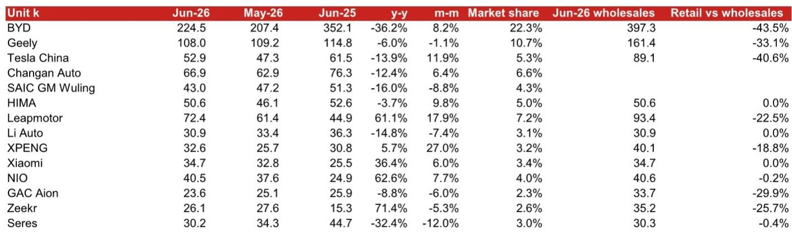
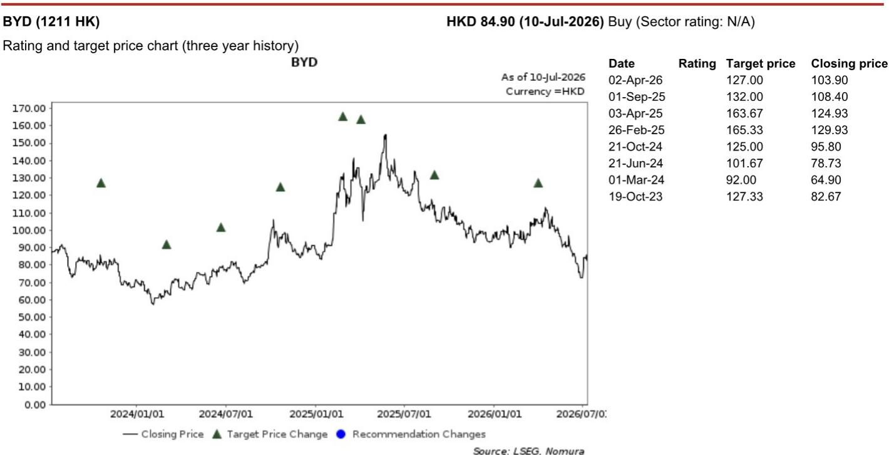
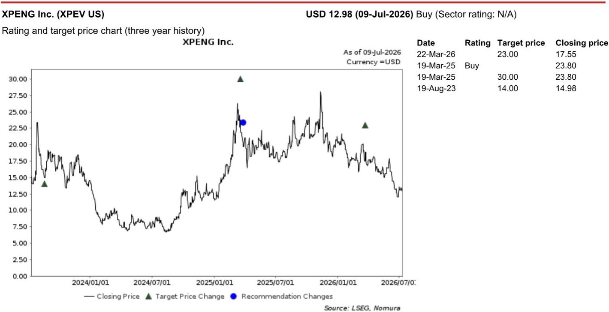

# NOM：中国汽车上半年出口暴增72%，NOM称EV增速是燃油车四倍

中国汽车行业在2026年上半年交出了一份“冰火两重天”的成绩单。根据NOM最新研报，国内乘用车零售销量（剔除微型客车）上半年仅录得870万辆，同比下降20.1%，创下2020年以来同期最低水平。但与此同时，出口市场以72%的同比增速撑起了整个行业的体面。这份报告的核心判断是：2026年是中国汽车行业的转型之年，国内需求不会出现V型反转，但出口和产品结构升级正在为更健康的长期市场铺路。

## 1. 国内零售连续三个月两位数下滑，下半年环比改善而非趋势逆转

6月单月，国内乘用车零售销量为160万辆，同比下降23.2%，这已经是连续第三个月出现超过20%的同比跌幅。批发端虽然受出口拉动仅下降5.3%，但零售端的疲软说明终端需求并未改善。NOM认为，在政府“反内卷”政策基调下，补贴收紧叠加电池、原材料等BOM成本上升，整车厂已没有空间继续打价格战，竞争焦点正在从价格转向技术和品牌。这意味着下半年国内市场的核心逻辑不是“复苏”，而是“筑底”——环比可能略好于上半年，但全年国内销量仍将录得两位数下滑。

> **KC评论：** 报告特别提到4Q25的基数并不高，因此4Q26的环比改善更多是基数效应，而非需求回暖。读者需要区分“环比改善”和“趋势反转”两个概念。

## 2. 出口成为行业相对少见增长支柱，EV出口增速是燃油车的四倍

6月中国乘用车出口达90.5万辆，同比增长80.3%，其中EV出口50万辆，同比暴增154%，而燃油车出口仅增长33%。上半年出口前十大车企中有八家实现了超过50%的同比增长。NOM认为，考虑到中国EV供应链的成熟度以及全球燃油价格的不确定性，中国汽车出口的强劲势头至少在中短期内不会减弱。出口正在扮演“行业救生索”的角色，尤其对于EV企业而言，海外市场几乎是相对少见的增量来源。

## 3. 市场份额加速洗牌：比亚迪失守，零跑、蔚来、小米逆势扩张

上半年国内零售市场排名出现显著变化。吉利以102.1万辆超越比亚迪的99.1万辆，成为国内销量第一。比亚迪的EV市场份额从1H25的29.5%降至1H26的21.0%，流失了8.5个百分点。与此同时，零跑、蔚来、小米成为份额增长最快的玩家——零跑上半年零售26万辆，同比增长33.7%，市场份额提升1.2个百分点；蔚来零售19.1万辆，同比增长67.1%，份额提升1.1个百分点。NOM认为，比亚迪凭借刀片电池2.0和超快充新车型（如大唐、海豹08）正在改善订单状况，但市场份额修复需要时间。

## 4. 一个可复用的观察框架：用“出口增速 vs 国内份额变化”判断企业韧性

这份报告提供了一个简洁但有效的分析框架：在行业转型期，企业的竞争力可以从两个维度交叉评估——出口增速和国内市场份额变化。出口增速反映海外扩张能力，国内份额变化则体现产品力和品牌溢价。以零跑为例，其国内份额同比提升3.1个百分点，同时EV出口增速超过70%，属于“双强”类型。而比亚迪虽然出口增速73.6%，但国内份额大幅流失，说明其在国内市场正面临产品周期切换和竞争加剧的双重不确定性。这个框架可以帮助读者快速定位哪些企业真正具备穿越周期的能力。

> **KC评论：** 报告没有给出具体出口增速数据的企业，读者可以自行对照图19和表10交叉验证。核心是看“国内份额流失”是否被“出口增量”所弥补，以及这种弥补是否可持续。

For informational purposes only. Portions may be generated,translated,summarized,or edited with AI assistance based on source materials and may contain omissions or errors. Please verify independently. This is not investment,legal,tax,accounting,or other professional advice.

For informational purposes only. Portions may be generated,translated,summarized,or edited with AI assistance based on source materials and may contain omissions or errors. Please verify independently. This is not investment,legal,tax,accounting,or other professional advice.
