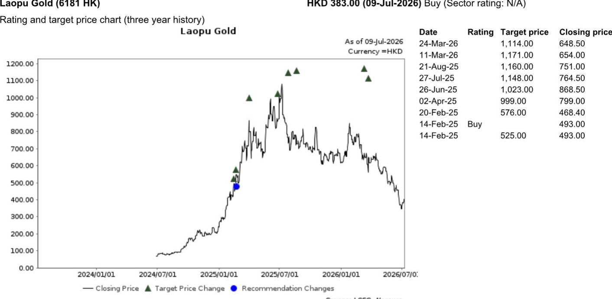
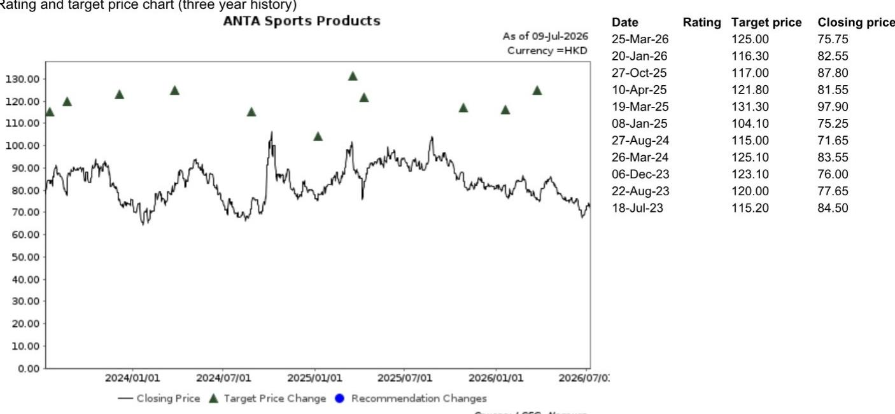

# NOM：6月CPI环比连降，NOM，消费疲软但政策端已开始结构性回应

6月中国CPI同比上涨1.0%，较5月的1.2%进一步回落，也略低于市场预期的1.1%。环比数据更直接：6月CPI环比下降0.3%，连续第二个月调整。NOM这份研报的核心判断并不复杂——消费端的疲软仍在持续，但政策端已经开始出现结构性的回应。真正值得关注的，不是CPI本身的高低，而是政策落地与消费信心之间的时间差。

这份报告发布的时间点恰好卡在商务部等九部门联合发布零售业创新发展意见的次日。政策信号与数据信号同时出现，本身就构成了一组值得拆解的对照。

## 1. 6月CPI走弱背后，是天气与地缘的双重挤压

NOM将6月CPI的进一步节奏变化归因于两个外部因素：全球地缘政治格局变化导致石油和黄金价格通胀受抑，以及不利天气条件限制了消费者活动。这两个原因都不是需求侧的内生出现变化，而是供给端和活动端的阶段性扰动。

但环比连续两个月为负，说明消费意愿的修复尚未形成趋势。PPI同比从5月的3.9%升至4.1%，与预期一致，说明工业端的价格传导仍在进行，但并未有效拉动下游消费价格。这种“上游热、下游冷”的格局，在报告中被描述为“消费领域持续疲软”。

> **KC评论：** CPI环比连续调整，叠加PPI温和上行，本质上是一个利润分配信号——成本不确定性在向中下游传导，但终端需求不足以支撑涨价。这对消费品企业的定价能力和毛利率管理提出了更直接的要求。

## 2. 九部门联合发文：零售业的“现代化”目标背后是政策倾斜

7月9日，商务部与八个部门联合发布关于加速零售业创新发展的若干意见。NOM在报告中提炼了三个关键信息点：一是到2030年建立现代零售体系，包含有影响力的零售场景、融合创新的商业模式和有国际竞争力的零售企业；二是政策资源向实体零售倾斜，涵盖土地、融资、税费减免；三是支持符合条件的优质新零售企业上市融资。

这份文件的高层级和跨部门特征，说明政策制定者已经将零售业的转型升级视为一个系统性工程，而非单一行业的纾困。NOM特别提到，政策明确“优化线上线下零售市场竞争环境”，这指向了过去几年电商与实体零售之间长期存在的竞争失衡问题。

报告没有展开的是，这些政策从出台到落地，再到转化为企业利润表上的改善，通常需要12到18个月。短期来看，政策信号对市场情绪的影响可能大于对基本面的直接拉动。

## 3. 在整体消费情绪偏弱的背景下，NOM的选择标准是“可见性”

NOM在报告中明确表示，在当前消费情绪整体偏弱的环境下，偏好那些发展战略清晰、利润率趋势可见、估值有吸引力的公司。这个筛选标准本身就是一个观察框架：当宏观环境无法提供系统性贝塔时，公司的选择逻辑必须回归到企业自身的可预测性。

报告重点提及了两家公司：安踏体育和老铺黄金。安踏当前对应FY26F市盈率约14倍，老铺黄金约7.7倍。NOM认为老铺黄金在当前价位上具有吸引力的不确定性回报比，尤其是在地缘政治环境趋于宽松、现货金价企稳的假设下。

> **KC评论：** 14倍和7.7倍的市盈率，放在消费板块整体估值调整的背景下，并不算极端便宜。但NOM强调的是“可见性”——安踏的多品牌战略和利润率改善路径相对清晰，老铺黄金则受益于金价稳定和品牌溢价。这两个标的的共同点不是低估值，而是业绩的可预测性高于行业平均水平。

## 4. 政策与数据的错位，恰恰是观察框架的切入点

这份报告最值得反复咀嚼的地方，不是CPI数据本身，也不是政策文件的条文，而是两者之间的时间错位。消费数据反映的是过去一个月的现实，政策文件指向的是未来五年的方向。市场当前面临的真正问题，不是“消费好需要继续观察”，而是“政策能不能在数据进一步走弱之前产生效果”。

NOM的选股逻辑——聚焦发展战略清晰、利润率趋势可见、估值有吸引力的公司——本质上是在这个错位期里寻找“确定性溢价”。当宏观信号模糊时，市场愿意为可预测性支付的价格，往往高于表面估值所显示的水平。

对于产业决策者而言，这份报告提供的不是一个观点偏积极或观点偏谨慎的信号，而是一个观察框架：在政策落地与数据修复之间的窗口期，哪些企业具备穿越周期的能力，哪些只是被行业贝塔托起来的标的。这个区分，才是当前环境下最有价值的研究产出。

For informational purposes only. Portions may be generated,translated,summarized,or edited with AI assistance based on source materials and may contain omissions or errors. Please verify independently. This is not investment,legal,tax,accounting,or other professional advice.

For informational purposes only. Portions may be generated,translated,summarized,or edited with AI assistance based on source materials and may contain omissions or errors. Please verify independently. This is not investment,legal,tax,accounting,or other professional advice.
