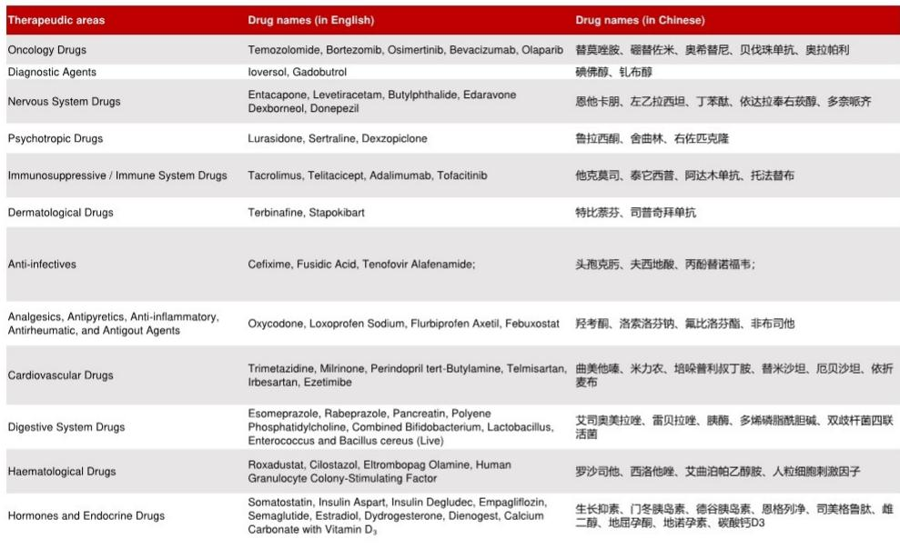

# 中国新版基药目录：不仅是目录更新，更是创新药放量的战略转向

时隔八年，国家卫健委联合国家中医药局、国家疾控局于7月9日发布了2026年版《国家基本药物目录》。本次调整新增109个品种，总数达到794个——其中化学药品和生物制品476个，中成药318个。但数字本身并未完全体现其战略意义。2026版基药目录并非简单扩容，而是有意识地纳入了多个新型药物类别——GLP-1受体激动剂、用于肿瘤和自身免疫性疾病的单克隆抗体、以及靶向治疗药物——这些在以往版本中均未出现。这是基药目录首次大规模纳入创新药，供基层医疗机构广泛使用。对于产品入选的药企而言，信号明确：入选目录意味着放量催化剂，而不仅仅是价格信号。

时间节点值得关注。上一次更新是2018年，八年的间隔反映了调整一份覆盖全国基层医疗网络用药行为的目录的复杂性。2026版基药目录将于2026年9月1日起施行，留给医院和采购系统约14个月的调整期。对于研究者和企业战略制定者而言，布局窗口期有限。目录对治疗领域的优先排序——糖尿病、高血压、慢阻肺、儿科疾病和肿瘤——反映了中国随着人口老龄化和生活方式相关慢性病增多而变化的疾病负担。司美格鲁肽、奥希替尼、贝伐珠单抗、阿达木单抗、泰它西普等品种的加入，表明政府愿意以更高的单位药价换取在传统疗法效果不佳领域更好的长期效果。

核心观点是：2026版基药目录是创新药的放量机制，而非控费工具。懂得如何利用目录准入实现市场渗透的企业将获得更大收益。仅将其视为监管节点的企业则可能错失先机。

## 新型生物制剂与靶向疗法入选，标志着基药目录从仿制药为主的历史定位发生转变

历史上，中国基药目录旨在保障基本药物的可及性——主要是仿制药和专利过期药。2018版目录中生物制剂极少，靶向治疗药物几乎没有。2026版目录彻底打破了这一模式。新增品种包括贝伐珠单抗（肿瘤用单抗）、阿达木单抗（自身免疫病用抗TNF生物制剂）、奥希替尼（非小细胞肺癌用第三代EGFR抑制剂）和司美格鲁肽（糖尿病及体重管理用GLP-1受体激动剂）。这些并非低价普药，而是具有明确临床差异化优势、享有专利保护的高价药物。

纳入这些药物反映了政策层面的考量：中国医疗体系已无法仅依赖廉价老药来应对日益复杂的慢性病负担。仅糖尿病就影响超过1.4亿中国成年人，肥胖和代谢综合征的患病率正在加速上升。司美格鲁肽的入选意味着县级医院的基层医生现在可以开具此前仅在一线城市才能使用的药物。同样，奥希替尼的加入意味着在低层级医院确诊的肺癌患者无需转诊至省级肿瘤中心即可获得标准靶向治疗。其放量潜力巨大。

目录还纳入了碘佛醇、钆布醇等诊断用造影剂。这是一个微妙但重要的补充：表明基药目录不仅用于指导治疗，也在推动诊断路径的标准化。对于生产碘佛醇的恒瑞医药等企业而言，入选目录确保了其在公立医院的基础用量，而此前这一用量存在不确定性。

## 基药目录通过强制采购与处方激励推动放量增长

基药目录入选转化为放量的机制并非理论上的。在占药品销售约80%的中国公立医院体系中，基药目录实际上发挥着处方集的作用。医院必须配备目录内药品，医生通过绩效考核和医保报销规则被激励优先使用这些药物。对于同时纳入国家集中带量采购（VBP）的药物，用量承诺是明确的。即使对于未纳入VBP的药物，基药目录也创造了结构性的需求基础。

以石药集团生产的用于缺血性卒中的药物丁苯酞（NBP）为例。NBP在中国已是重磅品种，但其入选2026版基药目录，正式确立了其作为各级医疗机构卒中标准治疗药物的地位。这意味着此前因成本或目录限制而犹豫是否配备NBP的医院，现在将被要求配备。同样的逻辑适用于荣昌生物用于狼疮肾炎的新型生物制剂泰它西普（泰爱）。泰它西普是一款创新、首创的高价药物。其入选基药目录标志着政府背书，将加速其在全风湿科领域的应用。

对于生物类似药，贝伐珠单抗和阿达木单抗（两者在中国均有多个生物类似药竞争者）的入选创造了不同的动态。基药目录未指定必须使用哪个生物类似药版本，因此放量收益将在各生产商之间分配。信达生物拥有这两种分子的生物类似药，凭借其成熟的商业基础设施，有望获得可观份额。但真正的赢家是整个生物类似药类别：基药目录的入选验证了生物类似药在公立体系中可与原研生物制剂互换使用，这一先例可能加速未来生物类似药的推广。

## 药企决策框架：将基药目录准入视为战略资产，而非价格让步

对于评估中国医药企业的战略制定者和组合管理者而言，2026版基药目录提供了一个清晰的决策框架。第一个问题是：你的产品是否在目录上？如果是，第二个问题是：产品用量对目录入选的弹性如何？对于目前在低层级医院渗透率低的药物，放量提升将很大。对于已广泛处方的药物，增量收益可能有限，但由于处方指南的正式化，仍为正面。

第三个问题是：价格风险如何？基药目录入选不会自动触发降价，但确实使药物面临未来国家医保目录（NRDL）或VBP谈判。企业应模拟情景，其中目录驱动的放量收益可能被后续采购周期中的降价部分抵消。对于具有强大知识产权保护和临床差异化优势的创新药，这种权衡可能有利。对于有多个竞争者的me-too药物，放量收益可能被价格竞争侵蚀。

第四个问题是：基药目录入选如何影响竞争护城河？目录内药物相对于未入选的治疗替代品具有结构性优势。这在多个药物竞争同一适应症的治疗领域尤为相关。例如，在糖尿病领域，司美格鲁肽的目录入选使其相对于其他未入选的GLP-1受体激动剂更具优势。在肿瘤领域，奥希替尼的入选巩固了其相对于被认为疗效欠佳的早期EGFR抑制剂的地位。

该框架也适用于产品未入选的企业。对于这些企业，战略重点是加速临床差异化，或争取在下一轮更新中入选——鉴于政府已表示有意缩短修订间隔，下一轮可能不会等八年。在此期间，这些企业必须在非目录渠道——私立医院、自费市场和线上药房——竞争，这些渠道规模较小且可预测性较低。

## 2026版基药目录重塑治疗领域竞争格局，利好先行者与组合多元化

目录的影响在不同治疗领域并不均匀。在肿瘤领域，奥希替尼、贝伐珠单抗、奥拉帕利和替莫唑胺的入选，在公立体系中为肺癌、卵巢癌和脑癌创建了事实上的标准治疗方案。拥有未入选的竞争产品（如其他PD-1抑制剂或PARP抑制剂）的企业将面临结构性劣势。同时拥有奥希替尼和奥拉帕利的阿斯利康获益尤为突出。对于拥有针对相同机制的管线资产的中国生物科技公司，信号明确：争取入选下一版基药目录应成为开发阶段的目标，而非事后考虑。

在免疫领域，阿达木单抗和泰它西普的入选表明政府认识到中国自身免疫性疾病负担日益加重。阿达木单抗的生物类似药市场已很拥挤，但目录入选将通过使药物在以往未处方的医院可用，扩大总可及市场。泰它西普作为狼疮肾炎的新型疗法，获得了仅靠医生教育需要多年才能建立的商业立足点。

在内分泌领域，司美格鲁肽、恩格列净、门冬胰岛素和德谷胰岛素的入选反映了糖尿病管理的综合方法。GLP-1和SGLT2抑制剂——两种具有互补机制的药物类别——的同时入选，表明政府预期联合治疗将成为标准。销售司美格鲁肽的诺和诺德是主要受益者，但放量效应也将惠及整个糖尿病护理生态系统，包括血糖监测和诊断服务。

在神经领域，丁苯酞、依达拉奉右莰醇、多奈哌齐和左乙拉西坦的入选覆盖了卒中、阿尔茨海默病和癫痫。对于石药集团，其两个关键产品丁苯酞和依达拉奉右莰醇同时入选，创造了强劲的收入增长动力。该公司的产品组合现已深度嵌入基药目录，为未来数年提供了收入可见性。

## 对研究者的战略启示：目录内创新药的放量效应将超过价格压力

中国医疗健康领域研究的传统观点认为，政策变化——无论是VBP、NRDL谈判还是基药目录更新——主要是关于成本控制。2026版基药目录挑战了这一叙事。通过大规模纳入创新药，政府表明其重视临床进步并愿意为此付费，前提是放量通过公立体系进行。关键风险并非价格被压至不可持续水平，而是放量预期已被计入公司估值。对于石药集团、恒瑞医药和信达生物等公司，目录入选是积极催化剂，但放量幅度将取决于执行——具体而言，它们能多快在低线城市提升产能、分销和医院准入。

对于诺和诺德和阿斯利康，目录入选在中国开辟了此前无法进入的新增长渠道。司美格鲁肽尤其在中国具有重磅潜力，考虑到糖尿病和肥胖人群的规模。然而，目录入选并不保证医保报销；司美格鲁肽仍需纳入NRDL才能实现广泛可负担性。目录入选是实现全面市场准入的必要但非充分条件。

2026版基药目录还对更广泛的医疗健康生态系统具有二阶影响。随着更多创新药在基层医疗机构被处方，对诊断基础设施、专科培训和患者监测的需求将上升。提供互补服务的企业——如诊断影像、实验室检测和数字健康平台——可能间接受益。此外，目录对儿科和老年疾病的重视与中国人口趋势一致，表明未来更新将继续优先考虑这些领域。

对于研究者，可操作的见解是区分拥有单一目录内产品的企业和拥有跨多个治疗领域多元化组合的企业。后者具有结构性优势，因为目录的影响是累积的：随着更多产品在后续更新中被添加，收入基础对任何单一药物的价格压力更具韧性。石药集团拥有三个主要神经领域产品在目录上，体现了这种组合效应。恒瑞医药拥有碘佛醇和其他潜在新增品种，处于类似位置。

2026版基药目录并非静态文件。它是一个政策工具，将随着中国疾病负担的变化和新疗法的出现而演变。将其视为一次性事件的企业将错失建立长期放量特许经营权的战略机遇。将目录战略整合到研发、定价和商业规划中的企业，将能更好地应对下一轮医疗改革周期。

*仅供参考。部分内容可能基于源材料通过AI辅助生成、翻译、总结或编辑，可能存在遗漏或错误。请独立核实。本文不构成专业建议。*

仅供参考。部分内容可能基于源材料通过AI辅助生成、翻译、总结或编辑，可能存在遗漏或错误。请独立核实。本文不构成专业建议。

