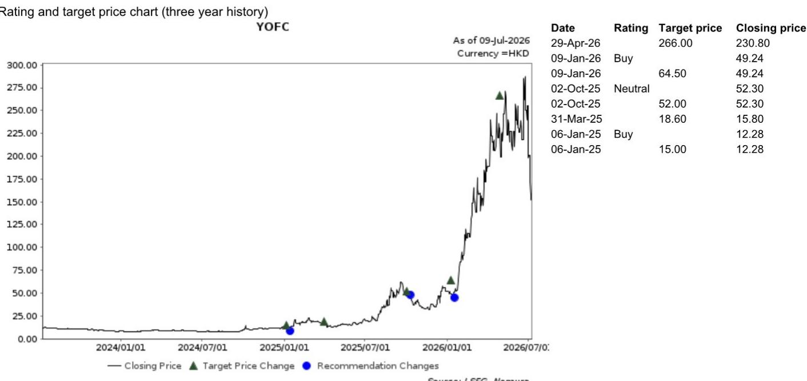

9 July 2026

EQUITY: TECHNOLOGY

# 中国移动公布2026-27年光缆招标快讯

## 事件概述

中国移动（941 HK）于7月8日发布了2026-27年普通光缆集中采购的招标公告。本次普通光缆产品的采购规模约为6920万芯公里，需求满足期为中标结果发布后9个月，折合年化需求约为9230万芯公里。这一年度需求规模较2025-26年采购的9880万芯公里有所调整。中国移动未公布本次招标的报价上限；不过，基于近期光纤行业的价格趋势，我们预计今年的投标报价将有所上升。2025年，光缆产品的加权平均投标报价为每芯公里53.85元人民币（含增值税）（而光纤价格低于每芯公里25元人民币）。我们预计招标结果将在一个月内公布，同时会公布中标供应商的价格和份额分配细节。

## 研究观点

我们认为，光纤需求已从电信市场向AIDC市场发生了显著转变，这导致过去6个月市场现货价格出现明显上涨。对于中国移动2026-27年的招标，我们预计价格将较去年有显著提升，但我们认为参与此次招标的光纤厂商仍会给予作为重要战略客户的中国移动一定的折扣。长飞光纤光缆的股价在过去两周经历了较大幅度的调整，我们认为，若短期不确定性因素消退，长飞光纤光缆可能提供交易机会。长期来看，我们仍需关注主要光纤预制棒厂商是否能保持自律，避免出现供应过剩的局面。我们维持对长飞光纤光缆的积极看法。

<table><tr><td>评级维持</td><td>积极</td></tr><tr><td>目标价维持</td><td>266.00 港元</td></tr><tr><td>2026年7月8日收盘价</td><td>151.90 港元</td></tr></table>

## 研究分析师

中国科技行业

Bing Duan - NIHK

bing.duan1@NOM.com +852 2252 2141

Ethan Zhang - NIHK

ethan.zhang@NOM.com +852 2252 2157

## 附录A-1

本报告由NOM国际（香港）有限公司（NIHK）编制。关于NOM集团实体详情，请参阅免责声明。

## 分析师认证

我，Bing Duan，特此证明：(1) 本研究报告中所表达的观点准确反映了我对相关标的证券或发行人的个人看法；(2) 我的薪酬中没有任何部分直接或间接与本研究报告中的具体建议或观点相关；(3) 我的薪酬中没有任何部分与NOM国际有限公司、NOM国际有限公司或任何其他NOM集团公司进行的任何特定投资银行业务交易挂钩。

## 发行人特定监管披露

本文中使用的“NOM”和“NOM集团”指NOM控股有限公司及其关联公司和子公司，包括在美国注册的经纪交易商和SIPC成员的NOM国际有限公司（'NSI'）和Instinet, LLC（'ILLC'）。

## 主要提及的发行人

<table><tr><td>发行人</td><td>代码</td><td>价格</td><td>价格日期</td><td>股票评级</td><td>行业评级</td><td>披露</td></tr><tr><td>长飞光纤光缆</td><td>6869 HK</td><td>151.90 港元</td><td>2026年7月8日</td><td>积极</td><td>不适用</td><td></td></tr></table>

151.90 港元 (2026年7月8日) 积极 (行业评级: 不适用)  
  
有关评级的解释，请参阅图表后的股票评级说明。

估值方法 我们的目标价266.00港元是基于23.7倍2027财年预期每股收益9.75元人民币，与Wind H股线缆公司市盈率中位数一致。该股票的基准指数为恒生指数。

可能阻碍目标价实现的风险 下行风险包括：1) 中国电信运营商对光纤的需求弱于预期；2) 人工智能网络业务扩张弱于预期；3) 长飞光纤光缆海外市场扩张低于预期。上行风险包括：1) 中国电信运营商需求复苏快于预期；2) 高端人工智能产品（如空芯光纤）渗透快于预期；3) 海外市场扩张快于预期。

## 重要披露

## 研究报告及利益冲突披露的在线获取

NOM集团的研究报告可在 www.NOMnow.com/research、彭博、Capital IQ、Factset、LSEG 上获取。

重要披露可访问 http://go.NOMnow.com/research/m/Disclosures 或向NOM国际有限公司索取。如果您在访问网站时遇到任何困难，请发送电子邮件至 grpsupport@NOM.com 寻求帮助。

负责编写本报告的分析师已根据多种因素获得薪酬，其中包括公司总收入的一部分来自投资银行业务。除非另有说明，本报告首页列出的非美国分析师未在FINRA规则下注册/具备研究分析师资格，可能不是NSI的关联人士，并且可能不受FINRA规则2241关于与所覆盖公司沟通、公开露面以及交易研究分析师账户持有的证券的限制。

NOM全球金融产品有限公司（NGFP）、NOM衍生品有限公司（NDP）和NOM国际有限公司（NIplc）已在美国商品期货交易委员会和美国国家期货协会（NFA）注册为掉期交易商。NGFP、NDPI和NIplc主要从事掉期及其他衍生品交易，其中任何一项都可能成为本报告的主题。

## 评级分布（NOM集团）

NOM集团全球股票研究部发布的所有评级分布如下：

58% 被授予“买入”评级，出于强制披露目的，该评级被归类为“买入”评级；其中33%的公司是NOM集团的投资银行客户*。0% 获得此评级的公司（在EEA受监管市场上市交易）曾接受NOM集团提供的实质性服务**。

39% 被授予“中性”评级，出于强制披露目的，该评级被归类为“持有”评级；其中57%的公司是NOM集团的投资银行客户*。0% 获得此评级的公司（在EEA受监管市场上市交易）曾接受NOM集团提供的实质性服务。

3% 被授予“减持”评级，出于强制披露目的，该评级被归类为“卖出”评级；其中15%的公司是NOM集团的投资银行客户*。0% 获得此评级的公司（在EEA受监管市场上市交易）曾接受NOM集团提供的实质性服务。

*NOM集团的定义见本报告末尾的免责声明部分。
** 根据欧盟市场滥用监管法规的定义。

## NOM集团股票研究评级体系及行业定义

该评级体系是一个相对评级体系，表明相对于为每只股票确定的特定基准（受有限的管理层酌情权限制）的预期表现。分析师的目标价是基于分析师确定的适当估值方法对股票当前内在公允价值的评估。估值方法包括但不限于贴现现金流分析、预期股本回报率和倍数分析。分析师也可能指出相对于所述目标价的预期相对上涨/下跌空间，定义为（目标价 - 当前价格）/ 当前价格。

## 股票

“买入”评级表示分析师预计该股票在未来12个月内的表现将优于基准。“中性”评级表示分析师预计该股票在未来12个月内的表现将与基准一致。“减持”评级表示分析师预计该股票在未来12个月内的表现将逊于基准。“暂停”评级表示评级、目标价和预估已暂时暂停，以遵守适用的法规和/或公司政策。标记为“未评级”或显示为“无评级”的证券和/或公司不在常规研究覆盖范围内。读者不应期望NOM就此类证券和/或公司提供持续或额外的信息。基准如下：美国/欧洲/亚洲（除日本外）：请参阅估值方法以了解股票相关基准的解释，可访问：http://go.NOMnow.com/research/m/Disclosures；全球新兴市场（除亚洲外）：MSCI新兴市场（除亚洲外）指数，除非估值方法中另有说明；日本：罗素/NOM大盘股指数。

## 行业

“看好”立场表示分析师预计该行业在未来12个月内的表现将优于基准。“中性”立场表示分析师预计该行业在未来12个月内的表现将与基准一致。“看淡”立场表示分析师预计该行业在未来12个月内的表现将逊于基准。标记为“未评级”或显示为“不适用”的行业不分配评级。基准如下：美国：标普500指数；欧洲：道琼斯STOXX 600指数；全球新兴市场（除亚洲外）：MSCI新兴市场（除亚洲外）指数。日本/亚洲（除日本外）：不分配行业评级。

## 目标价

如果讨论到目标价，它表示分析师对未来12个月股价的预测，部分反映了分析师对公司盈利的估计。任何目标价的实现都可能受到整体市场和宏观经济趋势、与公司或市场相关的其他风险的阻碍，并且如果公司的盈利与估计不符，则可能无法实现。

## 免责声明

本出版物包含由第1页确定的NOM集团实体准备的材料，并且（如适用）包含一个或多个NOM集团实体的贡献，其员工及其各自隶属关系在第1页或本出版物的其他地方指定。本文中使用的“NOM集团”一词指NOM控股有限公司及其关联公司和子公司，包括：(a) NOM株式会社（'NSC'）日本东京，(b) NOM金融产品欧洲有限公司（'NFPE'）德国，(c) NOM国际有限公司（'NIplc'）英国，(d) NOM国际有限公司（'NSI'）美国纽约，(e) NOM国际（香港）有限公司（'NIHK'）香港，(f) NOM金融投资（韩国）有限公司（'NFIK'）韩国（有关在韩国金融投资协会（'KOFIA'）注册的NOM分析师的信息，可在KOFIA内部网http://dis.kofia.or.kr上找到），(g) NOM新加坡有限公司（'NSL'）新加坡（注册号197201440E，受新加坡金融管理局监管），(h) NOM澳大利亚有限公司（'NAL'）澳大利亚（ABN 48 003 032 513），受澳大利亚证券和投资委员会（'ASIC'）监管，持有澳大利亚金融服务牌照号246412，(i) NOM马来西亚私人有限公司（'NSM'）马来西亚，(j) NIHK台北分公司（'NITB'）台湾，(k) NOM金融咨询与证券（印度）私人有限公司（'NFASL'）印度孟买（注册地址：Ceejay House, Level 11, Plot F, Shivsagar Estate, Dr. Annie Besant Road, Worli, Mumbai- 400 018, India；电话：91 22 4037 4037，传真：91 22 4037 4111；CIN编号：U74140MH2007PTC169116，SEBI股票经纪业务注册号：INZ000255633；SEBI商人银行业务注册号：INM000011419；SEBI研究业务注册号：INH000001014 - 合规官：Pratiksha Tondwalkar女士，91 22 40374904，投诉邮箱：investorgrievancesra@NOM.com 网页：链接

对于涉及印度上市公司或由印度NFASL研究分析师撰写的报告：(i) 证券市场投资存在市场风险。投资前请仔细阅读所有相关文件。(ii) SEBI授予的注册以及NISM的认证绝不保证中介机构的业绩或向读者提供任何回报保证。(iii) NFASL获取研究服务的条款和条件在NFASL网页上披露。

(I) NOM受托研究与咨询有限公司（'NFRC'）日本东京。(m) NOM东方国际证券有限公司（"NOI"）是NOM集团、东方国际（集团）有限公司和上海黄浦投资控股（集团）有限公司共同控股的合资企业。根据中华人民共和国（"中国"，就本文件而言，不包括香港、澳门和台湾）法律，NOI在中国境内获准提供证券研究和研究交流，并独立于NOM集团其他成员运营；特别是，NOI在中国证券中的权益不会向任何其他NOM集团实体披露或与其持仓合并，其他NOM集团实体在中国证券中的权益也不会向NOI披露或与其持仓合并。研究报告首页NOI旁边印有的个人姓名表示该个人受雇于NOI，根据研究合作协议为NIHK提供研究协助。研究报告首页员工姓名旁边的'NSFSPL'表示该个人受雇于NOM结构化融资服务私人有限公司，根据公司间协议为某些NOM实体提供协助。研究报告首页个人姓名旁边的'Verdhana'表示该个人受雇于PT Verdhana Sekuritas Indonesia（'Verdhana'），根据研究合作协议为NIHK提供研究协助，Verdhana及其个人均未在印度尼西亚境外获得许可。

本材料：(I) 仅供您私人参考，我们不基于此材料招揽任何行动；(II) 不应被解释为在任何司法管辖区出售或招揽购买任何证券的要约，在该等司法管辖区此类要约或招揽将是非法的；(III) 除与NOM集团相关的披露外，基于我们认为可靠的来源信息，但未经NOM集团独立核实。

除与NOM集团相关的披露外，NOM集团不保证、陈述或承诺（明示或暗示）本文件是公平、准确、完整、正确、可靠或适合任何特定目的或适销的，并且在法律/法规允许的最大范围内，不承担因使用本文件及相关数据而产生的任何行为（或决定不作为）的责任（无论是过失或其他，以及全部或部分）。在法律/法规允许的最大范围内，NOM集团的所有保证和其他保证特此排除，NOM集团对因使用、误用或分发本材料或其中包含的信息或以其他方式与之相关而产生的任何损失（无论是过失或其他，以及全部或部分）不承担任何责任。

所表达的意见或估计是截至本材料原始发布日期当前的意见，并且其中的信息（包括其中包含的意见和估计）如有更改，恕不另行通知。然而，NOM集团明确表示不承担任何更新或修订本文件的义务，因此也没有责任。本文中的任何评论或陈述均为作者本人的观点，可能与NOM集团内部其他方的观点不同。客户应考虑本报告中的任何建议或推荐是否适合其特定情况，并在适当时寻求专业建议，包括税务建议。NOM集团不提供税务建议。

在适用法律/法规允许的范围内，NOM集团和/或其高级职员、董事、员工和关联方可能作为委托人、代理人或其他身份进行交易，或者对本文提及的发行人或证券、商品或工具，或基于其的期权或其他衍生工具持有多头或空头头寸，或进行买卖。NOM集团公司也可能担任发行人金融工具的市场做市商或流动性提供者（根据英国适用法规的定义）。如果市场做市商活动是根据美国或其他司法管辖区的特定法律法规给出的定义进行的，则将在具体的发行人披露中单独披露。

本文件可能包含从第三方获得的信息，包括但不限于信用评级机构（如标准普尔）的评级。NOM集团特此明确否认对本文材料中包含的或与之相关的任何从第三方获得的信息的原创性、公平性、准确性、完整性、正确性、适销性或特定目的适用性做出任何陈述、保证或承诺，并且不对因使用或误用本文材料中包含的或与之相关的任何从第三方获得的信息而产生的任何直接、间接、附带、示范性、补偿性、惩罚性、特殊或后果性损害、成本、费用、法律费用或损失（包括收入或利润损失和机会成本）承担责任（无论是过失或其他，以及全部或部分）。禁止以任何形式复制和分发第三方内容，除非事先获得相关第三方的书面许可。第三方内容提供者不（明示或暗示）保证任何信息（包括评级）的公平性、准确性、完整性、正确性、及时性或可用性，并且不以任何方式对因使用或误用此类内容而产生的任何错误或遗漏（无论过失或其他）或结果负责，无论其原因如何。第三方内容提供者不提供明示或暗示的保证，包括但不限于任何适销性或特定目的或用途的适用性保证。第三方内容提供者不对因使用或误用其内容（包括评级）而产生的任何直接、间接、附带、示范性、补偿性、惩罚性、特殊或后果性损害、成本、费用、法律费用或损失（包括收入或利润损失和机会成本）承担责任（无论是过失或其他，以及全部或部分）。信用评级是意见陈述，而非事实陈述或购买、持有或出售证券的建议。它们不涉及证券的 suitability 或证券是否适合研究目的，不应作为研究交流依赖。本文件中的任何MSCI来源信息均为MSCI Inc.（'MSCI'）的专有财产。未经MSCI事先书面许可，不得为任何目的（包括创建任何金融产品和任何指数）复制、转载、重新传播、重新分发或使用本信息和任何其他MSCI知识产权（全部或部分）。此信息按“原样”提供。用户承担使用此信息的全部风险。MSCI、其关联方以及任何参与或涉及计算或编制此信息的第三方特此明确否认对本文材料或其中包含的信息或以其他方式与之相关的任何原创性、公平性、准确性、完整性、正确性、适销性或特定目的适用性做出任何陈述、保证或承诺。在不限制前述规定的情况下，MSCI、其任何关联方或任何参与或涉及计算或编制此信息的第三方在任何情况下均不对任何类型的任何损害承担责任（无论是过失或其他，以及全部或部分）。MSCI和MSCI指数是MSCI及其关联方的服务标志。

罗素/NOM日本股票指数的知识产权和任何其他权利属于NOM受托研究与咨询有限公司（'NFRC'）和富时罗素（'Russell'）。NFRC和Russell不保证该指数的公平性、准确性、完整性、正确性、可靠性、有用性、适销性、适销性或特定目的适用性，并且不对任何指数用户和/或其关联方使用该指数进行的业务活动或服务负责。

读者应将本文件视为其做出投资决策的单一因素，因此，本报告不应被视为识别或暗示与任何投资决策相关的所有直接或间接风险。NOM集团制作多种不同类型的研究产品，包括基本面分析和定量分析等；一种研究产品中包含的建议可能与其他类型研究产品中的建议不同，无论是由于不同的时间范围、方法论或其他原因。NOM集团以多种不同方式发布研究产品，包括在NOM集团门户网站上发布产品和/或直接分发给客户。不同的客户群体可能会根据其个人需求从研究部门获得不同的产品和服务。

本文中呈现的数字可能涉及过去的表现或基于过去表现的模拟，这些并非未来或可能表现的可靠指标。如果信息包含对未来表现和业务前景的预期、预测或指示，此类预测可能不是未来或可能表现的可靠指标。此外，模拟基于模型和简化假设，这些假设可能过度简化且不能反映未来的回报分布。本文件中为说明目的创建和发布的任何数字、策略或指数均不旨在用作欧洲基准监管法规定义的“基准”。某些证券会受到汇率波动的影响，这可能对投资的价值或价格或由此产生的收入产生不利影响。

关于固定收益研究：建议分为两类：战术性，通常持续最多三个月；或战略性，通常持续6-12个月。然而，交易建议可能会在情况发生变化时随时进行审查。还提供了交易的“止损”水平；如果触及，将自动关闭交易建议。建议中显示的价格和回报表现是在提交发布时获取的，并基于当时彭博、LSEG或NOM的指示性价格和回报表现。所显示的价格和回报表现不一定是交易建议可以实施的价格。

本文所述的证券可能尚未根据1933年美国证券法（“1933年法案”）注册，在这种情况下，除非已根据1933年法案注册，或符合1933年法案注册要求的豁免条件，否则不得在美国或向美国人发行或出售。除非管辖法律允许，否则任何交易均应通过您所在司法管辖区的NOM实体执行。

本文件已获批准在英国作为投资研究由NIplc分发。NIplc由审慎监管局授权，并受金融行为监管局和审慎监管局监管。NIplc是伦敦证券交易所的成员。本文件不构成英国适用法规意义上的个人推荐，也未考虑个人读者的特定投资目标、财务状况或需求。本文件仅适用于英国适用法规意义上的“合格交易对手”或“专业客户”读者，因此，不得重新分发给此类目的的“零售客户”。

本文件已获批准在欧洲经济区作为投资研究由NOM金融产品欧洲有限公司（“NFPE”）分发。NFPE是一家根据德国法律注册成立的有限责任公司，在法兰克福/美因河畔法院商业登记处注册，编号为HRB 110223。NFPE由德国联邦金融监管局（BaFin）授权和监管。

本文件已获NIHK批准，NIHK受香港证券及期货事务监察委员会监管，由NIHK在香港分发。本文件仅适用于香港适用法规意义上的“专业读者”，因此，不得重新分发给非此类目的的“专业读者”。

本文件已获批准在澳大利亚由NAL分发，NAL在澳大利亚由ASIC授权和监管。

本文件也已获批准在马来西亚由NSM分发。

在新加坡，本文件由NSL分发，NSL是根据《金融顾问法》（第110章）定义的豁免金融顾问（除其他外），并受新加坡金融管理局监管。NSL可根据《金融顾问条例》第32C条规定的安排，分发其外国关联公司制作的本文件。本文件适用于《证券及期货法》（第289章）定义的认可、专家或机构读者。如果本文件的接收者不是认可、专家或机构读者，NSL仅在法律要求的范围内对此类接收者承担本文件内容的法律责任。新加坡的本文件接收者应就本文件引起或与之相关的事项联系NSL。本文件旨在广泛传播。它没有考虑任何特定个人的具体投资目标、财务状况或特殊需求。接收者在承诺购买任何证券之前，应考虑其具体的投资目标、财务状况或特殊需求，包括根据其认为合适的方式，通过单独约定寻求独立财务顾问关于投资适宜性的建议。除非1933年法案S条例的规定禁止，否则本材料在美国由美国注册经纪交易商NSI分发，NSI根据1934年美国证券交易法规则15a-6的规定对其内容负责。准备本文件的实体允许其NOM集团内单独运营的关联公司向其客户提供此类文件的副本。

本文件未获批准分发给沙特阿拉伯王国（“沙特阿拉伯”）的“授权人士”、“豁免人士”或“机构”（由资本市场管理局定义），或阿拉伯联合酋长国（“阿联酋”）的“市场交易对手”或“专业客户”（由迪拜金融服务局定义），或卡塔尔国（“卡塔尔”）的“市场交易对手”或“商业客户”（由卡塔尔金融中心监管局定义），由NOM沙特阿拉伯、NIplc或任何其他NOM集团成员（视情况而定）分发。本文件及其任何副本不得由未经授权的人士带入、传输或分发（直接或间接）到沙特阿拉伯、阿联酋或卡塔尔，或分发给沙特阿拉伯境内的“授权人士”、“豁免人士”或“机构”以外的任何人，或阿联酋的“市场交易对手”或“专业客户”以外的任何人，或卡塔尔的“市场交易对手”或“商业客户”以外的任何人。未能遵守这些限制可能构成违反阿联酋、沙特阿拉伯或卡塔尔的法律。

对于涉及台湾上市公司或由台湾研究分析师撰写的报告：

本文件仅供参考。您应独立评估投资风险，并对您的投资决策全权负责。未经NOM集团书面授权，不得复制或引用本报告的任何部分给媒体或任何其他人。根据台湾《证券商受托买卖有价证券管理规则》和/或其他适用法律法规，您不得将报告提供给他人（包括但不限于关联方、关联公司和任何其他第三方）或从事任何可能涉及利益冲突的报告相关活动。关于NOM国际（香港）有限公司台北分公司不可执行的证券/工具的信息仅供参考，不应被解释为建议或招揽交易此类证券/工具。

本材料不得在印度尼西亚境内分发，或传递给印度尼西亚共和国境内的任何人，或传递给印度尼西亚公民（无论其居住地或所在地）或印度尼西亚的实体或居民，其方式构成印度尼西亚共和国法律下的公开发售。本文件中提及的证券不得在印度尼西亚发行或出售给印度尼西亚公民（无论其居住地或所在地）或印度尼西亚的实体或居民，其方式构成印度尼西亚共和国法律下的公开发售。

研究报告首页NOI旁边印有的个人姓名表示本文件是NOI在中国发布的研究报告的翻译版本。在所有其他情况下，本文件由未在中国获得提供证券研究许可的NOM集团或其子公司或关联公司（统称“离岸发行人”）编制。本研究报告未获批准或旨在在中国境内分发。任何A股相关分析（如有）并非为位于或注册于中国的任何人制作。接收者不应依赖本研究报告中包含的任何信息做出投资决策，离岸发行人不对此承担任何责任。未经NOM集团成员事先书面同意，不得以任何形式（I）复制、影印、复制或复印本材料的任何部分；或（II）重新传播、重新发布或重新分发本材料的任何部分。如果本文件通过电子传输（例如电子邮件）分发，则无法保证此类传输是安全或无错误的，因为信息可能被拦截、损坏、丢失、销毁、延迟到达或不完整，或包含病毒。因此，发送方不对本文件内容中可能因电子传输而产生的任何错误或遗漏承担责任（无论是过失或其他，以及全部或部分）。如果需要验证，请索取硬拷贝版本。

NOM集团通过其合规政策和程序（包括但不限于利益冲突、中国墙和保密政策）以及通过维护中国墙和员工培训来管理与研究制作相关的冲突。

如需获取有关本文件中包含的任何研究交流所使用的方法或模型的更多信息，请联系本文件首页列出的NOM研究分析师。可根据要求提供披露信息，披露信息可在NOM披露网页上获取：

http://go.NOMnow.com/research/m/Disclosures

版权所有 © 2026 NOM国际（香港）有限公司，香港。保留所有权利。
