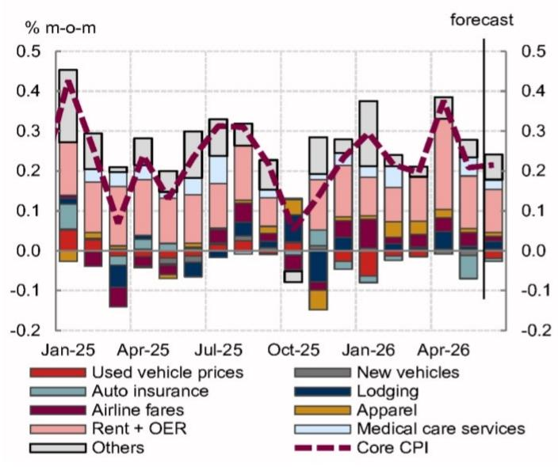
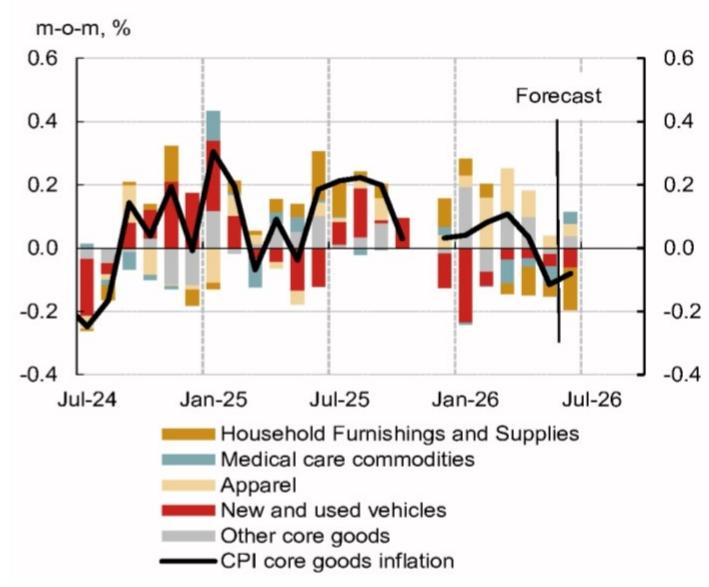
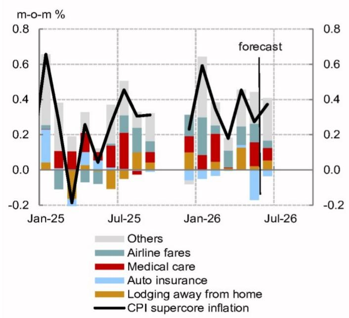
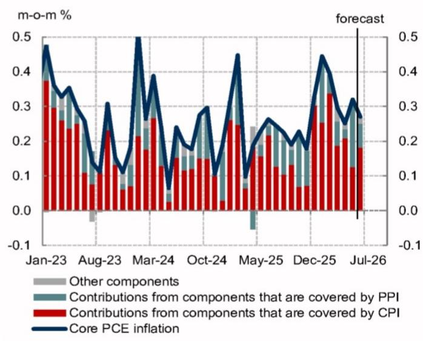
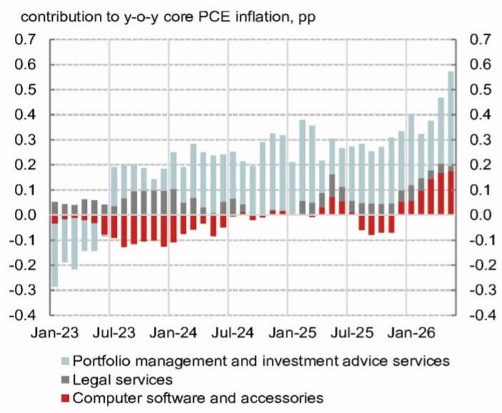
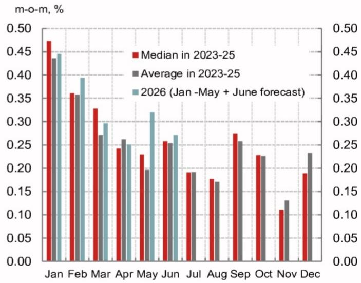

## 宏观观察

- 我们预计6月核心CPI环比涨幅保持在0.215%附近，与5月的0.208%基本持平。6月核心商品价格涨幅仍为负值，而核心服务类CPI有所上升。

- 综合CPI和PPI数据来看，6月核心PCE价格涨幅可能从5月的0.320%小幅回落至0.271%，同比涨幅维持在3.4%，仍明显高于目标水平。不过，考虑到即将对部分PCE价格采用的统计方法调整，核心PCE涨幅不太可能超过预测中值所暗示的水平。

## 研究分析师

北美经济研究

Aichi Amemiya - NSI
aichi.amemiya@NOM.com
+1 212 667 9347

Jeremy Schwartz - NSI
jeremy.schwartz@NOM.com
+1 212 667 9637

Ruchir Sharma - NSI  
ruchir.sharma@NOM.com  
+1 212 667 9186

- 美联储宣布了五个工作组的成员名单。我们认为，成员的选择并未对未来政策路径释放出明确的倾向信号。工作组未来的工作更可能是渐进式的，而非颠覆性的。

## 预计核心CPI涨幅将保持温和

我们预计6月核心CPI环比涨幅保持在0.215%附近，此前5月和4月分别上涨0.208%和0.376%（图1）。

关税的影响正在减弱，二手车价格也有所下降。当月半导体短缺并未对消费电子价格造成明显的上行压力。因此，我们预计CPI核心商品价格将连续第二个月下降（图2）。

图1：预计6月核心CPI环比涨幅保持在0.215%附近

核心CPI环比涨幅分解

  
注：对于2025年10月未公布的CPI分项，我们假设基于调查的分项在未季调基础上无变化，但进行了季节性调整。  
来源：BLS, Haver, NOM

图2：6月核心商品价格涨幅可能仍为负值，部分原因是二手车价格下降 核心商品CPI环比涨幅分解  
  
来源：BLS, Haver, NOM

我们预测6月核心服务类CPI环比涨幅为0.373%，高于5月的0.273%（图3）。酒店住宿价格可能有所上涨，部分受到世界杯的提振。相比之下，我们预计交通服务价格涨幅在6月保持温和，因为月中航空燃油价格下降似乎对机票价格产生了影响。

我们预计常规租金和业主等价租金（OER）的涨幅在6月分别放缓至0.24%和0.28%，因为5月的暂时性走强在6月可能有所消退。

图3：6月核心服务类CPI涨幅可能加快 核心服务类CPI环比涨幅分解  
  
来源：BLS, Haver, NOM

  
来源：BLS, BEA, Haver, NOM

基于我们对CPI和PPI数据的预测，我们预计6月核心PCE涨幅将从5月的0.320%小幅回落至0.271%，这将使同比涨幅维持在3.4%（图4）。6月CPI数据中的一些预期疲软并未传导至核心PCE，而PPI中的投资组合管理和投资咨询服务价格（核心PCE的关键输入项）在6月似乎以2.7%的环比速度稳健增长，这有助于核心PCE涨幅超过核心CPI。

正如我们近期报告中所讨论的，BEA将大幅改变其对计算机软件及配件、投资组合管理和投资咨询服务以及法律服务PCE价格的估算方法。这些分项对5月核心PCE同比涨幅的合计贡献约为60个基点（图5）。我们估计，这些方法上的调整将使核心PCE同比涨幅降低约20个基点。在此背景下，政策制定者可能会对投资组合管理和投资咨询价格带来的预期提振（对6月核心PCE涨幅贡献约5个基点）打一些折扣。

展望6月之后，我们预计关税影响的减弱、原油价格下降、工资增长放缓以及负面的残余季节性因素（图6）将导致核心PCE涨幅逐步放缓，这与我们对美联储在2027年底前不会调整利率的判断一致。

图5：投资组合管理与投资咨询服务、计算机软件及配件显著推高了核心PCE涨幅

受方法调整影响的分项对核心PCE同比涨幅的贡献

  
来源：BEA, Haver, NOM

图6：下半年核心PCE环比涨幅往往受到负面残余季节性因素的影响 过去三年各月核心PCE环比涨幅的中位数和均值 vs. 2026年  
  
来源：BEA, Haver, NOM

## 美联储工作组名单公布

作为主席Warsh对货币政策框架更广泛评估的一部分，美联储宣布了五个工作组的领导层。我们认为，成员的选择在利率政策方面并未显示出明确的倾向。基于这些人事选择，我们预计政策建议将是渐进式的，而非颠覆性的。

在某些情况下，例如资产负债表工作组，Warsh纳入了可能反对他长期持有观点的成员，这表明工作组的结果并非既定事实。我们认为这将增加工作组未来工作的可信度。

尽管工作组的目的是讨论财政政策，但一些成员似乎倾向于限制使用美联储的资产负债表来配合扩张性财政政策，这与Warsh此前关于美联储应“退出财政业务”的评论一致。

存在一种风险，即FOMC的大多数参与者可能不接受工作组的政策建议，这些建议预计将在今年年底前提交。值得注意的是，纽约联储主席Williams将工作组的时间表描述为“相当激进”。

主席Warsh宣布了五个工作组的领导层。美联储声明指出，每个工作组将考虑政策制定者的手段和方法、分析工具以及政策方法是否可以改进。成员包括前央行官员、行业专业人士和学者。总体而言，该声明表明评估是全面的，并非侧重于狭窄的目标。

## Warsh下周的证词不太可能带来新信息

就下周的美联储官员讲话而言，重点是Warsh周二在众议院金融服务委员会和周三在参议院银行委员会的首次半年度证词。鉴于可负担性问题处于讨论的中心，Warsh将强调实现价格稳定的重要性，但不会具体说明如何实现。既然五个工作组即将开始工作，我们预计当被问及货币政策前景时，Warsh将把问题交由工作组未来的工作来回答。此外，理事Waller、Barr、Cook、Bowman和Jefferson，以及地区联储主席Williams、Musalem、Logan和Schmid下周也将公开发言。

## 增长动能持续

下周公布的数据可能显示增长继续保持韧性。我们预计6月零售销售增速从5月的0.9%放缓至0.3%。疲软主要源于汽油销售下降，而其他分项依然强劲。工业生产可能反弹，受到制造业产出增强的支撑，包括汽车和核心制造业的增长。

## 第二季度GDP跟踪

我们将第二季度GDP跟踪预测从上周的2.4%下调至2.3%（环比年化）。

我们对面向国内私人购买者的实际最终销售的预测小幅上调至2.9%。

图7：NOM的价格预测（未考虑即将对部分PCE价格采用的方法调整影响）

<table><tr><td rowspan="2"></td><td colspan="2">整体PCE</td><td colspan="3">核心PCE</td><td colspan="2">整体CPI</td><td colspan="3">核心CPI</td><td>CPI NSA</td></tr><tr><td>环比%</td><td>同比%</td><td>环比%</td><td>同比%</td><td>季度同比%</td><td>环比%</td><td>同比%</td><td>环比%</td><td>同比%</td><td>季度同比%</td><td>指数</td></tr><tr><td>2025年1月</td><td>0.35</td><td>2.61</td><td>0.31</td><td>2.78</td><td></td><td>0.43</td><td>3.00</td><td>0.43</td><td>3.26</td><td></td><td>317.671</td></tr><tr><td>2025年2月</td><td>0.40</td><td>2.71</td><td>0.45</td><td>2.97</td><td></td><td>0.23</td><td>2.82</td><td>0.25</td><td>3.12</td><td></td><td>319.082</td></tr><tr><td>2025年3月</td><td>0.02</td><td>2.36</td><td>0.10</td><td>2.67</td><td>2.81</td><td>0.03</td><td>2.39</td><td>0.07</td><td>2.79</td><td>3.08</td><td>319.799</td></tr><tr><td>2025年4月</td><td>0.17</td><td>2.28</td><td>0.19</td><td>2.61</td><td></td><td>0.16</td><td>2.31</td><td>0.24</td><td>2.78</td><td></td><td>320.795</td></tr><tr><td>2025年5月</td><td>0.18</td><td>2.46</td><td>0.23</td><td>2.78</td><td></td><td>0.10</td><td>2.35</td><td>0.13</td><td>2.79</td><td></td><td>321.465</td></tr><tr><td>2025年6月</td><td>0.29</td><td>2.59</td><td>0.26</td><td>2.81</td><td>2.74</td><td>0.25</td><td>2.67</td><td>0.23</td><td>2.93</td><td>2.82</td><td>322.561</td></tr><tr><td>2025年7月</td><td>0.17</td><td>2.61</td><td>0.25</td><td>2.86</td><td></td><td>0.23</td><td>2.70</td><td>0.31</td><td>3.06</td><td></td><td>323.048</td></tr><tr><td>2025年8月</td><td>0.26</td><td>2.75</td><td>0.22</td><td>2.91</td><td></td><td>0.35</td><td>2.92</td><td>0.31</td><td>3.11</td><td></td><td>323.976</td></tr><tr><td>2025年9月</td><td>0.26</td><td>2.79</td><td>0.19</td><td>2.83</td><td>2.87</td><td>0.30</td><td>3.01</td><td>0.22</td><td>3.02</td><td>3.06</td><td>324.800</td></tr><tr><td>2025年10月</td><td>0.19</td><td>2.71</td><td>0.23</td><td>2.75</td><td></td><td>0.03</td><td>2.76</td><td>0.11</td><td>2.81</td><td></td><td>324.372</td></tr><tr><td>2025年11月</td><td>0.22</td><td>2.82</td><td>0.18</td><td>2.83</td><td></td><td>0.22</td><td>2.74</td><td>0.08</td><td>2.63</td><td></td><td>324.122</td></tr><tr><td>2025年12月</td><td>0.33</td><td>2.88</td><td>0.33</td><td>2.97</td><td>2.85</td><td>0.30</td><td>2.68</td><td>0.23</td><td>2.64</td><td>2.69</td><td>324.054</td></tr><tr><td>2026年1月</td><td>0.35</td><td>2.88</td><td>0.44</td><td>3.10</td><td></td><td>0.17</td><td>2.39</td><td>0.30</td><td>2.50</td><td></td><td>325.252</td></tr><tr><td>2026年2月</td><td>0.40</td><td>2.87</td><td>0.39</td><td>3.05</td><td></td><td>0.27</td><td>2.41</td><td>0.22</td><td>2.46</td><td></td><td>326.785</td></tr><tr><td>2026年3月</td><td>0.67</td><td>3.54</td><td>0.30</td><td>3.25</td><td>3.14</td><td>0.87</td><td>3.26</td><td>0.20</td><td>2.60</td><td>2.53</td><td>330.213</td></tr><tr><td>2026年4月</td><td>0.41</td><td>3.80</td><td>0.25</td><td>3.32</td><td></td><td>0.64</td><td>3.81</td><td>0.38</td><td>2.75</td><td></td><td>333.020</td></tr><tr><td>2026年5月</td><td>0.45</td><td>4.07</td><td>0.32</td><td>3.41</td><td></td><td>0.47</td><td>4.25</td><td>0.21</td><td>2.85</td><td></td><td>335.123</td></tr><tr><td>2026年6月</td><td>0.038</td><td>3.814</td><td>0.271</td><td>3.420</td><td>3.38</td><td>-0.203</td><td>3.754</td><td>0.215</td><td>2.804</td><td>2.79</td><td>334.671</td></tr><tr><td>2026年7月</td><td>0.12</td><td>3.76</td><td>0.21</td><td>3.38</td><td></td><td>0.07</td><td>3.60</td><td>0.22</td><td>2.71</td><td></td><td>334.675</td></tr><tr><td>2026年8月</td><td>0.22</td><td>3.71</td><td>0.20</td><td>3.36</td><td></td><td>0.24</td><td>3.48</td><td>0.22</td><td>2.62</td><td></td><td>335.244</td></tr><tr><td>2026年9月</td><td>0.20</td><td>3.65</td><td>0.20</td><td>3.37</td><td>3.37</td><td>0.21</td><td>3.37</td><td>0.22</td><td>2.61</td><td>2.65</td><td>335.759</td></tr><tr><td>2026年10月</td><td>0.14</td><td>3.60</td><td>0.22</td><td>3.36</td><td></td><td>0.09</td><td>3.43</td><td>0.22</td><td>2.73</td><td></td><td>335.500</td></tr><tr><td>2026年11月</td><td>0.21</td><td>3.59</td><td>0.21</td><td>3.39</td><td></td><td>0.22</td><td>3.41</td><td>0.22</td><td>2.87</td><td></td><td>335.177</td></tr><tr><td>2026年12月</td><td>0.25</td><td>3.50</td><td>0.21</td><td>3.27</td><td>3.34</td><td>0.28</td><td>3.37</td><td>0.22</td><td>2.85</td><td>2.82</td><td>334.989</td></tr><tr><td>2027年1月</td><td>0.20</td><td>3.35</td><td>0.25</td><td>3.07</td><td></td><td>0.18</td><td>3.39</td><td>0.27</td><td>2.82</td><td></td><td>336.286</td></tr><tr><td>2027年2月</td><td>0.15</td><td>3.09</td><td>0.20</td><td>2.88</td><td></td><td>0.12</td><td>3.25</td><td>0.20</td><td>2.80</td><td></td><td>337.403</td></tr><tr><td>2027年3月</td><td>0.19</td><td>2.60</td><td>0.20</td><td>2.78</td><td>2.91</td><td>0.18</td><td>2.57</td><td>0.20</td><td>2.80</td><td>2.81</td><td>338.703</td></tr><tr><td>2027年4月</td><td>0.13</td><td>2.31</td><td>0.20</td><td>2.73</td><td></td><td>0.08</td><td>1.98</td><td>0.19</td><td>2.62</td><td></td><td>339.597</td></tr><tr><td>2027年5月</td><td>0.15</td><td>2.00</td><td>0.20</td><td>2.61</td><td></td><td>0.11</td><td>1.59</td><td>0.19</td><td>2.60</td><td></td><td>340.448</td></tr><tr><td>2027年6月</td><td>0.16</td><td>2.13</td><td>0.20</td><td>2.53</td><td>2.62</td><td>0.14</td><td>1.94</td><td>0.19</td><td>2.57</td><td>2.60</td><td>341.162</td></tr><tr><td>2027年7月</td><td>0.18</td><td>2.19</td><td>0.19</td><td>2.52</td><td></td><td>0.17</td><td>2.04</td><td>0.19</td><td>2.54</td><td></td><td>341.509</td></tr><tr><td>2027年8月</td><td>0.19</td><td>2.17</td><td>0.19</td><td>2.50</td><td></td><td>0.20</td><td>2.00</td><td>0.18</td><td>2.50</td><td></td><td>341.952</td></tr><tr><td>2027年9月</td><td>0.21</td><td>2.18</td><td>0.19</td><td>2.48</td><td>2.50</td><td>0.23</td><td>2.02</td><td>0.18</td><td>2.47</td><td>2.50</td><td>342.557</td></tr><tr><td>2027年10月</td><td>0.15</td><td>2.19</td><td>0.19</td><td>2.45</td><td></td><td>0.12</td><td>2.06</td><td>0.18</td><td>2.43</td><td></td><td>342.397</td></tr><tr><td>2027年11月</td><td>0.21</td><td>2.20</td><td>0.18</td><td>2.43</td><td></td><td>0.23</td><td>2.08</td><td>0.18</td><td>2.38</td><td></td><td>342.137</td></tr><tr><td>2027年12月</td><td>0.25</td><td>2.19</td><td>0.18</td><td>2.40</td><td>2.43</td><td>0.28</td><td>2.09</td><td>0.18</td><td>2.34</td><td>2.38</td><td>341.981</td></tr></table>

来源：BLS, BEA, Haver, NOM  
注：10月和11月CPI为NOM的估计值。

## 数据预览

## 未来一周

我们预计6月核心CPI环比上涨0.215%。

消费者价格（周二）：我们预计6月核心CPI环比涨幅保持在0.215%附近，此前5月为0.208%。

关税影响的减弱和二手车价格下降可能使核心商品价格环比涨幅保持在负值区间。

我们预计6月核心服务类CPI环比涨幅从5月的0.273%加快至0.373%。酒店住宿价格上涨的正面影响似乎被机票价格和医疗服务价格涨幅放缓部分抵消。租金相关分项的价格涨幅在5月意外上行后，6月可能回落。

我们预计6月CPI能源价格环比下降5.2%，主要受汽油价格下跌影响。这可能导致整体CPI环比涨幅降至-0.203%。

基于我们对CPI和PPI的预测，6月核心PCE涨幅可能从5月的0.320%放缓至0.271%（或年化3.3%）。

尽管6月核心PCE涨幅可能仍高于2%的年化水平，但我们预计整体CPI的负增长以及即将对PCE价格采用的方法调整将使美联储在7月FOMC会议上保持耐心。

PPI（周三）：能源价格下降可能拖累整体PPI涨幅，而剔除波动较大的能源、食品和贸易服务的“核心”PPI似乎仍为正值。关注制成品价格是否对近期大宗商品价格下跌做出反应很重要。此外，随着关注点从关税/原油价格转向AI引发的价格压力，PPI中包括半导体在内的电子元器件价格值得关注。在PCE相关的分项中，我们预计PPI的投资组合管理和投资咨询服务价格在6月继续以2.7%的环比速度稳健增长，此前5月为4.9%。我们假设PPI的国内机票价格在6月环比下降0.5%，但该分项对近期航空燃油价格波动的反应程度尚不确定。

褐皮书（周三）：下一份褐皮书对经济活动的总体评估可能会上调，以反映AI商业投资支持的强劲经济活动。然而，与5月褐皮书的情况一样，下一份褐皮书可能会强调家庭之间更深的K型分化。在价格方面，可能会报告由于大宗商品价格下跌导致的价格压力缓解。此外，企业可能报告称，中低收入家庭面临的财务压力增加使消费者对价格上涨更加敏感。最后，5月褐皮书提到11个地区的就业“几乎没有变化”，这与近期非农就业增长的强劲表现不一致。我们预计下周褐皮书对就业增长的评估将有所上调。

零售销售（周四）：我们预计6月零售销售环比增长0.3%，此前5月为0.9%。放缓主要源于加油站销售下降，因为实际销售略有下降，且汽油价格在美伊停火后当月下跌。然而，剔除汽油销售后，消费依然强劲，受到稳定的工资收入增长和更高的退税支持。

我们预计名义控制组零售销售环比增长0.6%，受亚马逊Prime Day和其他促销活动推动的在线销售回升带动。汽车及零部件销售增长也略有上升，因为6月汽车销量大幅反弹。

NAHB住房市场指数（周四）：我们预计7月NAHB住房市场指数从6月的35升至37。调查参考期间抵押贷款利率略有下降，且美伊停火宣布，这可能是建筑商信心的利好因素。

失业金申请（周四）：本周初请失业金人数小幅下降，而续请失业金人数上升。尽管裁员公告有所增加，但申请人数仍处于低位，表明劳动力市场具有韧性。

成屋签约销售（周四）：我们预计6月成屋签约销售环比下降0.7%，为1月以来首次月度下降。Redfin的周度数据显示当月签约销售有所放缓。

进口价格（周五）：我们预计6月进口价格下降，因为原油价格在美伊停火后回落。剔除石油的进口价格可能因美元走弱的滞后效应而上涨。注意，BLS进口价格的范围不包括关税。

工业生产（周五）：我们预计6月工业生产环比增长从5月的0.1%反弹至0.6%。制造业产出可能环比增长0.4%，受强劲的汽车及零部件生产推动。

核心制造业（即制造业剔除汽车及零部件生产）可能环比增长0.3%。制造业调查显示当月产出增长，且该行业整体就业有所改善。6月波动较大的分项表现不一，电力公用事业产出的强劲增长超过了采矿产出的放缓。

新屋开工（周五）：我们预计6月新屋开工从5月意外下降的1177k反弹至1310k。建筑许可等领先指标表明6月独栋住宅开工可能依然强劲，而波动较大的多户住宅部分部分逆转了5月的急剧下降。6月建筑许可可能环比下降0.3%。

密歇根大学消费者信心（周五）：我们预计7月密歇根大学消费者信心指数初值从6月的49.5小幅升至51.0。调查访谈期始于美伊停火宣布之后，这对信心可能是一个积极因素。调查参考期间能源价格下跌，股价小幅走高，而旧金山联储每日新闻情绪指数和Morning Consult调查的高频数据指向消费者信心的温和改善。

图8：7月13日当周经济指标预测

<table><tr><td colspan="2">7月13日 周一</td><td>单位</td><td>时期</td><td>前值2</td><td>前值1</td><td>最新</td><td>NOM</td><td>共识</td></tr><tr><td>14:00</td><td>预算报告</td><td>$bn</td><td>6月</td><td>-164.1</td><td>215.0</td><td>-292.6</td><td>n.a.</td><td>n.a.</td></tr><tr><td colspan="9">7月14日 周二</td></tr><tr><td>6:00</td><td>NFIB小企业调查</td><td>指数</td><td>6月</td><td>95.8</td><td>95.9</td><td>95.3</td><td>n.a.</td><td>95.5</td></tr><tr><td>8:30</td><td>消费者价格</td><td>% 环比</td><td>6月</td><td>0.9</td><td>0.6</td><td>0.5</td><td>-0.203</td><td>-0.1</td></tr><tr><td>8:30</td><td>消费者价格</td><td>% 同比</td><td>6月</td><td>3.3</td><td>3.8</td><td>4.2</td><td>3.754</td><td>3.9</td></tr><tr><td>8:30</td><td>核心CPI</td><td>% 环比</td><td>6月</td><td>0.2</td><td>0.4</td><td>0.2</td><td>0.215</td><td>0.3</td></tr><tr><td>8:30</td><td>核心CPI</td><td>% 同比</td><td>6月</td><td>2.6</td><td>2.8</td><td>2.9</td><td>2.804</td><td>2.9</td></tr><tr><td>8:30</td><td>消费者价格 (NSA)</td><td>指数</td><td>6月</td><td>330.2</td><td>333.0</td><td>335.1</td><td>334.671</td><td>334.800</td></tr><tr><td colspan="9">7月15日 周三</td></tr><tr><td>7:00</td><td>抵押贷款申请</td><td>% 周环比</td><td>7月10日</td><td>1.0</td><td>0.0</td><td>-2.2</td><td>n.a.</td><td>n.a.</td></tr><tr><td>8:30</td><td>PPI最终需求</td><td>% 环比</td><td>6月</td><td>0.7</td><td>1.1</td><td>1.1</td><td>n.a.</td><td>0.0</td></tr><tr><td>8:30</td><td>PPI剔除食品和能源</td><td>% 环比</td><td>6月</td><td>0.3</td><td>0.7</td><td>0.4</td><td>n.a.</td><td>0.4</td></tr><tr><td>8:30</td><td>帝国州调查</td><td>指数</td><td>7月</td><td>11.0</td><td>19.6</td><td>5.7</td><td>n.a.</td><td>9.3</td></tr><tr><td>14:00</td><td>褐皮书</td><td></td><td>7月</td><td></td><td></td><td></td><td></td><td></td></tr><tr><td colspan="9">7月16日 周四</td></tr><tr><td>8:30</td><td>初请失业金人数</td><td>000s</td><td>7月11日</td><td>216</td><td>217</td><td>215</td><td>n.a.</td><td>n.a.</td></tr><tr><td>8:30</td><td>续请失业金人数</td><td>000s</td><td>7月4日</td><td>1812</td><td>1806</td><td>1814</td><td>n.a.</td><td>n.a.</td></tr><tr><td>8:30</td><td>零售销售</td><td>% 环比</td><td>6月</td><td>1.7</td><td>0.4</td><td>0.9</td><td>0.3</td><td>0.3</td></tr><tr><td>8:30</td><td>零售销售“控制组”</td><td>% 环比</td><td>6月</td><td>0.9</td><td>0.5</td><td>0.7</td><td>0.6</td><td>0.4</td></tr><tr><td>8:30</td><td>零售销售剔除汽车</td><td>% 环比</td><td>6月</td><td>2.0</td><td>0.7</td><td>0.8</td><td>0.0</td><td>-0.1</td></tr><tr><td>10:00</td><td>NAHB住房市场指数</td><td>指数</td><td>7月</td><td>34</td><td>37</td><td>35</td><td>37</td><td>35</td></tr><tr><td>10:00</td><td>商业库存</td><td>% 环比</td><td>5月</td><td>0.4</td><td>1.0</td><td>0.5</td><td>n.a.</td><td>n.a.</td></tr><tr><td>10:00</td><td>成屋签约销售</td><td>% 环比</td><td>6月</td><td>1.7</td><td>0.3</td><td>3.8</td><td>-0.7</td><td>n.a.</td></tr><tr><td colspan="9">7月17日 周五</td></tr><tr><td>8:30</td><td>进口价格</td><td>% 环比</td><td>6月</td><td>0.9</td><td>2.0</td><td>1.9</td><td>n.a.</td><td>n.a.</td></tr><tr><td>8:30</td><td>进口价格剔除石油</td><td>% 环比</td><td>6月</td><td>0.0</td><td>0.5</td><td>0.8</td><td>n.a.</td><td>n.a.</td></tr><tr><td
