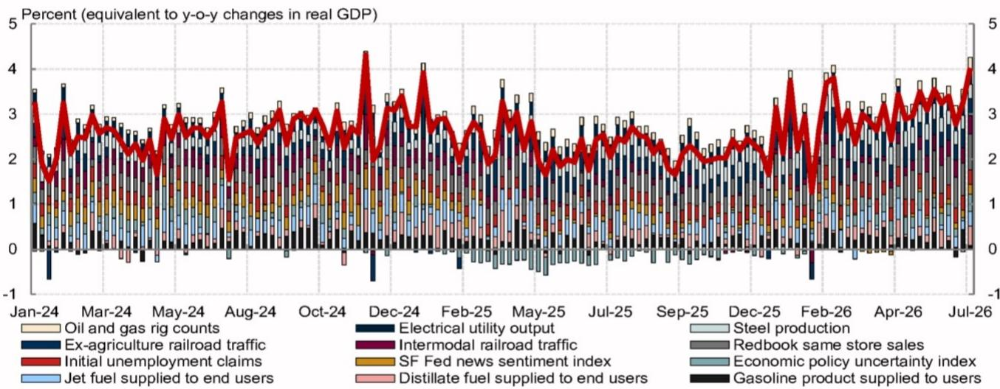
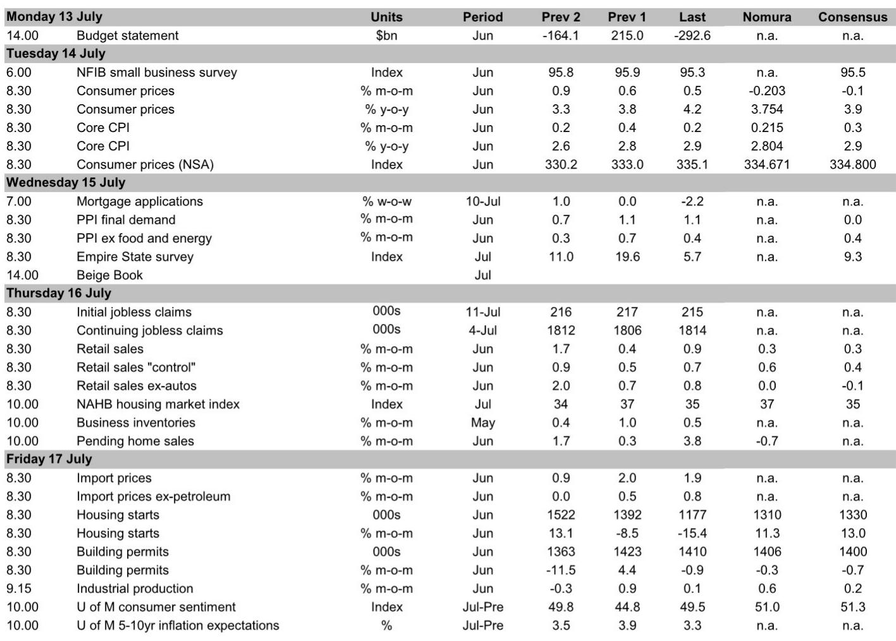
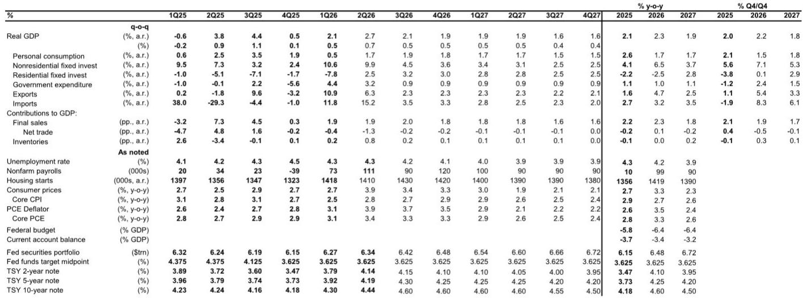

# 核心通胀仍高于目标，但美联储已为耐心构建了可信理由

6月通胀数据将呈现一个熟悉的故事：去通胀进程已停滞，但并未逆转。核心CPI预计环比上涨0.215%，与5月的0.208%几乎持平；而核心PCE通胀预计仅从0.320%小幅放缓至0.271%。这使得核心PCE同比维持在3.4%，仍比美联储2%的目标高出超过一个百分点。“通胀粘性”这一总体叙事依然成立，但对市场而言，战略性问题并非通胀下降速度是否足够快——而是制度与方法论背景是否已发生足够变化，使美联储能够维持当前立场直至2027年。

当前阶段的独特之处不在于通胀数据本身，而在于三种结构性发展同时出现，共同构成了反对加息周期的理由。首先，美国经济分析局正在实施方法调整，以改进其对计算机软件、投资组合管理服务及法律服务价格的估算方式——这些组成部分在5月对核心PCE同比的贡献约为60个基点。这些调整预计将使核心PCE测量值降低约20个基点，为政策制定者提供了统计上的理由来忽略短期噪音。其次，美联储新宣布的由沃什主席领导的工作组架构，表明其对货币政策评估采取的是渐进式而非革命性方法，从成员选择中并未显现出明确鹰派或鸽派倾向。第三，下半年核心PCE通胀的负向残余季节性——这一模式已由过去三年的中位数和平均值所确认——应会在12月前机械地拉低月度读数。

其含义十分明确：按任何历史标准衡量，通胀数据仍将处于令人不安的高位，但制度架构正在被构建以容忍这种不适。那些将通胀粘性解读为紧缩触发因素的观察者，可能忽略了更广泛的战略图景。

## 核心CPI与核心PCE通胀之间的差距正在扩大，这有利于美联储的鸽派叙事

6月的数据将凸显一个日益重要的技术性差距。核心CPI通胀预计环比上涨0.215%，而核心PCE通胀预计为0.271%。这一差距之所以重要，是因为美联储偏好的衡量指标是PCE，而非CPI。这一差距源于两个指数的构成差异：PCE对更具持续性的服务类项目赋予了更高权重，并且它纳入了投资组合管理和投资咨询服务的PPI数据，后者在5月环比跃升4.9%后，预计6月将稳健上涨2.7%。

计划实施的PCE方法调整将专门针对那些推高核心PCE读数的组成部分。计算机软件及配件、投资组合管理与投资咨询、以及法律服务，在5月合计对核心PCE同比贡献了约60个基点。美国经济分析局的方法修订预计将从此数值中削减约20个基点。这并非价格压力的经济性缓解，而是一次统计上的重新校准。但对于一个希望避免加息的央行而言，测量通胀降低20个基点提供了有意义的掩护。

政策制定者可以合理地辩称，近期核心PCE加速的部分原因是测量方法所致，而非潜在通胀的真正重新加速。如果核心CPI也在加速，这一论点会显得较弱，但事实并非如此——核心商品通胀连续第二个月为负，原因是关税影响减弱和二手车价格下跌。负值的商品通胀与经过方法调整的服务通胀相结合，为美联储提供了比六个月前更站得住脚的“暂时性噪音”叙事。

## 6月超级核心服务通胀加速，但其构成表明这并非广泛的工资-价格螺旋

超级核心CPI通胀——剔除食品、能源和住房——预计6月环比加速至0.373%，高于5月的0.273%。表面上看，这是报告中最令人担忧的数字。超级核心是美联储强调的、作为国内需求驱动型通胀最佳代理的指标，其加速通常意味着需要更紧缩的政策。

但构成因素至关重要。此次加速主要由外出住宿价格推动，而这一价格受到了世界杯的提振。这是一次性事件效应，而非定价能力的结构性转变。与此同时，由于航空燃油价格下跌拖累机票价格，6月交通服务价格依然疲软。超级核心的两个最大组成部分正朝相反方向移动，净加速集中在具有明确临时催化剂的类别中。

与租金相关的通胀在5月意外上行后，预计6月将回落。常规租金预计环比上涨0.24%，业主等价租金预计上涨0.28%，均低于5月水平。这与更广泛的住房通胀减速趋势一致，后者滞后于市场租金12至18个月，并应会持续对核心通胀施加下行压力直至2026年底。

超级核心的加速是真实但狭窄的。它并不预示着需求拉动型通胀的普遍重燃。美联储可以在不改变其政策立场的情况下承认这一数据，因为其背后的驱动因素并不具有持续性。

## 美联储的工作组架构旨在避免预判结果，这降低了出现鹰派意外的风险

沃什主席宣布了作为更广泛货币政策框架评估一部分的五个工作组的领导层。市场的即时反应是寻找关于未来利率路径的信号。分析表明，从成员选择中无法推断出明确的倾向。在某些情况下，沃什纳入了曾公开反对其长期观点的成员——尤其是在资产负债表工作组中——这表明结果并非既定事实。

这在战略上至关重要。如果工作组中鹰派云集，市场将定价更高的加息或资产负债表紧缩概率。相反，包容性的成员构成增加了最终任何建议的可信度。美联储正在发出信号，表明它希望评估被认真对待，而非一项预先确定的练习。

存在一种风险，即FOMC多数成员可能不接受工作组预计于今年年底前提出的建议。纽约联储主席威廉姆斯将时间表描述为“相当激进”，暗示内部对评估日程的可行性存在怀疑。但即使工作组没有产生即时的政策变化，它们的存在也有一个目的：它为美联储在评估进行期间提供了推迟行动的理由。沃什主席下周的半年度证词预计将强调价格稳定的重要性，而不具体说明如何实现，将操作细节交由工作组处理。

制度机器正在被构建以争取时间，而非迫使做出决定。

## 负向残余季节性将在下半年拉低核心PCE通胀，提供机械性顺风

通胀前景中最被低估的因素之一是核心PCE的残余季节性模式。过去三年中，核心PCE通胀的月度环比读数在下半年始终低于上半年。7月至12月的中位数和平均值与1月至6月相比，存在显著差距。

这不是预测的产物；它是一个统计模式，经受住了疫情时期的波动，并在当前周期中持续存在。报告的预测明确纳入了这一模式，预计核心PCE通胀将从6月的0.271%放缓至2026年下半年的约0.20%。到2026年12月，核心PCE同比预计将降至3.27%，到2027年6月降至2.53%。

其机制很简单：美国经济分析局应用于PCE数据的季节性调整因子是根据历史模式估算的，而这些模式目前暗示通胀在下半年会减速。无论这反映的是真实的经济季节性还是统计产物，其实际效果更为重要。如果季节性模式成立，无论潜在经济数据如何，美联储都将在2026年下半年看到较低的通胀读数。这为政策制定者提供了第二层掩护——首先来自方法调整，然后来自季节性。

这两个因素的结合意味着，在潜在经济条件没有任何变化的情况下，未来六个月内测量的通胀率可能会下降约40至50个基点。这足以使美联储维持当前立场。

## 读者的决策框架：迫使美联储加息的三个条件，目前均不满足

报告的数据和分析可以综合成一个简单的决策框架，用于评估美联储加息的风险。要使美联储放弃当前的耐心，需要同时满足三个条件。

首先，核心PCE通胀需要持续加速至月环比0.35%以上，并至少持续三个月。6月0.271%的预测未达到此阈值，且下半年的残余季节性模式使其不太可能实现。其次，超级核心通胀需要广泛加速，而非由世界杯等一次性事件驱动。6月的超级核心读数偏高，但其构成狭窄且具有临时性。第三，制度背景需要转向鹰派——要么通过工作组的建议，要么通过FOMC领导层信号的变化。工作组的成员构成表明情况恰恰相反：一个包容、渐进的过程，降低了激进政策变化的可能性。

这三个条件目前均不满足。通胀数据是粘滞的，而非飙升。方法调整和季节性因素正朝着有利于美联储的方向发展。制度评估旨在推迟而非加速政策行动。报告关于到2027年底不加息的基本情景与此框架一致。

读者应监控的风险并非下一次通胀数据。而是工作组可能提出过于激进或过于温和的建议，以至于无法维持FOMC共识的可能性。如果工作组提议对资产负债表框架或通胀目标进行重大改变，而FOMC多数成员拒绝这些提议，由此产生的僵局可能削弱美联储的信誉，并迫使其采取更具反应性的政策立场。但那是2027年的故事，而非2026年的。

就目前而言，数据、方法论和制度结构都指向同一方向：美联储将保持耐心，市场应为这种耐心定价。

*仅供参考。部分内容可能基于源材料通过AI辅助生成、翻译、总结或编辑，可能存在遗漏或错误。请独立核实。本文不构成投资、法律、税务、会计或其他专业建议。*

仅供参考。部分内容可能基于源材料通过AI辅助生成、翻译、总结或编辑，可能存在遗漏或错误。请独立核实。本文不构成投资、法律、税务、会计或其他专业建议。

