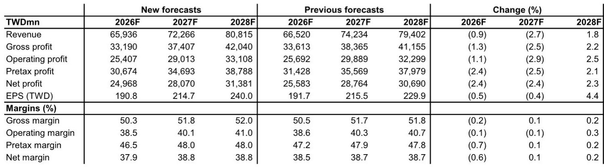
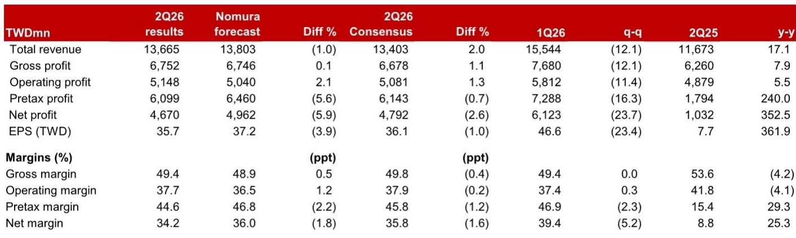
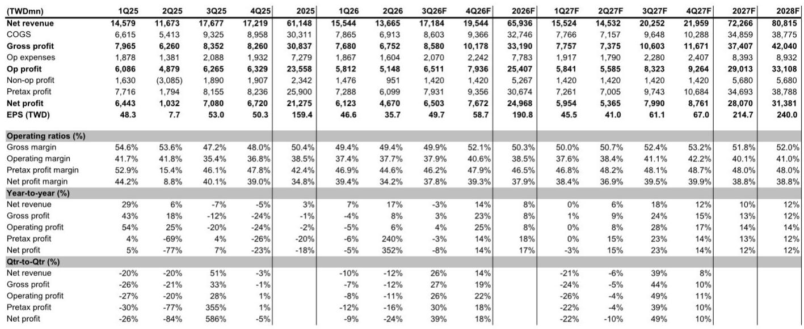

# Largan的CPO光纤阵列突破与iPhone摄像头升级加速：市场尚未充分定价的多年增长逻辑

移动设备光学技术最重要的进展已不再仅仅是更高的像素数或更大的光圈，而是设备内部数据的物理传输方式。大立光已为其共封装光学光纤阵列模块获得首个核心客户，试产计划于2026年9月进行，最早可能在2027年中开始量产。这不是实验室实验或遥远的路线图项目，而是一个有资金支持、有客户承诺的计划，使大立光从纯镜头制造商转变为有源光学互连组件的供应商。与此同时，报告揭示了更积极的iPhone摄像头镜头升级时间表：2026年主摄像头采用可变光圈，2027年采用带镜头叶片架构的增强型可变光圈，2028年主摄像头分辨率进一步提升，同时潜望式设计更复杂，可实现更高分辨率的内变焦。这两个并行轨迹——CPO FA工业化和智能手机光学复杂度的阶跃式提升——创造了当前估值尚未充分反映的复合收益驱动因素。

时机很重要，因为市场一直给予大立光较低的估值倍数，将其视为成熟镜头供应商，认为其最佳增长期已过。在FY25标准化每股收益下降17.9%后，该股交易于FY27预期每股收益的18.4倍。报告认为应重新估值至FY28每股收益的25倍，这是大立光自2015年以来10-25倍历史区间的高端。理由并非投机，而是基于两个具体且不重叠的催化剂：一个新产品类别（CPO FA）打开了智能手机镜头以外的总可寻址市场，以及一个多年iPhone摄像头升级周期增加了每台设备的内容。每个催化剂都独立支持利润率扩张和收入加速。两者结合，创造了FY28标准化每股收益TWD 240显得保守而非遥不可及的情景。

## 大立光获得CPO光纤阵列核心客户：从技术探索迈向创收生产

报告明确指出，大立光已为单排光纤阵列产品获得至少一个客户。试产目标为2026年9月，最早于2027年中开始量产。这是大立光CPO投资从概念验证进入商业制造时间线的首个具体证据。公司计划利用其全自动化能力支持规模化生产、高效故障排除和高精度对准。这些并非泛泛的制造愿景，而是大立光在数十年高产量镜头组装中积累的具体运营优势，其中微米级精度是日常要求。

这一里程碑的战略意义不容低估。光纤阵列是共封装光学的关键组件，光学引擎靠近交换ASIC放置，以减少数据中心互连的功耗和信号损失。通过获得客户承诺，大立光有效验证了其光栅耦合FA的制造工艺满足超大规模数据中心运营商或其光学模块供应商所需的可靠性和性能标准。报告还指出，大立光专注于光栅耦合FA，且不受康宁用于边缘耦合的GlassBridge解决方案影响，因为大立光认为光栅耦合是主流设计路线。这是一种有意的技术定位，使大立光与其他方法区分开来，并降低了被竞争架构取代的风险。

与其他客户的接触仍处于下一代产品的概念验证阶段，这意味着单一核心客户是可扩展管道的开端。报告未披露客户身份，但试产计划在报告日期后14个月内进行，表明客户是一级光学模块制造商或拥有直接CPO路线图的超大规模企业。对观察者而言，这意味着大立光并非浅尝CPO，而是在有承诺买家的情况下建设生产线。FA的收入贡献在FY27可能较为温和，但随着客户扩大产量且更多客户从概念验证转向生产，在FY28及以后可能显著增长。

## 2026-2028年iPhone摄像头镜头升级时间表加速：多年内容增长轨迹未被共识预期定价

报告确定了三个具体升级步骤。2026年，旗舰iPhone主摄像头将采用可变光圈。2027年，大立光预计推出增强型可变光圈摄像头，可能将叶片置于镜头之上。2028年，主摄像头分辨率可能进一步提升。此外，潜望式摄像头设计预计在2027年变得更复杂，以实现更高分辨率的内变焦。这些升级中的每一项都增加了每个摄像头模块的镜头数量、组装所需的精度，或两者兼有。大立光因其在塑料镜头制造方面的技术领先地位以及提供这些更高复杂度模块的设计和生产能力而处于有利位置。

报告的收入预测反映了这种加速。FY27收入预计为TWD 723亿，同比增长9.6%；FY28收入为TWD 808亿，同比增长11.8%。更重要的是，毛利率预计从FY26的50.3%提升至FY27的51.8%和FY28的52.0%。这种利润率扩张并非自动实现，取决于大立光能否为更复杂的镜头组件获得更高平均售价，以及能否实现抵消额外制造难度的良率。报告对这些利润率的信心基于大立光在规模化解决困难光学问题方面的历史记录。仅可变光圈机制就需要将移动部件集成到镜头模块中，这是一项重大的工程挑战，很少有供应商能可靠执行。

潜望式升级同样重要。更高分辨率的内变焦意味着更复杂的棱镜和镜头序列，可能需要额外的镜头元件或更精确的对准。大立光在潜望式镜头设计方面的技术领先地位一直是其竞争护城河，2027年的升级强化了这一优势。对观察者而言，关键洞察是iPhone摄像头升级周期并非一次性事件，而是一个为期三年的复杂度递增序列，每一步都增加大立光的每台设备收入并强化其定价能力。

## 报告还强调了棱镜和微透镜阵列的次要CPO技术路径，但光纤阵列仍是主要价值驱动因素

大立光还开发了基于模压玻璃的CPO棱镜和微透镜阵列解决方案。报告指出，该技术的优先级低于光纤阵列，但仍提供了有用的竞争参考点。大立光声称模压玻璃比超透镜替代方案具有更低的插入损耗。然而，公司承认，使用半导体级制造的石英玻璃竞争棱镜解决方案显示出更好的成本结构且无热效应。这一承认很重要，因为它表明大立光并未对竞争技术自满，意识到其模压玻璃方法相对于半导体制造替代方案存在成本劣势，这可能限制PMLA解决方案的可寻址市场。

战略含义是，大立光将其主要赌注押在光纤阵列上，其自动化和精密组装能力在此具有更清晰的竞争优势。PMLA技术可能找到利基应用或作为备用架构，但并非重新估值论点的驱动因素。观察者应关注FA时间线和客户参与度，作为CPO收入实现的主要指标。

## 评估大立光风险回报概况的决策框架：三个时间维度

对于需要将此分析转化为决策的读者，以下框架按时间维度组织关键变量。

**近期（0-12个月）：** 主要风险是iPhone需求因价格上涨或宏观环境因素而疲软。报告承认，苹果近期对其终端产品的提价可能暂时影响需求，并已将FY26和FY27盈利预测下调2.4%，以考虑汇率波动和需求影响。关键观察点是2026年9月iPhone发布，以及可变光圈采用是否为大立光带来有意义的平均售价提升。如果发布表现不佳，股价可能下跌，但CPO催化剂和FY28升级周期提供了支撑。

**中期（12-24个月）：** 2026年9月的CPO FA试产和2027年中的量产启动是关键里程碑。如果大立光证明能以可接受良率规模化生产FA模块，市场将开始赋予反映CPO收入流的新估值倍数。同时，2027年iPhone的增强型可变光圈和潜望式升级应推动收入增长加速。风险在于CPO客户延迟量产或良率令人失望，这将把收入贡献推至FY29并减少近期盈利上行空间。

**长期（24-36个月）：** FY28每股收益TWD 240的预测锚定了预期内容增长和CPO FA项目规模化至有意义收入。如果两个催化剂都实现，股价可能交易于25倍或更高，尤其是如果市场将大立光重新估值具有新增长向量的复合增长公司。下行风险是智能手机镜头升级强度在2028年达到峰值，且CPO收入相对于镜头业务仍较小，使股票终端增长率较低。

报告的估值方法透明：FY28每股收益TWD 240的25倍意味着目标价TWD 6,000，较收盘价TWD 3,950约有52%上行空间。这一目标由CPO期权价值和多年升级周期共同支撑。作为参考，该股目前交易于FY27每股收益的18倍，并未充分反映FY28预期的盈利加速。

此分析最重要的结论是，大立光不再是一家依赖年度iPhone镜头数量的单一产品公司。它正在CPO光学组件领域建设第二收入支柱，并且是在有承诺客户和明确制造计划的情况下进行。与此同时，智能手机镜头业务正进入由可变光圈和潜望式复杂度驱动的超趋势增长期。这两种力量的结合创造了复合收益轨迹，证明了溢价倍数的合理性。市场最终会对此定价，但前提是执行里程碑得以实现。

*仅供参考。部分内容可能基于源材料通过AI辅助生成、翻译、总结或编辑，可能存在遗漏或错误。请独立核实。本文不构成专业建议。*

仅供参考。部分内容可能基于源材料通过AI辅助生成、翻译、总结或编辑，可能存在遗漏或错误。请独立核实。本文不构成专业建议。

