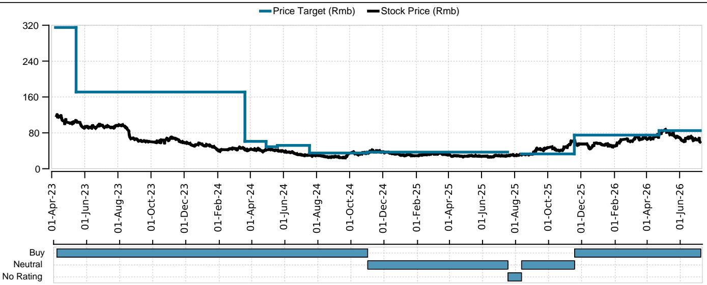
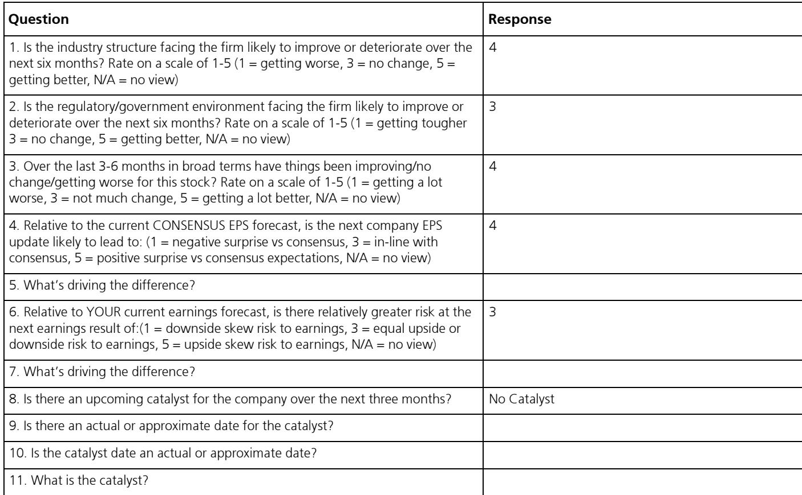
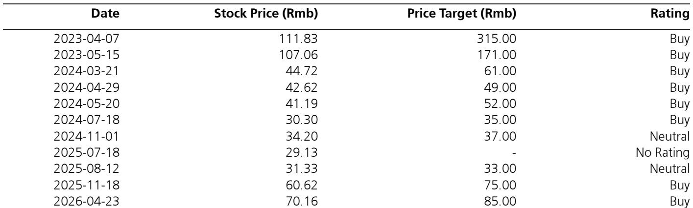

# Yunnan Energy’s Q2 Beat Signals the Inflection Point the Separator Market Has Been Waiting For

Yunnan Energy New Material reported a Q2 2026 net profit midpoint of RMB 610 million, up 115% quarter-over-quarter and ahead of both analyst and consensus expectations. The headline number is striking, but the real story lies beneath it. The company shipped 4.1 billion square meters of separator products in the quarter, a 58% year-over-year increase and a 17% sequential gain that exceeded its own prior guidance of 3.8 to 4.0 billion square meters. Volume growth alone, however, does not explain the magnitude of the profit recovery.

The more telling metric is unit profitability. Estimated unit net profit rose to RMB 0.15 per square meter in Q2, a modest but meaningful improvement from RMB 0.13 in Q1. This marginal uptick in unit economics, combined with the volume beat, suggests that the separator industry is exiting the prolonged trough that followed the post-2022 capacity glut. The inflection is not yet dramatic, but the direction is clear, and the catalyst is now visible.

Price negotiations between mainstream separator manufacturers and leading downstream battery companies are nearing completion, with the market expecting a price hike of 7-8%, equivalent to RMB 0.05 to 0.06 per square meter. If realized, this would mark the first sustained price increase in the Chinese lithium-ion battery separator market in over two years. For Yunnan Energy, which commands a dominant share of the wet-process separator segment, the implications extend well beyond a single quarter's beat. The company is entering a phase where volume growth and margin expansion can compound simultaneously, a combination that has historically driven outsized returns in cyclical materials.

Observers should not interpret this as a one-off earnings surprise. The Q2 results are a leading indicator of a structural shift in the separator industry's pricing dynamics, capacity utilization, and competitive landscape.

## The Volume Beat Was Not Just Operational Execution; It Reflects a Structural Demand Uptick That Is Outpacing Market Expectations

Yunnan Energy's Q2 shipment of 4.1 billion square meters is not merely a production achievement. It represents a fundamental demand signal from the downstream battery supply chain. The global battery industry has been absorbing capacity at a faster rate than most models projected. The 58% year-over-year growth in separator shipments implies that battery cell production, particularly for electric vehicles and energy storage systems, is accelerating into the second half of 2026.

The key insight is that this volume growth is occurring without any price recovery yet embedded in the numbers. The company's prior guidance of 3.8 to 4.0 billion square meters already assumed a healthy demand environment. The actual result exceeded even that optimistic baseline by 2.5% to 8%. This suggests that either end-market demand is running hotter than the company itself anticipated, or that Yunnan Energy is capturing market share from smaller competitors who are struggling to maintain output amid compressed margins.

In either case, the volume trajectory supports a thesis that the separator market is tightening. When a dominant producer consistently ships above its own guidance, it indicates that the supply-demand balance is shifting in the producer's favor. The next logical consequence is pricing power.

## Unit Profitability Is Already Improving, and the Impending Price Hike Will Accelerate Margin Expansion More Than Most Models Currently Reflect

The improvement from RMB 0.13 to RMB 0.15 in unit net profit is modest in absolute terms, but its significance lies in the trajectory. During the 2024 downturn, Yunnan Energy's unit profitability collapsed as industry-wide overcapacity forced prices below cash costs for many producers. The fact that unit profits are now rising sequentially, before any formal price increase, indicates that internal cost improvements and operating leverage are already taking effect.

The forecasted price hike of 7-8%, or RMB 0.05 to 0.06 per square meter, would lift unit net profit by roughly 33% to 40% from the Q2 level, assuming costs remain stable. This is not a speculative assumption. Price negotiations with leading battery manufacturers are nearing completion, and the market consensus is that the increase will materialize. For Yunnan Energy, which shipped 4.1 billion square meters in Q2 alone, every RMB 0.01 per square meter in price improvement translates to approximately RMB 41 million in additional quarterly revenue, most of which flows directly to the bottom line.

The consensus earnings estimates for 2026 stand at RMB 1.70 per share, while the analyst estimate is RMB 2.41, a 42% premium. The gap is largely attributable to differing assumptions about pricing and unit margins. If the price hike is implemented as expected, the consensus will likely need to revise upward, and the analyst estimate may prove conservative. The unit profit trajectory is the single most important variable for earnings in the next 12 to 18 months.

## The Company's Valuation Is Pricing in a Recovery, but Not the Full Magnitude of the Margin Upside

At a current share price of RMB 59.33, Yunnan Energy trades at 24.6 times 2026 estimated earnings, which is below its historical average multiple during periods of profast stock return of 44.1% including dividend yield.

The valuation argument hinges on the earnings trajectory. The analyst's 2026 EPS estimate of RMB 2.41 is roughly 40% above consensus, and the 2027 estimate of RMB 3.74 is 18% above consensus. If the price hike materializes and unit margins continue to improve, the divergence between analyst and consensus estimates is likely to narrow as the market reprices the stock upward. The current P/E multiple does not fully reflect the potential for a multi-year margin recovery.

The balance sheet provides additional support. Net debt to EBITDA is projected at 2.5 times for 2026, which is manageable for a capital-intensive materials company. The equity free cash flow yield is expected to turn positive in 2027 at 4.5%, rising to 11.1% by 2030. This cash flow trajectory is consistent with a company that is past the peak of its capital expenditure cycle and entering a harvest phase. The valuation discount to historical norms is likely to close as the market recognizes that the earnings recovery is not a one-quarter phenomenon but the beginning of a sustained upcycle.

## A Strategic Decision Framework for Observers: How to Position for the Separator Cycle Inflection

Observers evaluating Yunnan Energy should apply a three-part framework that goes beyond the standard earnings surprise analysis. The first dimension is price realization. The key question is not whether prices will rise, but how much and how fast. The expected 7-8% increase is the base case. If negotiations conclude at the higher end of that range, or if the price hike triggers follow-on increases in subsequent quarters, the earnings impact will compound. Observers should monitor not just the announcement of the price increase but also the timing of its implementation and the degree to which it is passed through to end customers.

The second dimension is volume sustainability. The Q2 beat was driven by volume, but the sustainability of that volume depends on downstream demand. The battery industry is notoriously lumpy, with quarterly fluctuations driven by inventory cycles and policy changes. Observers should assess whether the volume growth is being driven by genuine end-market pull or by pre-buying ahead of price increases. If it is the latter, a volume pullback in Q3 or Q4 is possible. The analyst's forward estimates imply continued volume growth, and the absence of a guidance change from the company suggests confidence, but this remains a risk factor.

The third dimension is competitive positioning. Yunnan Energy is the dominant player in wet-process separators, but the industry remains fragmented. If the price hike is successful, it will improve margins for all producers, which could slow the exit of marginal capacity. A slower capacity exit would cap the upside for pricing in the medium term. Conversely, if smaller competitors are unable to benefit from the price increase due to customer concentration or cost disadvantages, Yunnan Energy's market share and pricing power could strengthen further.

The framework leads to a clear conclusion: the risk-reward is asymmetric to the upside. The downside is that the price hike fails to materialize or is smaller than expected, which would delay the margin recovery but not reverse the volume growth. The upside is that the price hike, combined with continued volume growth and operating leverage, drives earnings well above current estimates. The current valuation does not fully price in this upside scenario.

## The Profit Recovery Is Real, and the Next Catalyst Is Already in Motion

Yunnan Energy's Q2 results are not an anomaly. They are the first clear signal that the separator market has turned. The volume beat, the improvement in unit profitability, and the impending price hike form a coherent narrative of a cyclical recovery that has begun but is not yet fully reflected in consensus estimates or the stock price.

The company's financial trajectory over the next 12 to 24 months will be determined by the interplay of three factors: the magnitude and timing of the price increase, the sustainability of downstream demand, and the competitive response from smaller producers. All three are currently moving in the company's favor. The price negotiations are concluding with a positive outcome. Demand is exceeding expectations. And the competitive landscape remains favorable for the market leader.

For serious observers, the question is not whether Yunnan Energy will recover. The evidence from Q2 2026 shows that the recovery is already underway. The question is how much of the recovery is already priced in, and the answer is not enough.

*For informational purposes only. Portions may be generated, translated, summarized, or edited with AI assistance based on source materials and may contain omissions or errors. Please verify independently. This is not professional advice.*

For informational purposes only. Portions may be generated, translated, summarized, or edited with AI assistance based on source materials and may contain omissions or errors. Please verify independently. This is not professional advice.

