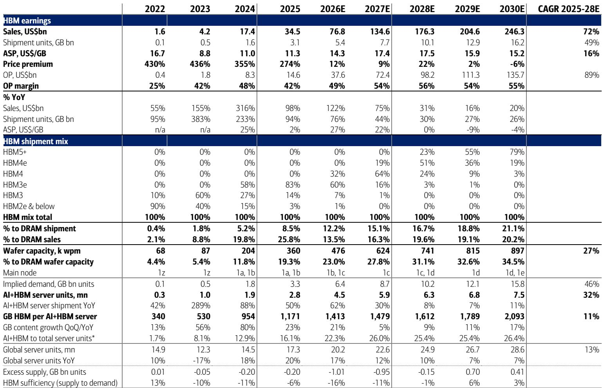
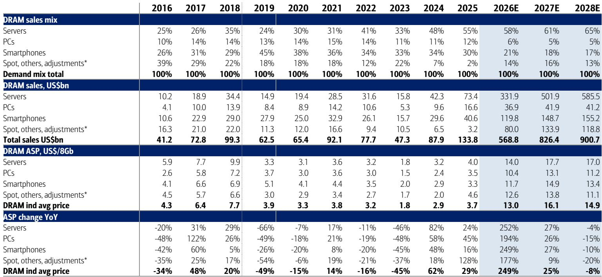
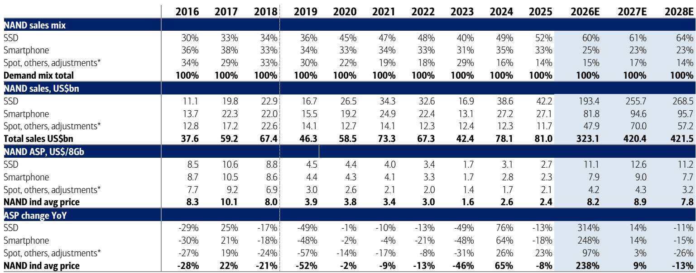

# 全球存储芯片观察：三星回调与长鑫存储IPO，南亚科回升

三星电子在交出亮眼二季度成绩单后报价反而下跌，市场开始讨论存储芯片周期是否见顶。某机构最新报告给出了一个反直觉的判断：当前不是周期尾声，而是超级周期的延续，只是驱动逻辑从全面涨价转向结构性分化。

这份报告的核心证据来自该机构自建的存储芯片景气指标。该指标在5月录得183，不仅远高于2017年和2024年周期高点（120-130），也持续运行在历史极值区域。驱动指标走高的力量来自DRAM和NAND全球出货金额同比增幅均超过300%，韩国半导体出口同比增199%，DRAM现货价格同比涨幅达到700%。这些数字指向一个事实：需求端的强度并未减弱。

市场担忧主要来自三个方向：Meta削减芯片订单、中国长鑫存储扩产、以及二季度可能是季度环比增速的峰值。该机构的渠道调研显示，美国大型科技公司的存储芯片需求依然强劲，长鑫存储的实际冲击有限，而三季度DRAM合约价已有多个新合同显示20%以上的涨幅。报告甚至将三季度DRAM均价环比涨幅预测从17%上调至21%。

## 1. 长鑫存储IPO不会改变高端DRAM的竞争格局

长鑫存储已确定7月16日为IPO申购日，预计7月底正式上市。公司披露的二季度营收指引为590-690亿元人民币，约合95亿美元，同比增长7倍。但这一规模仅占全球DRAM市场的高个位数份额。尽管其晶圆产能已达到每月28-30万片，占全球DRAM总产能的15%左右，但该机构认为，高端DRAM产品——包括10Ghz以上LPDDR5、HBM、SOCAMM、GDDR7——仍将主要由中国以外的厂商供应，原因在于品质差距和美国对中国半导体产业的严格管控。

> **KC评论：** 长鑫存储的扩产是市场情绪的一个扰动因素，但该机构的框架提醒我们，DRAM的竞争正从“谁产能大”转向“谁能做高端”。产能份额和营收份额之间的差距，恰恰反映了产品结构的差异。这一点在评估中国存储厂商的实际影响时容易被忽略。

## 2. 南亚科的业绩证明：成熟制程DRAM的利润率可以超过HBM

南亚科二季度营收同比增长684%，营业利润率达到74%，而一年前还是-43%。驱动这一爆发的是DRAM均价环比上涨超过60%，同比涨幅超过500%。公司管理层对三季度乃至更长期的展望依然乐观，认为DDR3和DDR4等成熟制程产品的短缺将持续，中国厂商的产能扩张影响有限。

该机构在报告中特别指出，南亚科的DRAM业务利润率实际上高于HBM。这是一个值得注意的对比：当市场注意力集中在HBM这类尖端产品时，成熟制程DRAM的供需缺口反而创造了更高的边际利润。报告维持对南亚科的正面看法，核心逻辑是“强劲的盈利能力和低估值倍数”。

## 3. 一个可复用的观察框架：关注ASP环比变化而非同比

该机构对存储周期的判断框架中，最值得关注的变量不是同比增速，而是ASP的季度环比变化。报告预测DRAM均价在二季度环比上涨61%之后，三季度和四季度将分别节奏变化至23%和8%，2027年进一步降至0%至-3%的区间。这种逐季递减的节奏并非周期见顶的信号，而是超级周期从“爆发期”进入“稳态期”的自然过渡。

NAND的情况类似，但节奏更弱。现货市场数据显示，6月NAND wafer价格环比仍在下降，但同比涨幅依然在377%至621%之间。该机构认为，NAND的供需再平衡需要更长时间，但整体方向并未逆转。

对于产业观察者而言，这份报告的核心启示是：存储芯片的超级周期并未结束，但研究逻辑需要从“关注整个赛道”转向“关注产品结构和客户结构”。能够同时把握高端HBM需求和成熟制程缺口的厂商，将在这一轮周期中获得更持续的回报。

For informational purposes only. Portions may be generated,translated,summarized,or edited with AI assistance based on source materials and may contain omissions or errors. Please verify independently. This is not investment,legal,tax,accounting,or other professional advice.

For informational purposes only. Portions may be generated,translated,summarized,or edited with AI assistance based on source materials and may contain omissions or errors. Please verify independently. This is not investment,legal,tax,accounting,or other professional advice.

