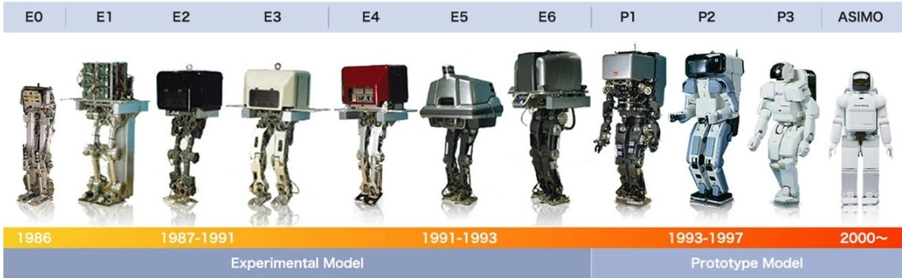
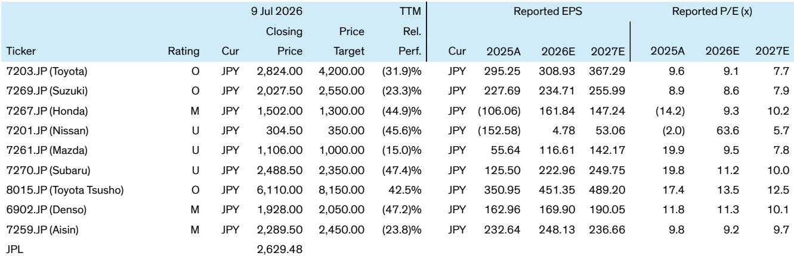

# Bernstein：日本车企对人形机器人的兴趣重新浮现

三菱汽车宣布与东京大学孵化的人形机器人初创公司Highlanders签署谅解备忘录，计划共同开发并量产基于其“N”平台的人形机器人。这不是一个孤立的技术展示，而是日本汽车产业在传统主业面临调整之际，重新将机器人视为中长期增长引擎的信号。Bernstein最新研报指出，这一趋势正在加速。

三菱的计划相当具体：初期月产能目标为1000台，最早2027年在其京都工厂利用闲置空间启动生产。这家车企已对Highlanders进行研究，并计划增持以支持商业化。机器人将首先部署在三菱自己的制造工厂中，同时借助其在量产和质量控制方面的经验来降低成本。

日本车企在机器人领域并非新手。本田1986年就开始双足人形机器人研究，2000年推出ASIMO，一度是全球最知名的人形机器人。丰田在2000年代跟进，推出Partner Robot项目，聚焦辅助、医疗和人机交互。但这些努力长期停留在研发层面，从未真正走向商业量产。三菱此次的举动，是日本车企首次将人形机器人量产提上明确日程。

> **KC评论：** 三菱选择2027年、月产1000台作为初期目标，说明这不是概念验证，而是有明确产能规划的尝试。闲置工厂空间的利用，也降低了试错成本。

## 1. 全球人形机器人市场预计2050年达到7290亿美元，车企的技术储备是天然优势

Bernstein预测，全球人形机器人出货量到2050年将达到4900万台，2025至2050年间年复合增长率约37%；市场规模同期将扩大至约7290亿美元，年复合增长率约32%。这个数字足以让任何一家面临增长瓶颈的车企认真对待。

报告认为，人形机器人与汽车产业在核心技术上有大量重叠：执行器（电机、减速器）、传感器、电池、控制单元以及AI驱动的软件——这些恰恰是车企和零部件供应商在多年造车过程中积累最深的领域。丰田在最新财报会上也特别提到了工厂内的机器人应用，包括零部件物流和拣选流程，并明确表示最终会将机器人应用从制造扩展到医疗和零售。

## 2. 三菱的路径选择：借力初创平台，而非从头自研

三菱没有选择像本田那样从零开发，而是与已有成熟平台的初创公司合作。Highlanders的“N”型机器人已经具备一定的技术基础，三菱的角色更多是量产化、质量控制和供应链整合。这种模式降低了技术不确定性，也缩短了从研发到量产的时间。

报告没有展开讨论这种合作模式的成功概率，但从商业逻辑看，它比纯自研更符合日本车企当前的资源状况——全球汽车市场竞争加剧，各家都在削减成本，很难再像当年ASIMO那样不计投入地做长期研发。

## 3. 丰田的布局更广，但商业化路径仍待明确

丰田在机器人领域的动作比三菱更早、更广。其研究机构TRI已经在工厂环境中测试移动操作机器人，公司也在财报会上强调了机器人从制造向医疗、零售扩展的长期愿景。但Bernstein的研报指出，市场仍在等待丰田拿出更具体的商业化方案，而非停留在研究展示阶段。

> **KC评论：** 丰田的机器人布局覆盖了从工厂到服务场景的多个方向，但报告没有给出明确的量产时间表。三菱的路径虽然更聚焦，但胜在可执行——这可能是两种策略的分水岭。

## 4. 一个可复用的观察框架：从“技术储备”到“商业闭环”

对于关注这一赛道的读者，Bernstein的研报提供了一个简洁的评估框架：日本车企在机器人领域的竞争力，取决于三个环节的衔接程度——核心技术重叠度（执行器、传感器、电池等）、量产能力（质量控制、供应链管理、闲置产能利用）以及商业化路径（从工厂内部部署到外部市场销售）。三菱在第三个环节迈出了第一步，丰田仍在前两个环节积累。谁先跑通闭环，谁就可能在这一轮人形机器人浪潮中占据先机。

For informational purposes only. Portions may be generated,translated,summarized,or edited with AI assistance based on source materials and may contain omissions or errors. Please verify independently. This is not investment,legal,tax,accounting,or other professional advice.

For informational purposes only. Portions may be generated,translated,summarized,or edited with AI assistance based on source materials and may contain omissions or errors. Please verify independently. This is not investment,legal,tax,accounting,or other professional advice.

