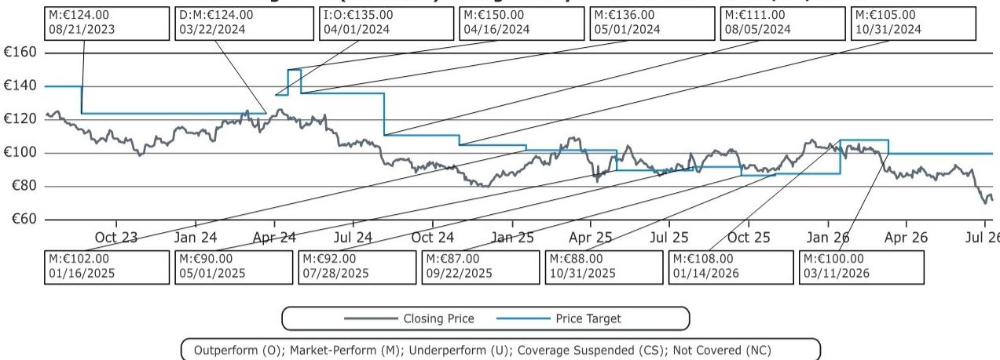

# Bernstein：大众未来计划-所以呢？

7月9日晚间，大众集团以一份三页新闻稿发布了“未来计划”，承诺到2030年成为全球最具吸引力的汽车公司。然而，Bernstein分析师在第一时间给出的评价只有两个字：“Na und?”——德语里“所以呢？”的意思。

这份研报的核心判断很直接：市场不会对这份计划做出积极反应。不是因为方向错了，而是因为读者在问一个更根本的问题——“具体内容在哪里？”

大众宣布将车型系列精简最多50%，复杂度减少最多75%，年产能从1000万辆降至900万辆。这些数字听起来宏大，但Bernstein指出，新闻稿在如何执行上几乎没有任何具体说明。产能削减100万辆，具体关停哪些工厂？何时执行？成本节约目标是多少？这些关键问题全部悬空。

更值得关注的是，就在新闻稿发布当天上午，德国《明镜》周刊援引监事会内部消息称，大众计划在未来五年内逐步关闭茨维考和埃姆登工厂，汉诺威商用车工厂在2032年关闭，奥迪内卡苏尔姆工厂在2034年关闭。这些信息直接涉及约4万个工作岗位。但“未来计划”新闻稿中对此只字未提。

> **KC评论：** 这不是一次普通的劳资博弈。大众工会主席卡瓦洛已经公开要求CEO布卢姆在周五前就工厂关闭传闻做出明确表态，并威胁在暑假后举行全集团范围的特别职工大会。报告提醒读者，这轮谈判的背景与2024年那一轮高度相似——当时管理层同样提出了关闭大型工厂的要求，但最终没有一家关闭，工会称最终协议为“圣诞前的奇迹”。历史是否会重演，是判断大众重组能否真正推进的关键变量。

## 1. 资本回报预期可能落空，Everllence交易资金去向不明

今年市场对大众的一个核心看多逻辑，是出售大型柴油发动机制造商Everllence多数股权的交易——这笔交易将带来74亿欧元现金流入，市场普遍预期其中相当一部分会以一次性资本回报形式返还给股东。

但“未来计划”中的一句话让这个预期变得不确定。报告原文写道：“该交易同时强化了集团资产负债表，并扩大了大众集团进一步战略发展的财务空间。”Bernstein认为，这种措辞暗示资金更可能被用于战略研究或补充流动性，而非股东回报。如果这个判断成立，那么今年支撑大众报价的一个关键逻辑将被削弱。

## 2. 技术领先的宣称与中国竞争者的现实之间存在明显张力

大众在新闻稿中重申“正在扩展技术领先地位”。Bernstein对此的评论是：考虑到中国竞争对手的创新速度，这一宣称“很可能让人皱眉”。

这不是一个主观判断。报告隐含的逻辑链条是：大众在中国市场的份额持续变化，而中国本土电动车品牌在智能化、电动化方面的迭代速度已经显著快于传统跨国车企。如果大众的技术领先地位无法在中国这个全球最大汽车市场得到验证，那么这一宣称的说服力就大打折扣。

## 3. 一个可复用的观察框架：区分“愿景”与“执行细节”的差距

这份研报提供了一个实用的分析框架：当一家公司发布战略计划时，读者应该区分“方向性陈述”和“可验证的执行细节”。大众的“未来计划”在方向层面没有问题——精简车型、降低复杂度、调整产能，这些都是正确的战略方向。但问题在于，缺乏可验证的执行细节，使得读者无法判断管理层是否有能力、有意愿真正推进这些变革。

Bernstein的估值方法也值得注意。该机构采用SOTP（分部分加总）估值法，对大众各业务板块分别估值后，再施加50%的折价，以反映地缘政治不确定性、中国市场竞争加剧、集团整体转型难度等因素。这个50%的折价本身就是一个信号：市场对大众重组的信任度仍然有限。

回到“Na und?”这个问题。对于大众管理层来说，接下来的关键不是再发布一份更宏大的愿景，而是拿出可验证的行动计划，回答读者和工会都在追问的那个问题：具体怎么做，什么时候做，做到什么程度。

For informational purposes only. Portions may be generated,translated,summarized,or edited with AI assistance based on source materials and may contain omissions or errors. Please verify independently. This is not investment,legal,tax,accounting,or other professional advice.

For informational purposes only. Portions may be generated,translated,summarized,or edited with AI assistance based on source materials and may contain omissions or errors. Please verify independently. This is not investment,legal,tax,accounting,or other professional advice.

