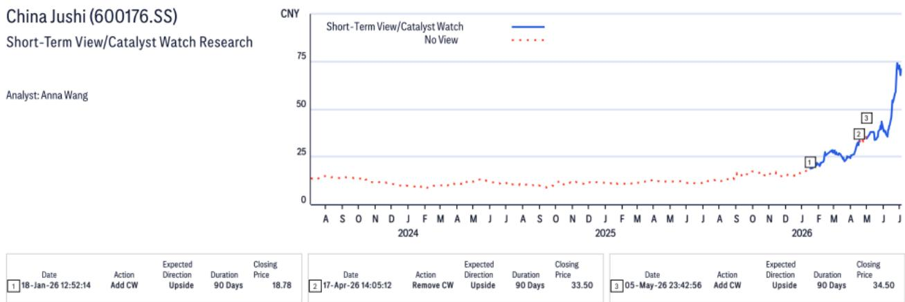
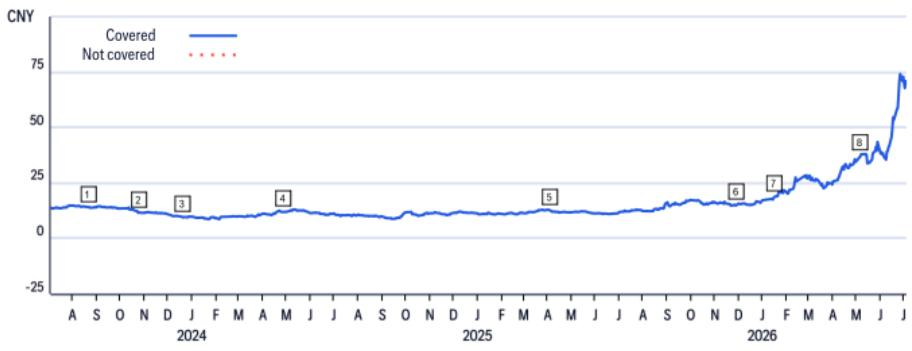
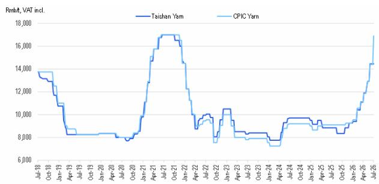

# 中国玻璃纤维市场观察：电子纱景气与粗纱调整的结构性分化

2026年7月中旬，中国玻璃纤维市场最值得关注的现象并非价格涨跌本身，而是市场已分化为两个供需格局截然不同的领域。电子纱价格周环比上涨3.6%，均价约16,988元/吨；而粗纱价格微降0.33%，均价约3,778元/吨，部分二三线厂商为促进出货下调50-100元/吨。同一原材料家族、同一国家、同一周——一个领域面临近乎零库存和客户溢价采购，另一个则面对季节性需求走弱、库存上升和价格让步。

这种分化并非短期数据波动，而是反映了两类产品在生产、消费和定价方式上的结构性差异。电子纱受益于供需失衡，新投产线难以快速弥合缺口；粗纱则受制于下游加工企业开工率偏低、补库意愿不足。将玻璃纤维视为同质化商品的观察视角，可能低估了这种结构性差异带来的影响。市场已演变为两个市场，对生产者、采购方和研究者的战略意义截然不同。

这一分化的加速具有时间意义。电子纱价格已升至月度合约执行无阻的水平，部分小型下游客户为锁定配额甚至支付溢价。与此同时，粗纱生产商在需求趋弱环境下降价，后续或面临进一步调整。关键问题不在于玻璃纤维整体处于何种周期，而在于企业产品组合落在分化的哪一侧——以及市场是否已充分定价这一结构性差距的持续性。

## 电子纱供需失衡具有结构性特征，短期难以缓解

有观点认为产能增加最终将弥合缺口。但截至7月9日当周的数据显示并非如此。中国巨石淮安零碳基地一条5万吨电子纱线投产，但有效供给增长依然有限。电子纱及电子布库存维持历史低位，多个产品规格持续短缺。新产能上线未能缓解紧张局面——这是结构性失衡的典型特征，而非暂时现象。

原因在于：新点火产线需经历爬坡期才能达到满产效率，期间需求持续超过供给。同时，下游覆铜板厂商积极锁定供应，并未等待价格回落。部分客户愿为交货支付溢价，表明市场已预期短缺将持续。当买方自愿支付高于挂牌价的价格，意味着他们认为不确保原料的代价更高。

这一动态因产品规格问题而强化。短缺并非均匀分布于所有电子纱类型，而是集中于高端产品和特定规格。这意味着即使总产能增加，客户所需的具体规格仍可能稀缺。有效供给约束比名义产能数字更为紧张。对于研究者而言，电子纱的定价能力可能持续数季度而非数周，任何产能增加都应按规格逐一评估，而非视为单一供给数据。

## 粗纱面临需求问题，库存积累或放大而非修正调整

粗纱领域呈现不同图景，其运行机制同样具有结构性特征。南方高温多雨导致的季节性因素降低了下游加工企业开工率，这是需求侧的冲击。但二三线厂商降价50-100元/吨的反应，揭示了该领域的竞争动态。

在集中度较高的市场中，厂商本可维持定价纪律、等待需求走弱期过去。但较小厂商率先降价，表明其库存持有成本较高、订单簿较薄，或两者兼有。这种行为产生连锁效应：一家降价后，其他厂商为保持市场份额跟进，价格底部随之松动。全国均价3,778元/吨周环比仅降0.33%，但方向明确，催化剂并非外部宏观环境，而是内部竞争压力。

报告展望部分明确指出：随着季节性因素持续、库存逐步积累、需求复苏有限，粗纱价格预计将继续承压。“逐步积累”一词至关重要，意味着当前库存水平尚未达到危机程度，但正朝不利方向移动。若需求在库存达到迫使厂商去化的阈值前未能恢复，价格下行可能加速。风险并非急剧下跌，而是缓慢走低，压缩所有厂商的利润空间，尤其是缺乏成本优势或特种产品组合的企业。

## 分化形成基于产品组合、产能周期和客户议价能力的决策框架

对于研究者和企业战略制定者而言，分化转化为包含三个维度的结构化决策框架。第一，产品组合暴露度。电子纱及电子布占比高的企业处于卖方市场，定价能力完整、短缺持续、客户愿付溢价。粗纱占比高的企业则处于买方市场，价格让步必要、利润承压。首要含义是两类企业的收入增长和利润率轨迹将显著分化。

第二，产能周期。电子纱短缺不会快速解决，因新点火产线需时间爬坡。这意味着定价能力窗口以月计而非周计。粗纱方面，122条窑炉生产线运行，总产能903.8万吨/年，周环比增0.56%。增量产能叠加需求疲弱，供需平衡正朝不利于生产商的方向移动。战略问题在于企业能否将产能从粗纱转向电子纱，以及转换速度如何。答案决定生产商能否摆脱粗纱调整期或受其束缚。

第三，客户议价能力。电子纱领域，下游覆铜板厂商积极锁定供应并支付溢价，其议价能力较低，因为不确保原料的代价高昂。粗纱领域，下游加工企业开工率低、采购有限，议价能力较高，因可等待。这种不对称意味着电子纱价格上涨可能持续，而粗纱价格上涨在需求环境改善前难以获得支撑。

## 库存机制是预判各领域拐点最可靠的领先指标

在两个领域中，库存水平是预判价格方向最具信息量的指标。电子纱库存近乎为零，这并非正常运营状态，而是结构性约束，迫使买方接受价格上涨。只要库存维持此水平，定价权就掌握在生产商手中。一旦库存开始积累——无论源于产能成功爬坡还是需求软化——定价动态将转变。但报告表述清晰：有效供给增长依然有限，短缺持续。需关注的领先指标并非价格本身，而是库存趋势。

粗纱方面，库存逐步积累，这是相反信号。报告未提供相对库存水平，但方向明确。当库存上升且需求疲弱时，价格路径阻力最小方向为下行。粗纱的拐点将出现在需求复苏——报告未预测近期内实现——或生产商减产以稳定库存之时。在此之前，粗纱价格压力将持续。

对于研究者而言，这意味着两个领域处于不同时间表。电子纱处于定价上升周期中段，短期内无逆转催化剂。粗纱处于下行周期早期，短期内无复苏催化剂。分化可能先扩大后收窄，任何假设两个领域均值回归的观点可能为时过早。

## 高端产品溢价是结构性转变，而非暂时性提价机会

值得特别关注的是，报告提及高端产品订单持续增加，现货短缺可能持续，尤其是高端产品和特定规格。这不仅是定价故事，更是产品组合故事。电子纱市场不仅整体紧张，而且在最有价值的子领域最为紧张。这意味着具备制造高端电子纱和电子布能力的企业正获得不成比例的定价能力和利润扩张。

这对如何评估企业价值具有启示。能够将产品组合转向高端电子纱的企业，不仅受益于周期性上升，更在捕捉来自下游应用（如高性能覆铜板和先进电子产品）的结构性需求增长。报告对中国巨石的价值评估框架明确纳入这一可能性，指出若公司特种电子布产品放量，可能带来估值重估。市场正开始区分大宗玻璃纤维生产商和特种电子材料生产商，这一区分将随分化持续而更加鲜明。

对于企业战略，启示明确：产能投资应导向高端电子纱和电子布，而非粗纱。电子领域的资本回报率目前远高于粗纱，竞争护城河更深，因为客户愿为特定规格的可靠供应支付溢价。相比之下，粗纱产品更趋同质化，客户基础拥有更多替代选择，定价能力较弱。生产商的战略选择并非在两个好选项之间，而是在一个具有结构性定价能力的领域和一个面临结构性定价压力的领域之间。

*仅供参考。部分内容可能基于源材料通过AI辅助生成、翻译、总结或编辑，可能存在遗漏或错误。请独立核实。本文不构成专业建议。*

仅供参考。部分内容可能基于源材料通过AI辅助生成、翻译、总结或编辑，可能存在遗漏或错误。请独立核实。本文不构成专业建议。

