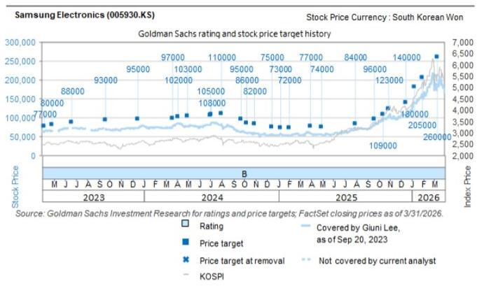
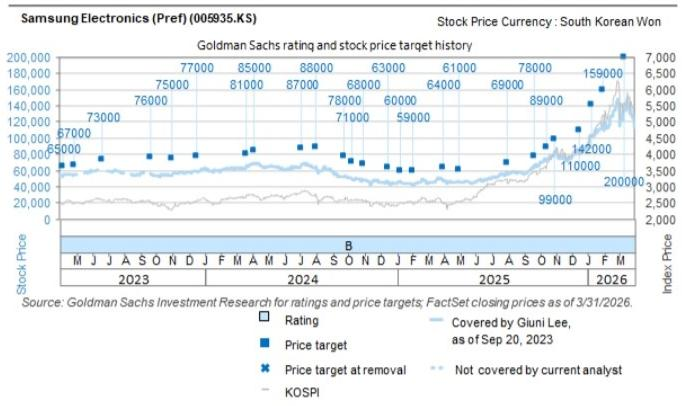

# DRAM Pricing Has Entered a Structural Regime Shift, Not Just a Cyclical Upswing

Taiwanese DRAM producer Nanya Technology reported that its average selling prices rose more than 60% quarter-on-quarter in the June quarter, following a prior quarter increase of over 70%. These are not normal cyclical numbers. They represent consecutive quarters of price acceleration that push operating profit margins to 74%. For Samsung Electronics, the read-across implies conventional DRAM ASPs rose 47% quarter-on-quarter and DRAM operating margins reached 80% in the same period. These figures demand a fundamental reassessment of how memory markets function, not merely a recalibration of near-term earnings estimates.

The industry has long been characterized as a textbook cyclical business, swinging violently between oversupply and shortage. That framework is becoming obsolete. The evidence from Nanya's results and the broader supply-demand dynamics points to a structural tightening driven by two forces: the insatiable demand from AI and general server buildouts, and a supply side that is increasingly disciplined through long-term agreements. Those who continue to model memory as a mean-reverting commodity risk underestimating the duration and magnitude of this cycle.

What makes this moment different is not just the magnitude of the price increases but the mechanism sustaining them. Nanya explicitly stated that supply tightness is expected to continue over the next several quarters, and that the scale of recent greenfield capacity expansion announcements is reasonable and aligned with multi-year LTAs. This is not the language of an industry about to flood the market with new supply. It is the language of an industry that has learned from past boom-bust cycles and is actively managing capacity in coordination with customer commitments.

For those observing Samsung Electronics and other memory exposed names, the strategic question is whether the current valuation adequately reflects this regime change. The evidence suggests it does not.

## Long-Term Agreements Are Reshaping Memory Industry Cyclicality, Making Price Declines Shallower and Upturns Longer

The single most important structural shift in the memory industry is the proliferation of long-term agreements between suppliers and hyperscale customers. Nanya's commentary that LTAs will mitigate memory cyclicality is not aspirational; it reflects a contractual reality that is already binding behavior. When a significant portion of output is pre-committed at negotiated prices for multi-year periods, the spot market becomes a smaller and less influential pricing mechanism.

This changes the incentive structure for capacity additions. In the old model, suppliers raced to build fabs during upturns, only to find themselves drowning in excess capacity when demand softened. The result was violent price collapses that destroyed shareholder value. Under the LTA framework, capacity expansion is pre-funded by customer commitments. Greenfield investments are only approved when they are backed by contracted demand. This is precisely what Nanya described: recent capacity announcements are reasonable because they align with these multi-year agreements.

For Samsung, this means that the conventional risk of a sudden supply glut is materially reduced. The 80% DRAM operating margin reported for the June quarter is not a peak to be immediately faded. It is a level that could prove sustainable for longer than historical models predict, because the supply-demand balance is being managed through contractual mechanisms rather than spot market chaos. Observers should adjust their margin assumptions upward and extend their duration of elevated profitability.

## AI and General Server Demand Are Creating a Two-Tier Market That Squeezes Non-Server Segments

Nanya's observation that AI and general servers are constraining supply for non-server segments reveals a critical market structure dynamic. The memory industry is not experiencing uniform demand growth. It is experiencing concentrated demand from a subset of customers with the highest willingness to pay and the longest planning horizons.

Hyperscale data center operators are securing wafer allocation through LTAs that effectively lock up supply for years. This creates a scarcity effect in the remaining addressable market for PC, smartphone, and automotive DRAM. When the highest-margin customers pre-commit capacity, the remaining supply for other segments becomes tighter than it would be in a balanced market. The result is upward price pressure across all segments, even those where end-demand growth is modest.

This two-tier structure has a second-order implication for competitive dynamics. Suppliers with the strongest relationships with hyperscale customers gain disproportionate access to the highest-value demand. Samsung, as the largest DRAM producer with the broadest customer relationships, is positioned to capture the lion's share of AI-driven demand while also benefiting from the spillover pricing effects in non-server markets. Smaller players without hyperscale relationships face a dual squeeze: they cannot access the fastest-growing demand pool, and they pay higher prices for the supply that remains.

## The Conventional DRAM ASP Trajectory Implies Samsung's Earnings Momentum Has Further to Run

The read-across from Nanya to Samsung is not merely qualitative. The specific numbers allow for a quantitative bridge. Nanya's ASPs rose over 60% quarter-on-quarter in the June quarter after a prior quarter increase of over 70%. For Samsung, the implied conventional DRAM ASP increase was 47% quarter-on-quarter, and DRAM operating margins reached 80%.

The gap between Nanya's 60% ASP growth and Samsung's 47% is explainable by product mix. Nanya has a higher exposure to commodity DRAM, which has seen the most dramatic spot price increases. Samsung's broader portfolio includes higher-value products where pricing is more stable. But the direction is unambiguous: pricing momentum is accelerating, not decelerating.

Operating margins of 80% in DRAM are extraordinary by any historical standard. They imply that variable costs are being covered many times over by selling prices, and that fixed costs are being absorbed by high utilization rates. The question for observers is whether these margins can persist. The answer depends on supply behavior, and the LTA framework argues for persistence. When a supplier knows that a customer is contractually obligated to take output at negotiated prices for multiple years, the incentive to cut prices to gain market share disappears. The industry has effectively replaced price competition with capacity allocation competition, which is a far more rational dynamic.

## A Decision Framework for Assessing Memory Cycle Positioning

For institutional observers evaluating exposure to Samsung Electronics and the memory sector, the following framework translates the structural analysis into actionable criteria.

First, assess the LTA coverage ratio of each supplier. Companies with a higher percentage of output under long-term agreements have lower earnings volatility and higher sustainable margins. Samsung's scale and customer relationships suggest its LTA coverage is among the highest in the industry. This should command a valuation premium relative to historical multiples.

Second, evaluate the end-market exposure of each supplier's customer base. Suppliers with direct relationships with hyperscale data center operators benefit from both volume growth and pricing power. Samsung's foundry and memory businesses are deeply integrated with the largest AI infrastructure builders, providing a structural demand anchor that commodity-oriented players lack.

Third, monitor capacity announcement behavior. The key risk to this cycle is not demand destruction but supply discipline breaking down. If major players announce greenfield capacity without corresponding LTA commitments, the cycle could accelerate toward oversupply. Nanya's commentary that recent announcements are reasonable and aligned with LTAs is reassuring, but observers should watch for deviations from this pattern.

Fourth, estimate the duration of elevated margins using a scenario analysis. In the base case where LTAs remain binding and AI demand continues to grow, DRAM margins could remain above 70% for four to six quarters before gradually normalizing. In the bear case where supply discipline breaks down, margins could compress to 50% within two to three quarters. The current risk-reward favors the base case.

## The Valuation Disconnect Between Earnings Power and Market Pricing Creates Opportunity

Samsung Electronics trades at a forward price-to-earnings multiple that is below its historical average, despite earnings that are at or near record levels. This valuation discount reflects the market's persistent assumption that memory is a cyclical commodity business where high earnings are followed by inevitable losses. If the structural thesis is correct, that assumption is wrong.

The LTA framework, the two-tier demand structure, and the rational capacity behavior all point to an industry that has permanently reduced its downside volatility. Samsung's DRAM margins of 80% are not a cyclical peak to be faded; they are a structural level supported by contractual commitments and concentrated demand. The market is pricing Samsung as if this cycle will end the same way previous cycles ended, with a crash. The evidence suggests this cycle is fundamentally different.

Those who wait for confirmation of the structural shift will pay higher prices. The earnings are already visible. The margins are already realized. The supply discipline is already in place. What remains is for the market to reprice Samsung to reflect the new regime. That repricing is the observation opportunity.

*For informational purposes only. Portions may be generated, translated, summarized, or edited with AI assistance based on source materials and may contain omissions or errors. Please verify independently. This is not professional advice.*

For informational purposes only. Portions may be generated, translated, summarized, or edited with AI assistance based on source materials and may contain omissions or errors. Please verify independently. This is not professional advice.

