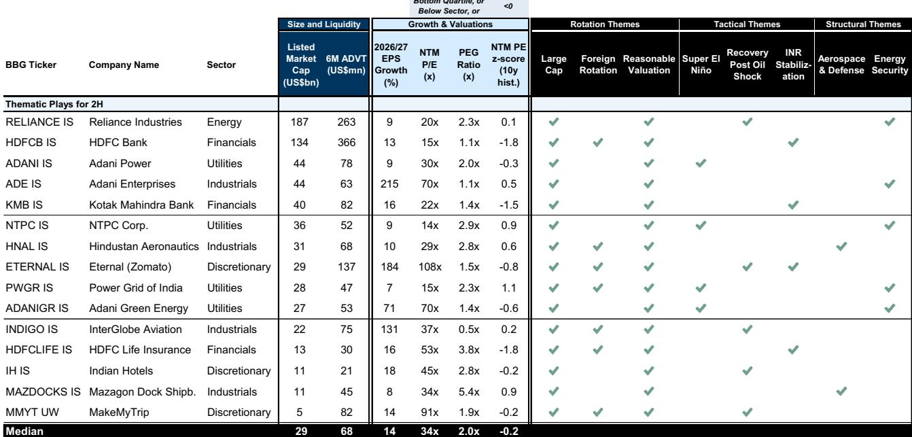
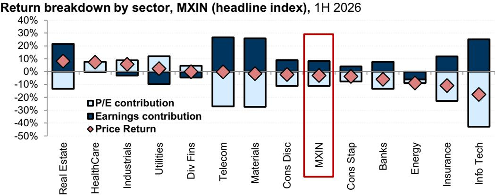
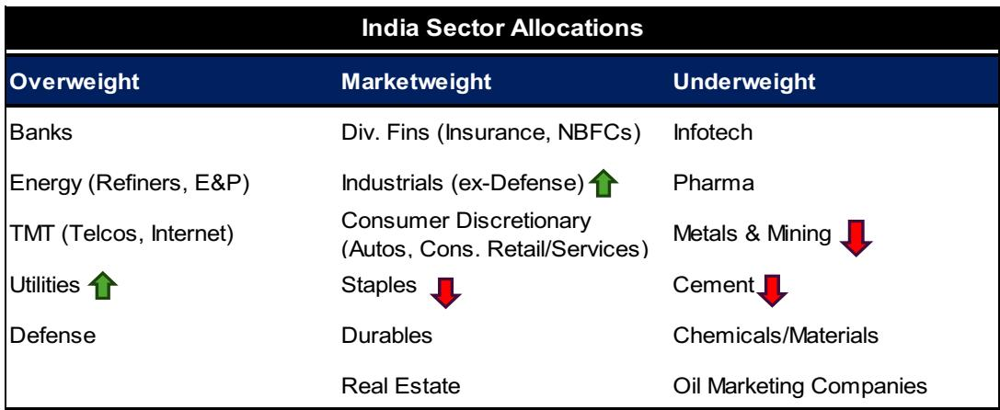

# GS：GS印度策略，反弹空间已打开

印度市场在经历上半年9%的回调后，GS近期发布策略报告，认为市场底部已经形成。核心判断是：外资持仓已降至极低水平，国内宏观环境韧性超预期，而市场对盈利下修的定价可能已经过头。报告给出NIFTY指数至2027年6月目标26500点，较当前约有10%的上行空间。这不是一个简单的反弹判断，而是基于三个可验证的结构性变化：盈利下修周期接近尾声、外资抛售不确定性释放完毕、以及估值从“增长溢价”向“价值修复”的轮动。

## 1. 盈利下修周期已进入尾声，部分行业可能被过度修正

当前MSCI印度2026年盈利增长预期已被从16%下修至12%，接近GS全年10%的预测。但报告指出，下修过程可能尚未结束，未来两个月仍有2个百分点的下调空间。关键在于，不同行业的下修幅度并不对称。能源精炼、旅游航空等板块的盈利预期可能被过度削减——这些行业产能紧张、需求韧性仍在，而分析师对油价冲击的影响估算偏保守。相比之下，金属矿业和医疗板块的下修可能还不够充分。这意味着，二季度财报季将出现预期与实际的错位，为读者提供战术性交易机会。

> **KC评论：** GS在此处提供了一个可复用的分析框架——不是看盈利下修本身，而是看“哪些行业的下修幅度与历史冲击模式不符”。能源精炼和旅游航空是当前最值得关注的错位方向。

## 2. 外资抛售已近极限，资金板块将率先受益

上半年外资净观点偏谨慎约300亿美元印度公司，创下历史纪录。但自6月中旬以来，外资已转为净观点偏积极，尽管规模仅20亿美元，且主要集中于资金板块。GS认为，外资对印度公司的持仓已降至极低水平，全球产品有充足空间将仓位从“大幅低配”调回中性。资金板块是外资抛售最集中的领域——过去4个月观点偏谨慎120亿美元，几乎抹去了过去十年累计流入。随着外资情绪改善，资金板块将成为最大受益者。估值方面，印度资金板块当前16倍远期PE，远低于MSCI印度整体20倍，且增长调整后的PE（PEG）不到1倍，是印度相对少见低于1倍门槛的板块。

## 3. 从“增长”到“价值”的轮动已经启动，大盘股性价比凸显

上半年市场风格偏向“增长”因子，因为读者在增长稀缺的环境下追逐确定性。但GS预计，随着市场预期宏观环境复苏，资金将从“增长”转向“价值”。当前MSCI印度中估值合理的公司占比已升至2-3年高位，为价值选股提供了足够宽的标的池。同时，大盘股相对中小盘股的折价已扩大至30%的历史极端水平。大盘股估值已回落至15年均值附近，而中小盘仍高于均值1.5个标准差。从盈利可见性看，大盘股上半年的盈利下修幅度也小于中小盘。GS建议超配大盘股、低配中小盘。

## 4. “超级厄尔尼诺”将制造行业分化：电力跑赢，农业承压

美国国家海洋和大气管理局预计，当前厄尔尼诺有63%概率在11月至1月演变为“超级”强度。印度气象部门预测2026年季风降雨量将低于正常水平10%，且7月气温持续偏高。GS认为，这将带来清晰的行业分化：电力公用事业受益于高温驱动的用电需求激增和水电受限导致的供给缺口，而农业相关板块（化肥、种子、农机、灌溉、食品加工）将面临不确定性。历史数据显示，在强厄尔尼诺月份，印度电力板块是最大受益者，而必需消费品板块表现最弱。

> **KC评论：** 这是一个典型的“天气主题交易”框架。GS将宏观气候变量直接映射到行业配置，而非停留在市场整体判断。对于关注印度市场的读者，这提供了一个可操作的观察窗口——电力与农业的相对表现，将是验证厄尔尼诺影响强度的实时指标。

For informational purposes only. Portions may be generated,translated,summarized,or edited with AI assistance based on source materials and may contain omissions or errors. Please verify independently. This is not investment,legal,tax,accounting,or other professional advice.

For informational purposes only. Portions may be generated,translated,summarized,or edited with AI assistance based on source materials and may contain omissions or errors. Please verify independently. This is not investment,legal,tax,accounting,or other professional advice.
