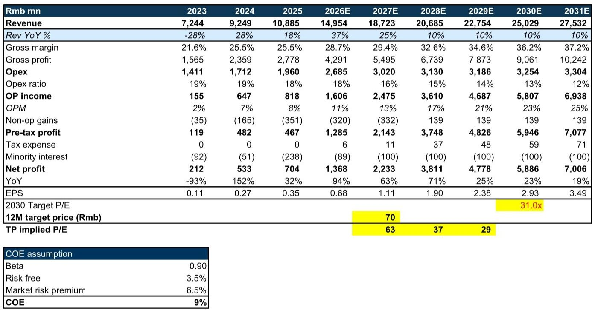
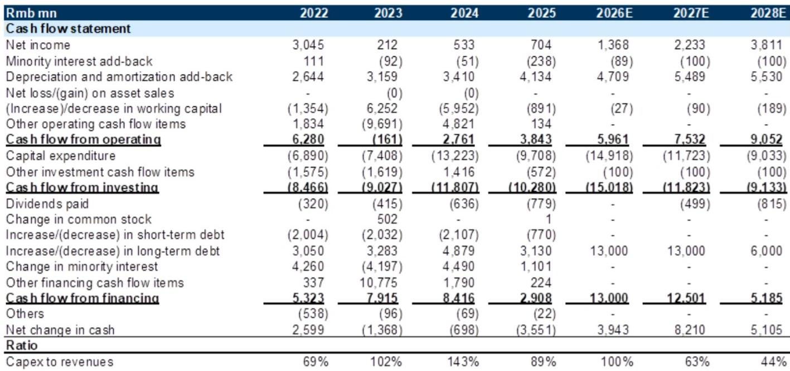
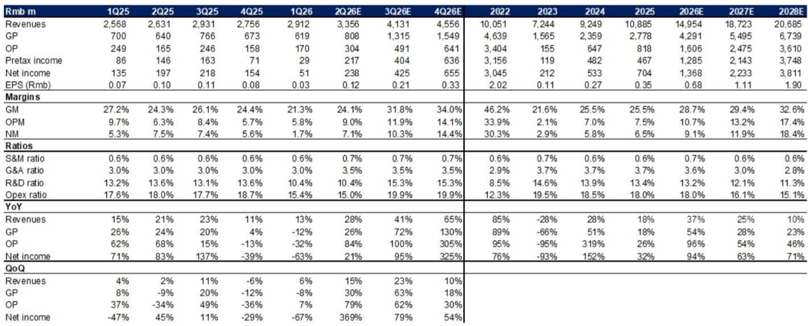

# Nexchip's 28nm Bet Will Reshape China's Foundry Economics, but the Market Has Already Priced In the Inflection

The most consequential decision in China's semiconductor manufacturing today is not about cutting-edge EUV lithography. It is about a single foundry's willingness to spend RMB 35.5 billion to build a 40nm and 28nm fab that will not reach full capacity until mid-2028. Nexchip, a pure-play foundry that has historically operated at the trailing edge of process technology, is making a strategic pivot that will define its financial trajectory for the next half-decade. The company has announced that trial production on its new advanced-node plant will begin in the fourth quarter of 2026, targeting a monthly capacity of 55,000 12-inch wafers across AI smartphone, AI PC, and smart automotive applications. This is not an incremental capacity addition. It is a structural upgrade of Nexchip's technology profile, and it arrives at a moment when China's semiconductor supply chain is absorbing unprecedented capital expenditure in pursuit of self-sufficiency.

The financial implications are already visible in the earnings revisions from a global investment bank's research team. Revenue estimates for 2026 and 2027 have been raised by 1% and 8% respectively, reflecting higher contribution from the 40nm and 28nm business lines. But the margin story is more nuanced. While 2026 gross margin is essentially unchanged at 28.7%, the 2027 gross margin estimate has been revised down by 90 basis points to 29.4%, driven by rising depreciation costs from the new capacity. This tension between top-line growth and margin compression is the central strategic challenge for Nexchip observers. The company's EPS is forecast to grow from RMB 0.35 in 2025 to RMB 1.90 by 2028, a compound annual growth rate of approximately 73%. Yet the stock carries a 2026 P/E of 79.5x, and the valuation methodology has shifted from near-term P/E to a 2030 discounted P/E framework to capture long-term visibility.

The bull case rests on a logical foundation: China's semiconductor ecosystem needs domestic foundry capacity at mature and advanced nodes, and Nexchip is one of the few players with the scale and government support to build it. The bear case, equally logical, is that the market has already priced this trajectory into a stock that trades at a significant premium to its global peers. The valuation is fair but not compelling. This article unpacks the strategic logic behind Nexchip's capacity expansion, the pricing power that supports its revenue growth, the depreciation drag that constrains margins, and the valuation framework that observers must use to assess whether the long-term opportunity justifies the near-term multiple.

## Nexchip's Capacity Expansion Is a Bet on China's Localization Imperative, Not on Cyclical Demand

The decision to invest RMB 35.5 billion in a 40nm and 28nm fab is not driven by a bullish view on semiconductor demand cycles. It is a structural response to China's accelerating push for domestic chip manufacturing. Nexchip's new plant, with a planned monthly capacity of 55,000 12-inch wafers, targets end markets that are themselves undergoing rapid localization: AI smartphone processors, AI PC chipsets, and smart automotive electronics. These are precisely the segments where Chinese fabless design houses are gaining market share, and they need a foundry partner that can meet their process technology requirements without reliance on Taiwan- or Korea-based suppliers.

The timeline is telling. Trial production will begin in the fourth quarter of 2026, with full capacity expected by the second quarter of 2028. This means Nexchip is committing capital today for revenue that will not fully materialize for nearly two years. The investment bank's research team has responded by raising its capacity and capex estimates for the coming years, reflecting the contribution of the new plant. But the lag between capital outlay and revenue generation creates a period of elevated financial risk. The company's net debt-to-equity ratio is forecast to rise from 68.6% in 2025 to 109.7% by 2027, and free cash flow is expected to remain deeply negative through 2027, turning positive only in 2028 with a marginal RMB 19 million. This is a balance sheet that will be under strain for the foreseeable future, and observers must assess whether the eventual payoff justifies the interim leverage.

The strategic logic, however, is sound. Nexchip's existing capacity is concentrated in more mature nodes, where competition is intense and pricing power is limited. The move to 40nm and 28nm represents a step up the technology ladder, capturing higher-value manufacturing that commands better unit economics. The investment bank's revenue estimates for 2028 stand at RMB 20.7 billion, up from RMB 10.9 billion in 2025, implying a revenue CAGR of approximately 24%. This growth is not driven by a broad market recovery; it is driven by Nexchip's ability to capture a share of China's expanding advanced-node foundry demand. The company is effectively positioning itself as a domestic alternative to the global foundry leaders in a segment that is strategically important for China's technology self-sufficiency.

## The 10% Price Increase Signals Pricing Power, but Depreciation Will Cap Margin Expansion

In June 2026, Nexchip will implement a 10% price increase across its product lines, explicitly citing rising raw material costs. This is a significant signal of pricing power in a foundry market that has historically been characterized by aggressive competition and periodic price declines. The investment bank's research team views the price increase as positive for profitability, and the revenue estimates for 2026 and 2027 have been revised upward accordingly. But the margin impact is more complex than a simple pass-through of cost increases.

The 2026 gross margin estimate remains essentially unchanged at 28.7%, suggesting that the price increase will offset higher input costs without generating margin expansion. The 2027 gross margin estimate, however, has been revised down by 90 basis points to 29.4%, even as revenue estimates have been raised. The culprit is depreciation. The new plant will require significant upfront capital expenditure, and the associated depreciation charges will begin to flow through the income statement before the plant reaches full production. The operating margin for 2027 is now estimated at 13.2%, down from the prior estimate of 13.8%, a decline of 60 basis points.

This dynamic creates an unusual pattern in Nexchip's margin trajectory. The gross margin is forecast to improve from 25.5% in 2025 to 32.6% by 2028, driven by the mix shift toward higher-value 40nm and 28nm products and the eventual absorption of fixed costs as the new plant ramps. But the path is not linear. The 2027 margin compression is a headwind that observers must navigate. The key question is whether the revenue growth from the new capacity will outpace the depreciation drag. The investment bank's estimates suggest that it will, but only by a narrow margin. The net income margin is forecast to reach 18.4% by 2028, up from 6.5% in 2025, but this assumes that the pricing environment remains supportive and that the ramp-up proceeds without significant yield issues or delays.

## The Valuation Shift to Discounted P/E Reflects a Structural Change in How Observers Must Think About Nexchip

The investment bank has changed its valuation methodology from near-term P/E to a 2030 discounted P/E framework, a move that is consistent with its broader China semiconductor coverage. This is not a technical adjustment. It is a fundamental recognition that Nexchip's value creation will occur over a multi-year horizon, not in the next two to three quarters. The target multiple of 31x 2030 discounted P/E is derived from a peer correlation analysis linking forward-year trading P/E to net income growth. Based on Nexchip's projected 2030-2031 average net income growth of 21%, the 31x multiple is applied and discounted back to 2027 using a cost of equity of 9%.

The investment bank notes this is in line with the stock's recent forward trading P/E range of roughly 64x. This is the crux of the report's perspective. The stock is not obviously cheap, but it is not obviously expensive either, given the growth trajectory. The investment bank's estimates for 2026 and 2027 net income are 15% and 28% higher than Bloomberg consensus, respectively, indicating that the research team is more optimistic than the market about Nexchip's earnings power. Yet even with these above-consensus estimates, the valuation does not present a compelling entry point.

The discounted P/E framework also highlights a risk that is often overlooked in growth stock analysis: the compounding effect of the discount rate. A 9% cost of equity over three years reduces the present value of future earnings by approximately 25%. This means that even if Nexchip achieves its 2030 earnings targets, the current stock price already reflects a significant portion of that multi-year growth story. Observers are being asked to pay a premium for visibility, but the premium is already embedded in the multiple.

## A Decision Framework for Assessing Nexchip's Risk-Reward Profile

For those evaluating Nexchip, the key variables are not difficult to identify, but their interaction creates a complex risk-reward calculus. The framework below translates the report's analysis into actionable decision points.

The first variable is the ramp-up trajectory of the new plant. The investment bank assumes that trial production will begin in Q4 2026 and that full capacity of 55,000 wafers per month will be achieved by Q2 2028. Any delay in this timeline would compress the revenue upside while depreciation charges continue to accumulate. The second variable is the pricing environment. The 10% price increase in June 2026 is a known catalyst, but sustaining pricing power beyond that point depends on the balance between China's foundry demand and the capacity additions of competitors. The third variable is the depreciation schedule. The investment bank's margin estimates assume a specific pattern of depreciation charges, but changes in the useful life assumptions or accelerated depreciation could alter the margin trajectory.

The fourth variable is the competitive landscape. Nexchip is not the only Chinese foundry investing in advanced-node capacity. The investment bank's peer analysis provides a benchmark for valuation, but it also implies that Nexchip's growth is not occurring in a vacuum. The fifth variable is the broader China semiconductor capex cycle. The investment bank's positive view on China semi supply chain is predicated on rising advanced-node capacity expansion and the generative AI trend. A change in China's technology investment cycle would directly impact Nexchip's revenue outlook.

The decision framework can be summarized as follows. If the plant ramp proceeds on schedule, pricing holds, and depreciation follows the forecast pattern, Nexchip's 2028 net income of RMB 3.8 billion supports a valuation that is roughly in line with the current price. If any of these variables deteriorates, the downside risk is significant given the elevated leverage and negative free cash flow. The report's perspective reflects this balanced assessment. The stock is a hold for existing observers who believe in the long-term thesis, but it does not offer a sufficient margin of safety for new positions at the current multiple.

## The Market Has Discounted the Inflection, but Execution Risk Remains the Unpriced Variable

Nexchip's story is compelling in its strategic logic. The company is making a bold bet on China's semiconductor localization, investing heavily in advanced-node capacity that will serve the fastest-growing segments of the domestic market. The pricing power demonstrated by the 10% price increase suggests that Nexchip has some ability to pass through cost increases, and the long-term margin trajectory is positive as the new plant reaches full capacity and depreciation charges moderate.

But the market has already priced this narrative. The 2027 P/E of 63x is not a value multiple; it is a growth multiple that assumes near-flawless execution over a multi-year period. The investment bank's own estimates, which are above consensus, still imply a fair value that is only 29% above the current price. This is not the kind of asymmetric risk-reward profile that generates outsized returns. It is a scenario where the upside is limited by valuation and the downside is amplified by leverage and execution risk.

The most important insight from the investment bank's analysis is that Nexchip's value will be determined by its ability to execute on the new plant ramp, not by the broad semiconductor cycle. The company is creating its own destiny through capital allocation, and those who want to participate in that story must accept the associated uncertainty. The report's perspective is not a lack of conviction. It is a recognition that the current price already reflects a high probability of success, leaving little room for error.

*For informational purposes only. Portions may be generated, translated, summarized, or edited with AI assistance based on source materials and may contain omissions or errors. Please verify independently. This is not professional advice.*

For informational purposes only. Portions may be generated, translated, summarized, or edited with AI assistance based on source materials and may contain omissions or errors. Please verify independently. This is not professional advice.

