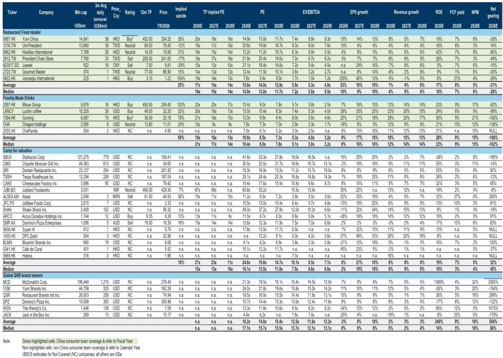
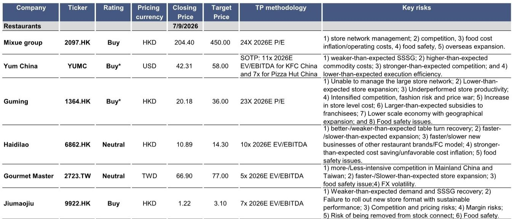
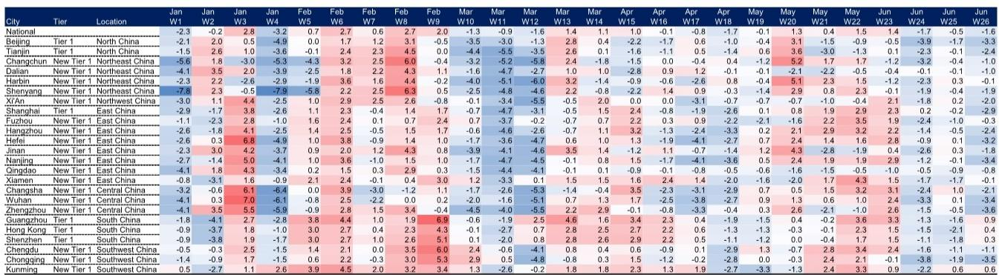

# 中国餐饮行业月度观察-6月更新：茶饮在高基数下仍具韧性

6月中国餐饮数据延续了此前的分化格局。最新月度追踪显示，现制茶饮板块的同店销售表现，在去年高基数下反而展现出超出预期的韧性，而火锅和正餐品牌则继续受到天气和消费意愿的影响。这份报告的核心价值在于，它提供了对茶饮品牌“触底修复”信号的月度验证，同时揭示了正餐品牌在门店扩张和同店增长之间的两难。

报告中最具辨识度的对比来自茶饮板块。以茶百道为例，其6月同店销售环比改善至仅小幅下滑，这得益于咖啡品类的推出和“冰椰荔枝”等成功新品。古茗的同店销售同样改善至小幅下滑，部分原因是促销日历调整（6月买一送一活动，去年在5月）。霸王茶姬的月均GMV超过35万元，同店销售和GMV均环比提升，新品“流沙茶”和柠檬奶茶贡献了约15%的GMV。这些数据表明，此前对茶饮板块的悲观预期可能过度，头部品牌通过产品创新和品类扩张，正在消化高基数不确定性。

> **观察评论：** 茶饮的韧性不是全面回暖，而是“有条件的修复”。报告特别指出，促销力度虽在加大，但整体仍保持克制。这意味着，对茶饮板块的定价可能低估了品牌通过产品创新而非单纯价格战来维持客流的能力。

正餐板块则呈现另一幅图景。海底捞6月翻台率稳定在约3.8次，同比小幅下滑，恢复至2019年水平的约80%，低于5月的80%-85%区间。太二酸菜鱼6月同店销售增速节奏变化至中个位数下滑，主要受6月最后一周不利天气影响（前三周仍为双位数增长）。报告认为，海底捞1H26平均翻台率约2%的增长，低于其假设的4%单店销售增速，尽管市场预期已随消费环境变化而调整。

门店网络调整也反映出不同策略。海底捞6月净关店1家，上半年净关8家，低于预期的净开23家；但上半年新开14家加盟店，超出预期的8家。九毛九旗下太二上半年净关23家店，其中2Q26净关5家。这组数据说明，头部正餐品牌正在主动调整直营网络，同时试探性开放加盟，以降低资本开支不确定性。

对九毛九的解读值得关注：太二6月同店增速虽受天气影响节奏变化，但新店型（6.0版本）首周销售额比旧店型高出30%-40%。如果这一模型测试成功，可能带来未来门店效率的提升。这提示我们，在整体消费环境偏弱时，品牌间的竞争正在从“铺店速度”转向“单店模型效率”。

这份报告还提供了一个可复用的观察框架：将同店销售、门店净增、新店型效率三个指标组合来看，可以更准确地判断一个餐饮品牌的真实经营状态。单看同店销售可能低估茶饮的修复，单看门店数量可能高估正餐的扩张质量。

For informational purposes only. Portions may be generated,translated,summarized,or edited with AI assistance based on source materials and may contain omissions or errors. Please verify independently. This is not investment,legal,tax,accounting,or other professional advice.

