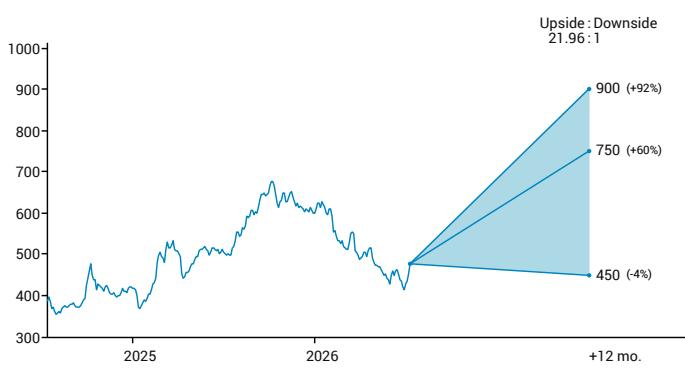
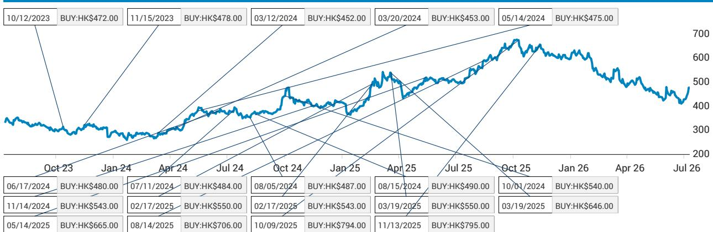
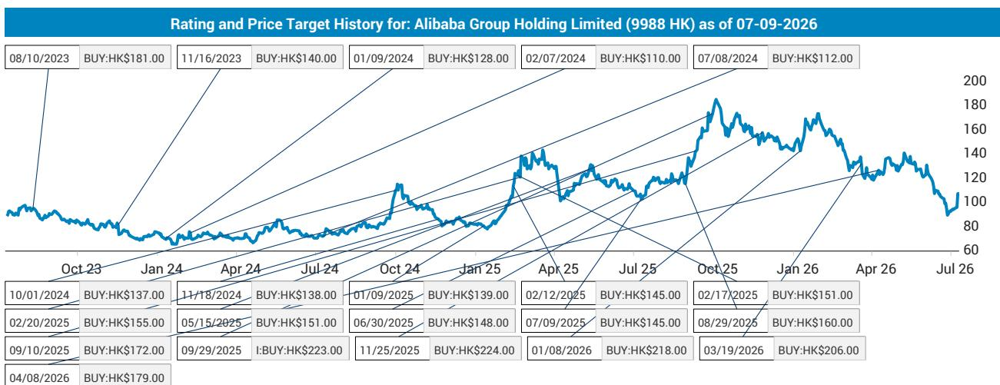
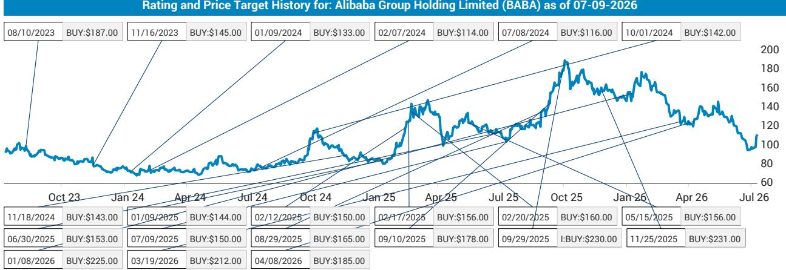

# 多领域AI进展观察；相关投入并非市场新话题

腾讯近期在AI领域有多项新进展，包括Hy3的发布、微信AI的测试以及WorkBuddy的持续拓展。预计第二季度广告业务继续扩大市场份额，国内游戏增速快于海外。受AI相关投入影响，非IFRS盈利增速预计慢于收入增速。如我们此前报告所述（链接），AI领域的投入及资本开支增加预计将在2026年持续。

结合最新趋势，AI领域进展稳健。第二季度，我们预计总收入同比增长约9.6%（维持不变），约2000亿元人民币。分业务看，预计网络游戏收入同比增长约8.6%（市场一致预期为同比增长11%，我们此前预期为同比增长8.6%），其中国内游戏增速快于海外游戏。国内游戏方面，预计长青游戏表现稳健。根据我们对iOS畅销榜的观察，第二季度《洛克王国：世界》表现优于《王者荣耀：世界》（链接）。海外游戏方面，预计Supercell畅销榜效应消退及收购工作室常态化将带来收入递延影响。我们预计AI将提升用户参与度和变现能力。营销服务方面，预计收入同比增长18%（市场一致预期为同比增长18%），达424亿元人民币，得益于广告技术升级及视频号的表现。金融科技及企业服务（FBS）方面，预计收入同比增长9%（市场一致预期为同比增长9%），综合考虑近期消费趋势及云业务收入同比增速预期加快。受AI投入影响，预计非IFRS营业利润同比增长6%（市场一致预期为同比增长9.3%），约730亿元人民币。预计非IFRS净利润同比增长4%（市场一致预期为同比增长9.7%，与我们此前预期基本持平），达655亿元人民币。

微信AI测试于6月启动。腾讯正在社交沟通、信息搜索、生产力、娱乐购物及工具生成等多个场景对微信AI进行小规模测试。微信AI名为“小微”，位于主页面左上角，也是消息功能中的一项特性。核心模型为微信团队自研的WeLM。我们认为这是腾讯在Agent2Agent（A2A）领域的重要一步，预计正式版本将于2026年第四季度发布。详情请参阅报告（链接）。

WorkBuddy在办公空间Agent市场处于领先地位。公司引用了第三方机构Analysys关于WorkBuddy在该领域运营指标的数据（2026年3月）。这些指标包括：1）桌面端月访问量达885万次；2）WorkBuddy领先于Trae（字节跳动）、QClaw（腾讯）和Qoder Work（阿里巴巴）。

以下内容继续...

<table><tr><td>财年（12月）</td><td>2024A</td><td>2025A</td><td>2026E</td><td>2027E</td></tr><tr><td>收入（百万）</td><td>660,257.0</td><td>751,766.0</td><td>822,715.0</td><td>894,173.0</td></tr><tr><td>调整后净利润</td><td>222,703.0</td><td>259,626.0</td><td>269,936.0</td><td>277,310.0</td></tr></table>

<table><tr><td colspan="2">目标调整</td></tr><tr><td>评级</td><td>买入</td></tr><tr><td>报价</td><td>港币469.60元^</td></tr><tr><td>目标价 | 较目标价</td><td>↓港币750.00元（港币795.00元）| +60%</td></tr><tr><td>52周高低</td><td>港币683.00元 - 港币411.00元</td></tr><tr><td>流通比例（%）| 日均成交额（百万美元）</td><td>68.3% | 2,179.76</td></tr><tr><td>总市值</td><td>港币4.3万亿元 | 5444亿美元</td></tr><tr><td>代码</td><td>700 HK</td></tr></table>

^除非另有说明，为前一交易日收盘价。

<table><tr><td>财年（12月）</td><td colspan="2">较JEFe变动</td><td colspan="2">JEF vs 市场一致预期</td></tr><tr><td></td><td>2026</td><td>2027</td><td>2026</td><td>2027</td></tr><tr><td>收入</td><td>不适用</td><td>不适用</td><td>不适用</td><td>不适用</td></tr><tr><td>每股收益</td><td>不适用</td><td>不适用</td><td>不适用</td><td>不适用</td></tr></table>

Thomas Chong \* | 股票分析师
852 3743 8016 | thomas.chong@JEF.com

Zoey Zong \* | 股票分析师
852 3743 8163 | zoey.zong@JEF.com

## 长期视角：腾讯控股

## 研究观点

- 我们认为，腾讯从消费互联网向产业互联网的演进，同时保持其在游戏领域的坚实基础并扩大广告市场份额，为其未来发展奠定了基础。

- 预期稳健的收入增长由多个驱动因素支撑，在宏观环境变化中降低了集中度风险。

- 腾讯的社交生态，注重投入产出比并具有显著的协同效应，使其在宏观环境变化和竞争加剧的背景下，相较于同行具备关键竞争优势。

风险/回报 - 12个月展望  

## 基准情景，港币750元，+60%

• 我们认为腾讯是全球移动游戏领导者，在成功开发游戏方面拥有良好记录。

- 《王者荣耀》的成功，日活跃用户数创历史新高，新游戏获得积极反馈，加上产品组合策略，应能推动长期增长。

• 我们认为视频广告领域内容为王。

• 基于分部估值法，目标价为港币750元。

上行情景，港币900元，+92%

- 高流水新游戏成功上线。

- 宏观环境改善带动在线广告增长超预期。

- 云业务亏损收窄幅度超预期。

- 基于分部估值法，上行目标价为港币900元。

下行情景，港币450元，-4%

• 新游戏上线未达预期。

- 宏观环境因素导致在线广告增长慢于预期。

- 支付业务补贴及云业务资本开支力度较大。

- 基于分部估值法，下行目标价为港币450元。

## 可持续发展相关事项

主要议题：1）数据安全与客户隐私。隐私保护与数据安全措施对科技公司至关重要。公司需要以合乎道德的方式开发和使用技术，并维护合作伙伴、客户及交易对手的信任。2）员工敬业度、多元化和包容性。人才是为公司创造价值的关键，员工队伍的多元化对创新很重要。公司应优先考虑员工敬业度与工作生活平衡，这有助于招聘和留住多元化人才。

## 催化剂

公司目标：1）承诺到2030年实现运营及供应链碳中和，并在可行情况下将电力供应转为100%绿色电力或可再生能源。2）到2025年底，腾讯在中国大陆自建办公大楼的人均用电量较2019年基准减少15%。

- 高流水新游戏上线。

• 前景展望好于预期。

- 广告市场份额增长快于预期。

向管理层提问：1）公司在保护自身及客户数据方面有哪些投入？2）环保措施对利润率有何影响？

Hy3正式版根据用户反馈进行了多项增强。与预览版相比，Hy3的主要亮点包括：1）收到来自50多个业务部门的反馈，用户体验得到升级。在输入/输出价格方面，Hy3每百万token价格为人民币1元/4元，低于预览版的人民币2元/8元，旨在支持更多用户和场景。2）在后训练方面进一步强化，如强化学习。在长上下文方面表现优于参数规模大2-5倍的大模型。3）在生产力场景中创造价值，如软件开发、办公、财务、设计和游戏开发。4）在真实工作场景中对270位专家进行的盲测显示，Hy3在多项指标上优于GLM-5.1（如前端、数据、存储、CI/CD）。5）进一步改进：a）任务成功率较预览版提升（90%对比之前的72%）；b）token效率提升；与GLM-5.2相比，在文字处理（47.4%）和PPT（49%）方面节省了token消耗；c）幻觉率降低15个百分点。详情请参阅我们的报告（链接）。

腾讯云AI行业应用峰会要点。亮点包括：1）基础模型、产品和前沿技术探索是关键；2）腾讯凭借跨不同场景的全面产品组合脱颖而出，为模型和Agent/编码产品提供更完整的数据洞察；3）产品与模型团队之间的协同设计很重要，信任是关键；4）模型性能在token消耗方面实现了效率提升；5）AI是一个长期故事，目前仍处于早期发展阶段。详情请参阅我们的报告（链接）。

财报电话会议关注重点：1）AI策略更新及WorkBuddy最新趋势反馈。此外，市场关注微信AI测试的用户反馈。2）AI模型竞争格局及Hy3正式版的反馈。3）国内在线游戏策略，如现有游戏（如《王者荣耀》、《和平精英》）的焕新计划及新兴IP的进展。4）海外游戏展望。5）不同行业类别的广告展望及趋势。6）金融科技（如支付和非支付）收入趋势。7）资本开支趋势及云收入展望。8）运营费用趋势。9）不同业务板块AI变现机会的更新。10）下半年盈利增长。11）股东回报。

估值与风险。我们维持报告评级，并将目标价调整至港币750元（此前为港币795元），综合考虑AI投入及市盈率倍数下调，以反映市场情绪变化下行业估值的动态。风险包括：1）新游戏上线未达预期；2）宏观环境因素导致在线广告增长慢于预期；3）新业务投入力度较大。

图表1 - 700 HK：利润表

<table><tr><td colspan="7">利润表（700 HK）</td></tr><tr><td>人民币百万元</td><td>2022A</td><td>2023A</td><td>2024A</td><td>2025A</td><td>2026F</td><td>2027F</td></tr><tr><td>总收入</td><td>554,552</td><td>609,015</td><td>660,257</td><td>751,766</td><td>822,715</td><td>894,173</td></tr><tr><td>收入成本</td><td>-315,806</td><td>-315,906</td><td>-311,011</td><td>-329,173</td><td>-364,765</td><td>-409,654</td></tr><tr><td>毛利润</td><td>238,746</td><td>293,109</td><td>349,246</td><td>422,593</td><td>457,949</td><td>484,519</td></tr><tr><td>销售及市场推广费用</td><td>-29,229</td><td>-34,211</td><td>-36,388</td><td>-41,727</td><td>-49,061</td><td>-53,967</td></tr><tr><td>研发费用</td><td>-61,401</td><td>-64,078</td><td>-70,686</td><td>-85,747</td><td>-108,005</td><td>-118,806</td></tr><tr><td>一般及行政费用</td><td>-45,295</td><td>-39,447</td><td>-42,075</td><td>-50,380</td><td>-45,032</td><td>-47,284</td></tr><tr><td>非IFRS营业利润</td><td>153,538</td><td>191,886</td><td>237,811</td><td>280,656</td><td>293,736</td><td>303,554</td></tr><tr><td>非IFRS营业利润率</td><td>27.7%</td><td>31.5%</td><td>36.0%</td><td>37.3%</td><td>35.7%</td><td>33.9%</td></tr><tr><td>非IFRS净利润</td><td>115,549</td><td>157,688</td><td>222,703</td><td>259,626</td><td>269,936</td><td>277,310</td></tr><tr><td>非IFRS净利润率</td><td>20.8%</td><td>25.9%</td><td>33.7%</td><td>34.5%</td><td>32.8%</td><td>31.0%</td></tr></table>

来源：公司数据，JEF估计

图表2 - 700 HK：资产负债表

<table><tr><td colspan="7">资产负债表（700 HK）</td></tr><tr><td>人民币百万元</td><td>2022A</td><td>2023A</td><td>2024A</td><td>2025A</td><td>2026F</td><td>2027F</td></tr><tr><td>现金及现金等价物</td><td>156,739</td><td>172,320</td><td>132,519</td><td>141,041</td><td>201,399</td><td>254,150</td></tr><tr><td>以公允价值计量且其变动计入当期损益的金融资产</td><td>27,963</td><td>14,903</td><td>12,913</td><td>44,710</td><td>44,710</td><td>44,710</td></tr><tr><td>定期存款</td><td>104,776</td><td>185,983</td><td>192,977</td><td>236,801</td><td>238,801</td><td>240,801</td></tr><tr><td>受限资金</td><td>2,783</td><td>3,818</td><td>3,334</td><td>6,977</td><td>6,977</td><td>6,977</td></tr><tr><td>应收账款</td><td>45,467</td><td>46,606</td><td>48,203</td><td>49,930</td><td>54,642</td><td>59,388</td></tr><tr><td>存货</td><td>2,333</td><td>456</td><td>440</td><td>530</td><td>530</td><td>530</td></tr><tr><td>预付款项、押金及其他应收款</td><td>77,963</td><td>94,360</td><td>105,794</td><td>115,471</td><td>126,369</td><td>137,345</td></tr><tr><td>持有待分配资产</td><td>147,965</td><td>-</td><td>-</td><td>-</td><td>-</td><td>-</td></tr><tr><td>流动资产合计</td><td>565,989</td><td>518,446</td><td>496,180</td><td>595,460</td><td>673,428</td><td>743,901</td></tr><tr><td>可供出售金融资产</td><td>391,332</td><td>425,096</td><td>507,359</td><td>563,797</td><td>563,997</td><td>564,197</td></tr><tr><td>物业、厂房及设备</td><td>63,766</td><td>67,385</td><td>93,288</td><td>160,525</td><td>330,080</td><td>537,435</td></tr><tr><td>土地使用权</td><td>18,046</td><td>17,179</td><td>23,117</td><td>22,339</td><td>22,339</td><td>22,339</td></tr><tr><td>无形资产</td><td>161,802</td><td>177,727</td><td>196,127</td><td>205,999</td><td>209,710</td><td>213,421</td></tr><tr><td>对联营企业的投资</td><td>252,715</td><td>261,665</td><td>297,415</td><td>348,712</td><td>348,712</td><td>348,712</td></tr><tr><td>递延所得税资产</td><td>29,882</td><td>29,017</td><td>28,325</td><td>28,618</td><td>28,618</td><td>28,618</td></tr><tr><td>定期存款</td><td>28,336</td><td>29,301</td><td>77,601</td><td>70,302</td><td>70,302</td><td>70,302</td></tr><tr><td>使用权资产</td><td>22,524</td><td>20,464</td><td>17,679</td><td>17,367</td><td>17,367</td><td>17,367</td></tr><tr><td>预付款项、押金及其他资产</td><td>43,739</td><td>30,966</td><td>43,904</td><td>25,867</td><td>31,040</td><td>37,248</td></tr><tr><td>非流动资产合计</td><td>1,012,142</td><td>1,058,800</td><td>1,284,815</td><td>1,443,526</td><td>1,622,165</td><td>1,839,639</td></tr><tr><td>资产总计</td><td>1,578,131</td><td>1,577,246</td><td>1,780,995</td><td>2,038,986</td><td>2,295,593</td><td>2,583,540</td></tr><tr><td>递延收入</td><td>82,216</td><td>86,168</td><td>100,097</td><td>110,309</td><td>120,720</td><td>131,205</td></tr><tr><td>应付账款</td><td>92,381</td><td>100,948</td><td>118,712</td><td>121,127</td><td>135,422</td><td>150,435</td></tr><tr><td>其他应付款及应计费用</td><td>61,139</td><td>76,595</td><td>84,032</td><td>96,496</td><td>79,206</td><td>87,987</td></tr><tr><td>租赁负债</td><td>6,354</td><td>6,154</td><td>5,600</td><td>5,386</td><td>5,386</td><td>5,386</td></tr><tr><td>短期债务</td><td>11,580</td><td>41,537</td><td>52,885</td><td>42,618</td><td>42,618</td><td>42,618</td></tr><tr><td>应付股息</td><td>147,965</td><td>-</td><td>-</td><td>-</td><td>-</td><td>-</td></tr><tr><td>其他流动负债</td><td>32,569</td><td>40,755</td><td>35,583</td><td>36,815</td><td>37,615</td><td>38,415</td></tr><tr><td>流动负债合计</td><td>434,204</td><td>352,157</td><td>396,909</td><td>412,751</td><td>420,966</td><td>456,046</td></tr><tr><td>长期应付票据</td><td>312,337</td><td>292,920</td><td>277,107</td><td>334,573</td><td>334,573</td><td>334,573</td></tr><tr><td>递延所得税负债</td><td>12,162</td><td>17,635</td><td>18,546</td><td>21,684</td><td>21,684</td><td>21,684</td></tr><tr><td>租赁负债</td><td>18,424</td><td>16,468</td><td>13,897</td><td>13,280</td><td>13,280</td><td>13,280</td></tr><tr><td>其他金融负债</td><td>5,574</td><td>8,781</td><td>4,203</td><td>2,879</td><td>2,879</td><td>2,879</td></tr><tr><td>长期应付款</td><td>12,570</td><td>15,604</td><td>16,437</td><td>12,754</td><td>12,754</td><td>12,754</td></tr><tr><td>非流动负债合计</td><td>361,067</td><td>351,408</td><td>330,190</td><td>385,170</td><td>385,170</td><td>385,170</td></tr><tr><td>负债合计</td><td>795,271</td><td>703,565</td><td>727,099</td><td>797,921</td><td>806,136</td><td>841,216</td></tr><tr><td>股东权益</td><td>721,391</td><td>808,591</td><td>973,548</td><td>1,154,152</td><td>1,397,349</td><td>1,647,617</td></tr><tr><td>少数股东权益</td><td>61,469</td><td>65,090</td><td>80,348</td><td>86,913</td><td>92,109</td><td>94,707</td></tr><tr><td>股东权益及负债合计</td><td>1,578,131</td><td>1,577,246</td><td>1,780,995</td><td>2,038,986</td><td>2,295,593</td><td>2,583,540</td></tr></table>

来源：公司数据，JEF估计

图表3 - 700 HK：现金流量表

<table><tr><td colspan="7">现金流量表（700 HK）</td></tr><tr><td>人民币百万元</td><td>2022A</td><td>2023A</td><td>2024A</td><td>2025A</td><td>2026F</td><td>2027F</td></tr><tr><td>净利润</td><td>188,709</td><td>118,048</td><td>196,467</td><td>229,801</td><td>237,945</td><td>242,419</td></tr><tr><td>经营活动现金流</td><td>146,091</td><td>221,962</td><td>258,521</td><td>303,052</td><td>311,907</td><td>342,300</td></tr><tr><td>投资活动现金流</td><td>(104,871)</td><td>(125,161)</td><td>(122,187)</td><td>(205,732)</td><td>(241,694)</td><td>(279,694)</td></tr><tr><td>融资活动现金流</td><td>(59,953)</td><td>(82,573)</td><td>(176,494)</td><td>(87,155)</td><td>(9,855)</td><td>(9,855)</td></tr><tr><td>现金变动</td><td>(18,733)</td><td>14,228</td><td>(40,160)</td><td>10,165</td><td>60,358</td><td>52,751</td></tr><tr><td>汇率变动及其他调整</td><td>7,506</td><td>1,353</td><td>359</td><td>(1,643)</td><td>-</td><td>-</td></tr><tr><td>年初现金及现金等价物</td><td>167,966</td><td>156,739</td><td>172,320</td><td>132,519</td><td>141,041</td><td>201,399</td></tr><tr><td>年末现金及现金等价物</td><td>156,739</td><td>172,320</td><td>132,519</td><td>141,041</td><td>201,399</td><td>254,150</td></tr></table>

来源：公司数据，JEF估计

我们感谢Evalueserve Inc.的员工Fiona Fan为本报告的准备提供研究支持服务。我们感谢Evalueserve Inc.的员工Han Wang为本报告的准备提供研究支持服务。我们感谢Evalueserve Inc.的员工Erica Qiu为本报告的准备提供研究支持服务。

## 公司描述

腾讯控股

腾讯控股有限公司及其子公司主要向中华人民共和国用户提供互联网增值服务、移动及电信增值服务以及在线广告服务。公司分为四个业务板块：互联网增值服务；移动及电信增值服务；在线广告；及其他。

## 公司估值/风险

## 腾讯控股

我们给予报告评级，基于分部估值法的目标价为港币750元。风险包括：（1）新游戏上线未达预期；（2）宏观环境因素导致在线广告增长慢于预期；（3）新业务投入力度较大。

## 阿里巴巴集团控股有限公司

我们的目标价为185美元/179港元，基于分部估值法。主要风险包括：（1）宏观环境变化影响在线购物增长；（2）因竞争加剧，本地生活服务及全球化业务营销投入较大；（3）用户增长低于预期。

## 分析师认证：

我，Thomas Chong，特此证明本研究报告中所表达的所有观点均准确反映了我个人对所涉证券及公司的看法。我还证明，我的报酬中没有任何部分直接或间接与本研究报告中的具体推荐或观点相关。

我，Zoey Zong，特此证明本研究报告中所表达的所有观点均准确反映了我个人对所涉证券及公司的看法。我还证明，我的报酬中没有任何部分直接或间接与本研究报告中的具体推荐或观点相关。

非美国分析师注册：Thomas Chong受雇于JEF Hong Kong Limited，该公司是JEF LLC的非美国关联公司，未在FINRA注册/具备研究分析师资格。该分析师可能不是JEF LLC（FINRA成员公司）的关联人士，因此可能不受FINRA规则2241中关于与目标公司沟通、公开露面及持有研究分析师交易证券的限制。

非美国分析师注册：Zoey Zong受雇于JEF Hong Kong Limited，该公司是JEF LLC的非美国关联公司，未在FINRA注册/具备研究分析师资格。该分析师可能不是JEF LLC（FINRA成员公司）的关联人士，因此可能不受FINRA规则2241中关于与目标公司沟通、公开露面及持有研究分析师交易证券的限制。与所有JEF员工一样，负责本报告所涉金融工具覆盖范围的分析师的报酬部分基于公司的整体业绩，包括投行业务收入。我们力求适时更新研究，但各种法规可能阻止我们这样做。除某些定期发布的行业报告外，大部分报告由分析师酌情在不定期发布。

## 投资推荐记录

（MAR第3条第1e款和第7条）

推荐发布

2026年7月10日 凌晨1:21

推荐分发

2026年7月10日 凌晨1:21

## 公司特定披露

## JEF评级说明

买入 - 指我们预期在12个月内总回报（价格上涨加回报表现）达到15%或以上的证券。持有 - 指我们预期在12个月内总回报（价格上涨加回报表现）在正15%至负10%之间的证券。跑输 - 指我们预期在12个月内总回报（价格上涨加回报表现）为负10%或以下的证券。对于平均证券价格持续低于10美元的报告评级证券，预期12个月内总回报（价格上涨加回报表现）为20%或以上，因为这些公司通常比整体市场波动更大。对于平均证券价格持续低于10美元的持有评级证券，预期12个月内总回报（价格上涨加回报表现）为正负20%。对于平均证券价格持续低于10美元的跑输评级证券，预期12个月内总回报（价格上涨加回报表现）为负20%或以下。

NR - 投资评级和目标价已暂时暂停。此类暂停符合适用法规和/或JEF政策。

CS - 覆盖暂停。JEF已暂停对该公司的覆盖。

NC - 未覆盖。JEF不覆盖该公司。

受限 - 指因JEF参与特定交易、公司政策或适用证券法规禁止某些类型的沟通（包括投资推荐）的发行人。

监控 - 指正在监控公司基本面和财务状况的证券，不提供财务预测或对公司研究价值的意见。

## 估值方法

JEF分配评级的方法可能包括：市值、成熟度、增长/价值、波动性和未来12个月的预期总回报。目标价基于多种方法，可能包括但不限于：市场风险分析、增长率、收入流、现金流折现、EBITDA、每股收益、现金流、自由现金流、EV/EBITDA、市盈率、PEG、P/CF、P/FCF、溢价（折价）/平均组EV/EBITDA、溢价（折价）/平均组市盈率、分部加总、净资产价值、股息回报率和未来12个月的净资产回报表现。

## JEF精选股

JEF精选股包括我们股票分析师在12个月内从最佳股票想法中选出的股票。股票选择基于基本面分析，并可能考虑其他因素，如分析师确信度、差异化分析、有利的风险/回报比以及JEF分析师推荐的投研主题。JEF精选股将仅包括报告评级股票，数量可能因分析师推荐纳入情况而异。股票将在新机会出现时加入，并在纳入原因发生变化、股票已达到预期回报、不再被评为买入和/或触发止损时移除。120日波动率处于标普股票底部四分之一的股票将继续设置15%的止损，其余股票将设置20%的止损。精选股并非旨在代表推荐的投资组合，也不基于行业，但我们可能会指出我们认为某只股票属于增长或价值等投资风格。

## 可能阻碍实现我们目标价的风险

本报告为一般性流通编制，不提供针对个人读者的具体研究交流。因此，本报告中讨论的金融工具可能不适合所有读者，读者必须根据自己的具体投资目标和财务状况，利用其认为必要的财务顾问做出自己的投资决策。本报告中推荐的金融工具的过往表现不应被视为未来结果的指示或保证。本报告中提及的任何金融工具的价格、价值和收入都可能上涨或下跌，并可能受到经济、金融和政治因素变化的影响。如果金融工具以读者本国货币以外的货币计价，汇率变化可能对本报告中描述的金融工具的价格、价值或收入产生不利影响。如果价格以非美元货币显示，请注意我们的当地货币目标价是基于前一交易日（除非另有说明）的汇率进行货币换算。如果在此日期之后汇率出现波动，将影响非美元目标价，不应再依赖。此外，投资于美国存托凭证等证券的读者，其价值受基础证券货币影响，实际上承担了货币风险。

## 本报告中提及的其他公司

• 阿里巴巴集团控股有限公司（BABA：111.14美元，买入）
• 阿里巴巴集团控股有限公司（9988 HK：港币108.00元，买入）
• 腾讯控股有限公司（700 HK：港币469.60元，买入）

腾讯控股有限公司（700 HK）截至2026年7月9日的评级及目标价历史  

阿里巴巴集团控股有限公司（BABA）截至2026年7月9日的评级及目标价历史  

注：上方评级及目标价历史图中的每个方框代表过去三年中分析师对某公司进行首次覆盖、更改评级或目标价或停止覆盖的行动。
图例：

I：首次覆盖

D：停止覆盖

B：买入

H：持有

UP：跑输

<table><tr><td colspan="3">评级分布</td><td colspan="2">投行服务/过去12个月</td><td colspan="2">JIL市场服务/过去12个月</td></tr><tr><td></td><td>数量</td><td>百分比</td><td>数量</td><td>百分比</td><td>数量</td><td>百分比</td></tr><tr><td>买入</td><td>2234</td><td>62.51%</td><td>387</td><td>17.32%</td><td>111</td><td>4.97%</td></tr><tr><td>持有</td><td>1176</td><td>32.90%</td><td>99</td><td>8.42%</td><td>20</td><td>1.70%</td></tr><tr><td>跑输</td><td>164</td><td>4.59%</td><td>1</td><td>0.61%</td><td>1</td><td>0.61%</td></tr></table>

## 其他重要披露

## 其他重要披露

JEF与其研究报告中所覆盖的公司开展业务并寻求开展业务，并预期从这些公司获得或意图寻求投行服务及其他活动的报酬。因此，读者应注意JEF可能存在可能影响本报告客观性的利益冲突。读者应将本报告视为做出投资决策的单一因素。JEF股票研究是指由JEF Financial Group Inc.（"JEF"）旗下某公司雇用的分析师制作的研究报告：

美国：JEF LLC，一家SEC注册的经纪交易商，FINRA成员（并由SEC注册的投资顾问JEF Services LLC向单独付费的客户分发）。

加拿大：JEF Securities Inc.，一家在加拿大十三个省份均注册的投资交易商，加拿大投资监管组织交易商成员，包括由JEF Securities Inc.与另一JEF实体联合制作的研究报告（由JEF Securities Inc.分发）。

若JEF Securities Inc.分发由JEF LLC、JEF International Limited、JEF Japan Company Limited或JEF India Private Limited制作的研究报告，请注意JEF LLC、JEF International Limited、JEF Japan Company Limited和JEF India Private Limited均根据国家文书31-103《注册要求、豁免及持续注册人义务》中的豁免在您所在司法管辖区作为交易商运营，因此上述各公司无需也并非您所在司法管辖区的注册交易商或顾问。请注意，若JEF LLC或JEF International Limited制作了本研究，其并非按照加拿大关于研究报告的披露要求编制。

英国：JEF International Limited，由金融行为监管局授权和监管；在英格兰和威尔士注册，编号1978621；注册地址：100 Bishopsgate, London EC2N 4JL；电话+44 (
