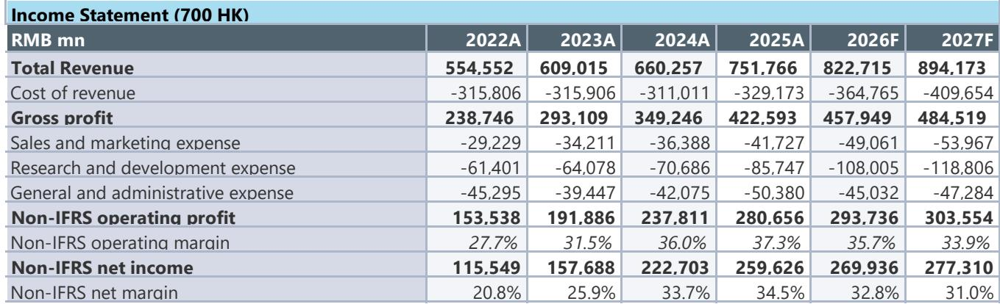

# JEF：腾讯AI多点开花，研究并非市场新事

腾讯正在经历一个关键转折：AI产品线全面铺开，但利润增速明显慢于收入增速。JEF在最新报告中给出了一个值得关注的信号——二季度非IFRS净利润增速预计仅为4%，远低于市场共识的9.7%。这不是腾讯基本面出了问题，而是AI投入正在重塑这家公司的短期财务结构。

报告覆盖了腾讯在AI领域的多个新进展：混元Hy3正式版发布、微信AI“小微”开启小范围测试、企业级AI助手WorkBuddy在桌面月访问量达到885万次，领先字节跳动的Trae和阿里巴巴的Qoder Work。这些产品布局本身并不意外，真正值得关注的是它们对财务的影响节奏。

> **KC评论：** 报告最核心的观察不是腾讯做了多少AI产品，而是这些产品在2026年才开始显著贡献收入，而资本开支从2025年就已经开始大幅上升。这种时间错配是理解腾讯未来12-18个月利润走势的关键。

## 1. 微信AI测试是腾讯在Agent生态中的关键落子

6月启动的微信AI“小微”测试，被JEF视为腾讯在Agent-to-Agent（A2A）领域的重要一步。该功能位于微信主页面左上角，同时在消息界面内可用，底层模型是微信团队自研的WeLM。报告预计正式版本将在2026年第四季度推出。

这意味着腾讯正在将AI能力嵌入中国最大的社交平台。微信月活超过13亿，任何AI功能的规模化部署都将直接影响用户交互方式、广告变现效率和商业生态。但报告也暗示，从测试到正式发布，再到产生可量化的收入贡献，中间还有相当长的周期。

## 2. 混元Hy3降价幅度超预期，推理成本下降才是真正的竞争壁垒

Hy3正式版相比预览版，输入/输出价格从每百万token 2元/8元降至1元/4元，降幅达50%。同时，在270位专家的盲测中，Hy3在前端开发、数据、存储、CI/CD等实际工作场景中的表现优于智谱GLM-5.1。任务成功率从预览版的72%提升至90%，幻觉率下降15个百分点。

这些数字背后是一个更重要的判断：腾讯正在用更低的推理成本换取更大的应用场景。报告特别提到，Hy3在文字处理和PPT生成中分别节省了47.4%和49%的token消耗。这种效率提升不是技术参数层面的竞争，而是直接关系到AI产品能否在商业场景中跑通宏观环境账。

## 3. 广告业务仍在抢份额，但游戏收入增速可能低于市场预期

二季度广告收入预计同比增长18%至424亿元，与市场共识一致。增长动力来自广告技术升级和视频号的持续强势。但游戏业务方面，JEF的预期（同比增长8.6%）低于市场共识的11%。国内游戏表现优于海外，但海外游戏受到Supercell流水消退和收购工作室正常化的递延收入影响。

这里有一个容易被忽略的结构性变化：广告业务正在成为腾讯收入增长的主要引擎，而游戏业务的增速贡献在下降。报告没有直接说，但从分项数据可以推断，广告业务的利润率高于游戏，如果广告份额持续提升，长期对利润结构是有利的。

## 4. 资本开支周期已经启动，利润增速节奏变化是主动选择

最关键的财务判断在利润端。报告预计二季度非IFRS营业利润增长6%，非IFRS净利润增长4%，均显著低于收入增速。原因很清楚：AI研发投入和资本开支在2025年已经开始大幅增加，而收入贡献要等到2026年才会体现。

从报表数据看，研发费用从2024年的707亿元预计增至2025年的857亿元，2026年进一步增至1080亿元。资本开支驱动的固定资产从2024年的933亿元预计跳升至2025年的1605亿元，2026年达到3301亿元。这些数字说明，腾讯正在用利润空间换取AI基础设施的提前布局。

，理由是AI研究和更低的市盈率倍数。这不是对业务前景的悲观，而是对“投入期利润被压缩”这一事实的定价。读者需要区分：这是腾讯主动选择的战略节奏，不是被动应对竞争。

对于关注腾讯的决策者来说，这份报告提供了一个清晰的观察框架：AI产品进展是长期叙事，资本开支是中期成本，利润增速是短期结果。三个时间维度叠加，决定了未来6-12个月腾讯的财务表现大概率是“收入稳健、利润承压”。真正的回报窗口，可能要等到2026年下半年AI产品开始规模化变现之后。

For informational purposes only. Portions may be generated,translated,summarized,or edited with AI assistance based on source materials and may contain omissions or errors. Please verify independently. This is not investment,legal,tax,accounting,or other professional advice.

For informational purposes only. Portions may be generated,translated,summarized,or edited with AI assistance based on source materials and may contain omissions or errors. Please verify independently. This is not investment,legal,tax,accounting,or other professional advice.

