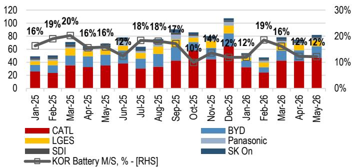
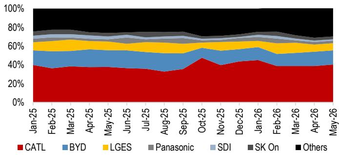
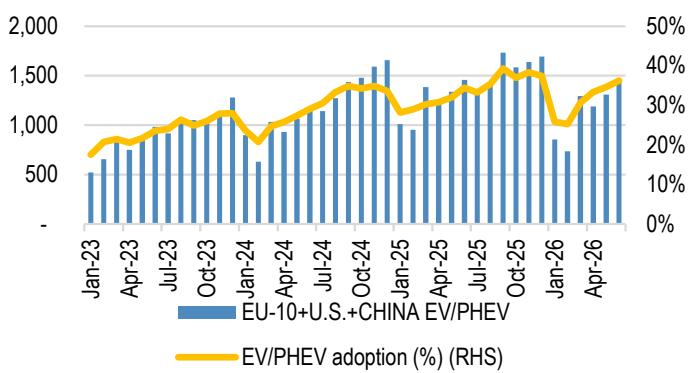
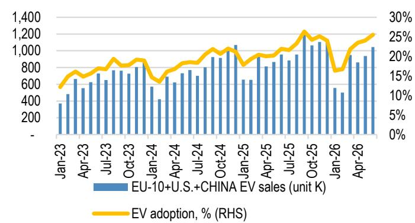
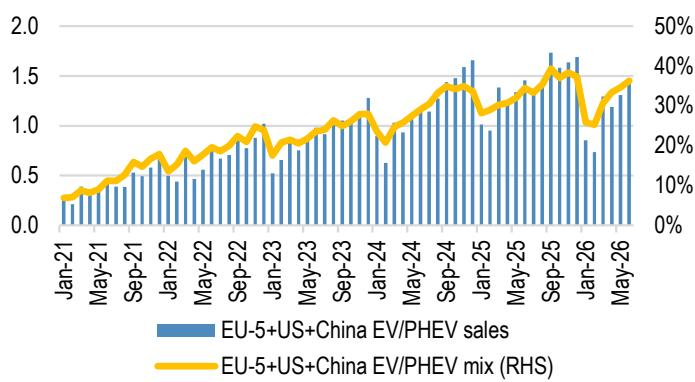
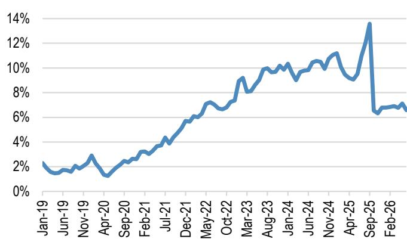
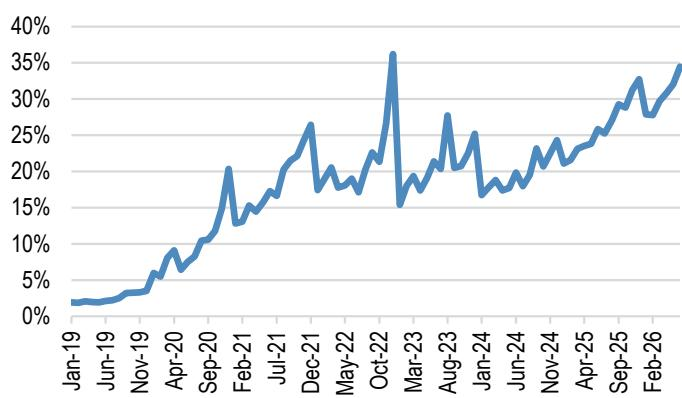
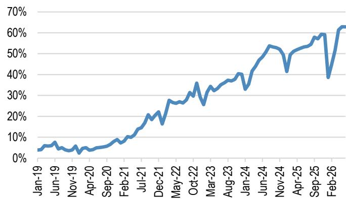

本材料无意向中国大陆读者分发，亦不构成在中国境内提供证券投资咨询服务。未经JPM书面同意，不得转载、出售或重新分发本材料或其任何部分。

# 全球电动车及电池研究更新

## 2026年6月：欧盟电动车/插电式混合动力车增长强劲，中国市场增速趋稳，美国市场保持平稳；储能系统仍是亮点

各地区电动车+插电式混合动力车渗透率趋势。6月，欧盟五国、美国和中国市场的电动车/插电式混合动力车销量保持韧性，合计销量为140万辆（同比增长10%，环比下降2%），渗透率为36%（同比提升2个百分点，环比提升2个百分点）。欧盟五国继续推动渗透率提升，中国在乘用车销量平稳的背景下渗透率有所上升，而美国市场则保持稳定。

- 欧盟五国。6月电动车/插电式混合动力车销量同比增长49%，渗透率达到34%（同比提升8个百分点，环比提升2个百分点），所有地区均表现强劲。欧盟五国渗透率持续上升：法国（提升12个百分点），其次是德国（提升11个百分点）、意大利（提升8个百分点）、英国（提升7个百分点）、西班牙（提升2个百分点），这得益于各国的补贴计划和经济型大众市场电动车的普及。我们的欧盟汽车团队预测，随着本地化进程的持续推进，中国整车厂在欧洲的市场份额将从目前的约12%上升至约20%，西班牙被视为进一步区域生产本地化的关键枢纽（链接）。

- 美国。6月电动车/插电式混合动力车销量同比下降26%，渗透率为7%（同比下降3个百分点，环比下降1个百分点），继续呈现同比下降趋势。按整车厂划分，特斯拉（第一）领先，其次是通用汽车（第二）、现代汽车集团（第三）、丰田（第四）和Rivian（第五）。电动车的环比降幅大于整体行业，这表明美伊和谈引发的油价稳定可能促使部分消费者重新转向燃油车。

- 中国。乘联会6月新能源乘用车零售销量为100万辆（同比下降9%，环比增长6%），在总计160万辆乘用车销量中，整体渗透率为63%（同比提升10个百分点，环比持平）。虽然整体乘用车销量继续下降，但新能源车销量表现相对较好。中国政府已启动农村新能源车补贴计划，但我们的中国汽车团队认为，鉴于乘用车需求偏弱和消费者信心有待提振，该计划更多是“结构优化与替代”的稳定器，而非真正的需求转折点。JPM对2026年中国乘用车需求的预测仍为同比下降15%，预计2026年下半年将逐步恢复（链接）。

电动车指数表现。过去一个月，亚洲电动车供应链相关公司报价表现分化，韩国（-12%）和中国（-8%）相对落后，而日本（+8%）表现领先。按子板块看，正极材料（-13%）跌幅最大，其次是电池箔（-11%）、负极材料（-6%）、电芯制造商（-3%）和隔膜（-2%），而电解液（+1%）表现领先。

美国联邦能源监管委员会政策对储能系统的影响。社会对数据中心建设和电费影响的反馈日益增多，这很可能推动了美国联邦能源监管委员会的电网排队改革，其中强调了表后解决方案是一条潜在路径。专家反馈表明，它正日益成为数据中心现场微电网的标准组成部分，与燃气轮机和燃料电池协同工作，以提高效率和韧性（链接）。更重要的是，联邦能源监管委员会已发布指令，可将数据中心电力审批时间从数年缩短至约90天，特别是当与储能系统通过可削减输电服务结合时，这有效地激励了储能系统的配套。因此，我们将2030年美国储能系统需求预测上调52%至303吉瓦时，预计到2030年数据中心将占总需求的约45%（链接）。

韩国汽车、电动车电池、核电和公用事业

Sonny Lee AC
(82-2) 758 5716
sonny.lee@JPM.com
JPM证券（远东）有限公司首尔分行

Seri Yoon
(82-2) 758 5704
seri.yoon@JPM.com
JPM证券（远东）有限公司首尔分行

亚洲汽车及电动车电池

(852) 2800-8505
rebecca.y.wen@JPM.com
JPM证券（亚太）有限公司/JPM经纪（香港）有限公司

亚洲能源与化工/电动车电池

Parsley Ong
(65) 6882-8578
parsley.rh.ong@JPM.com
JPM证券新加坡私人有限公司/
JPM证券（亚太）有限公司/JPM经纪（香港）有限公司

欧洲汽车

Jose M Asumendi
(44-20) 7742-5315
jose.m.asumendi@JPM.com
JPM证券有限公司

分析师认证和重要披露（包括非美国分析师披露）请参见第10页。

LGES第二季度营业利润略低于彭博一致预期，原因是整车厂补偿有限以及先进制造生产税收抵免低于预期，这表明储能系统生产瓶颈依然存在。尽管如此，渠道调研显示，LGES已引入第二家公司协助储能系统电池包生产，这应能在2026年第三季度前缓解大部分瓶颈。LGES继续预计Ultium工厂（2026年上半年停产）将在第三季度重启。在7月30日的财报电话会议上，我们预计将获得关于美国电动车电池产能爬坡、整车厂补偿、储能系统产能爬坡和订单积压的最新信息（链接）。

Ecopro BM于6月30日宣布通过发行990万股新股进行1.2万亿韩元的配股。募集资金将主要用于收购印尼BNSI镍冶炼厂约20%的股权（7650亿韩元），其余用于匈牙利项目融资（1500亿韩元）等。我们认为，更深度的镍上游整合增加了额外风险：1）对磷酸铁锂机会的灵活性降低；2）对镍价波动的敏感性提高；3）印尼政策管控带来的风险（链接）。

公司观点与潜在未来关注点。欧洲继续录得强劲的电动车增长，中国在乘用车销量平稳的背景下新能源车渗透率持续上升，而美国市场则保持平稳。全球储能系统电池需求因产能限制而环比放缓，但同比依然强劲，中国仍是最大的需求驱动力。在美国，储能系统电池采购正迅速从中国供应商转向韩国企业：韩国/日本供应商的出货量同比激增超过200%，而中国供应商5月对美国的储能系统出货量同比下降40%。第二季度财报季于本月开始，我们关注盈利轨迹的改善。近期的关注点将是电池制造商储能系统产能的顺利爬坡并转化为盈利，而长期关注点则集中在人工智能数据中心对储能系统的持续订单。

公司定位。在韩国，我们看好汽车整车厂（现代汽车、起亚汽车），原因是混合动力车占比提升带来的稳健汽车盈利。在韩国电池供应链中，相较于材料公司（LG化学/L&F评级为超配；Ecopro BM评级为中性；POSCO Future M评级为低配）和锂生产商（POSCO评级为中性），我们更偏好电池制造商（LGES/SDI评级为超配），这反映了相对议价能力和执行能力（LGES、LG Chem由Parsley Ong覆盖）。在中国，我们看好比亚迪A/H股（由Nick Lai覆盖），因其在全球扩张以及海外产能爬坡方面执行力强；以及宁德时代A/H股（由Rebecca Wen覆盖），因其在全球电动车和储能系统电池市场中的技术和领先地位。

表1：2026年6月乘用车+电动车+插电式混合动力车月度及年初至今销量与渗透率趋势（按地区划分）

<table><tr><td>全球乘用车销量（千辆）</td><td>2026年6月</td><td>2025年6月</td><td>同比%</td><td>2026年上半年</td><td>2025年上半年</td><td>同比%</td></tr><tr><td colspan="7">乘用车</td></tr><tr><td>欧洲（欧盟五国）</td><td>973</td><td>868</td><td>12.1%</td><td>5,066</td><td>4,752</td><td>6.6%</td></tr><tr><td>德国</td><td>296</td><td>256</td><td>15.7%</td><td>1,484</td><td>1,403</td><td>5.8%</td></tr><tr><td>法国</td><td>189</td><td>170</td><td>11.4%</td><td>857</td><td>842</td><td>1.8%</td></tr><tr><td>意大利</td><td>146</td><td>132</td><td>10.8%</td><td>938</td><td>855</td><td>9.8%</td></tr><tr><td>西班牙</td><td>128</td><td>119</td><td>7.8%</td><td>648</td><td>610</td><td>6.2%</td></tr><tr><td>英国</td><td>213</td><td>191</td><td>11.4%</td><td>1,138</td><td>1,042</td><td>9.2%</td></tr><tr><td>中国</td><td>1,602</td><td>2,085</td><td>-23.2%</td><td>8,721</td><td>10,895</td><td>-20.0%</td></tr><tr><td>美国</td><td>1,379</td><td>1,280</td><td>7.7%</td><td>7,954</td><td>8,181</td><td>-2.8%</td></tr><tr><td>总计</td><td>3,954</td><td>4,233</td><td>-6.6%</td><td>21,740</td><td>23,828</td><td>-8.8%</td></tr><tr><td colspan="7">纯电动车</td></tr><tr><td>欧洲（欧盟五国）</td><td>233</td><td>143</td><td>63.1%</td><td>1,037</td><td>713</td><td>45.4%</td></tr><tr><td>德国</td><td>84</td><td>47</td><td>78.2%</td><td>368</td><td>249</td><td>47.9%</td></tr><tr><td>法国</td><td>56</td><td>29</td><td>91.7%</td><td>242</td><td>149</td><td>62.5%</td></tr><tr><td>意大利</td><td>15</td><td>8</td><td>88.3%</td><td>80</td><td>45</td><td>77.8%</td></tr><tr><td>西班牙</td><td>14</td><td>11</td><td>26.5%</td><td>63</td><td>46</td><td>36.6%</td></tr><tr><td>英国</td><td>64</td><td>47</td><td>35.0%</td><td>285</td><td>225</td><td>26.6%</td></tr><tr><td>中国</td><td>685</td><td>661</td><td>3.6%</td><td>3,106</td><td>3,336</td><td>-6.9%</td></tr><tr><td>美国</td><td>73</td><td>101</td><td>-27.6%</td><td>458</td><td>616</td><td>-25.7%</td></tr><tr><td>总计</td><td>991</td><td>905</td><td>9.6%</td><td>4,601</td><td>4,665</td><td>-1.4%</td></tr><tr><td colspan="7">插电式混合动力车</td></tr><tr><td>欧洲（欧盟五国）</td><td>102</td><td>82</td><td>25.2%</td><td>516</td><td>394</td><td>31.1%</td></tr><tr><td>德国</td><td>32</td><td>26</td><td>25.8%</td><td>164</td><td>139</td><td>17.8%</td></tr><tr><td>法国</td><td>12</td><td>12</td><td>4.4%</td><td>42</td><td>49</td><td>-15.4%</td></tr><tr><td>意大利</td><td>16</td><td>10</td><td>64.6%</td><td>85</td><td>43</td><td>98.6%</td></tr><tr><td>西班牙</td><td>16</td><td>14</td><td>15.0%</td><td>78</td><td>56</td><td>39.2%</td></tr><tr><td>英国</td><td>27</td><td>21</td><td>24.9%</td><td>148</td><td>107</td><td>38.4%</td></tr><tr><td>中国</td><td>323</td><td>450</td><td>-28.2%</td><td>1,614</td><td>2,128</td><td>-24.2%</td></tr><tr><td>美国</td><td>18</td><td>21</td><td>-15.9%</td><td>86</td><td>175</td><td>-51.1%</td></tr><tr><td>总计</td><td>443</td><td>553</td><td>-19.8%</td><td>2,216</td><td>2,697</td><td>-17.8%</td></tr></table>

来源：CNEV Post、Motor Intelligence、欧盟

<table><tr><td>全球电动车/插电式混合动力车渗透率（%）</td><td>2026年6月</td><td>2025年6月</td><td>同比百分点</td><td>2026年上半年</td><td>2025年上半年</td><td>同比百分点</td></tr><tr><td colspan="7">电动车/插电式混合动力车渗透率（%）</td></tr><tr><td>欧洲（欧盟五国）</td><td>34.5%</td><td>25.9%</td><td>8.6%</td><td>30.7%</td><td>23.3%</td><td>7.4%</td></tr><tr><td>德国</td><td>39.2%</td><td>28.4%</td><td>10.8%</td><td>35.8%</td><td>27.6%</td><td>8.2%</td></tr><tr><td>法国</td><td>36.1%</td><td>24.1%</td><td>12.0%</td><td>33.0%</td><td>23.5%</td><td>9.5%</td></tr><tr><td>意大利</td><td>20.9%</td><td>13.2%</td><td>7.7%</td><td>17.5%</td><td>10.2%</td><td>7.3%</td></tr><tr><td>西班牙</td><td>23.2%</td><td>20.8%</td><td>2.4%</td><td>21.8%</td><td>16.8%</td><td>5.0%</td></tr><tr><td>英国</td><td>42.5%</td><td>35.9%</td><td>6.6%</td><td>38.0%</td><td>31.8%</td><td>6.2%</td></tr><tr><td>中国</td><td>62.9%</td><td>53.3%</td><td>9.6%</td><td>54.1%</td><td>50.1%</td><td>4.0%</td></tr><tr><td>美国</td><td>6.6%</td><td>9.5%</td><td>-2.9%</td><td>6.8%</td><td>9.7%</td><td>-2.8%</td></tr><tr><td>总计</td><td>36.3%</td><td>34.4%</td><td>1.8%</td><td>31.4%</td><td>30.9%</td><td>0.5%</td></tr><tr><td colspan="7"></td></tr><tr><td colspan="7">纯电动车渗透率（%）</td></tr><tr><td>欧洲（欧盟五国）</td><td>23.9%</td><td>16.4%</td><td>7.5%</td><td>20.5%</td><td>15.0%</td><td>5.5%</td></tr><tr><td>德国</td><td>28.4%</td><td>18.4%</td><td>10.0%</td><td>24.8%</td><td>17.7%</td><td>7.1%</td></tr><tr><td>法国</td><td>29.6%</td><td>17.2%</td><td>12.4%</td><td>28.2%</td><td>17.6%</td><td>10.5%</td></tr><tr><td>意大利</td><td>10.2%</td><td>6.0%</td><td>4.2%</td><td>8.5%</td><td>5.2%</td><td>3.2%</td></tr><tr><td>西班牙</td><td>11.1%</td><td>9.4%</td><td>1.6%</td><td>9.8%</td><td>7.6%</td><td>2.2%</td></tr><tr><td>英国</td><td>30.0%</td><td>24.8%</td><td>5.2%</td><td>25.0%</td><td>21.6%</td><td>3.4%</td></tr><tr><td>中国</td><td>42.8%</td><td>31.7%</td><td>11.1%</td><td>35.6%</td><td>30.6%</td><td>5.0%</td></tr><tr><td>美国</td><td>5.3%</td><td>7.9%</td><td>-2.6%</td><td>5.8%</td><td>7.5%</td><td>-1.8%</td></tr><tr><td>总计</td><td>25.1%</td><td>21.4%</td><td>3.7%</td><td>21.2%</td><td>19.6%</td><td>1.6%</td></tr><tr><td colspan="7"></td></tr><tr><td colspan="7">插电式混合动力车渗透率（%）</td></tr><tr><td>欧洲（欧盟五国）</td><td>10.5%</td><td>9.4%</td><td>1.1%</td><td>10.2%</td><td>8.3%</td><td>1.9%</td></tr><tr><td>德国</td><td>10.9%</td><td>10.0%</td><td>0.9%</td><td>11.0%</td><td>9.9%</td><td>1.1%</td></tr><tr><td>法国</td><td>6.5%</td><td>7.0%</td><td>-0.4%</td><td>4.8%</td><td>5.8%</td><td>-1.0%</td></tr><tr><td>意大利</td><td>10.7%</td><td>7.2%</td><td>3.5%</td><td>9.1%</td><td>5.0%</td><td>4.0%</td></tr><tr><td>西班牙</td><td>12.1%</td><td>11.4%</td><td>0.8%</td><td>12.0%</td><td>9.2%</td><td>2.9%</td></tr><tr><td>英国</td><td>12.5%</td><td>11.2%</td><td>1.4%</td><td>13.0%</td><td>10.3%</td><td>2.7%</td></tr><tr><td>中国</td><td>20.2%</td><td>21.6%</td><td>-1.4%</td><td>18.5%</td><td>19.5%</td><td>-1.0%</td></tr><tr><td>美国</td><td>1.3%</td><td>1.6%</td><td>-0.4%</td><td>1.1%</td><td>2.1%</td><td>-1.1%</td></tr><tr><td>总计</td><td>11.2%</td><td>13.1%</td><td>-1.9%</td><td>10.2%</td><td>11.3%</td><td>-1.1%</td></tr></table>

注：中国数据基于乘联会初步零售数据。
吉瓦时，%

图1：全球电动车电池装机量（按公司划分）对比韩国电池电芯市场份额

来源：SNE Research。

图2：全球电动车电池装机市场份额趋势（按公司划分）%

来源：SNE Research。

图3：欧盟十国+美国+中国电动车/插电式混合动力车销量及渗透率趋势
单位：千辆，%

来源：CNEV Post、Motor Intelligence、欧盟

图4：欧盟十国+美国+中国电动车销量及渗透率趋势
单位：千辆，%

来源：CNEV Post、Motor Intelligence、欧盟

图5：欧盟五国+美国+中国电动车/插电式混合动力车销量结构趋势
单位：百万辆，%

来源：CNEV Post、Motor Intelligence、欧盟

图6：美国电动车/插电式混合动力车渗透率趋势%

图7：欧盟五国电动车/插电式混合动力车渗透率趋势

来源：欧盟
来源：Motor Intelligence

图8：中国电动车/插电式混合动力车渗透率趋势

来源：CNEV Post

单位：辆，%，百分点

表2：美国/德国：2026年6月电动车月度及年初至今销量与市场份额趋势（按整车厂划分）

<table><tr><td>全球电动车销量（按整车厂，辆）</td><td>2026年6月</td><td>2025年6月</td><td>同比%</td><td>2026年上半年</td><td>2025年上半年</td><td>同比%</td></tr><tr><td colspan="7">美国</td></tr><tr><td>特斯拉</td><td>36,642</td><td>45,628</td><td>-20%</td><td>234,670</td><td>274,638</td><td>-15%</td></tr><tr><td>通用汽车</td><td>9,077</td><td>15,337</td><td>-41%</td><td>56,679</td><td>78,195</td><td>-28%</td></tr><tr><td>丰田</td><td>4,845</td><td>1,986</td><td>144%</td><td>29,656</td><td>13,028</td><td>128%</td></tr><tr><td>现代汽车</td><td>3,394</td><td>5,117</td><td>-34%</td><td>27,466</td><td>30,859</td><td>-11%</td></tr><tr><td>福特</td><td>2,322</td><td>4,856</td><td>-52%</td><td>16,606</td><td>38,988</td><td>-57%</td></tr><tr><td>其他</td><td>2,294</td><td>2,071</td><td>11%</td><td>9,398</td><td>16,449</td><td>-43%</td></tr><tr><td>Rivian</td><td>2,290</td><td>3,303</td><td>-31%</td><td>13,801</td><td>15,131</td><td>-9%</td></tr><tr><td>起亚</td><td>2,226</td><td>2,074</td><td>7%</td><td>12,731</td><td>13,674</td><td>-7%</td></tr><tr><td>宝马</td><td>1,874</td><td>4,858</td><td>-61%</td><td>11,263</td><td>27,794</td><td>-59%</td></tr><tr><td>斯巴鲁</td><td>1,870</td><td>1,175</td><td>59%</td><td>10,058</td><td>6,501</td><td>55%</td></tr><tr><td>本田</td><td>1,706</td><td>4,117</td><td>-59%</td><td>8,515</td><td>26,652</td><td>-68%</td></tr><tr><td>沃尔沃</td><td>1,313</td><td>1,303</td><td>1%</td><td>7,635</td><td>8,715</td><td>-12%</td></tr><tr><td>Lucid</td><td>1,055</td><td>840</td><td>26%</td><td>7,785</td><td>5,047</td><td>54%</td></tr><tr><td>大众</td><td>689</td><td>908</td><td>-24%</td><td>4,686</td><td>12,120</td><td>-61%</td></tr><tr><td>梅赛德斯-奔驰</td><td>448</td><td>1,615</td><td>-72%</td><td>2,255</td><td>9,226</td><td>-76%</td></tr><tr><td>奥迪</td><td>374</td><td>1,746</td><td>-79%</td><td>1,728</td><td>11,380</td><td>-85%</td></tr><tr><td>日产</td><td>326</td><td>2,352</td><td>-86%</td><td>1,774</td><td>15,544</td><td>-89%</td></tr><tr><td>Stellantis</td><td>268</td><td>1,481</td><td>-82%</td><td>1,264</td><td>11,265</td><td>-89%</td></tr><tr><td>捷豹路虎</td><td>1</td><td>25</td><td>-96%</td><td>34</td><td>980</td><td>-97%</td></tr><tr><td>总计</td><td>73,014</td><td>100,792</td><td>-28%</td><td>458,004</td><td>616,186</td><td>-26%</td></tr></table>

<table><tr><td>全球电动车市场份额（按整车厂，%）</td><td>2026年6月</td><td>2025年6月</td><td>同比百分点</td><td>2026年上半年</td><td>2025年上半年</td><td>同比百分点</td></tr><tr><td colspan="7">美国</td></tr><tr><td>特斯拉</td><td>50.2%</td><td>45.3%</td><td>4.9%</td><td>51.2%</td><td>44.6%</td><td>6.7%</td></tr><tr><td>通用汽车</td><td>12.4%</td><td>15.2%</td><td>-2.8%</td><td>12.4%</td><td>12.7%</td><td>-0.3%</td></tr><tr><td>丰田</td><td>6.6%</td><td>2.0%</td><td>4.7%</td><td>6.5%</td><td>2.1%</td><td>4.4%</td></tr><tr><td>现代汽车</td><td>4.6%</td><td>5.1%</td><td>-0.4%</td><td>6.0%</td><td>5.0%</td><td>1.0%</td></tr><tr><td>福特</td><td>3.2%</td><td>4.8%</td><td>-1.6%</td><td>3.6%</td><td>6.3%</td><td>-2.7%</td></tr><tr><td>其他</td><td>3.1%</td><td>2.1%</td><td>1.1%</td><td>2.1%</td><td>2.7%</td><td>-0.6%</td></tr><tr><td>Rivian</td><td>3.1%</td><td>3.3%</td><td>-0.1%</td><td>3.0%</td><td>2.5%</td><td>0.6%</td></tr><tr><td>起亚</td><td>3.0%</td><td>2.1%</td><td>1.0%</td><td>2.8%</td><td>2.2%</td><td>0.6%</td></tr><tr><td>宝马</td><td>2.6%</td><td>4.8%</td><td>-2.3%</td><td>2.5%</td><td>4.5%</td><td>-2.1%</td></tr><tr><td>斯巴鲁</td><td>2.6%</td><td>1.2%</td><td>1.4%</td><td>2.2%</td><td>1.1%</td><td>1.1%</td></tr><tr><td>本田</td><td>2.3%</td><td>4.1%</td><td>-1.7%</td><td>1.9%</td><td>4.3%</td><td>-2.5%</td></tr><tr><td>沃尔沃</td><td>1.8%</td><td>1.3%</td><td>0.5%</td><td>1.7%</td><td>1.4%</td><td>0.3%</td></tr><tr><td>Lucid</td><td>1.4%</td><td>0.8%</td><td>0.6%</td><td>1.7%</td><td>0.8%</td><td>0.9%</td></tr><tr><td>大众</td><td>0.9%</td><td>0.9%</td><td>0.0%</td><td>1.0%</td><td>2.0%</td><td>-0.9%</td></tr><tr><td>梅赛德斯-奔驰</td><td>0.6%</td><td>1.6%</td><td>-1.0%</td><td>0.5%</td><td>1.5%</td><td>-1.0%</td></tr><tr><td>奥迪</td><td>0.5%</td><td>1.7%</td><td>-1.2%</td><td>0.4%</td><td>1.8%</td><td>-1.5%</td></tr><tr><td>日产</td><td>0.4%</td><td>2.3%</td><td>-1.9%</td><td>0.4%</td><td>2.5%</td><td>-2.1%</td></tr><tr><td>Stellantis</td><td>0.4%</td><td>1.5%</td><td>-1.1%</td><td>0.3%</td><td>1.8%</td><td>-1.6%</td></tr><tr><td>捷豹路虎</td><td>0.0%</td><td>0.0%</td><td>
