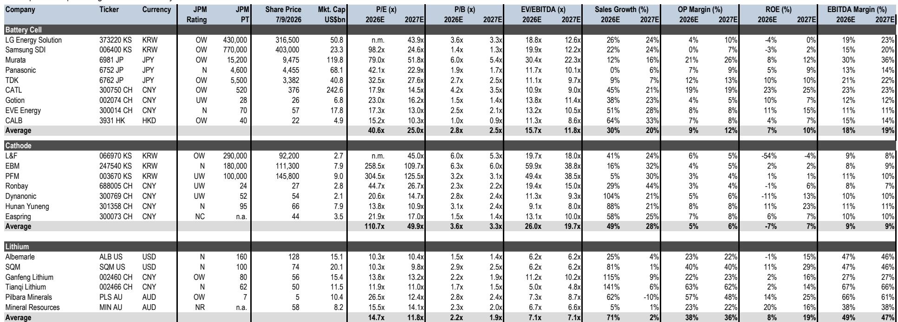
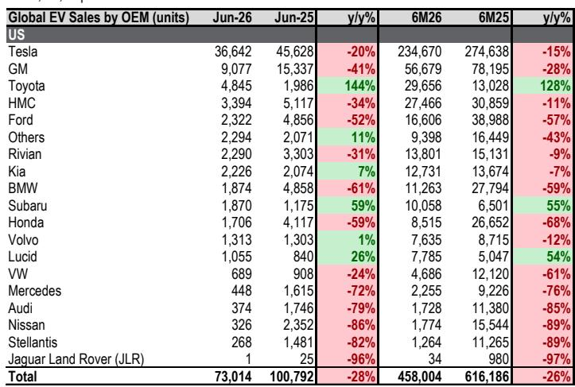
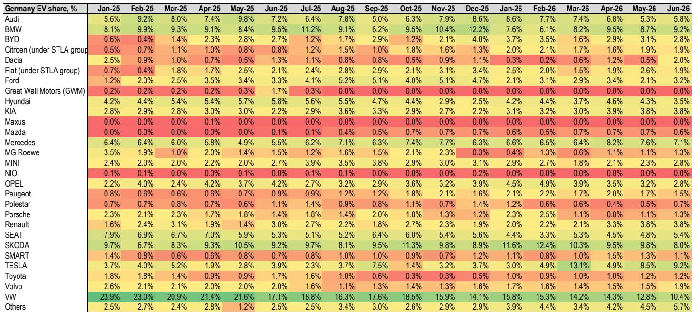

# 全球电动汽车市场正分化为三个不同格局，仅一个领域为电池研究者提供可观前景

2026年6月，欧盟五国、美国和中国合计的电动汽车及插电式混合动力车市场规模达到140万辆，同比增长10%。整体渗透率达到36%，较去年同期上升2个百分点。这些总体数据掩盖了深刻的区域分化。欧洲正在加速。中国在高渗透率下持续整合，尽管乘用车市场整体有所调整。美国则呈现阶段性调整。对于电池供应链的研究者而言，问题已不再是电动化是否在推进，而是哪个区域将催生下一波需求增长，哪里将成为利润竞争的主战场，以及结构性利润池正在向何处转移。

答案并不在乘用车领域。本报告中最具影响力的变化，是对美国储能系统需求预测的大幅上调，这源于一项监管催化因素——该因素将数据中心电力审批时间从数年压缩至约90天。2030年美国储能需求预测已上调52%至303吉瓦时，其中数据中心约占该总量的45%。这一调整重塑了电池制造商、材料供应商以及所有布局在表后电力生态系统中的参与者的研究格局。

战略意义显而易见。电动汽车市场正进入区域分化阶段，单纯的数量增长已不能代表盈利能力。相比之下，储能市场正进入政策驱动的加速期，产能瓶颈而非需求成为主要约束条件。将所有电池需求视为单一趋势的研究者将面临资源错配的风险。

## 欧洲电动汽车加速增长由补贴和亲民大众车型驱动，成为主要区域中渗透率仍快速攀升的相对少见市场

欧盟五国6月电动汽车及插电式混合动力车销量为33.5万辆，同比增长49%。渗透率达到34.5%，上升8.6个百分点。每个主要市场均有贡献。法国渗透率增加12个百分点，德国增加11个，意大利增加8个，英国增加7个，西班牙增加2个。

这并非低基数下的反弹。基数本身正在上升。数据背后是产品结构的转变。亲民的大众市场电动汽车正在进入欧洲市场，中国原始设备制造商是这一趋势的关键参与者。某全球投资银行的欧洲汽车团队预测，得益于本地化生产，中国OEM在欧洲的市场份额将从目前的约12%上升至约20%。西班牙正成为这一区域制造布局的中心。

对于电池研究者而言，欧洲代表了电动汽车领域最具吸引力的需求侧故事。该区域尚未饱和，不依赖单一主导企业，其渗透率增速远超全球平均水平，且政策支持依然稳固。任何拥有欧洲产能或可信本地化计划的电池制造商，都拥有其他区域同行无法比拟的结构性需求支撑。

## 中国新能源汽车渗透率在整体乘用车市场调整中持续上升，形成有利于现有企业的结构性机会

中国6月新能源汽车零售销量达到100万辆，同比下降9%。这一数字在特定背景下才有意义。整体乘用车销量同比下降23%至160万辆。新能源汽车渗透率达到63%，较去年同期上升10个百分点。换言之，新能源汽车市场收缩速度慢于整体市场，其在收缩市场中的份额持续扩大。

中国政府已启动农村新能源汽车补贴计划，但某全球投资银行的中国汽车团队将其视为结构性和置换性稳定措施，而非真正的需求反转。根本问题在于消费者信心偏弱，2026年全年乘用车需求预测为同比下降15%。预计2026年下半年将逐步改善，但结构性因素依然存在。

对于电池研究者而言，中国的故事在于市场份额集中，而非数量增长。在63%的渗透率下，快速增长阶段已过。剩余增长将来自在整体下降市场中替代内燃机车辆，而非新增首次购车用户。这一趋势有利于具备规模、成本优势及与主导OEM有稳定合作关系的现有企业。比亚迪和宁德时代是明确的受益者。依赖数量增长来覆盖固定成本的新进入者和材料供应商将面临更具挑战的环境。

## 美国电动汽车市场呈现结构性调整，受油价变化和消费者偏好影响，非暂时性波动

美国6月电动汽车及插电式混合动力车销量同比下降26%。渗透率降至6.6%，下降2.9个百分点。这并非单月异常。年初至今的数据呈现相同趋势。上半年电动汽车销量同比下降26%，渗透率从9.7%降至6.8%。

直接原因是美伊和谈后油价趋于稳定。当油价下降时，对普通美国消费者而言，电动汽车的经济性减弱。但更深层的问题是结构性的。美国市场缺乏推动欧洲和中国普及的亲民大众车型。特斯拉仍以50%市场份额占据主导，但6月销量同比下降20%。通用、福特和Stellantis均出现明显下滑。仅有的亮点是丰田（从极低基数增长144%）和斯巴鲁（增长59%）。

对电池研究者的启示很直接：短期内不要依赖美国电动汽车市场来消化产能。监管环境不支持，消费者偏好未明显转变，产品线缺乏吸引力。任何依赖2026或2027年美国电动汽车需求增长的研究假设都需要重新审视。

## 联邦能源监管委员会电网排队改革是美国储能需求的结构性催化剂，为韩国电池制造商创造明确机遇

本报告中最重要的发展并非关于电动汽车。美国联邦能源监管委员会已发布指令，可将数据中心电力审批时间从数年压缩至约90天，尤其是与储能系统配合使用可中断输电服务时。这实际上激励了每个新建数据中心配套储能系统。

其机制很直接。数据中心开发者面临社会对建设和电费影响的质疑。表后储能解决方案正日益成为现场微电网的标准组成部分，与燃气轮机和燃料电池协同工作，提升效率和韧性。联邦能源监管委员会的改革通过消除数据中心开发中最大的瓶颈——电网接入审批时间——使这种组合更具吸引力。

数据令人瞩目。某全球投资银行已将2030年美国储能需求预测上调52%至303吉瓦时，其中数据中心约占该年总需求的45%。这并非推测性预测，而是基于已发布并正在实施的监管变化。

供应链影响同样明确。美国储能电池采购正迅速从中国供应商转向韩国企业。5月，韩国和日本对美储能出货量同比增长超过200%，而中国供应商对美储能出货量同比下降40%。这一转变正在加速，为LG能源解决方案和三星SDI等韩国电池制造商创造了多年需求支撑。同时，这也为任何依赖美国储能市场增长的中国电池供应商带来了显著风险。

## 电池研究者的决策框架：三个问题决定资源分配方向

电动汽车需求的区域分化以及美国储能的监管催化因素，为研究者提供了清晰的决策框架。每项电池供应链研究都应围绕三个问题展开评估。

第一，公司的收入主要与电动汽车还是储能需求相关？如果是电动汽车，下一个问题是区域敞口。对欧洲电动汽车市场有显著敞口的公司拥有结构性增长支撑。对美国电动汽车市场有敞口的公司面临短期内难以逆转的调整。对中国市场有敞口的公司面临渗透率仍在上升但相对数量下降的市场，这有利于具备规模的现有企业。

第二，如果公司处于储能领域，是否拥有可服务美国市场的产能？联邦能源监管委员会改革创造了现有供应链难以应对的需求冲击。LG能源解决方案第二季度营业利润略低于市场预期，受限于有限的OEM补偿和低于预期的先进制造生产税收抵免，表明储能生产瓶颈依然存在。渠道调研显示，LGES已引入第二家公司协助储能电池包生产，预计2026年第三季度前可缓解大部分瓶颈。能够最快提升储能产能的公司将捕获最大价值。

第三，公司在供应链中的议价能力如何？电池制造商比材料供应商拥有更强的定价能力，材料供应商又比锂生产商拥有更强的定价能力。这反映在某全球投资银行分析师的持仓偏好中——他们更倾向于电池制造商而非材料和锂生产商。逻辑很简单：随着供应链成熟和产能更加充裕，价值池向控制最资本密集和技术复杂环节的公司转移。电池电芯制造符合这一描述，而锂精炼则不然。

## 财报季将区分执行能力，储能产能提升是最重要的短期催化剂

2026年第二季度财报季本月开始，关注点应放在盈利趋势的改善上。短期催化剂很直接：能够展示储能产能顺利提升并转化为报告盈利的电池制造商将获得认可。长期催化剂围绕人工智能数据中心对储能的持续订单，这将提供多年需求的可见性。

风险同样明确。Ecopro BM宣布1.2万亿韩元配股融资，用于收购印尼某镍冶炼厂约20%股权，这说明了错误方向垂直整合的风险。更深度的镍上游整合增加了额外风险：对磷酸铁锂机会的灵活性降低，对镍价波动的敏感性增加，以及印尼政策风险。并非所有整合都能创造价值。整合到价格波动大且政策不确定的大宗商品投入中，是价值破坏而非价值创造的策略。

核心结论是，全球电池市场已不再是单一故事。它是三个故事，且正朝不同方向发展。欧洲在加速。中国在整合。美国在电动汽车领域调整，但在储能领域加速。能够理解每个故事与其投资组合中每家公司关联性，并有依据地采取行动的研究者，将获得更清晰的视角。

*仅供参考。部分内容可能基于源材料通过AI辅助生成、翻译、总结或编辑，可能存在遗漏或错误。请独立核实。本文不构成专业建议。*

仅供参考。部分内容可能基于源材料通过AI辅助生成、翻译、总结或编辑，可能存在遗漏或错误。请独立核实。本文不构成专业建议。

