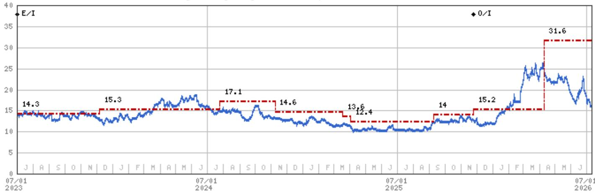
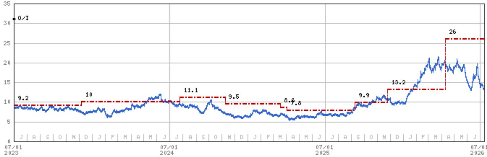
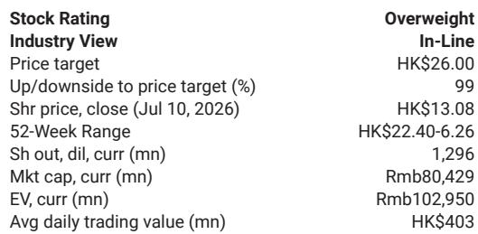

# COSCO Shipping Energy’s 1H26 Prelim Reveals a Market That Rewards Position, Not Just Tonnage

COSCO SHIPPING Energy Transportation (CSE) reported 1H26 preliminary net profit of Rmb4.5 billion, up 141% year on year on a restated basis, with implied 2Q26 net profit of Rmb2.3 billion coming in 6% above analyst expectations. The headline number is strong, but the structure beneath it tells a more nuanced story about the tanker market’s current dynamics. CSE’s second-quarter performance doubled year-ago levels yet improved only 7% sequentially, a modest gain that reflects two competing forces: surging benchmark rates on key crude routes and simultaneous earnings drag from vessels trapped in the Gulf and softer product oil markets.

The controlling insight is that CSE’s earnings trajectory is no longer a simple function of tanker rates. It is a function of fleet positioning, geopolitical friction, and the operational agility to redeploy capacity as trade lanes reconfigure. The company’s implied 2Q26 result, while slightly above consensus, does not fully capture the upside potential that could materialize in the second half if the vessels that exited the Strait of Hormuz by late June return to normal utilization. The strategic question for observers is not whether tanker demand is strong—it clearly is—but whether CSE’s fleet composition, geographic exposure, and cost structure allow it to capture more than a proportional share of the market’s upside.

Three factors define the current opportunity. First, benchmark time charter equivalent (TCE) rates on the TD15 West Africa–China and TD22 US Gulf–China routes surged 180% and 170% year on year in the first half, respectively, providing a powerful tailwind. Second, CSE’s effective rate realization was diluted by vessels that were operationally constrained in the Gulf, meaning the company absorbed a temporary efficiency penalty even as spot rates climbed. Third, management cited robust tanker rates as the primary earnings driver, implying that the underlying demand environment remains supportive even as short-term frictions compress margins.

The earnings surprise, while modest, reinforces a thesis that the tanker market has entered a phase where supply-side constraints—tight VLCC availability, sanctions on the dark fleet, and limited newbuilding deliveries—intersect with demand that is structurally reshaped by longer voyage distances and geopolitical realignment. CSE, as one of the largest listed tanker operators in Asia, is positioned to benefit disproportionately if these conditions persist or intensify.

## The Sequential Earnings Cap Is a Signal, Not a Ceiling

The 7% quarter-over-quarter net profit increase, while below what a 170% rate surge might suggest, is precisely the kind of data point that separates surface-level analysis from strategic understanding. The gap between rate momentum and earnings growth is explained by two identifiable drags: effective-rate dilution from vessels stuck in the Gulf and weak international product oil and domestic oil shipment rates amid geopolitical tension. These are not structural impairments. They are temporary frictions that, when resolved, could release pent-up earnings capacity.

The report notes that CSE’s affected vessels safely exited the Strait of Hormuz by late June. This is a critical operational milestone. If traffic normalizes in the third quarter, effective utilization should improve meaningfully. The sequential earnings cap in 2Q26 was, in effect, a penalty for being in the wrong place at the wrong time. The third quarter could reverse that penalty. Observers should watch not just headline rates but also fleet deployment data and port turnaround times as leading indicators of whether CSE can convert rate strength into realized earnings growth.

## Benchmark Rate Explosions Mask a Two-Tier Market

The 180% and 170% year-on-year TCE increases on TD15 and TD22 are attention-grabbing, but they do not represent the entire tanker market. These specific routes—West Africa to China and US Gulf to China—are the high-growth corridors driven by Chinese crude import demand and the rerouting of flows away from the Middle East. CSE’s exposure to these lanes is a structural advantage, not a cyclical one. The geopolitical tensions that have disrupted shorter-haul routes have simultaneously boosted demand for longer-haul voyages, which consume more ton-miles and support higher rates.

The product oil and domestic shipping segments, by contrast, experienced soft rates. This bifurcation matters. CSE’s earnings quality depends on the composition of its revenue mix, not just the aggregate rate level. A company that is positioned on the high-growth crude routes and underweight on domestic product oil will likely outperform peers with a more balanced or domestically skewed fleet. The report’s implicit message is that CSE’s fleet positioning aligns with the market’s structural winners.

## The Supply Side Offers a Multi-Year Tailwind, Not a Quarter-by-Quarter Spike

The valuation methodology in the report is built on a probability-weighted framework that assigns a 25% weight to a bull case, 60% to a base case, and 15% to a bear case. The bull case explicitly incorporates tight VLCC supply, more sanctions on the dark fleet, and continuous OPEC+ production hikes. These are not transient factors. VLCC supply is constrained by an aging fleet, limited newbuilding orders during the pandemic years, and regulatory pressure that accelerates scrapping of older tonnage. Sanctions on the dark fleet—uninsured or opaque vessels that operate outside mainstream compliance—reduce the effective supply of tanker capacity, pushing rates higher for compliant operators like CSE.

OPEC+ production hikes, while not guaranteed, would increase the volume of crude moving by sea, further tightening the tanker market. The combination of supply constraints and demand growth creates a multi-year window in which tanker operators with modern, compliant fleets can earn above-normal returns. CSE’s 2026 estimated return on equity of 19.8% and net profit of Rmb9.2 billion reflect this environment. The bear case—weaker global economy, lower OPEC output, or the return of shadow fleets—is a risk, but the probability weighting suggests the base case assumes these negative scenarios do not materialize in the near term.

## A Decision Framework for Assessing CSE’s Earnings Trajectory

For those evaluating CSE, the report provides the raw material for a structured decision framework that goes beyond simple rate forecasts. The framework has three pillars.

The first pillar is fleet utilization and redeployment speed. The key metric is not the headline TCE rate but the spread between spot rates and realized rates. If CSE’s realized rates converge toward spot rates in 3Q26, that signals that the Gulf-related drag has dissipated and the company is capturing full market value. The second pillar is route mix. Observers should monitor the proportion of CSE’s tonnage deployed on long-haul crude routes versus short-haul or product oil routes. A shift toward the former would support margin expansion even if aggregate rates plateau. The third pillar is the supply-side outlook for VLCCs and the dark fleet. Scrapping rates, newbuilding orders, and enforcement actions against uninsured vessels are the leading indicators that determine whether the current tightness persists or eases.

Each pillar has a clear causal link to earnings. High utilization plus favorable route mix plus tight supply equals above-consensus earnings. Any deterioration in one pillar erodes the probability of the bull case. The framework forces observers to distinguish between temporary noise—such as the 2Q26 sequential cap—and structural shifts that change the earnings trajectory for multiple quarters.

## The Second Half Holds More Upside Than the Sequential Numbers Suggest

The report explicitly states that FY26 earnings may see upside risk if tanker demand proves stronger or lasts longer than expected. This is not a hedge. It is a recognition that the first half was constrained by factors that are now resolving. The vessels that were affected by the Strait of Hormuz situation have exited, and if trade flows normalize, the third quarter could see a step-change in effective utilization. The sequential improvement from 1Q26 to 2Q26 was only 7%, but the improvement from 2Q26 to 3Q26 could be significantly larger if the fleet operates at full capacity on high-rate routes.

The risk to this view is that geopolitical tensions could re-escalate, or that the global economy slows faster than expected, depressing crude demand. These are the bear case inputs. But the probability-weighted valuation framework assigns only a 15% weight to the bear case, implying that the base and bull scenarios dominate the expected return calculation. For those with a 12- to 18-month horizon, the asymmetry is favorable: the upside from normalization and sustained rate strength is larger than the downside from a recession scenario that is not yet visible in leading indicators.

The July 10 close of HK$13.08. That target is based on a 2027 estimated price-to-book multiple of 1.9x in the base case, which is 3.5 standard deviations above the historical mean since 2009. That multiple is not justified by history alone. It is justified by the structural argument that the tanker market has entered a regime of higher average returns driven by supply constraints and longer trade routes. If that argument holds, the current price embeds a discount that will close as earnings materialize.

*For informational purposes only. Portions may be generated, translated, summarized, or edited with AI assistance based on source materials and may contain omissions or errors. Please verify independently. This is not investment, legal, tax, accounting, or other professional advice.*

For informational purposes only. Portions may be generated, translated, summarized, or edited with AI assistance based on source materials and may contain omissions or errors. Please verify independently. This is not investment, legal, tax, accounting, or other professional advice.

