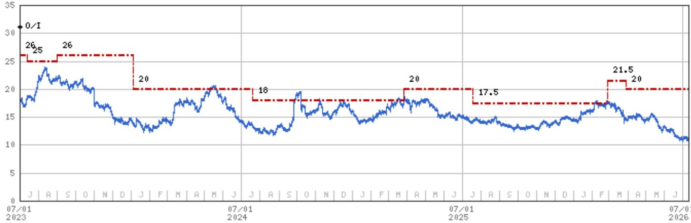
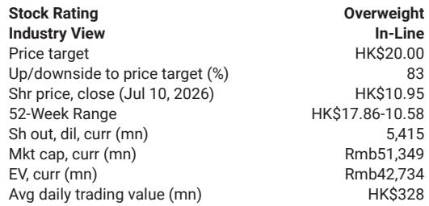
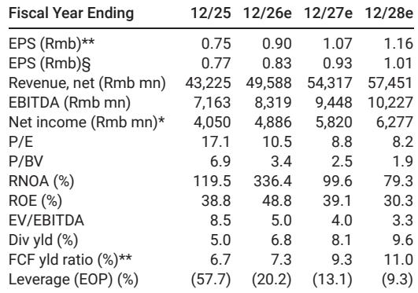

# 海底捞6月客流数据：消费复苏进入平台期，而非仅仅是放缓

海底捞作为国内营收最高的火锅连锁企业，其2026年6月的翻台率同比出现下降，即便考虑了端午节日历效应带来的潜在利好。这并非季节性波动。这一数据点——在包含重要节假日的月份里翻台率同比小幅下滑——传递出最清晰的信号：国内可选消费的复苏已进入一个真实的平台期。

最直接的解释是天气因素。6月国内主要城市出现异常强降雨，抑制了购物中心和街边餐饮的客流量。但天气本身无法解释这种模式的持续性。海底捞的翻台率走势已连续数月放缓，6月的数据只是进一步确认了背后的结构性原因：宏观环境的复苏力度尚不足以提振大众餐饮需求。

这一现象值得关注，因为海底捞历来是国内消费情绪的晴雨表。其门店覆盖一线至三线城市，客群涵盖白领和家庭用户，且运营数据按月披露。当海底捞的客流出现波动时，这通常不是单一公司事件，而是对更广泛经济环境的一次解读。

对市场参与者而言，后续的观察并不轻松。2026年下半年提供了较低的同比基数，这可能在数据上改善报告期的增长率。但来自相关行业的领先指标——酒店每间可用客房收入和国内航班客运量——显示，夏季客流可能仍将温和。机械性的基数效应与需求复苏是两回事。对于任何关注国内消费类公司的人来说，区分这一点至关重要。

## 端午节利好未能兑现，揭示需求真实偏弱

端午节从2025年的5月移至2026年的6月。对于餐饮连锁企业而言，这种假期移动本应为6月客流带来明显的提振。但事实并非如此。海底捞的翻台率同比依然下降。

这是数据中最具说明力的细节。当假期日历效应未能提振公司的核心运营指标时，意味着潜在需求不足以消化新增的供给。即便消费者拥有假期，他们也没有以更大规模出现。这并非天气问题，而是消费意愿问题。

同比小幅下滑的幅度不大，但方向比幅度更重要。海底捞一直处于低通胀环境中，管理层实施了严格的成本控制和审慎的门店扩张计划。这些因素可以保护利润率，但无法凭空创造客流。

观察者应将6月数据视为趋势的确认，而非异常值。公司的翻台率数据已连续数月走软。端午节本是最自然的反转催化剂，但这一情况并未发生。

## 夏季季节性将带来机械性提振，但领先指标显示提振力度有限

2026年下半年为海底捞提供了较低的同比基数。这是算术问题，而非战略问题。如果翻台率在当前水平企稳，同比增速自然会因前一年基数较低而改善。但若将此解读为复苏，则可能犯下类别错误。

关键问题不在于同比数据是否改善，而在于相对客流水平是否上升。对此，最佳的领先指标来自旅行和住宿数据。国内酒店每间可用客房收入持续承压。国内航班客运量虽从疫情低谷中恢复，但尚未展现出典型旺季的加速特征。

这两组数据之所以重要，是因为海底捞的客流与人员流动性高度相关。人们出行时，外出就餐频率增加；商务旅行回暖时，企业餐饮需求上升；家庭暑期出游时，火锅是自然的用餐选择。如果酒店和航空数据预示着一个温和的夏季，那么有理由预期海底捞的客流也将保持温和。

风险不在于客流崩溃，而在于客流在低于市场预期的水平上停滞。许多研究模型仍假设下半年会逐步复苏。如果这一复苏未能实现，盈利预期将需要向下修正。

## 研究框架：区分基数效应复苏与需求复苏

区分增长率的机械性改善与需求的有机复苏，是2026年下半年研究国内消费类公司的核心任务。一个简单的框架可以提供帮助。

首先，判断公司的销量或客流指标是否在相对数值上上升。对海底捞而言，这指的是每日翻台率。如果翻台率在整个夏季持平或环比下降，基数效应将带来更好的同比数据，但实际业务并未改善。

其次，检查改善是否在消费类别中广泛存在。如果海底捞的客流改善，但酒店RevPAR没有改善，那么这种改善可能是公司或渠道特有的，而非宏观层面的。如果两者同时改善，则复苏具有广度。

第三，评估管理层是采取扩张策略还是谨慎策略。海底捞当前的策略是审慎的门店增长和成本控制。这是需求疲软环境下的正确策略。如果管理层加速开店，将传递出需求正在回归的信心。在此之前，默认假设应是需求尚未回归。

这一框架同样适用于海底捞之外的公司。任何在2026年下半年报告同比改善的国内消费类公司，都应通过这三个测试进行评估。基数效应会制造噪音，而这一框架可以过滤噪音。

## 结构性风险：低通胀可能固化，在利润率稳定的同时压制销量

海底捞的利润率表现一直强劲。公司受益于稳定的原材料成本和严格的用工管理。近期一份研究报告中的估值方法预测，2025-2027年每股收益的年复合增长率为27%，主要驱动力来自经营杠杆。

这一利润率故事是真实的，但它不能替代销量增长。如果客流持续走软，经营杠杆将反向作用。固定成本——租金、人工、折旧——不会随客流下降而减少。持续的销量缺口将压缩而非扩大利润率。

支撑利润率扩张的宏观环境是低通胀：稳定的投入成本和温和的工资增长。这对餐饮利润率是有利的。但低通胀也意味着定价权薄弱。海底捞无法简单地通过提高菜单价格来弥补客流下降。如果尝试这样做，可能会加速客流下滑。

对于海底捞以及更广泛的国内消费类公司而言，结构性问题在于：经济能否产生足够的需求来吸收已建成的产能。如果低通胀持续且销量保持疲软，利润率故事将见顶。市场参与者所预期的每股收益增长可能无法实现。

6月的数据并不能证明这一情景是必然的。但它确实证明，复苏的假设尚未得到验证。那些依赖下半年基数效应来支撑其头寸的参与者，是在押注算术，而非基本面。这是一项胜算有限的押注。

*仅供参考。部分内容可能基于源材料通过AI辅助生成、翻译、总结或编辑，可能存在遗漏或错误。请独立核实。本文不构成任何专业建议。*

仅供参考。部分内容可能基于源材料通过AI辅助生成、翻译、总结或编辑，可能存在遗漏或错误。请独立核实。本文不构成任何专业建议。

