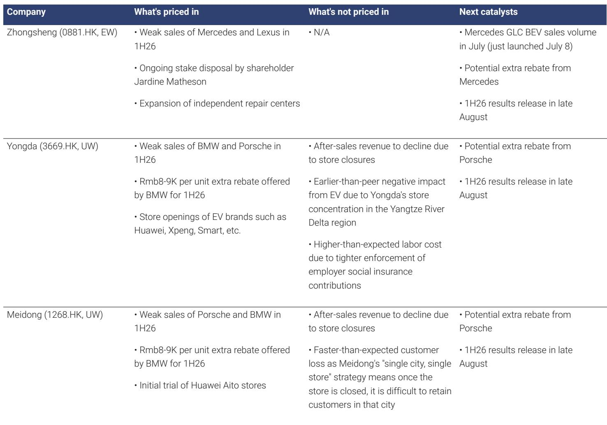
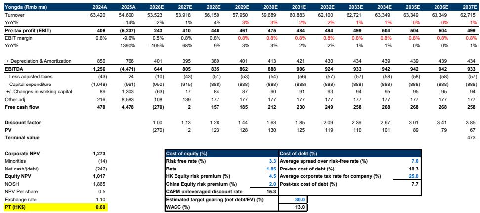
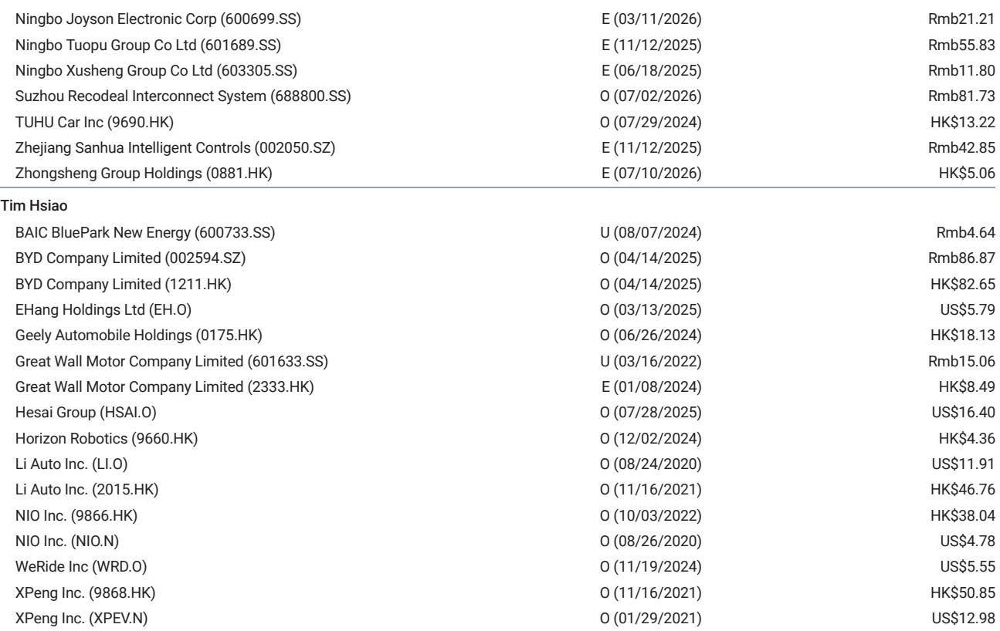

# 豪华汽车经销商模式正在经历比市场预期更快的结构性变化

中国豪华汽车零售领域正在经历深刻的结构性调整。过去依赖新车销售与制造商金融佣金支撑的盈利模式已经发生变化，而售后服务的第二增长引擎也因经销商网络加速收缩而面临挑战。2026年上半年，三大德国豪华品牌宝马、奔驰、奥迪的内燃机车型销量同比下降16%至28%，保时捷中国销量同比下降32%。这种变化并非暂时现象。即便相关公司报价年内已出现50%至60%的调整，市场尚未充分反映经销商整合对售后收入、人力成本及资产减值的二阶影响。

认为新车销量减少会直接缩小亏损规模的观察，可能忽略了问题的核心。从数学上看，销量下降减少总亏损的逻辑在孤立条件下成立，但它忽视了经销商商业模式的深层变化。真正的问题在于，当前的整合正在打破客户关系本身。当一家经销商关闭门店时，该门店的售后收入——历史上经销商最稳定、利润率最高的收入来源——并不会简单地转移到其他门店。在许多情况下，随着客户转向独立维修店，这部分收入会完全消失。这不是暂时的波动，而是整个授权经销商网络可触达市场份额的永久性流失。

对中国三家主要上市豪华汽车经销商——中升、永达、美东——的评级下调，反映了市场对其基本面的重新评估。一些观察者曾期待的2026年底或2027年初的盈利恢复，现在看来最早也要到2027年才有可能实现，而且前提是整合过程完全完成。对于关注汽车行业的研究者而言，关键问题不再是周期何时转向，而是哪些经销商能在整合中保留客户基础，哪些将留下空置的网络和无法收回的成本结构。

## 新车利润的下降并非周期性，而是结构性，源于金融佣金收入的消失

关于豪华汽车经销商盈利能力的传统讨论，通常聚焦于销量下降和制造商的定价压力。虽然这两个因素确实存在，但更深层的结构性变化是汽车金融佣金收入的消失——历史上，这部分收入为经销商每辆新车销售贡献了相当比例的利润。过去，经销商通过为客户安排高息汽车贷款获得可观的佣金，银行和金融公司向经销商支付的费用从数千元到上万元不等。这些佣金实际上补贴了经销商提供车辆折扣的能力。

这一机制已经改变。针对“高息高佣”汽车金融产品的监管措施，消除了经销商在新车交易中单车利润的主要来源。即使制造商降低建议零售价以刺激需求，经销商每辆车的净利率仍然受到压制，因为过去用于抵消价格折扣的金融佣金收入已经消失。结果是，现在每卖出一辆新车都会给经销商带来亏损，而不仅仅是利润变薄。

因此，销量下降产生了一个看似矛盾的现象。销量减少意味着亏损交易减少，从数学上降低了新车总亏损。但这并不是复苏信号。它表明经销商的主要收入来源活动已成为一种没有对冲利润流的亏损业务。那些将销量下降视为盈亏平衡路径的观察者，可能混淆了算术与业务健康。一个每卖一辆车都亏损的经销商，即使销量减少，每笔交易仍然在亏损。相对少见的区别是亏损的规模。

## 长期被视为稳健的售后收入，现在面临网络收缩和客户流失的风险

多年来，售后服务一直是经销商盈利的基石。保养、保修、碰撞维修和零部件销售产生了高利润的经常性收入，在很大程度上不受新车市场周期的影响。例如，中升的维修服务收入在2022年至2025年间以10%的年复合增长率增长，毛利润以13%的年复合增长率增长。这种韧性基于一个简单的假设：只要车辆保有量增长且客户对经销商网络保持忠诚，售后收入就会持续上升。

这一假设现在正受到三个同时发生的力量的挑战。首先，随着电动汽车渗透率的持续上升，中国的内燃机汽车保有量开始下降。更小的总可服务车队意味着需要经销商擅长的那种保养的车辆减少。其次，授权经销商门店数量正在减少。永达的门店数量从2020年底的179家下降到2025年底的137家，减少了23%。第三，也是最关键的，客户正在从经销商网络流失到提供更好性价比的独立维修店。

机制很简单。当一家经销商在某个城市关闭门店时，以前在该地点保养车辆的客户并不会自动迁移到另一个城市的经销商门店。他们会寻找当地的替代方案。独立维修店管理费用较低，且不需要使用制造商批准的零部件，可以提供有竞争力的价格。对于车辆已不在保修期内的客户，前往授权经销商的动力会急剧下降。这不是逐渐的侵蚀。对于每一次门店关闭，客户保留率都会出现阶梯式下降。

对于美东来说，问题因其“一城一店”策略而更加复杂。一旦美东关闭其在某个城市的相对少见门店，它就没有其他地点可以引导客户。该城市的全部售后收入将永久损失。美东的售后收入在2025年同比下降11%至39亿元，并且随着门店关闭和金融佣金收入从售后线中移除的影响全面显现，下降速度在2025年下半年加快。

## 更严格的劳动成本执行给经销商盈利能力带来了隐性但重要的拖累

除了销量和利润率的显性压力外，一个较少被讨论的成本因素是中国雇主社会保险缴费的执行力度正在加强。汽车零售是劳动密集型行业。截至2025年底，中升雇佣了30,287人，永达雇佣了13,243人，美东雇佣了3,763人。每位员工都需要雇主缴纳社会保险，包括养老、医疗、失业、工伤和生育保险。

历史上，许多经销商根据最低工资标准而非实际工资计算这些缴费，从而降低了有效劳动成本。今年，执行力度显著加强，监管机构要求按实际工资计算缴费。对于一家已经在新车销售上亏损且面临售后收入下降的经销商来说，有效社会保险缴费率的提高直接冲击了利润表，且难以轻易抵消。

影响并不均匀。平均工资较高、员工队伍较大的经销商面临的比例增长更大。但对于所有三家主要上市经销商来说，持续的经营亏损和更高的劳动成本相结合，形成了关闭更多门店的强大动力。关闭门店的决定不再仅仅关乎新车销售业绩不佳。它关乎消除那些社会保险缴费已变得显著更昂贵的员工的固定成本基础。这一动态加速了整合周期，并增加了门店关闭数量超过市场当前预期的可能性。

## 评估经销商在整合周期中生存能力的决策框架

对于评估哪些经销商能从当前整合中脱颖而出的观察者和行业分析师来说，关键变量不是新车销量或市场份额，而是通过门店关闭过程保留售后客户的能力。三个因素决定了这种能力。

首先，地理多元化很重要。门店集中在单一地区的经销商，例如永达在长三角地区的密集布局，面临其整个网络同时受到电动汽车渗透率压力的更高风险。当该地区电动汽车普及率上升时，永达的所有门店都会同时受到影响。地理分布更广的经销商至少可以部分抵消区域性的电动汽车影响。

其次，服务非专属客户的能力至关重要。中升对独立维修中心的投资，使其能够服务任何品牌的车辆，包括比亚迪和其他电动汽车制造商，这提供了永达和美东所缺乏的缓冲。这些独立中心不受特定制造商特许经营协议的约束，可以吸引客户，无论他们驾驶什么品牌。这创造了一个独立于新车销售业绩的潜在售后收入池。

第三，门店关闭策略本身决定了客户保留率。美东的一城一店模式意味着任何关闭都会导致该城市客户基础的完全丧失。永达在某些城市的多店布局提供了有限的客户引导能力，但其整体门店数量正在迅速下降。中升凭借其更大的网络和独立维修中心，即使在关闭表现不佳的门店时，也有最多的选择来保留客户。

结论是明确的。整合不会对所有经销商产生同等影响。中升在过渡期间更有能力维持售后收入，而永达和美东在每次门店关闭时面临更高的客户永久流失风险。市场目前对所有三家经销商的定价处于承压水平，可能未能充分区分这些生存能力特征。

## 盈利恢复时间线已推迟至2027年，且仅适用于较强的网络

对所有三家主要经销商的评级下调反映了这样一种判断：盈利恢复的时间比之前估计的更远。基本情景现在假设，经销商行业整合将至少在2026年剩余时间内抑制新车价格，而有意义的盈利恢复要到2027年才会出现。即便如此，恢复也可能是不均衡的。

对于中升，恢复路径取决于其独立维修中心策略能否抵消自有门店网络专属售后收入的下降。该公司的售后收入从2023年16%的同比增长放缓至2025年的4%，表明独立维修中心的增长尚未足够快以完全弥补核心售后业务的放缓。如果独立中心扩张速度加快，盈利恢复可能会更早到来。如果没有，即使更广泛的整合完成，中升的售后业务也可能继续放缓。

对于永达和美东，恢复时间线更加不确定。两家公司都面临门店数量下降和吸引非专属售后客户能力有限的双重负担。永达在电动汽车渗透率最高的长三角地区的门店集中，意味着其剩余门店面临高于平均水平的从内燃机汽车转型的压力。美东的一城一店模式意味着任何进一步的门店关闭都将导致完全退出这些城市市场，且没有后续恢复这些客户的希望。

这些经销商的合并资产负债表也呈现出不同的风险特征。中升的商誉和无形资产占总资产的比例较高——2025年底合计为14.5%，而永达为6%，美东为3%。如果豪华内燃机汽车销售进一步走弱，中升面临更高的减值风险。虽然减值不影响现金流，但它会减少报告利润，并且如果派息率与报告净利润挂钩，可能会影响股息支付。这为中升近期的盈利轨迹带来了额外的不确定性。

*仅供参考。部分内容可能基于源材料通过AI辅助生成、翻译、总结或编辑，可能存在遗漏或错误。请独立核实。本文不构成任何专业建议。*

仅供参考。部分内容可能基于源材料通过AI辅助生成、翻译、总结或编辑，可能存在遗漏或错误。请独立核实。本文不构成任何专业建议。

