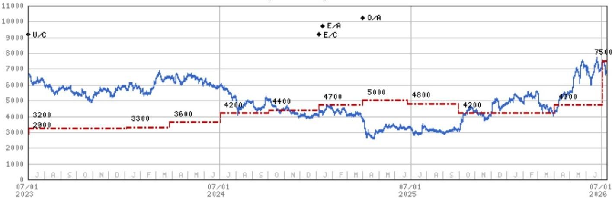
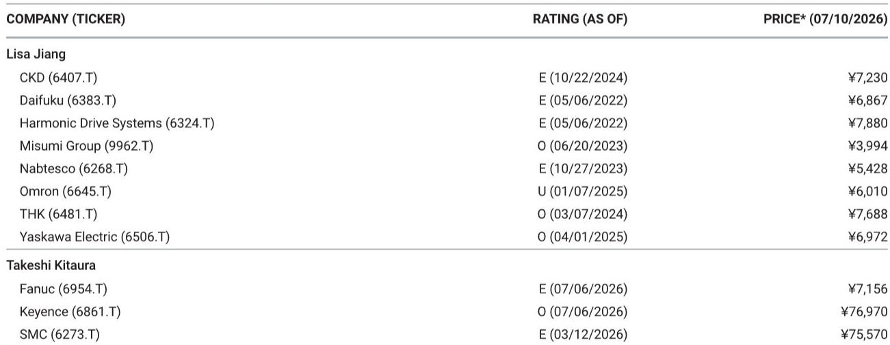

# The Real Story in Yaskawa's Quarter Is Not the Earnings Miss — It Is the Disconnect Between Surging Demand and Operational Fragility

Yaskawa Electric reported first-quarter operating profit of ¥8.5 billion for fiscal 2026, a 19% decline year-over-year and a staggering 41% below the consensus estimate of ¥14.4 billion. The headline number looks like a demand problem. It is not. Consolidated orders surged 28% year-over-year to ¥163.8 billion, with AC servo orders jumping 65% and robotics orders recovering 14%. The company is swimming in demand. The profit collapse came from an entirely different source: the migration of an enterprise resource planning system.

This quarter presents a strategic paradox that observers must resolve. On one side, Yaskawa's core end-markets — semiconductors, data centers, and general industrial automation — are delivering the kind of order acceleration that justifies the company's elevated valuation. On the other side, the company's internal execution capacity proved inadequate to convert that demand into earnings, as ERP-related production disruptions and cost overruns destroyed margin in the robotics segment. The question is not whether demand is real. It is whether Yaskawa's operational infrastructure can keep pace with the growth it is generating.

The market has a choice. It can treat the first quarter as a one-time operational glitch, a temporary cost of modernizing systems that will pay off in efficiency gains later. Or it can see this as a warning signal that Yaskawa's internal complexity has exceeded its management bandwidth, particularly as it juggles the simultaneous challenges of scaling robotics production, integrating new software platforms, and restructuring legacy businesses. The evidence from the quarter supports both interpretations, but the weight of the argument leans toward the former — provided management executes flawlessly from here.

## Orders Tell a Coherent Growth Story, but the Composition Reveals Two Divergent Demand Regimes

The order data from the first quarter is not ambiguous. Consolidated orders rose 28% year-over-year and 7% sequentially, a pace that would normally trigger upward earnings revisions rather than a downward earnings surprise. The strength was broad-based but not uniform. AC servo orders, the most direct proxy for semiconductor capital equipment and data center infrastructure investment, accelerated 65% year-over-year and 10% sequentially. This is the highest growth rate in this product line in several quarters and confirms that the semiconductor cycle is in full upswing, with Yaskawa as a primary beneficiary.

Inverter orders grew 31% year-over-year but declined 3% sequentially, suggesting a more mature phase in that cycle. Robotics orders, which had been the laggard in recent periods, recovered to 14% year-over-year growth and a sharp 37% sequential rebound. The robotics recovery was centered on general industrial applications and semiconductor-related uses, indicating that the factory automation investment cycle is broadening beyond its initial core.

The critical insight here is that Yaskawa is operating in two distinct demand regimes simultaneously. The AC servo and semiconductor-linked businesses are in an early-cycle acceleration phase, where order momentum is still building and the risk is under-investing in capacity. The robotics business is in a mid-cycle recovery phase, where demand is returning but margins are compressed by the cost of restarting production lines and absorbing restructuring charges. These two regimes impose different operational requirements. The servo business needs speed and capacity expansion. The robotics business needs cost discipline and process stabilization. Managing both at once, while simultaneously overhauling the ERP system, is the operational challenge that produced the first-quarter miss.

The implication is that Yaskawa's growth trajectory is intact, but the earnings path will be lumpier than the order trajectory suggests. Those who focus only on the order growth will overestimate near-term profitability. Those who focus only on the earnings miss will underestimate the structural demand opportunity.

## The Robotics Margin Collapse Is a Self-Inflicted Wound, Not a Structural Problem — but the Healing Process Is Not Guaranteed

Robotics segment margin fell to 1.6% in the first quarter, a level that is barely above breakeven and dramatically below what the order recovery would suggest. The source of this collapse is not competitive pricing pressure, not a shift in product mix toward lower-margin applications, and not a sudden increase in raw material costs. The source is two internal factors: costs associated with the ERP system migration and restructuring charges.

The ERP migration is a particularly telling issue. Enterprise resource planning implementations are notoriously difficult in manufacturing companies, where the software must integrate with production scheduling, inventory management, supply chain logistics, and financial reporting across multiple product lines and geographies. Yaskawa's decision to proceed with this migration during a period of surging demand created a perfect operational storm. Production lines were disrupted. Workflows were interrupted. Data reconciliation became a bottleneck. The result was that the company could not ship products fast enough to match the order intake, creating a gap between revenue recognition and cost absorption.

This is not a permanent margin impairment. Once the ERP system stabilizes and production normalizes, the cost overruns should reverse and the efficiency gains from the new system should begin to materialize. The second-quarter outlook, which management expects to show steady recovery, is predicated on this normalization. But the risk is that ERP migrations rarely follow a linear path. Unexpected data migration issues, user adoption friction, or supply chain integration problems can extend the disruption period beyond management's current expectations.

The restructuring costs in robotics add another layer of complexity. Yaskawa is simultaneously rationalizing its robotics operations, likely involving factory consolidation, workforce adjustments, or product line simplification. These actions are strategically sensible in the long term — they should improve the cost structure and focus the business on higher-value applications. But in the short term, they consume cash and depress reported margins. The combination of ERP disruption and restructuring costs means that robotics margins will remain under pressure for at least one more quarter, and possibly two, before a clear recovery path emerges.

The strategic question is whether the robotics business can sustain its order recovery while margins are so thin. Customers who place orders today may not receive deliveries for several months. If production disruptions persist, delivery delays could erode customer confidence and give competitors an opening. Yaskawa's competitive position in robotics is strong, but it is not unassailable. Competitors with more stable production operations could capture share during this window of vulnerability.

## The Full-Year Guidance Holds, but Credibility Now Depends on Second-Quarter Execution

Management has kept its full-year guidance unchanged despite the first-quarter shortfall. This is the conventional approach — companies rarely revise guidance after a single quarter, especially when the miss is attributed to temporary operational issues rather than demand deterioration. But the guidance now carries a higher burden of proof. Yaskawa needs to deliver approximately ¥66 billion in operating profit over the remaining three quarters to hit its full-year target, assuming no revisions. That implies an average quarterly profit of roughly ¥22 billion, more than 2.5 times the first-quarter result.

The math is feasible if production normalizes in the second quarter and the order momentum continues. The AC servo business, with its 65% order growth, should begin to convert into revenue with higher margins as production stabilizes. The robotics business, even with compressed margins, should benefit from the volume recovery. The inverter business provides a stable base. But the feasibility of the guidance rests on a specific assumption: that the ERP-related disruptions are front-loaded and will be substantially resolved by the end of the second quarter.

This assumption is reasonable but not risk-free. ERP implementations in complex manufacturing environments often reveal new issues in the second and third months after go-live, as users encounter edge cases and data reconciliation problems that were not apparent in the initial cutover. If Yaskawa encounters a second wave of disruptions, the guidance would become untenable. The market's reaction to the first-quarter results — which the report describes as a meaningful shortfall relative to consensus — suggests that observers are already pricing in some skepticism.

The more important strategic consideration is what the guidance implies about management's confidence. By keeping guidance unchanged, management is signaling that they have visibility into the production recovery and that the demand environment remains strong enough to absorb any residual disruption. If they are right, the company's valuation will recover as second-quarter results demonstrate the recovery. If they are wrong, the guidance will need to be revised downward, and the company will face a second leg of selling pressure.

## A Decision Framework for Evaluating Yaskawa Through the Recovery

For those trying to assess Yaskawa's trajectory, the first-quarter results provide a structured decision framework with three sequential tests. The first test is production normalization. By the end of the second quarter, the company should demonstrate that robotics production has returned to normal levels, that ERP-related disruptions have been resolved, and that the cost overruns from the migration are not recurring. The key metric to watch is robotics segment margin. If it recovers from 1.6% toward the mid-single digits, the ERP issue is passing. If it remains below 3%, the disruption is persisting.

The second test is order conversion. The 65% growth in AC servo orders and the 14% growth in robotics orders must translate into revenue growth. If revenue in these segments grows at a pace consistent with the order trends, it confirms that the production disruption was the only bottleneck. If revenue growth lags order growth significantly, it suggests that either production issues are deeper than disclosed or that customer delivery expectations are not being met, which could lead to order cancellations.

The third test is margin recovery in the core business. Excluding robotics restructuring costs and ERP migration expenses, the underlying margin in motion control and inverters should be stable or improving. If the core business margins are expanding, it confirms that the demand cycle is genuine and that Yaskawa's competitive position is intact. If core margins are compressing even after adjusting for the one-time items, it would suggest that the company is facing structural cost pressures or pricing erosion that the demand growth cannot offset.

Each test has a binary outcome. Passing all three would validate the thesis that Yaskawa is a high-quality automation company experiencing a temporary operational disruption in the middle of a powerful demand cycle. Failing any one test would raise questions about management's ability to execute during a period of rapid growth, which is precisely when execution matters most.

The report's own valuation framework supports itself reflects a 60% premium to the theoretical multiple implied by past valuation when ROE was 10.7%. That premium is justified by the structural demand opportunity in robotics and factory automation, particularly as physical AI and semiconductor-driven automation expand. But a premium valuation requires premium execution. The first quarter did not deliver premium execution. The next two quarters must.

*For informational purposes only. Portions may be generated, translated, summarized, or edited with AI assistance based on source materials and may contain omissions or errors. Please verify independently. This is not professional advice.*

For informational purposes only. Portions may be generated, translated, summarized, or edited with AI assistance based on source materials and may contain omissions or errors. Please verify independently. This is not professional advice.

