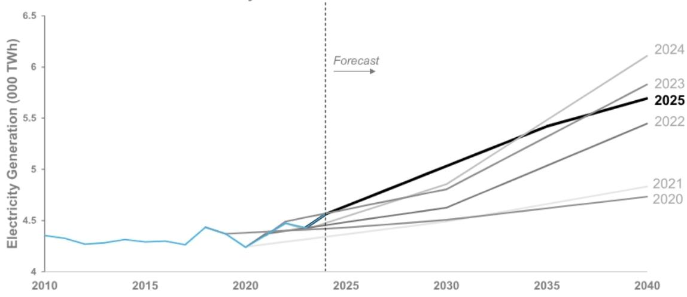
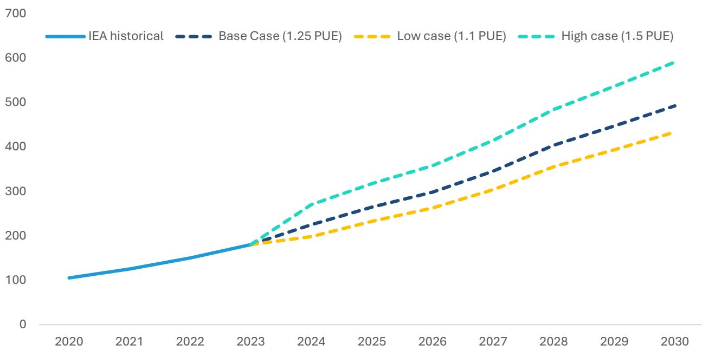
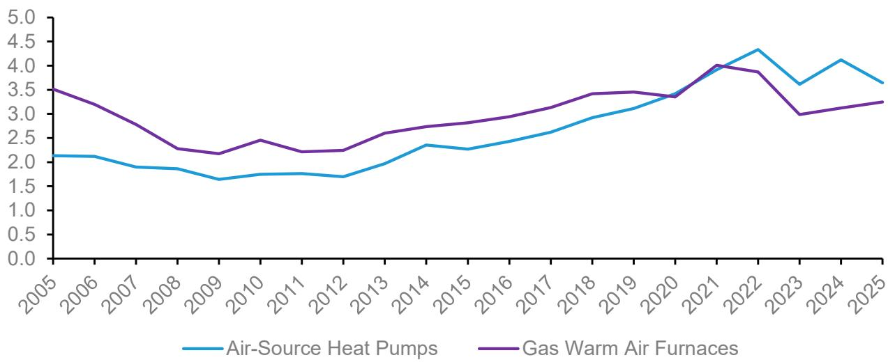
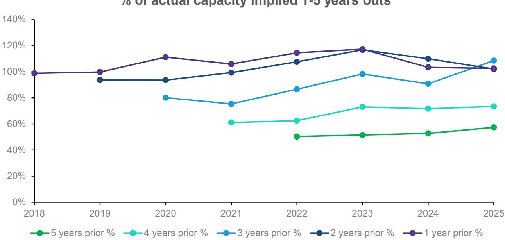
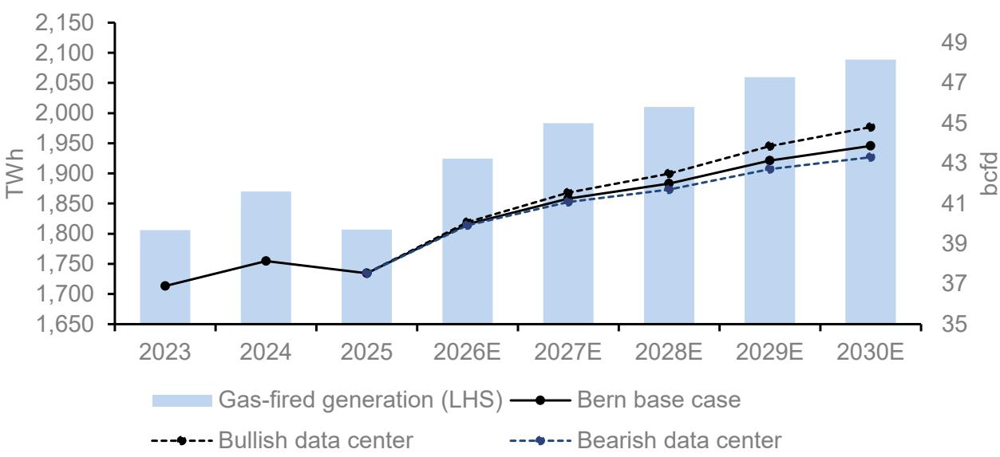

# Americas Energy & Transition

# Americas Power & Energy Transition: Baseload, Rising - Bernstein's Power Forecast until 2030

  
Sunaina Ocalan  
.+1 917 344 8503

sunaina.ocalan@bernsteinsg.com

Anshika Bajpai

+1 917 344 8306

anshika.bajpai@bernsteinsg.com

Raphael Lee

+1 917 344 8355

raphael.lee@bernsteinsg.com

There's never been a more important time to have a good power demand forecast. After decades of no demand growth, electricity demand is growing in the US. It's not just artificial intelligence - it's reshoring, it's electrification, and normal GDP growth. At current demand, Independent Power Producers (IPPs) are growing and providing returns to shareholders. The macro debate isn't really whether power demand is going up or how much is power demand increasing anymore....I think everyone agrees it's going up (more on our forecast below). The debate is who captures the margin on supplying it.

We use an in-house built power supply and demand model to forecast power demand by sector - that we think is really easy to use and sensitize. We use the power supply portion to inform our view on our forecasts for the companies that will serve this demand. The supply model also helps provide a sanity check for the guidance from the companies we cover. We go into detail below.

Our proprietary power supply and demand model helps us forecast demand by sub-sector (residential, commercial, industrial, and transport) and deep-dive into key drivers of those sub-sectors below (for example, data centers for commercial power demand). We forecast supply by sub-sector and consider the role of intermittency of renewables in the forecast as well.

We expect power demand to rise by ~3% annually (CAGR) to 2030 with increased consumption occurring in all three major sectors - residential, commercial, and industrial. Since our initiation three weeks ago, we have gotten feedback that our power demand forecast might be conservative. We think 3% is a LOT when historical power demand has risen at only a 0.35% CAGR from 2000 to 2024. The range of other sources we’ve seen (IEA, EIA, Rystad) has power demand growing anywhere from 2 - 5% in the 2025-2030 time frame, so our model falls on the more conservative side of power demand.

We have updated our model through 1Q26 with actual monthly data from the EIA, keeping our forecasts the same.

BERNSTEIN TICKER TABLE

<table><tr><td rowspan="2">Ticker</td><td colspan="4">9 Jul 2026</td><td rowspan="2">TTMRel.</td><td colspan="4">Reported EPS</td><td colspan="3">Reported P/E (x)</td></tr><tr><td>Rating</td><td>Cur</td><td>Closing Price</td><td>Price Target</td><td>Cur</td><td>2025A</td><td>2026E</td><td>2027E</td><td>2025A</td><td>2026E</td><td>2027E</td></tr><tr><td>BE (Bloom Energy)</td><td>M</td><td>USD</td><td>257.02</td><td>276.00</td><td>823.3%</td><td>USD</td><td>0.82</td><td>2.30</td><td>4.27</td><td>312.0</td><td>111.6</td><td>60.2</td></tr><tr><td>LNG (Cheniere Energy)</td><td>O</td><td>USD</td><td>261.29</td><td>283.00</td><td>(11.5)%</td><td>USD</td><td>24.19</td><td>16.70</td><td>15.06</td><td>10.8</td><td>15.6</td><td>17.3</td></tr><tr><td>CQP (Cheniere Energy Partners)</td><td>M</td><td>USD</td><td>64.88</td><td>58.00</td><td>(5.2)%</td><td>USD</td><td>5.17</td><td>4.69</td><td>3.66</td><td>12.6</td><td>13.8</td><td>17.7</td></tr><tr><td>CEG (Constellation Energy)</td><td>O</td><td>USD</td><td>250.74</td><td>296.00</td><td>(40.7)%</td><td>USD</td><td>7.40</td><td>11.82</td><td>12.67</td><td>33.9</td><td>21.2</td><td>19.8</td></tr><tr><td>ENPH (Enphase Energy)</td><td>M</td><td>USD</td><td>44.89</td><td>56.00</td><td>(14.3)%</td><td>USD</td><td>1.29</td><td>0.58</td><td>1.22</td><td>34.9</td><td>76.8</td><td>36.9</td></tr><tr><td>FRVO (Fervo)</td><td>O</td><td>USD</td><td>27.35</td><td>47.00</td><td>NA</td><td>USD</td><td>(0.25)</td><td>(0.10)</td><td>(0.16)</td><td>(110.1)</td><td>(279.4)</td><td>(173.7)</td></tr><tr><td>FSLR (First Solar)</td><td>U</td><td>USD</td><td>228.50</td><td>217.00</td><td>18.1%</td><td>USD</td><td>14.21</td><td>17.70</td><td>22.65</td><td>16.1</td><td>12.9</td><td>10.1</td></tr><tr><td>GEV (GE Vernova)</td><td>O</td><td>USD</td><td>1,075.26</td><td>1,206.00</td><td>83.4%</td><td>USD</td><td>17.70</td><td>25.21</td><td>26.05</td><td>60.8</td><td>42.6</td><td>41.3</td></tr><tr><td>NEE (NextEra Energy)</td><td>O</td><td>USD</td><td>87.10</td><td>107.00</td><td>(3.7)%</td><td>USD</td><td>3.30</td><td>4.30</td><td>4.48</td><td>23.5</td><td>20.2</td><td>19.4</td></tr><tr><td>ORA (Ormat Technologies)</td><td>U</td><td>USD</td><td>110.37</td><td>115.00</td><td>4.1%</td><td>USD</td><td>2.02</td><td>2.26</td><td>2.48</td><td>54.7</td><td>48.8</td><td>44.4</td></tr><tr><td>TE (T1 Energy)</td><td>M</td><td>USD</td><td>7.26</td><td>9.00</td><td>367.1%</td><td>USD</td><td>(2.19)</td><td>(0.31)</td><td>(0.07)</td><td>(3.3)</td><td>(23.1)</td><td>(101.0)</td></tr><tr><td>VG (Venture Global)</td><td>M</td><td>USD</td><td>12.53</td><td>14.00</td><td>(48.3)%</td><td>USD</td><td>0.86</td><td>0.86</td><td>0.86</td><td>14.6</td><td>14.6</td><td>14.6</td></tr><tr><td>VST (Vistra Corporation)</td><td>O</td><td>USD</td><td>157.98</td><td>181.00</td><td>(39.4)%</td><td>USD</td><td>2.18</td><td>9.44</td><td>11.70</td><td>72.6</td><td>16.7</td><td>13.5</td></tr><tr><td>SPX</td><td></td><td></td><td>7,575.39</td><td></td><td></td><td></td><td></td><td></td><td></td><td></td><td></td><td></td></tr></table>

O - Outperform, M - Market-Perform, U - Underperform, NR - Not Rated, CS - Coverage Suspended  
BE, VG estimate is Adjusted EPS; NEE estimate is Reported EPS Adjusted EPS; BE, NEE, VG valuation is Adjusted P/E (x); Source: Bloomberg, Bernstein estimates and analysis.

## INVESTMENT IMPLICATIONS

We are Outperform on GEV, FRVO, NEE, VST, CEG and LNG

We are Market-Perform on BE, ENPH, TE, VG, CQP

We are Underperform on FSLR and ORA

## DEMAND

Power demand in the U.S. has grown at a 1.2% CAGR since 2019, and 0.3% CAGR since 2010, significantly slower than overall GDP growth, as electricity use per kWh of GDP has declined by -3.7% in that time. However, we are now witnessing a once-in-a-generation increase in power demand. We bucket it into four categories: i) Residential demand from homes ii) Commercial demand from office spaces, warehouses, and other places of business (including data centers) iii) Industrial demand from manufacturing and iv) Transportation demand from the operation of public transport systems (which is a much smaller slice than the other three). We expect to see unprecedented growth in demand for power from all of these categories.

The biggest driver of demand is the addition of data centers in the US. Currently, 45% of global data centers are in the United States (more than 10X data centers in the US as compared to China!). By 2030, we expect ~50% of global data centers to be in the US. The proliferation of AI is meaningfully adding to the energy required to support data centers. Data center power demand currently makes up 6% of overall demand, growing to 10% of overall demand in 2030.

Additionally, the push to “reshore” manufacturing in an environment of increasing global geopolitical fragmentation will add incremental power demand from the industrial sector in the U.S.

Even before these more recent trends, the need to lower emissions by increasing electrification in various sectors of the economy (EVs, heat pumps, induction stoves) was set to increase the reliance on electricity.

## POWER FORECASTING

While there is probably no debate that power consumption is set to increase in the U.S., the extent of this growth is widely debated. The main tension here is that demand could materialize before supply can be connected. Power forecasting is driven by weather, seasonality, economic activity, and large technological changes. There is a short (months - 2 years), medium (3-5 years) and long term (6+ years) forecasting of power - the short term is still based on weather and seasonality and this is a mature science. The long term forecasting is based on large technology shifts and has been more scenario analysis than “forecasting”. Medium term power demand is driven by economic activity and industrial capacity additions - this used to be relatively predictable and slow moving - but now with AI and data centers, this medium term piece is difficult to predict. The current projection of increased load from data centers would have seemed ludicrous a decade ago, and interconnection requests still include a large share of speculative projects.

EXHIBIT 1: Various vintages of US Electricity Generation from the IEA show the difficulty in forecasting power

US Electricity Generation Historical Forecasts 2010-2050  
  
Source: IEA World Energy Outlook 2015-2025, Bernstein analysis

We pause to make the point that we may not be the best at forecasting power. Under the wise words of one of the best statisticians of all time, George Edward Pelham Box, “All models are wrong, some are useful”, we proceed with a sectoral approach to our forecasting.

We built an in-house model to put a helpful framing around the potential load growth from macro trends in data center development, re-shoring of manufacturing, EV adoption, and broader electrification. The model is easy to sensitize to various inputs. We outline our base case assumptions and inputs below, and elaborate on the methodology we used.

## EXHIBIT 2: Our in-house model allows us to sensitize demand and supply on various fronts

## DEMAND

Forecasts future monthly demand by estimating major growth drivers, and using base growth at 2010-2019 CAGR:

■ Residential: EV sales, heat pump sales

■ Commercial: data center and AI power demand

\- Industrial: Reshoring of manufacturing gross domestic output

\- Transportation flat

Adds 8% transmission losses based on historical data from EIA

## SUPPLY

Supply (plus imports) available to meet demand plus transmission losses. Imports negligible

By fuel source:

■ We sum monthly generation capacity adds of late-stage projects

\- We add monthly additions to current capacity to get future monthly capacity by generation, assuming a capacity factor

\- We gross up solar capacity 3 years out to account for continuous underestimation

■ Manually add nuclear restarts

Delta between demand and supply met by gas

## Inputs:

## INPUTS

\- Generation fleet

\- Outages

\- Renewable profiles

\- Import/ Exports

\- Transmission losses

■ Historical data from EIA

## Sources:

## SOURCES

■ Edison Electric Institute

\- Department of Energy

\- AHRI – Heat pump sales

■ International Energy Institute

■ Federal Reserve Bank

Bloomberg

Built in excel with scenario modeling approach

## DRIVERS OF FUTURE DEMAND GROWTH

## AI/ Data centers and commercial demand

We estimated the U.S. has ~45GW of installed data center capacity out of a total global installed base of ~100GW. These data centers currently consume ~260TWh of electricity. In addition to running compute, these facilities also use power for cooling, lighting and other operations. Therefore, 1GW of data center capacity has to be grossed up to account for total power consumption. Current estimates range from 10-50% gross up. This implies a range of “power use efficiency” or PUE of 1.1x to 1.5x for each GW of capacity. Data centers do not run at 100% of the time either with utilization depending on a variety of factors including type of workload (training vs. inference).

We use estimates of future U.S. data center capacity built by our Communications Infrastructure team, and estimate 40GW of capacity growth from 2025-30. In order to account for potential power use efficiency gains we assume a base case PUE of 1.25x and assume a capacity utilization of ~50%. These assumptions yield a power demand add of ~230TWh by 2030 from data centers.

EXHIBIT 3: At 40GW of data center capacity growth and 1.25x PUE, we see power demand from data centers growing ~230TWh by the end of the decade

<table><tr><td>Metric</td><td>Value</td></tr><tr><td>2025 U.S. data center capacity</td><td>46 GW</td></tr><tr><td>2030 U.S. data center capacity</td><td>86 GW</td></tr><tr><td>Total capacity added</td><td>40 GW</td></tr><tr><td>PUE</td><td>1.25x</td></tr><tr><td>Utilization</td><td>52%</td></tr><tr><td>Incremental power demand</td><td>26 GW</td></tr><tr><td>TWh added</td><td>228 TWh</td></tr></table>

Source: Bernstein Analysis and Estimates

In the bear case, if PUE improves to only 1.1x, demand growth would be closer to ~200TWh. This could also reflect lower power use for the actual compute (i.e. lower overall capacity demand or utilization). In the bull case for power, at a punitive 1.5x PUE, power demand would grow by ~270TWh in our model.

EXHIBIT 4: Our scenarios for potential data center power demand range from +200TWh to +270TWh reflecting a PUE range of 1.1x to 1.5x  
U.S. data center electricity demand (TWh)  
  
Source: IEA, Bernstein analysis and estimates

We consider this demand growth to be incremental. Commercial demand for power grew at a 0.7% CAGR from 2010-2019. We continue to grow “base” commercial demand at this CAGR. We do not use the last 5 years that have a higher CAGR as we believe this might already include the effect of recent data center demand adds (as well as noise from temporary COVID-19 related moves).

We see commercial demand overall growing at a 3.6% CAGR over the next five years, from ~1,500TWh today to ~1,800TWh in 2030.

## Manufacturing "re-shoring" and industrial demand

Prior to the rapid globalization of supply chains, the share of domestic manufacturing out of total supply was much higher than it is today. Our machinery team estimated this share was ~84% in the late 90s and has fallen to ~72% today. There has been a recent push to move some manufacturing back on-shore to reduce reliance on imports and exposure to global supply chain risks. While it would be difficult to reach a pre-globalization share of domestic manufacturing in a short time frame, we believe there is no debate on the US wanting to reinvigorate domestic manufacturing. We believe that will drive meaningful industrial power demand growth to the end of the decade.

U.S. gross domestic output (GDO) stands at ~$7Tr. If we assume GDO grows roughly with GDP growth expectations in the low single digits, and that domestic manufacturing grows share modestly to 75% by 2030, electricity demand from the U.S. industrial sector would grow by ~100TWh.

This reflects an overall industrial demand growth CAGR of $\sim 2\%$ over the next 5 years (vs. $< 1\%$ over the prior 5 years) from $\sim 1,000\mathrm{TWh}$ today to $\sim 1,100\mathrm{TWh}$ in 2030.

EXHIBIT 5: We believe growth in the share of domestic manufacturing could add ~100TWh of industrial power demand by 2030 reflecting a ~2% CAGR

<table><tr><td>Reshoring</td><td>Value</td></tr><tr><td>Est. 2025 manufacturing Gross Domestic Output (GDO)</td><td>$7,321bn</td></tr><tr><td>2030 Gross Domestic Output at 2%/yr growth</td><td>$8,083bn</td></tr><tr><td>Assumed 2030 domestic manufacturing capacity</td><td>75%</td></tr><tr><td>Electric intensity (GWh/ $GDO)</td><td>142</td></tr><tr><td>2030 industrial power demand</td><td>863 TWh</td></tr><tr><td>2025 implied manufacturing power demand</td><td>761 TWh</td></tr><tr><td>Manufacturing TWh added by 2030</td><td>102 TWh</td></tr></table>

Source: FRED, Bernstein Analysis and Estimates

## Electric Vehicles, Heat Pumps and residential demand

## Electric Vehicles (EVs)

Global light vehicle sales are estimated to reach over 100MM by 2030. We assume the share of U.S. sales remains at ~20%. U.S. light vehicle sales are estimated at ~16MM units in 2025 (15-20% of global sales) and we estimate EV sales (comprising BEVs and PHEVs that primarily use electric power) account for ~10% of these sales. After a slow-down of EV adoption in 2024/2025, the recent geopolitical strife in the Straight of Hormuz could give customers pause at the pump. We assume EV sales grow share of total light vehicle sales by ~2%/yr (similar to prior years) and account for 20% of U.S. light vehicle sales in 2030. This implies ~16MM EV units added over the next 5 years.

Using data from the DOE, we estimate average miles driven per vehicle in the U.S. is $\sim 14,000$ miles and that fuel consumption for light EVs is $\sim 0.3\mathrm{kWh}$ per mile. We keep these assumptions flat to 2030 and estimate $\sim 70\mathrm{TWh}$ of demand growth from EV adoption by 2030.

EXHIBIT 6: We estimate the U.S. adds ~16MM light EV units, and almost 70TWh of implied electricity demand growth to 2030

<table><tr><td>US EV Power Demand</td><td>Value</td></tr><tr><td>Average vehicle miles/ year</td><td>13,725</td></tr><tr><td>Electric Vehicle KWh/mile</td><td>0.3</td></tr><tr><td>Vehicle units added (million till 2030)</td><td>15.8</td></tr><tr><td>EV Power TWh added by 2030</td><td>66 TWh</td></tr></table>

Source: FRED, DOE, Bernstein Analysis and Estimates

## Heat Pumps

Heat pumps use electricity to transfer heat into and out of residences for space heating or cooling. Heat pumps are a low carbon substitute for natural gas based space heating. Shipments of air source heat pumps have reached ~4MM/year in the U.S. and have overtaken sales of gas air furnaces.

EXHIBIT 7: ~4MM heat pumps are shipped in the U.S. having recently overtaken shipments of gas warm air furnaces  
Heat pump units shipped (MM)  
  
Source: AHRI, Bernstein analysis

We assume a continued pace of 4MM heat pump units added per year to 2030 or 20MM total over the next five years. Using data from the EIA residential energy consumption survey (RECS) we estimate power consumption per heat pump of $\sim$ 12mmbtu or $\sim$ 3.4MWh. Assuming this power use per unit remains constant, adding 20MM heat pump through units adds $\sim$ 70TWh of electricity demand by 2030.

EXHIBIT 8: We estimate 20MM heat pumps added by 2030 could add ~70TWh of incremental residential electricity demand

<table><tr><td>Heat Pumps</td><td>Value</td></tr><tr><td>2020 houses with heat pumps</td><td>16.3 million</td></tr><tr><td>Electricity consumption per household</td><td>11.7 mmbtu</td></tr><tr><td>Energy used</td><td>3,428 KWh</td></tr><tr><td>Heat pumps added till 2030</td><td>20 million</td></tr><tr><td>Heat pump Power TWh added by 2030</td><td>69 TWh</td></tr></table>

Source: EIA, Bernstein Analysis and Estimates

We consider demand from EV adoption and heat pump sales to be incremental. Residential demand for power grew at a 0.5% CAGR from 2010-2019. We continue to grow “base” residential demand at this CAGR. We do not use the last 5 years that have a higher CAGR as we believe this might already include the effect of recent EV and heat pump adds (as well as noise from temporary COVID-19 related moves).

We see residential demand overall growing at a 2% CAGR over the next five years, from ~1,500TWh today to ~1,700TWh in 2030.

## Transportation demand and transmission losses

Transportation demand is the smallest end use sector at only ~7 TWh today and primarily accounts for electricity supplied to public transport systems. We model this staying flat to 2030 (EVs are included as residential demand source).

Historically ~8% of energy generation is lost during transmission as a result of the heating of wires and other inefficiencies. This creates ~400TWh of additional “demand” that needs to be accounted for.

## Demand Forecast

We see aggregate demand for electricity in the U.S. growing at a 3% CAGR between 2025-2030 from ~4,400TWh today to ~5,100TWh at the end of the decade. This demand growth is driven by data center build out, domestic manufacturing growth, EV sales, heat pump adoption and broader electrification.

EXHIBIT 9: Bernstein power demand outlook  
  
Source: EIA, Bernstein analysis and estimates

## SUPPLY

Electricity is generated in the U.S. primarily using natural gas, renewable energy sources like solar and wind, coal, and nuclear. Natural gas is the largest single source supplying ~40% of the grid. Solar is the fastest growing source with a CAGR of ~20% between 2019-24. The share of coal in the fuel stack has been declining as renewable and natural gas cannibalized it, a trend that we expect will continue to the end of the decade.

## METHODOLOGY

We model the mix of power supply in the U.S. grid using the EIA's database of late stage planned generation projects. We net out planned retirements (primarily of coal-fired capacity) to calculate expected net capacity added each month. We use assumptions of capacity factor for each source based on historical data, and calculate expected net generation.

There are three main adjustments we make this database to arrive at our final forecast:

1 - Planned solar capacity has a reliable line of sight 1-2 years out. However, we have found that using the EIA database has historically underestimated grid connected solar capacity 3-5 years in the future by up to 50% in year 5. Therefore, in our model, we gross up solar capacity that is implied by the EIA database by 6% three years out, ~20% four years out, and by ~35% five years out. This is a more modest increase than prior build out would imply. However, we believe that headwinds to the solar market in the next five years from policy changes warrant a more cautious view.

EXHIBIT 11: We gross up solar capacity that is implied by the EIA database, but at a more cautious pace than historical data implies to account for macro headwinds

EXHIBIT 10: The EIA database includes only advanced stage projects. We find that this data has historically underestimated solar buildout by up to 50% 5 years out  
% of actual capacity implied 1-5 years outs  
  
Source: EIA, Bernstein analysis

Implied solar PV installed capacity by EOY  
  
Source: EIA, Bernstein analysis and estimates

2 - We manually add planned restarts to existing nuclear capacity that have been announced. Namely, the Holtec 800MW Palisades plant in late 2025, CEG's 835MW 3 mile island plant in early 2028, and NEE's 615MW Duane Arnold plant in late

2028.

EXHIBIT 12: We manually add planned restarts to existing nuclear capacity that have been announced

<table><tr><td>Plant</td><td>Operator</td><td>Capacity (MW)</td><td>State</td><td>In-service</td></tr><tr><td>Palisades</td><td>Holtec</td><td>800</td><td>MI</td><td>4Q25</td></tr><tr><td>Crane/ 3 Mile Island</td><td>Constellation</td><td>835</td><td>PA</td><td>1Q28</td></tr><tr><td>Duane Arnold</td><td>NextEra</td><td>615</td><td>IA</td><td>4Q28</td></tr><tr><td colspan="2">2030 Total</td><td>2,250</td><td></td><td></td></tr></table>

Source: Company and news reports, Bernstein analysis and estimates

3 - Power supply has to match power demand. We assume that any gap remaining between our estimated demand for power and our estimated supply of power from the EIA database is met by natural gas. In our base case, the demand for gas in electricity generation grows by ~1bcfd per year to 2030. However, in a scenario where data center power demand grows at our high-end estimate of ~270TWh by 2030, the call on gas rises to 2bcfd/yr. Conversely, in the low-end demand scenario reflecting strong improvements in power use efficiency, demand for gas grows slower.

EXHIBIT 13: We estimate ~1bcfd/year of growth in overall gas demand for power through 2030 in the U.S. in our base case view of data center power demand growth

Implied gas demand for power

  
Source: EIA, Bernstein analysis and estimates

## SUPPLY FORECAST

We believe that solar will continue to be the fastest growing generation source at a $\sim 21\%$ CAGR from 2025-30. Wind grows $\sim 3.6\%/$ yr. and renewables overall grow at a $\sim 9\%$ CAGR. We see gas-fired generation growing at $\sim 2.9\%$ CAGR and coal declining at a $\sim 6\%$ CAGR in the next five years.

EXHIBIT 14: Bernstein power supply outlook  
  
Source: EIA, Bernstein analysis and estimates

Our coverage companies represent the future sources of power supply and power equipment in a rapidly evolving U.S. grid where the simultaneous forces of unprecedented demand growth, infrastructure constraints and decarbonization concerns are creating opportunities for all forms of energy providers to play to their strengths and capture upside. This is not only limited to large-scale, grid connected power. Hyperscalers need new power supply in under 3 years, while interconnections queues are stretching far longer. The resulting constraints mean providers of “behind-the-meter” power are seeing growing demand as well. Providers of grid equipment and solutions are seeing a growth runway in addressing these bottlenecks. As power consumers seek to balance speed, reliability, affordability and sustainability, they are looking to a mix of solutions to meet their needs.

## I. REQUIRED DISCLOSURES

References to "Bernstein" or the "Firm" in these disclosures relate to the following entities: Bernstein Institutional Services LLC (April 1, 2024 onwards), Bernstein & Co., LLC (pre April 1, 2024), Bernstein Autonomous LLP, BSG France S.A. (April 1, 2024 onwards), Bernstein (Hong Kong) Limited 盛博香港有限公司, Bernstein (Canada) Limited, Bernstein (India) Private Limited (SEBI registration no. INH000006378), Bernstein (Singapore) Private Limited, Bernstein Japan KK (サンフォード・C・バーンスタイン株式会社) and analysts employed by SG Africa Technologies & Services to produce Bernstein under a Global Services Agreement in place between Bernstein and SG.

Bernstein is part of a joint venture between SG (SG) and AllianceBernstein, L.P. (AB). Unless specifically noted otherwise, for purposes of these disclosures, references to Bernstein's “affiliates” relate to both SG and AB and their respective affiliates.

## VALUATION METHODOLOGY

This research publication covers six or more companies. For valuation methodology and other company disclosures: Please visit: https://bernstein-autonomous.bluematrix.com/sellside/Disclosures.action.

Or, you can also write to the Director of Compliance, Bernstein Institutional Services LLC, 245 Park Avenue, New York, NY 10167.

## RISKS

This research publication covers six or more companies. For risks and other company disclosures:

Please visit: https://bernstein-autonomous.bluematrix.com/sellside/Disclosures.action.

Or, you can also write to the Director of Compliance, Bernstein Institutional Services LLC, 245 Park Avenue, New York, NY 10167.

RATINGS DEFINITIONS, BENCHMARKS AND DISTRIBUTION

## EQUITY RATINGS DEFINITIONS

## Bernstein brand

The Bernstein brand rates stocks based on forecasts of relative performance for the next 12 months versus the S&P 500 for stocks listed on the U.S. and Canadian exchanges, versus the Bloomberg Europe Developed Markets Large and Mid Cap Price Return Index EUR (EDME) for stocks listed on the European exchanges and emerging markets exchanges outside of the Asia Pacific region, versus the Bloomberg Japan Large and Mid Cap Price Return Index USD (JPL) for stocks listed on the Japanese exchanges, and versus the Bloomberg Asia ex-Japan Large and Mid Cap Price Return Index (ASIAX) for stocks listed on the Asian (ex-Japan) exchanges -unless otherwise specified.

The Bernstein brand has three categories of ratings:

\- Outperform: Stock will outpace the market index by more than 15 pp

• Market-Perform: Stock will perform in line with the market index to within +/-15 pp

• Underperform: Stock will trail the performance of the market index by more than 15 pp

Coverage Suspended: Coverage of a company under the Bernstein brand has been suspended. Ratings and price targets are suspended temporarily, are no longer current, and should therefore not be relied upon.

Not Rated: A rating assigned when the stock cannot be accurately valued, or the performance of the company accurately predicted, at the present time. The covering analyst may continue to publish research reports on the company to update investors on events and developments.

Not Covered (NC) denotes companies that are not under coverage.

Bernstein brand stock ratings are based on a 12-month time horizon.

Autonomous brand – common stocks

The Autonomous brand rates common stocks as indicated below. As our benchmarks we use the Bloomberg Europe 600 Financials Price Return Index (E600BK) and Bloomberg Europe Dev Mkt Financials Large and Mid Cap Price Ret Index EUR (EDMFI) index for developed European banks and Payments, the Bloomberg Europe 600 Insurance
