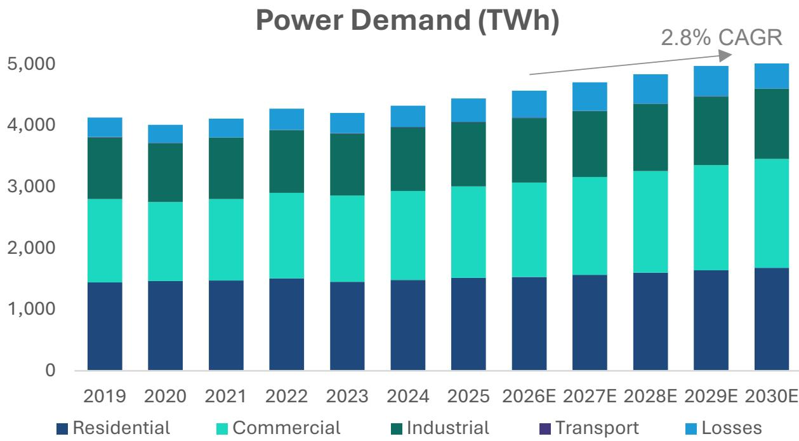
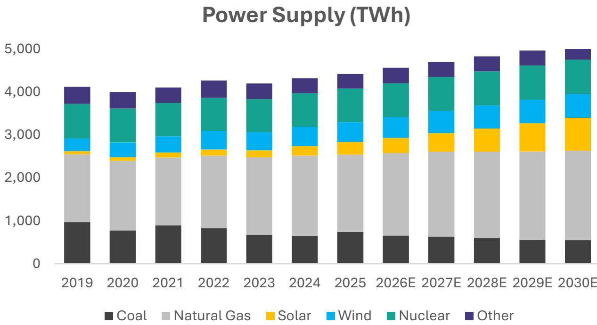
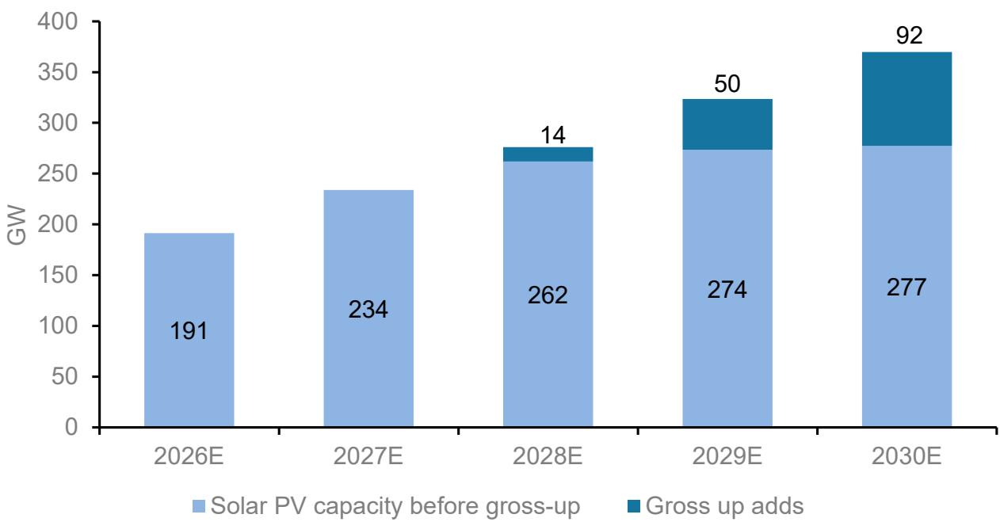

# 美国电力需求增长：从“是否增长”到“谁将捕获供应边际”的转变

经过数十年的近乎零增长，美国电力需求正以一代人未曾见过的速度加速增长。从2000年到2024年，电力需求的复合年增长率仅为0.35%。根据一项专有的供需模型预测，未来五年至2030年，增长率将提升至每年约3%。这一数字听起来或许温和，但它意味着消费增长速度相比历史基线增长了十倍。更重要的转变不在于数字本身，而在于它揭示了市场结构的变化：争论已不再是需求是否在上升，而是哪些公司和技术将捕获供应这一侧的边际。

这种加速的源头并非单一。人工智能和数据中心扩张是最显著的驱动因素，但它们只是更广泛重构的一部分。制造业回流、住宅供暖和交通电气化以及正常的经济扩张都在同时发挥作用。结果是，几十年来，所有主要需求领域——住宅、商业、工业和交通——预计将首次同步增长。这种同步扩张带来了一个根本不同于电网历史上管理的偶发性、天气驱动型峰值的供应挑战。

一个按子领域预测电力需求的模型显示，需求实现时间与供应接入时间之间的张力是核心战略风险。互联队列中已充斥着投机性项目，而中期预测窗口——三到五年——已成为最难预测的，因为它现在取决于技术部署周期，而非稳定的经济增长模式。对观察者和运营者而言，启示是明确的：赢家将是那些能在需求到来之前将可调度、可靠的供应推向市场的公司，而不是那些等待确定性的人。

## 数据中心扩张：到2030年将增加约230太瓦时需求，商业电力成为增长最快领域

美国目前拥有全球约45%的数据中心容量，即在全球100吉瓦的基数中约占45吉瓦。到2030年，这一份额预计将上升至约50%，意味着未来五年将新增40吉瓦容量。数据中心目前消耗约260太瓦时电力，约占美国总需求的6%。在基准情景假设下——电力使用效率比为1.25倍，容量利用率为52%——仅数据中心带来的增量电力需求到2030年将达到约230太瓦时，推动该领域在总需求中的份额升至约10%。

结果范围很广，但方向明确。在保守情景下，若电力使用效率提升至1.1倍，增量需求将接近200太瓦时。在乐观情景下，若效率降至1.5倍——反映冷却效率较低或计算负载较高——需求可能达到270太瓦时。即使这一范围的保守端，也超过了美国商业电力需求在过去二十年中任何五年期的全部历史增长。

这一需求是在基础商业负荷之上的增量，后者在2010年至2019年间的复合年增长率为0.7%。该模型明确将基础商业增长与数据中心特定增长分开，以避免重复计算近期的加速。结果是，商业领域到2030年将以3.6%的复合年增长率增长，从目前的约1500太瓦时增至约1800太瓦时。

## 制造业回流：AI叙事中常被忽视的第二个结构性需求驱动因素

国内制造业在美国总供应中的份额已从1990年代末的约84%下降到今天的约72%。减少进口依赖、保护供应链免受干扰的地缘政治推动，已形成逆转这一下降的政策和企业共识，尽管步伐尚不确定。该模型假设美国制造业总产出以每年约2%的速度增长，与更广泛的GDP预期一致，且国内制造业份额到2030年适度上升至75%。

在这些假设下，工业电力需求将增长约100太瓦时，未来五年的复合年增长率约为2%。相比之下，此前五年的增长率不到1%。目前消耗约1000太瓦时的工业领域，到2030年将达到约1100太瓦时。这不是一个投机性的上行情景；它反映了在当前产业政策激励和已宣布工厂建设势头下的一条合理轨迹。

由回流驱动的需求与数据中心需求之间的关键区别在于负荷曲线。工业设施往往具有更可预测的基荷消费模式，而数据中心的利用率可能因工作负载类型而变化。这种差异对供应规划很重要，因为它决定了增量需求是需要灵活发电还是全天候的稳定电力。

## 电动汽车和热泵：增加近140太瓦时住宅和交通需求，构成增长的第三极

美国电动汽车的普及在2024年和2025年有所放缓，但该模型假设份额增长将稳步恢复，每年约2个百分点，到2030年达到美国轻型汽车销量的20%。这意味着五年内新增约1600万辆电动汽车。根据能源部对年均行驶里程13725英里和每英里0.3千瓦时的估算，到2030年，电动汽车带来的增量电力需求约为66太瓦时。

热泵是住宅侧的平行驱动因素。空气源热泵的出货量已达到每年约400万台，超过了燃气暖风炉的销量。该模型假设到2030年每年保持400万台的速度，总计新增2000万台。根据住宅能源消费调查数据，每台热泵每年消耗约3.4兆瓦时。到2030年，累积效应约为70太瓦时的增量住宅电力需求。

电动汽车和热泵合计增加近140太瓦时的需求。这大致相当于纽约州一整年的总用电量。关键是，这一需求分布在数百万消费者的个人决策中，使其更难精确预测，但一旦嵌入住房和车辆存量，也更难逆转。

## 供应模型：天然气将填补可再生能源与稳定需求之间的缺口，可调度发电成为约束条件

该模型的供应侧按燃料来源汇总了后期项目的月度发电容量增加，考虑了容量因子，并对太阳能容量进行了三年期的上调以修正历史低估。核电机组重启是手动添加的。总需求与来自可再生能源、核电和水电的可用供应之间的差额，由天然气来满足。

这不是关于燃料偏好的意识形态假设。它是需求增长与发电机组物理特性相互作用的机械结果。可再生能源正在快速增加，但其输出是间歇性的，且相对于稳定发电，其容量因子较低。电池储能可以将太阳能输出转移到晚间时段，但无法维持多日的低可再生能源输出期。结果是，可按需调度并快速爬坡的天然气发电，成为满足日益增长的负荷份额的边际供应者。

该模型的供应框架也作为对公司指引的合理性检查。如果一家公用事业公司或独立发电商预测了某一水平的发电量或回报增长，供应模型可以测试该预测是否与需求轨迹所暗示的容量增加、退役和利用率步伐一致。这为观察者创造了一个决策工具：其指引与模型供应要求一致的公司，比那些指引依赖于关于互联时间表或监管批准的乐观假设的公司，更有可能兑现其承诺。

## 观察框架：从需求、供应前置时间和监管风险三个维度评估公司

该模型支持一种结构化的方法来评估哪些公司有望捕获供应边际。三个维度最为重要。第一是需求敞口：与商业或工业客户有直接客户关系的公司，比服务于住宅市场的公司更能从数量增长中受益，因为住宅需求更具弹性且受监管。第二是供应前置时间：能在两到三年内将可调度发电投入运营的公司，比那些需要五到七年进行许可和建设的公司具有结构性优势。第三是监管风险：在互联流程简化或支持新发电政策州运营的公司，比在存在争议费率案例或漫长环境审查周期的司法管辖区运营的公司，面临的执行风险更小。

应用这一框架，得分最高的公司是那些拥有大规模、可调度发电资产、现有互联协议以及能够直接与数据中心运营商或工业承购商签订合同的公司。依赖间歇性发电或面临漫长互联队列的公司得分较低，即使其技术在其他方面具有吸引力。该框架不预测报价，但它确实识别出哪些商业模式与需求环境结构性一致，哪些不一致。

启示是，未来五年不会平等地回报所有清洁能源公司。溢价将归于可靠性，而不仅仅是低边际成本。在需求在每个领域同时增长的世界里，最有价值的资产不是最便宜的千瓦时。而是需要时就能获得的千瓦时。

*仅供参考。部分内容可能基于源材料通过AI辅助生成、翻译、总结或编辑，可能存在遗漏或错误。请独立核实。本文不构成任何专业建议。*

仅供参考。部分内容可能基于源材料通过AI辅助生成、翻译、总结或编辑，可能存在遗漏或错误。请独立核实。本文不构成任何专业建议。

