## Global Digital Assets

Gautam Chhugani +91 226 842 1416 gautam.chhugani@bernsteinsg.com

Mahika Sapra +91 226 842 1408 mahika.sapra@bernsteinsg.com

Sanskar Chindalia +91 226 842 1445 sanskar.chindalia@bernsteinsg.com

Harsh Misra +91 226 842 1457 harsh.misra@bernsteinsg.com

# The Tokenization Memo: Robinhood Chain's strong debut launch (3/n)

Robinhood Chain's launch expands Robinhood's product offering across tokenized stocks, decentralized lending and perpetual futures products. Strong early adoption highlights the growing convergence of tokenized real world assets with the broader DeFi ecosystem, as industry participants continue to innovate across multiple business models for regulated asset tokenization.

Tokenized RWA Industry Metrics - Market cap of tokenized real-world assets has grown from \$35Bn in 2025 YE to over \$51Bn today, up 50% YTD (Exhibit 6-Exhibit 7). Tokenized real world assets have demonstrated strong resilience vs broader crypto markets that are down \~25% YTD. Private credit remains the dominant asset class at 48% of total RWA market cap, followed by U.S. Treasuries (29%) and commodities (9%). Ethereum and Provenance continue to host the bulk of onchain RWA activity, representing \~70% of total tokenized assets (Exhibit 8). Total RWA asset holders have crossed 1Mn, up \~75% YTD (Exhibit 10).

## Robinhood Chain launches with strong traction across DeFi and tokenized assets

Robinhood launched the public mainnet of Robinhood Chain (link), expanding its product offering across tokenized stocks, decentralized lending and perpetual futures products. Early traction on the Robinhood Chain has been strong in terms of trading volumes and user adoption.

Robinhood Chain DEX volumes vs other chains: In the last 7 days, Robinhood Chain has grown to be among the Top 5 chains in terms of DEX volumes - with \$3.1Bn in cumulative DEX volumes over the last 7 days (Exhibit 3-Exhibit 4). Early trading volumes on Robinhood Chain were led by meme coins but shows strong liquidity and tractions from crypto native traders. Over time, Robinhood is focused on dominating RWA (equities, commodities and perpetual futures) trading with Robinhood Chain and Bitstamp's growing product suite and market liquidity. Since the launch of Robinhood Chain on July 1, over \~65K users now hold \$13Mn of stock tokens and \$300Mn in stablecoin balances on the chain (Exhibit 1-Exhibit 2).

Key partnerships and offerings: Robinhood Chain is an Arbitrum-based Ethereum L2, built for financial services, tokenized real world assets with a permissionless environment for blockchain builders. Robinhood's blockchain ecosystem is continuously growing with deep integration from industry players like Uniswap (liquidity protocol), Pleiades (prop trading), Lighter, Morpho, BitGo (not covered), and Chainlink. Key offerings include:

\- Stock tokens: Robinhood Chain integrates Robinhood's tokenized stocks with the broader DeFi ecosystem. The new stock tokens are now available in 120+ countries (not currently available in US), support 24x7 trading (on decentralized exchanges like Uniswap, Lighter etc.) and improves token utility as lending and trading collateral.

\- Decentralized lending: Robinhood has partnered with Morpho, allowing eligible US users to lend their USDG (dollar-backed stablecoin) directly on the main Robinhood app. Currently, users can earn up to 7% APY through Robinhood's decentralized lending product.

\- Perpetual futures: Eligible users can now access perpetual future contracts through Lighter, a decentralized exchange. Lighter is offering incentives for Robinhood users to trade perpetuals (committed \$11Mn of LIT tokens for the community).

## Custodial tokenized equity model - DeFi integration enhances token utility while regulated U.S models emerge

Equity tokenization continues to attract mainstream interest with tokenized equities growing 170% YTD from \$0.7Bn to \$1.9Bn. Multiple business models are being attempted for equity tokenization, while the industry still awaits regulatory clarity for securities tokenization including potential expectation of an ‘innovation exemption’. Broadly, the issuer-sponsored tokenization model uses blockchain native shares issued directly by the issuing company. While the custodial model involves a third party sponsor buying the underlying shares, custody them in a secured account and issuing a blockchain token against them.

Over the last few weeks, we have seen two major developments gaining momentum in the custodial equity tokenization model - leveraging DeFi ecosystem to enhance stock token utility and first live application of a U.S regulated custodial tokenization model. Robinhood Chain enables Robinhood to expand its custodial model for equity tokenization. So far, the stock tokens were only available in EU, with limited utility beyond tracking the price of the underlying shares. However, with Robinhood Chain, Robinhood issued stock tokens are now available in 120+ countries (not currently available in US). The stock tokens can be traded 24x7 on decentralized exchanges, used as collateral in trading, or deposited in lending pools for additional yield. This enhances the utility of broker-issued stock tokens vs previous model. Currently, \~\$13Mn stock tokens are held on Robinhood Chain, across 90+ stocks.

Recently, Ondo Finance (not covered) announced (link) the first third-party tokenized securities compliant with existing US regulations. Under this model, Ondo's registered transfer agent mints security tokens backed 1:1 by underlying shares. The tokenizer will receive the same shareholder rights - via a common voting and shareholder communication platform. Ondo has tokenized an ETF and a stock to demonstrate the application of this model.

EXHIBIT 1: Robinhood Chain TVL is currently dominated by stablecoins, with \$13Mn in tokenized stocks  
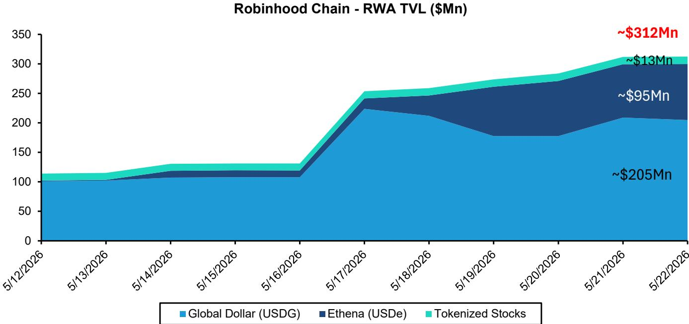  
Source: RWA.xyz, Bernstein analysis

EXHIBIT 2: RWA holders on Robinhood Chain have surpassed 67K users  
Robinhood Chain - RWA Holders (in '000s)  
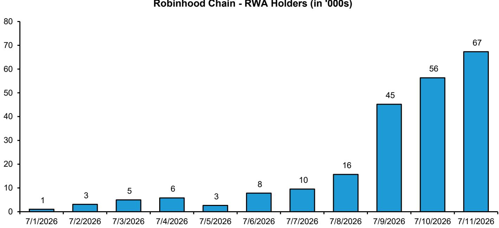  
Source: RWA.xyz, Bernstein analysis

EXHIBIT 3: DEX volumes have crossed \$3Bn in last 7 days  
Top Chains by DEX Volumes (\$Bn) - Last 7 days  
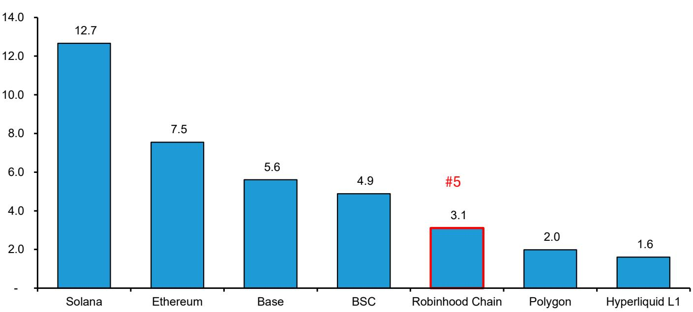  
Source: DeFiLlama, Bernstein analysis

EXHIBIT 4: Robinhood Chain has surpassed leading chains in daily DEX volumes  
Top Chains by DEX Volumes (\$Mn) - Last 24 hrs  
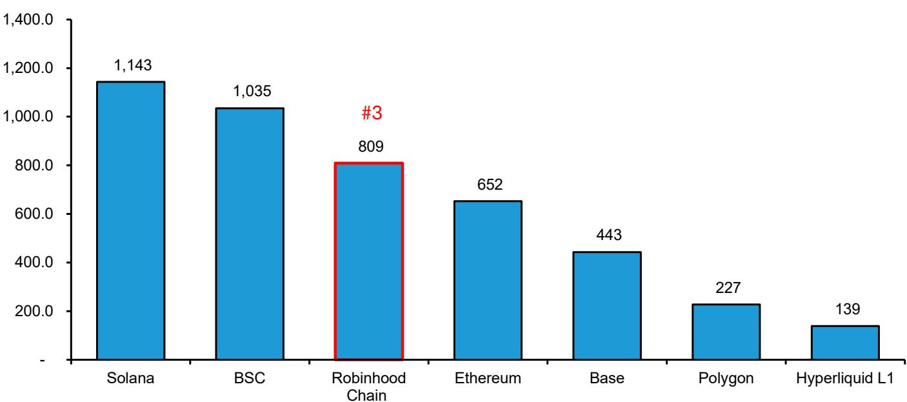  
Source: DeFiLlama, Bernstein analysis

EXHIBIT 5: DeFi TVL has crossed \$100Mn in less than 15 days of launch on Robinhood Chain  
Robinhood Chain - DeFi TVL (\$Mn)  
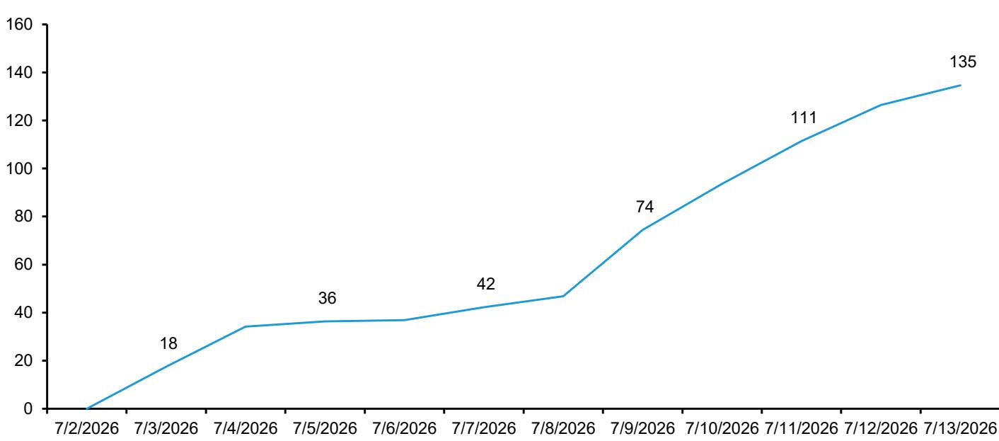  
Source: DeFiLlama, Bernstein analysis

RWA TOKENIZATION DASHBOARD
EXHIBIT 6: Tokenized RWA - Market Cap (\$Bn)  
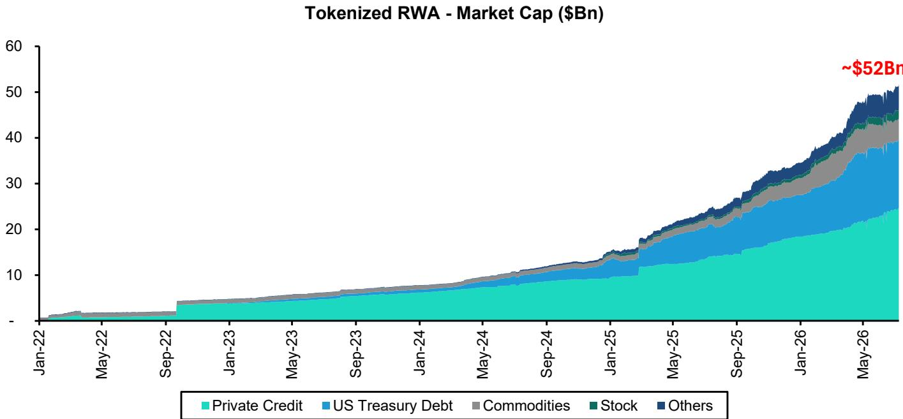  
Private credit also includes Figure tokenized credit  
Source: RWA.xyz, Bernstein analysis

EXHIBIT 7: Tokenized RWA market cap split by asset class  
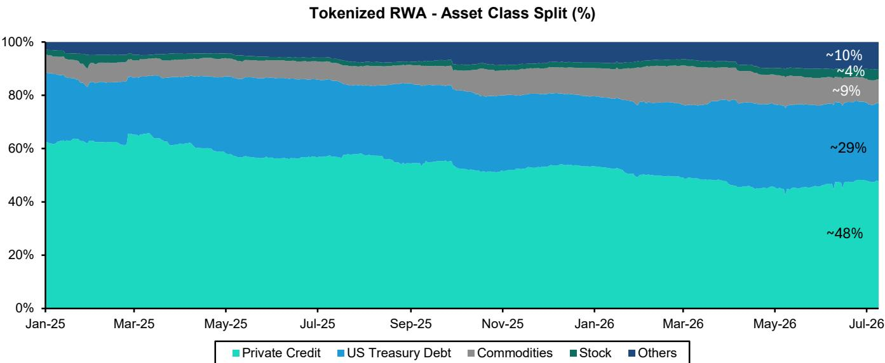  
Private credit includes Figure tokenized credit
Source: RWA.xyz, Bernstein analysis

## EXHIBIT 8: Tokenized RWA split by blockchain network

Tokenized RWA - Blockchain network split (%)

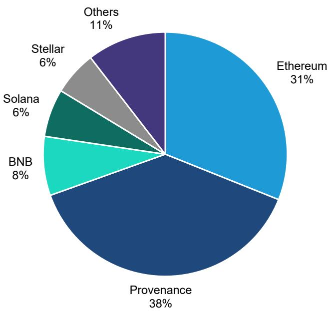  
Source: RWA.xyz, Bernstein analysis

EXHIBIT 9: Top RWA tokenization platform

<table><tr><td></td><td>Platform</td><td>Asset Class</td><td>Tokenized Assets ($Bn)</td></tr><tr><td>1</td><td>Figure</td><td>Private Credit</td><td>19.9</td></tr><tr><td>2</td><td>Securitize</td><td>Treasury, stocks</td><td>5.1</td></tr><tr><td>3</td><td>Ondo</td><td>Treasury, stocks</td><td>3.6</td></tr><tr><td>4</td><td>Circle</td><td>Treasury</td><td>3.1</td></tr><tr><td>5</td><td>Tether</td><td>Commodities</td><td>2.5</td></tr><tr><td>6</td><td>Franklin Templeton</td><td>Treasury</td><td>2.5</td></tr><tr><td>7</td><td>Spiko</td><td>Private Credit</td><td>2.1</td></tr><tr><td>8</td><td>Paxos</td><td>Commodities</td><td>1.8</td></tr><tr><td>9</td><td>Centrifuge</td><td>Treasury, credit</td><td>1.6</td></tr><tr><td>10</td><td>Maple</td><td>Credit, Treasuries</td><td>1.4</td></tr></table>

Source: RWA.xyz, Bernstein analysis

EXHIBIT 10: Tokenized real world asset holders  
RWA Asset Holders (in '000)  
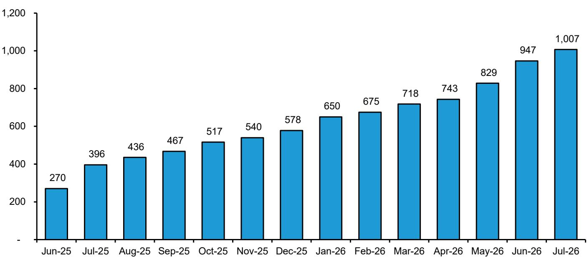  
Current as of July 11, 2026  
Source: RWA.xyz, Bernstein analysis  
137% YoY growth, 47% QoQ growth

EXHIBIT 11: FIGR - Consumer Loan Volumes (\$Bn)

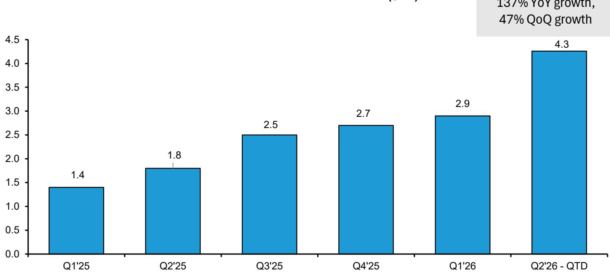  
Source: Company filings, Bernstein analysis

EXHIBIT 12: Tokenized Equities - Monthly Transfer Volumes  
Tokenized Equity - Transfer Volumes (\$Bn)  
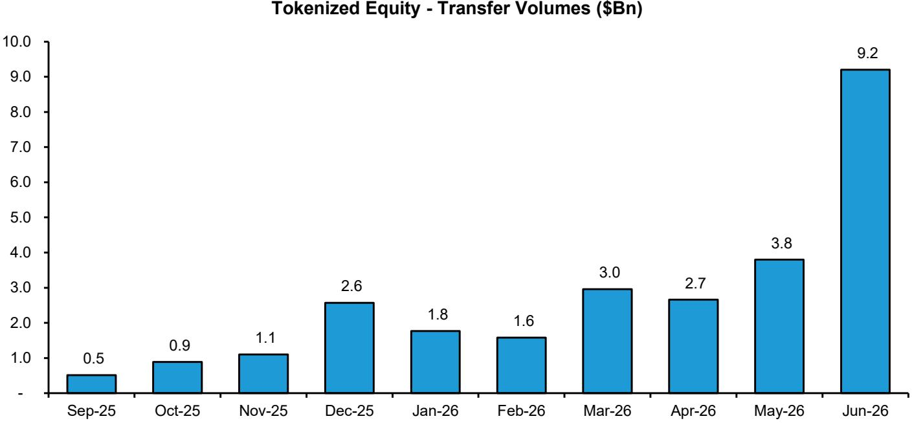  
Source: RWA.xyz, Bernstein analysis

## BERNSTEIN TICKER TABLE

<table><tr><td rowspan="2">Ticker</td><td rowspan="2">Rating</td><td colspan="3">10 Jul 2026</td><td rowspan="2">TTMRel.Perf.</td><td colspan="4">Reported EPS</td><td colspan="3">Reported P/E (x)</td></tr><tr><td>Cur</td><td>ClosingPrice</td><td>PriceTarget</td><td>Cur</td><td>2025A</td><td>2026E</td><td>2027E</td><td>2025A</td><td>2026E</td><td>2027E</td></tr><tr><td>FIGR (Figure)</td><td>O</td><td>USD</td><td>31.80</td><td>67.00</td><td>NA</td><td>USD</td><td>0.54</td><td>0.98</td><td>1.52</td><td>58.9</td><td>32.4</td><td>20.9</td></tr><tr><td>BLSH (Bullish)</td><td>M</td><td>USD</td><td>24.23</td><td>50.00</td><td>NA</td><td>USD</td><td>0.09</td><td>0.07</td><td>0.14</td><td>280.2</td><td>333.4</td><td>173.1</td></tr><tr><td>COIN (Coinbase )</td><td>O</td><td>USD</td><td>159.07</td><td>330.00</td><td>(79.5)%</td><td>USD</td><td>4.85</td><td>5.97</td><td>13.20</td><td>32.8</td><td>26.6</td><td>12.0</td></tr><tr><td>HOOD (Robinhood)</td><td>O</td><td>USD</td><td>111.97</td><td>130.00</td><td>(6.8)%</td><td>USD</td><td>2.12</td><td>2.65</td><td>3.70</td><td>52.8</td><td>42.3</td><td>30.2</td></tr><tr><td>SBET (Sharplink)</td><td>O</td><td>USD</td><td>5.51</td><td>24.00</td><td>(95.2)%</td><td>USD</td><td>(7.37)</td><td>1.73</td><td>(4.59)</td><td>(0.7)</td><td>3.2</td><td>(1.2)</td></tr><tr><td>SPX</td><td></td><td></td><td>7,575.39</td><td></td><td></td><td></td><td></td><td></td><td></td><td></td><td></td><td></td></tr></table>

O - Outperform, M - Market-Perform, U - Underperform, NR - Not Rated, CS - Coverage Suspended  
BLSH estimate is Adjusted EPS; BLSH valuation is Adjusted P/E (x); BLSH base year is 2024;

Source: Bloomberg, Bernstein estimates and analysis.

## I. REQUIRED DISCLOSURES

References to "Bernstein" or the "Firm" in these disclosures relate to the following entities: Bernstein Institutional Services LLC (April 1, 2024 onwards), Bernstein & Co., LLC (pre April 1, 2024), Bernstein Autonomous LLP, BSG France S.A. (April 1, 2024 onwards), Bernstein (Hong Kong) Limited 盛博香港有限公司, Bernstein (Canada) Limited, Bernstein (India) Private Limited (SEBI registration no. INH000006378), Bernstein (Singapore) Private Limited, Bernstein Japan KK (サンフォード・C・バーンスタイン株式会社) and analysts employed by SG Africa Technologies & Services to produce Bernstein under a Global Services Agreement in place between Bernstein and SG.

Bernstein is part of a joint venture between SG (SG) and AllianceBernstein, L.P. (AB). Unless specifically noted otherwise, for purposes of these disclosures, references to Bernstein's “affiliates” relate to both SG and AB and their respective affiliates.

## VALUATION METHODOLOGY

## Figure Technology Solutions

We value FIGR on 25x EV/27E EBITDA, at a premium to traditional exchanges and crypto peers, led by FIGR's structural growth prospects as pure-play tokenization platform and profitable core lending business. We rate Figure Outperform (PT\$67).

## Bullish

We value BLSH using 34x EV/Adjusted EBITDA'27E, at a premium on COIN and HOOD, considering the early stage of business and wide array of growth opportunities ahead. We rate BLSH Market-Perform with PT \$50.

## Coinbase Global Inc.

We value COIN using a 25x Price/2027E Earnings, in-line with the average of similar crypto/fintech/broker peers, to arrive at our price target of \$330.

## Robinhood Markets Inc

Robinhood is scaling up rapidly and is a cyclical business. As a consequence, we value HOOD using a \~35x Price/2027E Earnings to arrive at our price target of \$130.

## Sharplink Gaming

We value SBET using a 10-year ETH treasury holding model based on our ETH forecasts and SBET's ETH growth strategy. We discount back the estimated 2035E SBET price to arrive at 2026E SBET equity, implying a long-term 15% premium to SBET's 2026E ETH treasury NAV. We rate SBET Outperform (PT\$24).

## RISKS

## Figure Technology Solutions

1. FIGR's business model involve some macro risks, for example, aggressive interest rate decline makes mortgage refinancing more competitive, impacting the demand for HELOCs.

2. FIGR's business model is dependent on continued growth of private credit, any risks emerging leading to a slowdown in private credit could impact uptake for tokenized credit on Figure's marketplace.

3. We expect non-HELOC loans to contribute \~20% of FIGR's total loan volumes by 2027E, any delay in expansion into new loan categories can affect Figure's loan growth.

## Bullish

Upside Risks to our price target include:

1. Early roll-out of BLSH's U.S and crypto derivatives business can front load the growth in their trading volumes vs our estimates. We expect Bullish to launch U.S spot trading in 2026E and roll out options trading (ex-US) in 2026E.

2. Rapid scaling of Bullish's subscription services (new multi-year liquidity services contract, increased index adoption etc.) can further grow the subscription revenue lines.

Downside risks to our price target include:

1. Risk of fresh competition from U.S based and international exchanges (e.g Coinbase, Binance) and brokers (e.g Robinhood, Schwab) causing pricing & market share pressure in the U.S as well as international markets.

2. We expect \~15% of Bullish's transaction revenues from U.S by 2027E, any delay in receiving the U.S NY DFS license, delaying the US spot or derivatives launch could affect U.S revenues.

3. Digital Assets are a new asset class with limited price history and often display high-beta volatility to changes in macro including any recessionary challenges in U.S.

## Coinbase Global Inc.

1. Risk of fresh competition from international exchanges (e.g., Binance) and brokers (e.g., Robinhood, Schwab) causing pricing & market share pressure in the US home market.

2. Any delay in passing key regulation to establish the Digital assets regulatory framework in the U.S including risk of regulatory volatility from political changes (e.g., mid-term US elections).

3. Digital Assets are a new asset class with limited price history and often display high-beta volatility to changes in macro including any recessionary challenges in the US.

## Robinhood Markets Inc

Robinhood faces regulatory risks on its revenue model, particularly its PFOF model from SEC and other regulatory bodies. This also applies to the crypto trading business.

SEC has historically been harsh on crypto trading businesses, with focus on token trading platforms, as some tokens maybe considered securities.

Digital assets are a new asset class, with limited price history i.e Bitcoin itself is less than 14 years old. The remaining digital assets industry reflected by smart contracts and other blockchain applications is even younger and still evolving into its utility phase.

## Sharplink Gaming

1. Digital Asset treasury management involves significant balance sheet and liquidity risk, if companies deploy short term callable debt.

If Ethereum price is weak especially during maturity of debt, they will have to sell its ETH holdings to repay debt or refinance its debt at unfavourable terms.

2. SBET and other ETH Digital asset treasury companies deploy ETH in staking strategies. Native staking might pose some custody and liquidity issues due to long unstaking queues.

3. SBET might use decentralised finance and other applications to offer higher than market staking yield on ETH. DeFi yield strategies involve smart contract risk and may add to volatility in ETH rewards.

## RATINGS DEFINITIONS, BENCHMARKS AND DISTRIBUTION

## EQUITY RATINGS DEFINITIONS

## Bernstein brand

The Bernstein brand rates stocks based on forecasts of relative performance for the next 12 months versus the S&P 500 for stocks listed on the U.S. and Canadian exchanges, versus the Bloomberg Europe Developed Markets Large and Mid Cap Price

Return Index EUR (EDME) for stocks listed on the European exchanges and emerging markets exchanges outside of the Asia Pacific region, versus the Bloomberg Japan Large and Mid Cap Price Return Index USD (JPL) for stocks listed on the Japanese exchanges, and versus the Bloomberg Asia ex-Japan Large and Mid Cap Price Return Index (ASIAX) for stocks listed on the Asian (ex-Japan) exchanges -unless otherwise specified.

The Bernstein brand has three categories of ratings:

\- Outperform: Stock will outpace the market index by more than 15 pp

• Market-Perform: Stock will perform in line with the market index to within +/-15 pp

• Underperform: Stock will trail the performance of the market index by more than 15 pp

Coverage Suspended: Coverage of a company under the Bernstein brand has been suspended. Ratings and price targets are suspended temporarily, are no longer current, and should therefore not be relied upon.

Not Rated: A rating assigned when the stock cannot be accurately valued, or the performance of the company accurately predicted, at the present time. The covering analyst may continue to publish research reports on the company to update investors on events and developments.

Not Covered (NC) denotes companies that are not under coverage.

Bernstein brand stock ratings are based on a 12-month time horizon.

## Autonomous brand – common stocks

The Autonomous brand rates common stocks as indicated below. As our benchmarks we use the Bloomberg Europe 600 Financials Price Return Index (E600BK) and Bloomberg Europe Dev Mkt Financials Large and Mid Cap Price Ret Index EUR (EDMFI) index for developed European banks and Payments, the Bloomberg Europe 600 Insurance Price Return Index (E600IN) for European insurers, the S&P 500 and S&P Financials for US banks and Payments coverage, S5LIFE for US Insurance, the S&P Insurance Select Industry (SPSIINS) for US Non-Life Insurers coverage, and the Bloomberg Emerging Markets Financials Large, Mid and Small Cap Price Return Index (EMLSF) for emerging market banks and insurers and Payments. Ratings are stated relative to the sector (not the market).

The Autonomous brand has three categories of common stock ratings:

\- Outperform (OP): Stock will outpace the relevant index by more than 10 pp

\- Neutral (N): Stock will perform in line with the market index to within +/-10 pp

• Underperform (UP): Stock will trail the performance of the relevant index by more than 10 pp

Coverage Suspended: Coverage of a company under the Autonomous research brand has been suspended. Ratings and price targets are suspended temporarily, are no longer current, and should therefore not be relied upon.

Not Rated: A rating assigned when the stock cannot be accurately valued, or the performance of the company accurately predicted, at the present time. The covering analyst may continue to publish research reports on the company to update investors on events and developments.

Those denoted as ‘Feature’ (e.g., Feature Outperform FOP, Feature Under Outperform FUP) are our core ideas.

Not Covered (NC) denotes companies that are not under coverage.

Autonomous brand common stock ratings are based on a 12-month time horizon.

## Autonomous brand – preferred stocks

The Autonomous brand has three categories of preferred stock ratings:

\- Outperform (OP): The total return of the preferred instrument is expected to outperform preferred securities of other issuers operating in similar sectors or rating categories over the next six months.

\- Neutral (N): The total return of the preferred instrument is expected to perform in line with preferred securities of other issuers operating in similar sectors or rating categories over the next six months.

\- Underperform (UP): The total return of the preferred instrument is expected to underperform preferred securities of other issuers operating in similar sectors or rating categories over the next six months.

Autonomous preferred stock ratings are based on a 6-month time horizon.

## AUTONOMOUS CREDIT RESEARCH

Where this report contains investment recommendations for credit instruments, as defined in article 3(1)(35) of the Market Abuse Regulation, the information below is presented to comply with its disclosure requirements.

The report may also include reference(s) to published opinions by other Autonomous or Bernstein analysts covering the equity securities of the issuer(s) referenced herein. Please note an investment recommendation for credit instruments published by the author(s) of this report may differ from the published view of the analyst covering equity securities for the issuer(s) contained in this report and vice versa.

## CREDIT RATINGS DEFINITIONS

The Autonomous brand has three categories of credit ratings:

\- Credit Outperform (C-OP): The total return of the Reference Credit Instrument is expected to outperform the credit spread of bonds of other issuers operating in similar sectors or rating categories over the next six months.

\- Credit Neutral (C-N): The total return of the Reference Credit Instrument is expected to perform in line with the credit spread of bonds of other issuers operating in similar sectors or rating categories over the next six months.

\- Credit Underperform (C-UP): The total return of the Reference Credit Instrument is expected to underperform the credit spread of bonds of other issuers operating in similar sectors or rating categories over the next six months.

Autonomous credit ratings are based on a 6-month time horizon.

A list of all investment recommendations produced by the author(s) of this report alongside credit ratings history are available upon request.

It is at the sole discretion of the Firm as to when to initiate, update and cease research coverage. The Firm has established, maintains and relies on information barriers to control the flow of information contained in one or more areas (i.e. the private side) within the Firm, and into other areas, units, groups or affiliates (i.e. public side) of the Firm

DISTRIBUTION OF EQUITY RATINGS/INVESTMENT BANKING SERVICES

<table><tr><td>Equity Rating</td><td>Market Abuse Regulation (MAR) and FINRA Rating Category</td><td>Global Rating Distribution</td><td>Investment Banking Relationships*</td></tr><tr><td>Outperform</td><td>BUY</td><td>51.2%</td><td>15.3%</td></tr><tr><td>Market-Perform (Bernstein Brand) Neutral (Autonomous Brand)</td><td>HOLD</td><td>35.8%</td><td>16.2%</td></tr><tr><td>Underperform</td><td>SELL</td><td>13.1%</td><td>13.6%</td></tr></table>

\* These figures represent the percentage of companies within each equity rating category for which affiliates of Bernstein have provided investment banking services within the previous 12 months.
As of June 30, 2026. All figures are updated quarterly.

## PRICE CHARTS / RATINGS AND PRICE TARGET HISTORY

Outperform (O); Market-Perform (M); Underperform (U); Coverage Suspended (CS); Not Covered (NC)

Prior to April 1, 2024, Bernstein & Co., LLC. issued the ratings and price target information in the graph(s) below for the following companies: Coinbase Global Inc..

Figure Technology Solutions (FIGR) Rating History for Bernstein as of 07/10/2026  
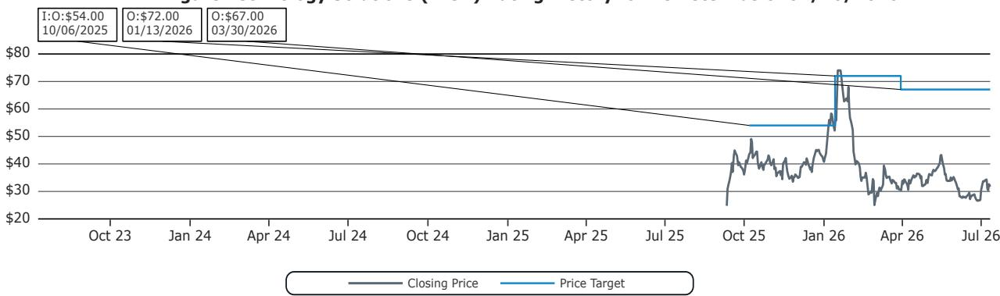  
Outperform (O); Market-Perform (M); Underperform (U); Coverage Suspended (CS); Not Covered (NC)

Bullish (BLSH) Rating History for Bernstein as of 07/10/2026  
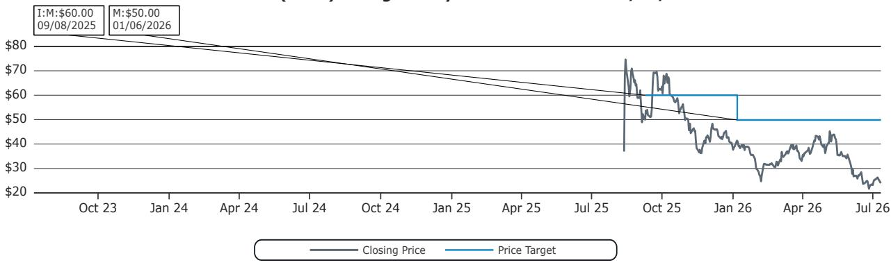

Coinbase Global Inc. (COIN) Rating History for Bernstein as of 07/10/2026  
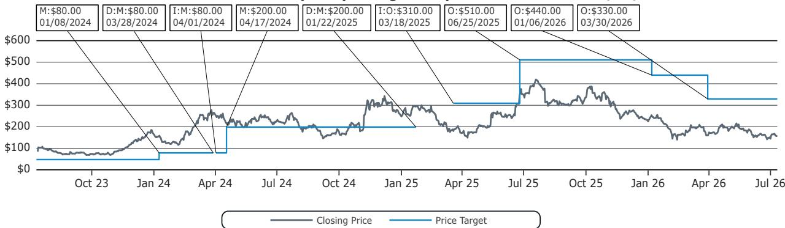  
Outperform (O); Market-Perform (M); Underperform (U); Coverage Suspended (CS); Not Covered (NC)

Robinhood Markets Inc (HOOD) Rating History for Bernstein as of 07/10/2026  
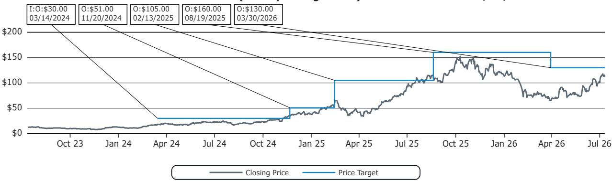  
Outperform (O); Market-Perform (M); Underperform (U); Coverage Suspended (CS); Not Covered (NC)

Sharplink Gaming (SBET) Rating History for Bernstein as of 07/10/2026  
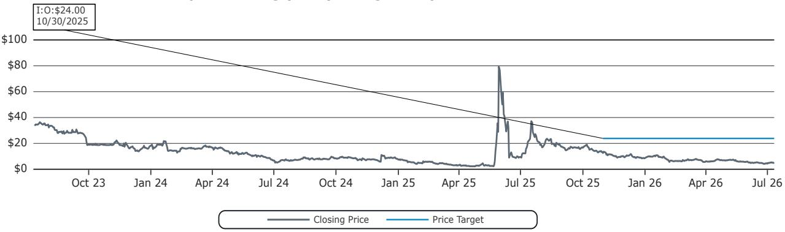  
Outperform (O); Market-Perform (M); Underperform (U); Coverage Suspended (CS); Not Covered (NC)

Figure Technology Solutions, Coinbase Global Inc. and Robinhood Markets Inc are covered by both the Autonomous and Bernstein brands. For the research ratings and price target history please go to https://bernstein-autonomous.bluematrix.com/sellside/Disclosures.action.

All price target and closing price data in the chart(s) above are denominated in the currency noted in the Ticker Table of this report.

## CONFLICTS OF INTEREST

Gautam Chhugani maintains long positions in various crypto currencies.

SG and/or its affiliates beneficially own 0.5% or more of [the total issued share capital/any class of common equity securities] with a net [long/short] position of: Figure Technology Solutions.

Bernstein and/or affiliates have received compensation for investment banking services in the past twelve months from Figure Technology Solutions, Bullish and Sharplink Gaming.

Bernstein has received compensation for non-investment banking securities-related products or services in the previous twelve months from the following clients: Figure Technology Solutions, Bullish and Sharplink Gaming.

Bernstein and/or affiliates have received compensation for non-investment banking securities-related products or services in the previous twelve months from the following clients: Figure Technology Solutions, Bullish and Sharplink Gaming.

Bernstein and/or affiliates expect to receive or intend to seek compensation for investment banking services in the next three months from Figure Technology Solutions, Bullish and Sharplink Gaming.

Affiliates of Bernstein managed or co-managed in the past twelve months a public offering of securities of Figure Technology Solutions, Bullish and Sharplink Gaming.

Bernstein and/or affiliates had an investment banking client relationship during the past twelve months with Figure Technology Solutions, Bullish and Sharplink Gaming.

Certain affiliates of Bernstein act as market maker or liquidity provider in the equities securities of: Coinbase Global Inc., Robinhood Markets Inc and Sharplink Gaming.

## OTHER MATTERS

The legal entity(ies) employing the analyst(s) listed in this report, and their location, can be determined by the country code of their phone number, as follows:

+1 Bernstein Institutional Services LLC; New York, New York, USA

+44 Bernstein Autonomous LLP; London UK

+212 SG Africa Technologies & Services; Casablanca, Morocco

+33 BSG France S.A.; Paris, France

+34 BSG France S.A.; Madrid, Spain

+41 Bernstein Autonomous LLP; Geneva, Switzerland

+49 BSG France S.A.; Frankfurt, Germany

+91 Bernstein (India) Private Limited; Mumbai, India

+852 Bernstein (Hong Kong) Limited 盛博香港有限公司; Hong Kong, China

+65 Bernstein (Singapore) Private Limited; Singapore

+81 Bernstein Japan KK; Tokyo, Japan

Where this report has been prepared by research analyst(s) employed by a non-US affiliate, such analyst(s), is/are (unless otherwise expressly noted below) not registered as associated persons of Bernstein Institutional Services LLC or any other SEC-registered broker-dealer and are not licensed or qualified as research analysts with FINRA. Accordingly, such analyst(s) may not be subject to FINRA's restrictions regarding (among other things) communications by research analysts with a subject company, interactions between research analysts and investment banking personnel, participation by research analysts in solicitation and marketing activities relating to investment banking transactions, public appearances by research analysts, and trading securities held by a research analyst account.

Where this report has been prepared by research analyst(s) employed by SG Africa Technologies & Services (part of the SG group of companies), it has been prepared on behalf of a Bernstein company under a Global Services Agreement in place between Bernstein and SG.

## CERTIFICATION

Each research analyst listed in this report, who is primarily responsible for the preparation of the content of this report, certifies that all of the views expressed in this publication accurately reflect that analyst's personal views about any and all of the subject securities or issuers and that no part of that analyst's compensation was, is, or will be, directly or indirectly, related to the specific recommendations or views in this publication.

## II. ADDITIONAL GLOBAL CONFLICT DISCLOSURES

It is at the sole discretion of the Firm as to when to initiate, update and cease research coverage. The Firm has established, maintains and relies on information barriers to control the flow of information contained in one or more areas (i.e., the private side) within the Firm, and into other areas, units, groups or affiliates (i.e., public side) of the Firm.

## III. OTHER IMPORTANT INFORMATION AND DISCLOSURES

Separate branding is maintained for “Bernstein” and “Autonomous” research products.

\- Bernstein produces a number of different types of research products including, among others, fundamental analysis and quantitative analysis under both the “Autonomous” and “Bernstein” brands. Recommendations contained within one type of research product may differ from recommendations contained within other types of research products, whether as a result of differing time horizons, methodologies or otherwise. Furthermore, views or recommendations within a research product issued under one brand may differ from views or recommendations under the same type of research product issued under the other brand. The Research Ratings System for the two brands and other information related to those Rating Systems are included in the previous section.

\- Autonomous operates as a separate business unit within the following entities: Bernstein Institutional Services LLC, Bernstein Autonomous LLP, Bernstein (Hong Kong) Limited 盛博香港有限公司 and Bernstein (India) Private Limited. For information relating to “Autonomous” branded products (including certain Sales materials) please visit: www.autonomous.com. For information relating to Bernstein branded products please visit: www.bernsteinresearch.com.

Analysts are compensated based on aggregate contributions to the research franchise as measured by account penetration, productivity and proactivity of investment ideas. No analysts are compensated based on performance in, or contributions to, generating investment banking revenues.

This report has been produced by an independent analyst as defined in Article 3 (1)(34)(i) of EU 596/2014 Market Abuse Regulation (“MAR”) and the same article of MAR as it forms part of United Kingdom domestic law by virtue of the European Union (Withdrawal) Act 2018.

To our readers in the United States: Bernstein Institutional Services LLC, a broker-dealer registered with the U.S. Securities and Exchange Commission (“SEC”) and a member of the U.S. Financial Industry Regulatory Authority, Inc. (“FINRA”) is distributing this publication in the United States and accepts responsibility for its contents. Where this material contains an analysis of debt product(s), such material is intended only for institutional investors and is not subject to the US independence and disclosure standards applicable to debt research prepared for retail investors.

Bernstein Institutional Services LLC may act as principal for its own account or as agent for another person (including an affiliate) in sales or purchases of any security which is a subject of this report. This report does not purport to meet the objectives or needs of any specific individuals, entities or accounts.

To our readers in Canada: If this publication pertains to a Canadian domiciled company, it is being distributed in Canada by Bernstein (Canada) Limited, which is licensed and regulated by the Canadian Investment Regulatory Organization. If the publication pertains to a non-Canadian domiciled company, it is being distributed by Bernstein Institutional Services LLC, which is licensed and regulated by both the SEC and FINRA, into Canada under the International Dealers Ex
